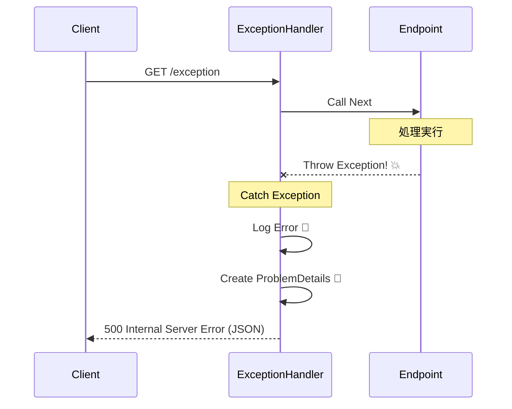

# 第10章：例外境界（Exception Boundary）ってなに？🚪

（テーマ：**「例外をどこまで通すか」**を“設計として”決める）

---

## この章のゴール🎯💖

この章が終わったら、こんな状態になれるよ😊✨

* 「例外はどこで捕まえるべき？」に**迷わない**🧭
* ドメイン（内側）を例外から守る“ドア”＝**例外境界**を引ける🚪
* API/UIの外側で、例外を**まとめて処理**できる（散らからない）🧹
* ASP.NET Core では `UseExceptionHandler` などで**境界を実装**できる🙌 ([Microsoft Learn][1])

---

## まず結論（超だいじ）🥺✨

例外境界ってね、

> **「例外を“内側”に入れないためのドア」**🚪
> 例外が起きても、**外側でまとめてキャッチして**、決まった形に変換して返す場所

って覚えてOKだよ😊💡

ASP.NET Coreだと、外側（HTTPパイプライン）で `UseExceptionHandler` が「未処理例外をキャッチしてログも残す」動きをしてくれるよ🧯📝 ([Microsoft Learn][1])

---

## 例外境界がない世界😱（あるある）

例外境界を決めてないと、こうなりがち👇💦

* 画面/Controller/Endpointごとに `try/catch` が増殖🌱🌱🌱
* 例外の握りつぶし（原因不明）👻
* 表示メッセージがバラバラでUXが崩壊🌀
* ログが二重三重に出たり、逆に出なかったり📉
* ドメインが `HttpStatusCode` とか `SqlException` とかを知り始めて汚れる🧼💔

だからこそ、**「例外はここで止める」**って境界線を引くのが大事なんだ〜🚧✨

---

## 例外境界のイメージ図🖊️✨（まずは脳内でOK）


ざっくりこう👇

* **内側（守られる側）**：ドメイン・アプリ層（ビジネスの心臓）💗
* **外側（受け止める側）**：UI / API / Worker（世界との接点）🌍

```text
[UI / API / Worker]  ← ここに例外境界（ドア）🚪
        |
   [Application]  ← ユースケース（手続き）
        |
     [Domain]     ← ルールと不変条件（心臓）💗
        |
  [Infrastructure] ← DB/HTTP/外部APIなど🌩️
```

ポイントはこれ👇✨
**「例外は“外側”でまとめて捕まえる」**
**「内側は例外まみれにしない」**

---

## じゃあ、境界はどこに置くの？📍✨（おすすめ3パターン）

### ① Web APIなら「HTTPパイプラインの入口」🚪🌐（最強）

* ASP.NET Core の `UseExceptionHandler` がまさにこれ✨
* 未処理例外をキャッチして、別の処理へ回したり、ログを残したりできるよ🧯📝 ([Microsoft Learn][1])
* API向けには **ProblemDetails** を返す設計に寄せやすいよ🧾✨（この教材でも最終的にそこへ行く）

※Minimal APIなら「例外フィルターをミドルウェアに置き換える」方向が明記されてるよ🧠 ([Microsoft Learn][2])

---

### ② アプリ層の「公開メソッドの入口」🚪🏗️

例えば `PurchaseService.BuyAsync()` みたいな **ユースケースの入口**。
ここで「下（インフラ等）から上がってくる例外」をまとめて捕まえて変換する方針もアリ✨

---

### ③ バックグラウンド処理なら「ジョブ1件の外側」🧵⏳

キュー処理・定期バッチなどは「1回の実行単位」が境界になりやすいよ😊
（例：1メッセージ処理＝1境界、失敗は分類してDLQへ、など）

---

## 例外境界のルール（これを1枚にして持ち帰ろう📄✨）

この章の成果物はこれっ👇😊💕

### ✅ 例外境界ポリシー（最小版）

* **内側（Domain/Application）**

  * 「想定内の失敗」は例外にしない（あとでResult型でやる🎁）
  * 例外は基本キャッチしない（握りつぶし禁止🙅‍♀️）
  * キャッチするなら「文脈を足す」→投げ直す（例外を隠さない）🧠

* **外側（Boundary：API/UI/Worker）**

  * 例外はまとめてキャッチしていい（ここは広めcatch OK）🧯
  * 返す形を統一（APIならProblemDetailsなど）🧾
  * ログは基本ここで一回にまとめる（重複させない）📝

---

## ハンズオン①：最小の例外境界（Minimal API）🧪✨




ここでは「境界で例外を受け止めて、統一形式で返す」体験をするよ😊

### やること💡

* `/exception` が例外を投げる
* 境界（ミドルウェア）で受け止めて `ProblemDetails` を返す

Microsoftの例では、`UseExceptionHandler` で例外処理ミドルウェアを入れられるよ🧯 ([Microsoft Learn][1])
API向けのドキュメントでも、`UseExceptionHandler` を使って `Results.Problem()` を返す例があるよ🧾 ([Microsoft Learn][2])

```csharp
using Microsoft.AspNetCore.Builder;

var builder = WebApplication.CreateBuilder(args);
var app = builder.Build();

// 例外境界🚪：ここで未処理例外をまとめて処理する
app.UseExceptionHandler(exceptionHandlerApp
    => exceptionHandlerApp.Run(async context
        => await Results.Problem().ExecuteAsync(context)));

app.MapGet("/exception", () =>
{
    throw new InvalidOperationException("Sample Exception 💥");
});

app.MapGet("/", () => "Try /exception 🙂");

app.Run();
```

これで「例外が漏れて画面が真っ赤」じゃなくて、**一定の形式で返る**ようになるよ😊🧾

---

## ハンズオン②：.NET 10の “ProblemDetails 自動生成” っぽい形へ🧾✨

Minimal APIなら `AddProblemDetails()` を入れて、`UseExceptionHandler()` を置くと、ProblemDetailsを生成してくれるミドルウェアが動くよ〜！✨ ([Microsoft Learn][2])

```csharp
var builder = WebApplication.CreateBuilder(args);

// ProblemDetails を使えるようにする🧾
builder.Services.AddProblemDetails();

var app = builder.Build();

// 例外境界🚪（ProblemDetails生成の対象にもなる）
app.UseExceptionHandler();
app.UseStatusCodePages();

app.MapGet("/users/{id:int}", (int id)
    => id <= 0 ? Results.BadRequest() : Results.Ok(new { id }));

app.MapGet("/exception", () =>
{
    throw new Exception("Boom 💥");
});

app.Run();
```

> ここでの気持ち：
> 「**例外境界って、ミドルウェア1枚で作れるんだ！**」って体感できたら勝ち😊✨

---

## ちょい上級：`IExceptionHandler` で“知ってる例外だけ”丁寧に扱う🧯💎

ASP.NET Core には `IExceptionHandler` って仕組みがあって、**中央で既知の例外を扱える**んだ〜！ ([Microsoft Learn][1])
登録は `AddExceptionHandler<T>` でできるよ🧩 ([Microsoft Learn][3])

しかも .NET 10 からは、`TryHandleAsync` が `true` を返して「処理済み」になった例外は、既定ではログやメトリクスが抑制される（＝必要なら自分でログ方針を決める）っていう変更もあるよ📝⚠️ ([Microsoft Learn][1])

---

## ミニ演習📝✨（この章の“手を動かす”ポイント）

### 演習A：境界線を引いてみよう🖊️🚪

1. 自分の想定アプリ（例：推し活グッズ購入🛍️💖）を思い浮かべる
2. さっきの層の図を書いて、**「ここが例外境界！」**って線を引く
3. 次の質問に答える✍️

   * 「この例外は境界まで通す？途中で握る？」
   * 「境界で返す形は何？（APIならProblemDetails、UIなら画面メッセージ etc）」

### 演習B：try/catch増殖を消す🧹✨

* Endpoint内に `try/catch` をいっぱい書いてる想定で、全部消す💥
* 代わりに **`UseExceptionHandler` で一箇所に寄せる**

---

## AI活用🤖💕（この章は“ツッコミ役”が最強）

Copilot / Codex にこう頼むとめっちゃ練習になるよ😊✨

* 「この構造で例外境界どこ？内側に例外漏れてない？」🔎
* 「try/catch を境界へ寄せるリファクタ案を3つ出して」🧹
* 「この例外は想定内/インフラ/バグのどれ？理由も」🚦
* 「境界で返すProblemDetailsのフィールド案を作って」🧾
  （※ProblemDetails本格運用は第22章で完成させるよ）

---

## まとめ🌸✨

* **例外境界＝例外を受け止めるドア🚪**
* **内側を汚さない**（ドメインは守る💗）
* **外側でまとめて処理**（散らからない🧹）
* ASP.NET Core なら `UseExceptionHandler` で境界を作れる🧯 ([Microsoft Learn][1])
* `IExceptionHandler` を使うと“既知の例外”を中央で扱えるし、.NET 10では「処理済み例外の診断抑制」みたいな挙動も意識ポイントだよ📝 ([Microsoft Learn][1])

---

## おまけ：今日の“最新”メモ📌✨

* C# 14 は最新で、.NET 10 上でサポートされてるよ🧠 ([Microsoft Learn][4])
* .NET 10 は LTS として3年サポートの位置づけだよ🛡️ ([Microsoft Learn][5])
* Visual Studio 2026 は提供されていて、AI統合も強化されてる流れだよ🤖✨ ([Microsoft Learn][6])

---

次は第11章で、**「じゃあ実際にアプリ層→ドメイン→インフラのどこに境界置くの？」**を、もう一段リアルな構造で体に染み込ませようね🏗️💖

[1]: https://learn.microsoft.com/en-us/aspnet/core/fundamentals/error-handling?view=aspnetcore-10.0 "Handle errors in ASP.NET Core | Microsoft Learn"
[2]: https://learn.microsoft.com/en-us/aspnet/core/fundamentals/error-handling-api?view=aspnetcore-10.0 "Handle errors in ASP.NET Core APIs | Microsoft Learn"
[3]: https://learn.microsoft.com/en-us/dotnet/api/microsoft.extensions.dependencyinjection.exceptionhandlerservicecollectionextensions.addexceptionhandler?view=aspnetcore-10.0 "ExceptionHandlerServiceCollectionExtensions.AddExceptionHandler Method (Microsoft.Extensions.DependencyInjection) | Microsoft Learn"
[4]: https://learn.microsoft.com/ja-jp/dotnet/csharp/whats-new/csharp-14?utm_source=chatgpt.com "C# 14 の新機能"
[5]: https://learn.microsoft.com/en-us/dotnet/core/whats-new/dotnet-10/overview "What's new in .NET 10 | Microsoft Learn"
[6]: https://learn.microsoft.com/en-us/visualstudio/releases/2026/release-notes "Visual Studio 2026 Release Notes | Microsoft Learn"
