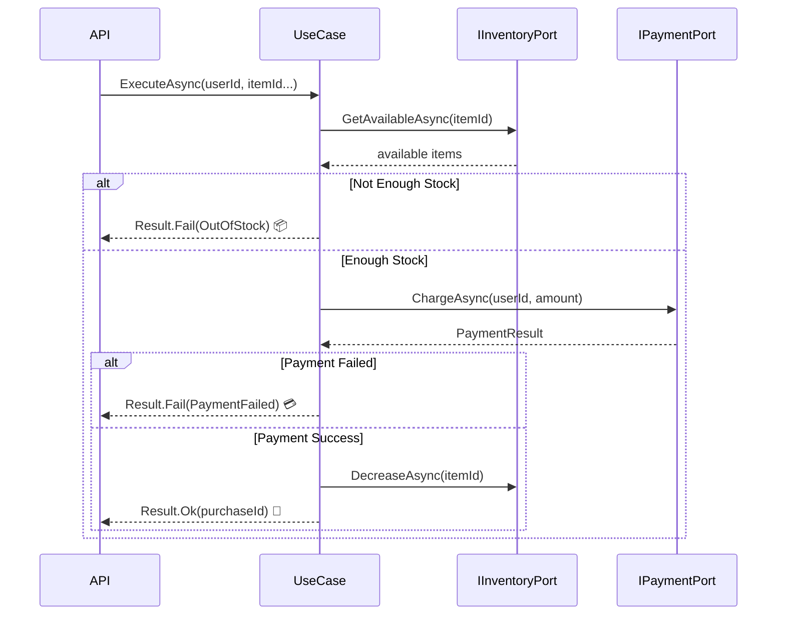

# 第11章：境界の実例①（アプリ層→ドメイン→インフラ）🏗️

この章は「境界（きょうかい）って結局どこに線を引くの？😵‍💫」を、**手で動くコード**で体に入れる回だよ〜！🫶💕

---

## 1) 今日のゴール🎯💡

読み終わったら、こうなってるのが理想✨

* **ドメイン（業務ルール）**が、DBやHTTPに一切触ってない🧼✨
* 外部I/O（DB・API・ファイル）は **インフラ側に押し出し**できてる🚚💨
* アプリ層（UseCase）が **ドメインを使って順序立てて処理**できる🧠🧩
* そして… **fake（偽物）に差し替えてテストできる**🧪🌈

この考え方は、DI（依存性注入）と相性が最高で、.NET / ASP.NET Core の標準DIとセットで使うのが定番だよ〜！🧰✨ ([Microsoft Learn][1])
（.NET 10 / ASP.NET Core 10 世代の前提でもこの構造が一番安全寄り👍） ([Microsoft Learn][2])

---

## 2) まず「境界」ってなに？🚪🧸

超ざっくり言うとね👇

* **ドメイン**：アプリの“芯”💗（ルール・判断・不変条件）
* **インフラ**：外の世界🌍（DB、外部API、ネットワーク、時計、ファイル…）
* **アプリ層**：司会進行🎤（手順の組み立て、取引の流れ、リトライ方針の置き場）

**境界＝「外の世界の都合」をドメインに持ち込まないための線**だよ🚧✨

---

## 3) よくある事故💥（境界がない世界）

たとえばドメインがこんなことし始めると危険⚠️

* ドメインが `HttpClient` を new して外部APIを叩く🌩️
* ドメインが `DbContext` を触る🗄️
* ドメインが `DateTime.Now` を直読みする⏰（テストがしにくい〜！😭）

これ、ぜんぶ「外の都合」が**芯に侵入**してる状態😵‍💫
→ 変更に弱い・テストしにくい・障害時の切り分けが辛い、の三重苦💀💦

---

## 4) “正しい配置”の完成図🗺️✨


イメージはこれ👇（覚えるのはこれだけでOK！）

* **Domain**：型・ルール・判断（純粋）🧼
* **Application**：ユースケース（手順）🧩
* **Infrastructure**：DB/HTTPなど実装（汚れ役）🧹
* **API/UI**：入口と出口（境界でまとめて扱う）🚪

図にするとこんな感じ〜📌

* API/UI
  ↓
* Application（UseCase）
  ↓（インターフェース越し）
* Domain（ルール）
  ↑（インターフェースの実装がここに刺さる）
* Infrastructure（DB/HTTP）

ポイントはこれ✨
**ドメインは「インフラの実装」を知らない**🙈
知っていいのは「こういう機能が必要！」っていう**契約（interface）だけ**📜

---

## 5) 例題：推し活グッズ購入（購入確定）🛍️💖

### 要件（超ざっくり）📌

* 在庫が足りなければ失敗（ドメインエラー）💔
* 決済は外部サービス（インフラ）💳🌐
* 購入を保存する（DB：インフラ）🗄️

---

## 6) まずドメイン（純粋）を作る🧼💗

### 6-1) ドメインエラー（想定内の失敗）💗❌

```csharp
namespace Oshikatsu.Domain;

public abstract record DomainError(string Code, string Message);

public sealed record OutOfStock(int Requested, int Available)
    : DomainError("OUT_OF_STOCK", "在庫が足りません🥲");

public sealed record BudgetExceeded(decimal Total, decimal Budget)
    : DomainError("BUDGET_EXCEEDED", "予算オーバーです🥲");
```

* **ドメインエラーは例外じゃなくて“仕様の失敗”**として表しやすい形にするのがコツだよ🎀
  （Result型の話は後の章で本格的にやるけど、ここでは“ドメインは純粋”を優先！）

---

### 6-2) ドメインが欲しい「外部の力」を interface で宣言📜✨（ポート）


**Repository** や **外部決済**は、ドメインから見ると「お願いしたい能力」だよね🙏
だから *契約だけ* 置くよ👇

```csharp
namespace Oshikatsu.Domain;

public interface IInventoryPort
{
    Task<int> GetAvailableAsync(Guid itemId, CancellationToken ct);
    Task DecreaseAsync(Guid itemId, int amount, CancellationToken ct);
}

public interface IPaymentPort
{
    Task<PaymentResult> ChargeAsync(Guid userId, decimal amount, CancellationToken ct);
}

public sealed record PaymentResult(bool IsSuccess, string? TransactionId, string? FailureReason);
```

✅ ここが超大事！！！

* Domain は **EF Core も HttpClient も知らない**🙈
* ただ「在庫見たい」「決済したい」を **契約として言うだけ**📣

---

## 7) 次にアプリ層（UseCase）を書く🎤🧩




ここは“手順の司会進行”だよ〜！✨
「在庫確認 → 決済 → 在庫減らす → 保存」みたいな流れを組み立てる🎬

### 7-1) Result（最小）を置いておく🎁（この章では簡易でOK）

```csharp
namespace Oshikatsu.Application;

public readonly record struct Result<T>(bool IsSuccess, T? Value, string? ErrorCode, string? ErrorMessage)
{
    public static Result<T> Ok(T value) => new(true, value, null, null);
    public static Result<T> Fail(string code, string message) => new(false, default, code, message);
}
```

---

### 7-2) UseCase（アプリ層）🏗️

```csharp
using Oshikatsu.Domain;

namespace Oshikatsu.Application;

public sealed class ConfirmPurchaseUseCase
{
    private readonly IInventoryPort _inventory;
    private readonly IPaymentPort _payment;

    public ConfirmPurchaseUseCase(IInventoryPort inventory, IPaymentPort payment)
    {
        _inventory = inventory;
        _payment = payment;
    }

    public async Task<Result<Guid>> ExecuteAsync(Guid userId, Guid itemId, int quantity, decimal price, CancellationToken ct)
    {
        // 1) 在庫チェック（外部I/Oだけど、契約越しに呼ぶ）
        var available = await _inventory.GetAvailableAsync(itemId, ct);
        if (available < quantity)
        {
            var err = new OutOfStock(quantity, available);
            return Result<Guid>.Fail(err.Code, err.Message);
        }

        // 2) 決済（外部サービス）
        var pay = await _payment.ChargeAsync(userId, quantity * price, ct);
        if (!pay.IsSuccess)
        {
            // ※ここでは雑に扱う（詳細な分類は後の章で✨）
            return Result<Guid>.Fail("PAYMENT_FAILED", pay.FailureReason ?? "決済に失敗しました🥲");
        }

        // 3) 在庫を減らす（DB更新想定）
        await _inventory.DecreaseAsync(itemId, quantity, ct);

        // 4) 購入IDを返す（保存やイベントは次の章以降で拡張しよう✨）
        return Result<Guid>.Ok(Guid.NewGuid());
    }
}
```

ここでの気持ちいいポイント😍✨

* UseCase は “手順”だけやってる
* 具体的なDBやHTTPは出てこない
* 依存は interface（契約）だけ

このスタイルは DI の考え方と直結してて、**直接 new しない**のが基本だよ〜！🧠✨ ([Microsoft Learn][3])

---

## 8) 最後にインフラ（実装）を書く🧹🗄️🌐

ここが“汚れ役”！🧤
汚れてOK！でも **汚れはここに閉じ込める**😆

### 8-1) DB（例：EF Core Repository の雰囲気）

```csharp
using Oshikatsu.Domain;

namespace Oshikatsu.Infrastructure;

public sealed class InventoryRepository : IInventoryPort
{
    // ここでは雰囲気だけ（DbContextなどが入る想定）
    private readonly Dictionary<Guid, int> _stock = new();

    public Task<int> GetAvailableAsync(Guid itemId, CancellationToken ct)
        => Task.FromResult(_stock.TryGetValue(itemId, out var v) ? v : 0);

    public Task DecreaseAsync(Guid itemId, int amount, CancellationToken ct)
    {
        var current = _stock.TryGetValue(itemId, out var v) ? v : 0;
        _stock[itemId] = Math.Max(0, current - amount);
        return Task.CompletedTask;
    }
}
```

### 8-2) 外部決済（例：HTTPクライアントの雰囲気）💳🌐

```csharp
using Oshikatsu.Domain;

namespace Oshikatsu.Infrastructure;

public sealed class PaymentClient : IPaymentPort
{
    public Task<PaymentResult> ChargeAsync(Guid userId, decimal amount, CancellationToken ct)
    {
        // 本当は HttpClient で外部API呼ぶ（この章では省略）
        return Task.FromResult(new PaymentResult(true, "tx_123", null));
    }
}
```

---

## 9) DI登録（API側で“刺す”）🧩🪡

ASP.NET Core は標準で DI を持ってるから、**ここで実装を差し込む**のが定番だよ！🧰✨ ([Microsoft Learn][1])

```csharp
using Oshikatsu.Application;
using Oshikatsu.Domain;
using Oshikatsu.Infrastructure;

var builder = WebApplication.CreateBuilder(args);

builder.Services.AddScoped<IInventoryPort, InventoryRepository>();
builder.Services.AddScoped<IPaymentPort, PaymentClient>();
builder.Services.AddScoped<ConfirmPurchaseUseCase>();

var app = builder.Build();

app.MapPost("/purchase/confirm", async (ConfirmPurchaseUseCase useCase, CancellationToken ct) =>
{
    var result = await useCase.ExecuteAsync(
        userId: Guid.NewGuid(),
        itemId: Guid.NewGuid(),
        quantity: 1,
        price: 5000,
        ct: ct
    );

    return result.IsSuccess
        ? Results.Ok(new { purchaseId = result.Value })
        : Results.BadRequest(new { code = result.ErrorCode, message = result.ErrorMessage });
});

app.Run();
```

---

## 10) ここが“境界の手触り”💡🫶

この章で覚えてほしいのは、たった2つだけ！✨

### ✅ ① I/O を端っこに押し出す🚚💨

* DB・HTTP・ファイル・時計・乱数…
  **外の世界は全部インフラへ！**

### ✅ ② ドメインから見えるのは「契約」だけ📜

* interface を Domain に置く（または Domain 近くに置く）
* 実装は Infrastructure
* 組み立ては API/UI（Composition Root）🧩

この形にすると、変更に強くなるし、テストがラクになるよ〜！🧪✨
（依存を直接 new しない、っていうDIの基本にもそのまま乗る！） ([Microsoft Learn][3])

---

## 11) ミニ演習🧪✨（手を動かそ〜！）

### 演習A：インフラ呼び出しを“1枚アダプタ”に隔離🧱

次の“悪い例”を、今日の形にリファクタしてね👇

* UseCase の中で `new HttpClient()` してたらアウト🙅‍♀️💥
* `DbContext` を UseCase で直に触ってたらアウト🙅‍♀️💥

✅ ゴール：

* `IPaymentPort` / `IInventoryPort` を作って、UseCase は interface だけ呼ぶようにする✨

### 演習B：fake に差し替えてテスト🧪🌈

* `FakeInventoryPort` を作って、在庫 0 のケースをテスト
* `FakePaymentPort` を作って、決済失敗のケースをテスト

---

## 12) AI活用コーナー🤖💞（おすすめプロンプト）

Copilot / Codex に投げるときは、**“目的＋制約＋出力形式”**をセットにすると強いよ💪✨

### ✅ interface と fake を作らせる

* 「`IInventoryPort` と `FakeInventoryPort` を C# で作って。`GetAvailableAsync` はメモリ辞書でOK。テストで在庫不足を再現したい」

### ✅ DI登録を作らせる

* 「Minimal API で `IInventoryPort` と `IPaymentPort` のDI登録例を出して。Scopedでお願いします」

### ✅ UseCase のユニットテスト雛形

* 「`ConfirmPurchaseUseCase` のユニットテストを xUnit で。ケースは在庫不足・決済失敗・成功の3つ」

※AIは雛形作りに強いけど、**境界の方針（どこに置くか）は人間が決める**のが大事だよ〜😊🫶

---

## 13) 今日のまとめ🌸✨

* 境界は「外の都合」を芯に入れないための線🚧
* ドメインは純粋に、インフラは汚れてOK🧼🧹
* UseCase は interface を通して外界と会話する📜
* DI で実装を差し込むのが王道🧩✨ ([Microsoft Learn][1])

---

次の第12章では、いよいよ
**「インフラで起きた例外を、分類して Result に変換する」**をやるよ〜！🔁🧯🎁
ここまでの“境界の置き方”が土台になるから、めちゃ気持ちよく繋がるはず😊💖

[1]: https://learn.microsoft.com/en-us/aspnet/core/fundamentals/dependency-injection?view=aspnetcore-10.0&utm_source=chatgpt.com "Dependency injection in ASP.NET Core"
[2]: https://learn.microsoft.com/en-us/dotnet/core/whats-new/dotnet-10/overview?utm_source=chatgpt.com "What's new in .NET 10"
[3]: https://learn.microsoft.com/en-us/dotnet/core/extensions/dependency-injection-guidelines?utm_source=chatgpt.com "Dependency injection guidelines - .NET"
