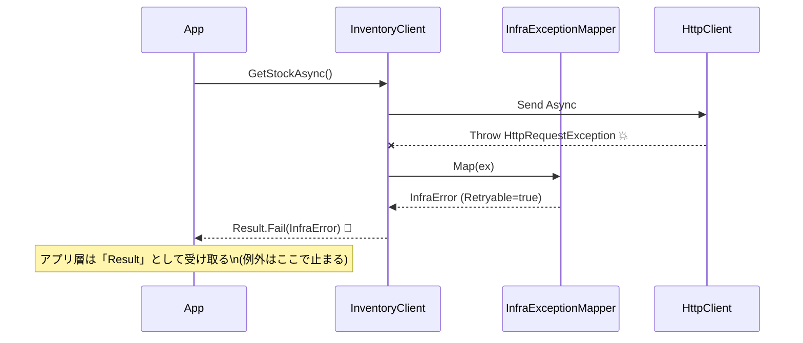

# 第12章：境界の実例②（例外→分類→Resultへ変換）🔁🧯

この章は「**例外を握りつぶさず**」「**でも上位に例外を撒き散らさず**」に、**境界で“仕様の形”に整えて渡す**のを体で覚える回だよ〜😊✨
（いまの最新だと **.NET 10 + C# 14 + Visual Studio 2026** 想定でOKだよ🧑‍💻💕） ([Microsoft for Developers][1])

---

## 1) この章のゴール（成果物）🎯📦

最終的に、次の2つができたら勝ち🏆✨

1. **例外→分類→InfraError→Result** の変換が書ける（握りつぶしゼロ🙅‍♀️）
2. 「再試行していい？ダメ？」を **Retryable** で返せる🚦🔁

---

## 2) 今日の主役： “境界”ってどこ？🚪👀

ここでいう境界は、だいたいこんな場所👇

* **外部I/O** を呼ぶところ（DB・HTTP・ファイル・メッセージング）
* 例：`Repository` / `HttpClient` ラッパ / `ExternalApiClient`

💡ポイント：
**境界の内側（ドメインやアプリ中核）には「外部の例外」を持ち込まない**🧼✨
代わりに **Result** で「失敗」を運べる形にする🎁

---

## 3) まず“ダメ例”を見る（あるある）🙅‍♀️💥

### ❌ ダメ例A：握りつぶし


* 何が起きたか分からない
* ログも残らない
* ユーザーには謎の失敗

### ❌ ダメ例B：全部throwで上に丸投げ


* UI/APIまで例外が到達して、表示もHTTPもバラバラ😵‍💫
* 再試行判断もできない

👉 だからこの章では「境界で整える」よ🔧✨

---

## 4) 変換の全体像（これを作る）🗺️✨


流れはこれだけ👇（超大事💗）

1. **例外が起きる**（DB/HTTPなど）
2. 境界で **catch**
3. 例外を **分類**（インフラの一時/恒久など）
4. **InfraError** を作る（コード・表示文言・Retryable）
5. **Result.Fail(InfraError)** で返す

---

## 5) 型を用意しよう（最小構成）🧰✨


> ここは「教材用ミニ実装」だよ😊（後の章で洗練できる）

```csharp
public sealed record InfraError(
    string Code,          // 例: "HTTP_TIMEOUT", "DB_CONN_FAILED"
    string Message,       // ユーザー向け（やさしめ）
    bool Retryable,       // 再試行して良いか
    string? Detail = null // ログ向け補足（ユーザーには出さない想定）
);

public readonly record struct Result<T>(bool IsSuccess, T? Value, InfraError? Error)
{
    public static Result<T> Ok(T value) => new(true, value, null);
    public static Result<T> Fail(InfraError error) => new(false, default, error);
}
```

✅ **Code** は後でエラーカタログに繋がるから、今から “揃える癖” をつけるよ🏷️✨

---

## 6) 例外分類ルール（まずはこの6つだけ）🚦🧠


境界で拾うのは基本「インフラ起因」ね🌩️
逆に、**バグっぽい例外は変換しない**（Fail Fast⚡）

### ✅ 変換対象（インフラ）

* タイムアウト系（HTTP/DB）
* 接続失敗・DNS・ソケット系
* 一時的な503/ネットワーク不安定
* DB接続落ち

### ❌ 変換しない（バグ寄り）

* `ArgumentException` / `NullReferenceException` など（設計や実装ミスの香り🧱⚡）

---

## 7) 例外→InfraError 変換関数を作る🧯➡️🎁




ここがこの章のキモだよっ💗

```csharp
using System.Net;
using System.Net.Http;
using System.Net.Sockets;

public static class InfraExceptionMapper
{
    public static InfraError Map(Exception ex)
    {
        // ① タイムアウト（HttpClientは timeout でも TaskCanceledException が来がち）
        if (ex is TaskCanceledException)
        {
            return new InfraError(
                Code: "HTTP_TIMEOUT",
                Message: "通信が混み合っているみたい…もう一度試してね🙏",
                Retryable: true,
                Detail: ex.Message
            );
        }

        // ② ネットワーク系（DNS/接続断など）
        if (ex is HttpRequestException || ex is SocketException)
        {
            return new InfraError(
                Code: "HTTP_NETWORK_ERROR",
                Message: "ネットワークが不安定かも…少し待ってから試してね📶",
                Retryable: true,
                Detail: ex.Message
            );
        }

        // ③ “それ以外のインフラ例外” はいったん恒久扱い（保守的）
        return new InfraError(
            Code: "INFRA_UNKNOWN",
            Message: "ごめんね、うまく処理できなかった…時間をおいて試してね🙇‍♀️",
            Retryable: false,
            Detail: ex.ToString()
        );
    }
}
```

💡コツ：


* **Retryable=true** は「やってもいい可能性が高い」だけに絞るのが安全🔁
* “未知” を何でもリトライにしない（地獄になる😇）

---

## 8) 境界（アダプタ）でキャッチして Result で返す🚪🧱

例：外部の在庫APIを叩く `InventoryClient` を想定するよ🛍️💕

```csharp
using System.Net.Http;

public sealed class InventoryClient
{
    private readonly HttpClient _http;

    public InventoryClient(HttpClient http) => _http = http;

    public async Task<Result<int>> GetStockAsync(string sku, CancellationToken ct)
    {
        try
        {
            // ✅ ct はちゃんと渡す（キャンセル可能にする）🛑
            using var res = await _http.GetAsync($"/stock/{sku}", ct);

            // 例：404などを例外にするかは方針次第。
            // ここでは “インフラ層では例外化” して mapper に投げる例にするね
            res.EnsureSuccessStatusCode();

            var text = await res.Content.ReadAsStringAsync(ct);
            var stock = int.Parse(text);

            return Result<int>.Ok(stock);
        }
        // ✅ キャンセルは「失敗」じゃなく「中断」なので、変換しないのが基本
        catch (OperationCanceledException) when (ct.IsCancellationRequested)
        {
            throw;
        }
        catch (Exception ex)
        {
            var err = InfraExceptionMapper.Map(ex);
            // ここでログ（後章で本格的に）ログには Detail を使う想定🧾🔎
            return Result<int>.Fail(err);
        }
    }
}
```

ここ、めっちゃ大事ポイント3つね🥹✨

1. **キャンセルは変換しない**（ユーザーがやめただけ🛑）


2. **境界でだけ例外→Result変換**
3. **Resultに“再試行の意図”を乗せる**🚦

---

## 9) 呼び出し側（アプリ層）は Result を読むだけ🎁👀

```csharp
public sealed class PurchaseService
{
    private readonly InventoryClient _inventory;

    public PurchaseService(InventoryClient inventory) => _inventory = inventory;

    public async Task<Result<string>> TryPurchaseAsync(string sku, CancellationToken ct)
    {
        var stockResult = await _inventory.GetStockAsync(sku, ct);
        if (!stockResult.IsSuccess)
        {
            // ここで「再試行導線」を出すかどうか判断できる🚦✨
            return Result<string>.Fail(stockResult.Error!);
        }

        if (stockResult.Value <= 0)
        {
            // 本当はドメインエラーにしたいけど、この章はインフラ中心なので省略🙂
            return Result<string>.Fail(new InfraError(
                "OUT_OF_STOCK",
                "在庫がないみたい…ごめんね🙏",
                Retryable: false
            ));
        }

        return Result<string>.Ok("購入できたよ🎉");
    }
}
```

---

## 10) ミニ演習（手を動かすよ✍️🔥）

### 演習A：例外→分類を3段階に増やす🧩

`InfraExceptionMapper` をこう変えてみてね👇

* Timeout → `Retryable=true`
* Network系 → `Retryable=true`
* “認証/権限っぽい” → `Retryable=false`（例：401/403を拾えるなら）

（HTTPステータスは `HttpRequestException` の中身や `EnsureSuccessStatusCode` の扱い次第で取り方が変わるから、まずは「方針メモ」を書けばOK📝）

### 演習B：ログ用Detailを“短く要約”して入れる📜

* 例外全文 `ToString()` だと重いので、最初は
  `ex.GetType().Name` + `ex.Message` だけでもOK🙆‍♀️

### 演習C：変換しない例外を決める⚡

* `ArgumentException` と `NullReferenceException` は **変換しないでthrow** にする、みたいにルール化してみてね🧱

---

## 11) AI活用（この章向けの使い方）🤖🪄

AIは「案出し」と「漏れチェック」に使うのが超強いよ✅✨

### 使えるプロンプト例💬

* 「`HttpClient` で起きがちな例外を列挙して、Retryableかどうかの理由も書いて」
* 「この `InfraExceptionMapper` の分類の穴（取りこぼし）を指摘して」
* 「Resultのテストケース案を10個出して」

⚠️注意：
“Retryable判定”はアプリの性質で変わるから、**最後は自分が決める**のが大事だよ〜🙂💗

---

## 12) まとめ（この章で覚える合言葉）🎀✨

* **例外は境界で捕まえて、Resultに変換する**🔁🧯
* **握りつぶさない**（情報はログへ🧾）
* **再試行判断をResultに乗せる**🚦🔁
* **キャンセルは失敗じゃない**🛑

---

ちなみに、APIを返す段になると **ProblemDetails（RFC 9457）** に変換して返すのがキレイだよ🧾✨（後の章でやるやつ！） ([datatracker.ietf.org][2])

[1]: https://devblogs.microsoft.com/dotnet/dotnet-and-dotnet-framework-january-2026-servicing-updates/?utm_source=chatgpt.com ".NET and .NET Framework January 2026 servicing ..."
[2]: https://datatracker.ietf.org/doc/rfc9457/?utm_source=chatgpt.com "RFC 9457 - Problem Details for HTTP APIs"
