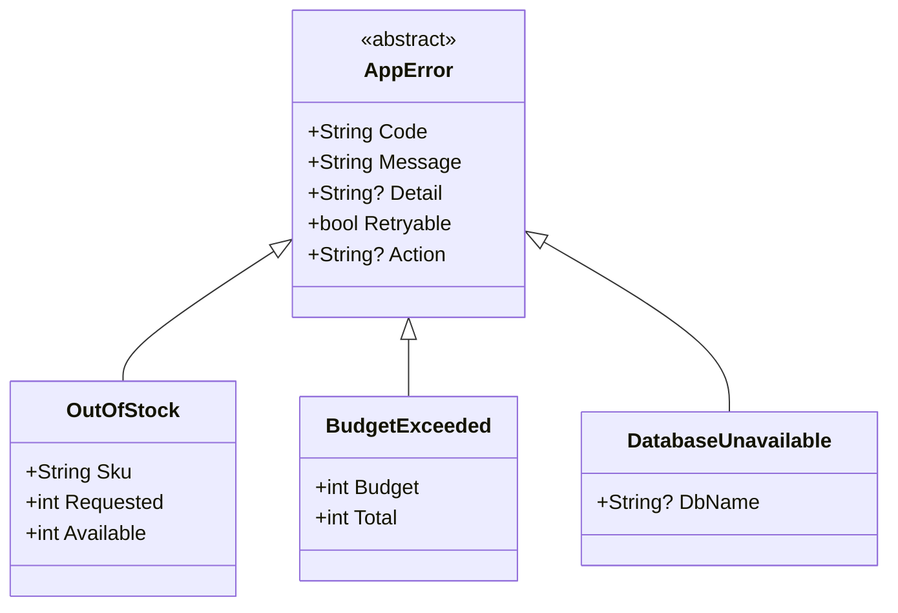

# 第14章：エラー型の実装（recordで表す）🧷✨

この章では「ドメインエラー（想定内の失敗）」を **型（record）** で表現できるようにするよ😊💗
※C# 14（.NET 10 / VS 2026）前提の最新情報も踏まえてるよ🆕✨ ([Microsoft Learn][1])

---

## 1) この章のゴール🎯✨

できるようになること👇😊

* **エラーを文字列じゃなく“型”で表す**（= 迷子になりにくい）🧭
* **recordで不変（immutable）＆比較しやすい**エラーを作る🧊
* `switch` / パターンマッチで **エラー種別ごとに分岐**できる🔀
* 次章以降の **Result型に入れる“失敗の中身”** を用意できる🎁

---

## 2) なんで「文字列エラー」じゃダメなの？😵‍💫💦


たとえばこういうの、ありがち👇

* `"在庫が足りません"` みたいな文字列だけ返す
  → 呼び出し側で **文言比較**し始める（地獄）🔥
* エラー情報が散らばる
  → どれが正式文言？コードは？再試行していい？が分からない😇

## ✅ 型にすると何が嬉しい？🥰

* **コンパイルで守られる**（typoが減る）🛡️
* **switchで分岐が読みやすい**📖
* recordは **値による等価比較**や、イミュータブル設計に向いてるよ✨ ([Microsoft Learn][2])

---

## 3) record超ざっくり理解🍬✨（エラー型に向いてる理由）

Microsoft公式でも、recordは

* **値の等価性（value equality）がほしい**
* **イミュータブルにしたい**
  ときにおすすめされてるよ😊 ([Microsoft Learn][2])

## record class と record struct どっち？🤔

* `record` / `record class` → **参照型**
* `record struct` → **値型** ([Microsoft Learn][3])

この教材では、まずは迷わないように👇でいくよ😊
✅ **エラーは `record class`（参照型）** を基本にする（継承もしやすい）🧩

---

## 4) まずは“共通の箱”を作ろう📦✨（ベースエラー）


エラーに最低限ほしい情報って、だいたいこれ👇

* `Code`：機械的に識別するコード（エラーカタログと対応）🏷️
* `Message`：ユーザー向け（やさしい文）💬
* `Detail`：開発者向け（ログ向け）🔧
* `Retryable`：再試行していい？🔁
* `Action`：ユーザー/運用が取る推奨アクション🧭

まずはベース型👇

```csharp
public abstract record AppError(
    string Code,
    string Message,
    string? Detail = null,
    bool Retryable = false,
    string? Action = null
);
```

> ここで `abstract` にしておくと「AppErrorそのもの」は作れなくなるよ🙆‍♀️
> 必ず “具体的なエラー型” を作る流れになる✨

---

## 5) ドメインエラーを record で作る💗🧷（例：推し活グッズ購入）





「在庫が足りない」「予算オーバー」みたいな、**想定内の失敗**を型にするよ😊

```csharp
public sealed record OutOfStock(
    string Sku,
    int Requested,
    int Available
) : AppError(
    Code: "STOCK_OUT",
    Message: "在庫が足りません🥲",
    Detail: $"sku={Sku}, requested={Requested}, available={Available}",
    Retryable: false,
    Action: "数量を減らすか、入荷を待ってね🛒"
);

public sealed record BudgetExceeded(
    int Budget,
    int Total
) : AppError(
    Code: "BUDGET_EXCEEDED",
    Message: "予算を超えちゃったよ💦",
    Detail: $"budget={Budget}, total={Total}",
    Retryable: false,
    Action: "カートを見直してね🧺"
);
```

## ポイントだよ😊✨

* `sealed`：派生の増殖を防いで、型ツリーを安定させる🧱
* `Detail` はログ向けの材料にできる（ユーザーに見せない前提）🔧
* `Action` は「どうしたらいい？」に即答できて親切💗

---

## 6) インフラエラーも作ってみる🌩️🧷（例：DBが落ちた）


インフラ系は「再試行OKか？」が超大事だよ🔁

```csharp
public sealed record DatabaseUnavailable(
    string? DbName = null
) : AppError(
    Code: "DB_UNAVAILABLE",
    Message: "ただいま混み合っています🙏 少し待ってもう一度試してね",
    Detail: DbName is null ? "db unavailable" : $"db={DbName} unavailable",
    Retryable: true,
    Action: "数秒待って再実行🔁（改善しないなら運営に連絡📩）"
);
```

---

## 7) switchで分岐してみよう🔀✨（演習の核）


「エラー型」を作ったら、呼び出し側はこうやって扱うと読みやすいよ📖💕

```csharp
static string ToUserMessage(AppError error) =>
    error switch
    {
        OutOfStock e      => $"{e.Message}（残り {e.Available} 個だよ）📦",
        BudgetExceeded    => "いったんカートを整理しよっか🧺✨",
        DatabaseUnavailable => "通信が不安定かも…🙏 少し待って再試行してね🔁",
        _ => "ごめんね、予期しない問題が起きたよ💦"
    };
```

> 文字列比較じゃなくて **型で分岐できる**のが最高に気持ちいいやつ😊✨

---

## 8) ミニ演習📝✨（この章の提出物）

## 演習A：エラー型を3つ作ろう🧷🧷🧷

次の3つを **record** で作ってね😊

* `OutOfStock`（在庫不足）📦
* `BudgetExceeded`（予算オーバー）💰
* `DatabaseUnavailable`（DB停止）🌩️

✅ 各エラーに `Code / Message / Detail / Retryable / Action` を入れる

---

## 演習B：switchで「表示文言」を決めよう🔀💬

* `ToUserMessage(AppError error)` を作って
* 型ごとにメッセージを変える✨

---

## 演習C：recordの“等価比較”を体験しよう🧪✨


recordは値で比較しやすいのが強みだよ（公式もこの方向性を説明してるよ） ([Microsoft Learn][4])

```csharp
var a = new OutOfStock("SKU-1", 2, 0);
var b = new OutOfStock("SKU-1", 2, 0);

Console.WriteLine(a == b); // True になりやすい（値が同じなら同じ扱い）✨
```

---

## 9) AI活用🤖💡（Copilot/Codex向けの使い方）

AIはこの章だと「命名・項目設計・漏れチェック」に最強だよ😊✅

## 使えるプロンプト例💬

* 「`AppError` のフィールド設計、過不足ある？（Code/Message/Detail/Retryable/Action）を見直して」
* 「`OutOfStock` の `Detail` にログで役立つ情報を追加して（個人情報は入れない）」
* 「この3つのエラー型の命名、より分かりやすい案を10個出して🏷️✨」
* 「`ToUserMessage` の文言を“女子大生向けにやさしく”整えて💗」

## AIの出力で注意するところ⚠️😆

* `Code` が **エラーカタログとズレてない？**（表記揺れに注意）🏷️
* `Detail` に **個人情報（住所/氏名など）を入れてない？**🫣
* `Retryable` を雑に `true` にしてない？（インフラでも状況による）🔁

---

## 10) よくある落とし穴🙅‍♀️💥


* **Messageに技術用語を詰め込む**（ユーザーが困る）😵
* **Detailが空っぽ**（ログで原因に辿れない）🔎
* **全部同じエラー型にまとめる**（分類が死ぬ）🪦
* **想定外（バグ）までrecordで返し始める**（それは別ルートで早期に気づく設計へ⚡）

---

## 11) まとめ🍵✨

この章でやったことはこれだよ😊💗

* エラーを **recordで“型”として表現**した🧷
* `Code/Message/Detail/Retryable/Action` を持つ **共通箱**を作った📦
* `switch` で **型ごとに分岐**できるようにした🔀
* 次の章の **Result型の“失敗側”に入れる準備**ができた🎁✅

---

次の第15章では、このエラー型たちを **Result（成功/失敗の箱）に入れて運ぶ**ところへ進むよ〜😊🎁✨

[1]: https://learn.microsoft.com/ja-jp/dotnet/csharp/whats-new/csharp-14?utm_source=chatgpt.com "C# 14 の新機能"
[2]: https://learn.microsoft.com/en-us/dotnet/csharp/fundamentals/types/records?utm_source=chatgpt.com "Record types - C#"
[3]: https://learn.microsoft.com/en-us/dotnet/csharp/language-reference/builtin-types/record?utm_source=chatgpt.com "Records - C# reference"
[4]: https://learn.microsoft.com/en-us/dotnet/csharp/tutorials/records?utm_source=chatgpt.com "Use record types tutorial - C#"
