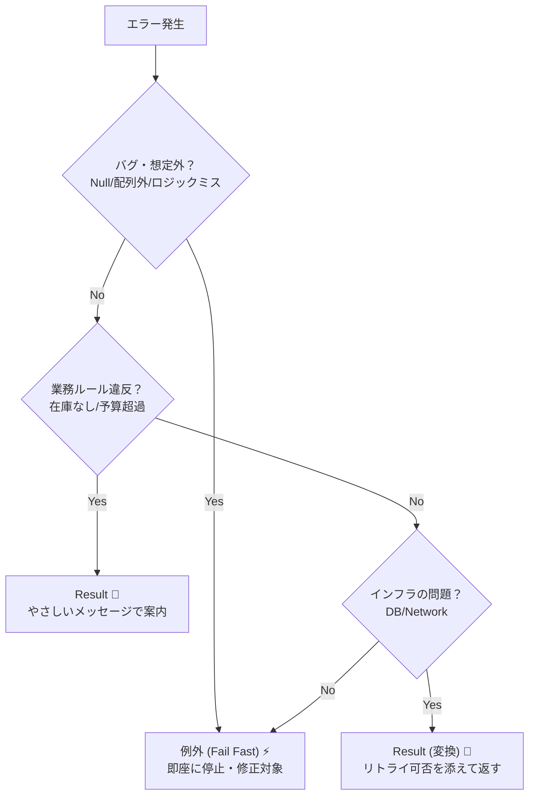

# 第15章：Result型の考え方（成功/失敗の箱）🎁✅❌

## 0. この章のゴール🎯✨

この章が終わったら、こんな判断ができるようになるよ〜😊💡

* 「これは**想定内の失敗**だから Result で返そう🎁」
* 「これは**想定外（バグ/不変条件違反）**だから例外で落としてOK⚡」
* 呼び出し側が読みやすい“失敗の扱い方”が分かる🔀✨
* TryParse みたいな「失敗しても普通」パターンが Result 的だと腹落ちする🧩

---

## 1. Result型ってなに？（超ざっくり）🎁


**Result型**は、関数の返り値を

* ✅ 成功：値が入ってる
* ❌ 失敗：エラー情報が入ってる

…という **「箱」** にする考え方だよ📦✨
例外みたいに「投げて上に飛ばす」じゃなくて、**“戻り値として、失敗もちゃんと返す”**のがポイント🙂

---

## 2. なんで Result が欲しくなるの？（例外だけだと困る場面）😵‍💫💥

### 2-1. 例外は “よく起きる失敗” に使うとしんどい🙅‍♀️

Microsoft の例外ベストプラクティスでも、**起きがちな条件は例外を避けて if で扱う**のが推奨されてるよ🧯
（例：接続が閉じてるなら Close しない、みたいな） ([Microsoft Learn][1])

つまり、**「入力ミス」みたいに日常的に起きる失敗**を毎回例外でやると、

* 制御が飛ぶ🌀（読みづらい）
* エラーパスが見えにくい👀
* 例外にはスタックトレース等の情報が付く（＝重い情報を運ぶ仕組み）🧵 ([Microsoft Learn][2])

…みたいな理由で、つらくなりがち💦

---

## 3) 「例外」VS「Result」ざっくり使い分け早見表🚦✨



| 状況                      | どう扱う？                | 理由                      |
| ----------------------- | -------------------- | ----------------------- |
| ユーザーの入力ミス（必ず起きうる）✍️     | Result ✅             | 想定内の失敗＝仕様として返したい        |
| 業務ルール違反（在庫なし、予算超え）🧾    | Result ✅             | ドメインエラーとして丁寧に扱う         |
| DB/外部APIが落ちた🌩️         | だいたい Result ✅（境界で変換） | 上に「再試行できる？」などを渡したい      |
| Null 参照、前提が崩れた、不変条件違反💥 | 例外 ⚡                 | 想定外＝バグ。早く気づく(Fail Fast) |

※この「想定内/外」の線引きが、第5章〜第9章でやった“分類”の出番だよ🧩💗🌩️⚡

---

## 4. Result 的な考え方、もう .NET にあるよ！（TryParse がそれ）🧠✨

たとえば `TryParse` は

* 変換できた？ → `true`
* できなかった？ → `false`
* できた場合の値は `out` で返す

っていう「失敗しても普通」設計だよね🙂
実際 `Boolean.TryParse` も「成功したら true、失敗したら false」を返すって明記されてるよ✅❌ ([Microsoft Learn][3])

つまり **TryParse ＝ Result の親戚**👨‍👩‍👧‍👦✨
Result はこれをもっと一般化して、

* 成功なら値
* 失敗ならエラー情報（コードやメッセージ）

まで持てるようにした感じだよ🎁🧾

---

## 5. 例外版 → Result版 にすると何が嬉しい？🎀✨

### 5-1. 呼び出し側が「読んだだけで分かる」📖👀

例外だと「どこで飛ぶか」がコード上ぱっと見えにくいけど、Result だと

* 成功 → 次へ
* 失敗 → ここで返す/表示する

が **制御フローとして見える**のが強い💪✨

---

## 6. 実例：入力チェックを「例外 → Result」へ🔁✨

### 6-1. まず悪くないけど、例外でやると“日常失敗”に弱い版😅

（例：予算は 0 以上じゃないとダメ、みたいな想定内ルール）

```csharp
public static int ParseBudgetOrThrow(string text)
{
    // ユーザーは普通に間違えるので、ここで例外を投げる設計はつらくなりがち💦
    return int.Parse(text); // 失敗すると例外
}
```

### 6-2. TryParse を挟むだけでも Result 的になる🙂✨

```csharp
public static bool TryParseBudget(string text, out int budget)
{
    return int.TryParse(text, out budget);
}
```

### 6-3. Result にすると「失敗理由」まで運べる🎁🧾

※Result本体の“完成版”は次章（第16章）で作るから、ここは最小の雰囲気だけね😊

```csharp
public abstract record AppError(string Code, string Message);

public sealed record ValidationError(string Code, string Message)
    : AppError(Code, Message);

public readonly record struct Result<T>(bool IsSuccess, T? Value, AppError? Error)
{
    public static Result<T> Ok(T value) => new(true, value, null);
    public static Result<T> Fail(AppError error) => new(false, default, error);
}

public static Result<int> ParseBudget(string text)
{
    if (!int.TryParse(text, out var budget))
        return Result<int>.Fail(new ValidationError("BUDGET_NOT_NUMBER", "予算は数字で入れてね🥺"));

    if (budget < 0)
        return Result<int>.Fail(new ValidationError("BUDGET_NEGATIVE", "予算は0以上にしてね🙏"));

    return Result<int>.Ok(budget);
}
```

呼び出し側はこうなるよ👇✨

```csharp
var result = ParseBudget(input);

if (!result.IsSuccess)
{
    Console.WriteLine(result.Error!.Message);
    return;
}

Console.WriteLine($"予算OK: {result.Value} 円🎉");
```

**「失敗したらここで終わり」**が自然に書けるのが Result の気持ちよさだよ〜🛑✨

---

## 7. ミニ演習（手を動かそ〜！）🧪💪✨

### 演習1：例外を Result に置き換え🔁

次の関数を「例外を投げない」で Result で返すようにしてみてね🙂

* 変換できない → `VALIDATION_NOT_NUMBER`
* 0以下 → `VALIDATION_OUT_OF_RANGE`

（ヒント：TryParse + if）

---

### 演習2：「例外？Result？」仕分けクイズ🎯

次をどっちで扱う？理由も1行で✨

1. メールアドレス形式が変📧
2. DB 接続タイムアウト⏳
3. 在庫が足りない📦
4. null が来た（絶対来ない想定）💥
5. 外部APIが 503 を返した🌩️

---

## 8. AI活用（Copilot / Codex）🤖✨：この章の使い方

AIは“答えを決める係”じゃなくて、**判断材料を増やす係**にすると強いよ💪😊

### 8-1. そのまま使えるプロンプト集📮✨

* 「この失敗は “想定内” ですか？ “想定外” ですか？理由も3つで」
* 「このコードを Result 返しにリファクタして。エラーコード案も出して」
* 「Result にすべきケース／例外にすべきケースを、この関数の仕様から整理して」
* 「呼び出し側が読みやすい early return 形に直して」

---

## 9. ちょい最新メモ（2026視点）🗓️✨

C# 14 は .NET 10 上でサポートされてて、Visual Studio 2026 に .NET 10 SDK が含まれるよ🪟🛠️ ([Microsoft Learn][4])
それと .NET 10 は 2025-11-11 に開始（LTS）って Lifecycle に載ってるよ📌 ([Microsoft Learn][5])

---

## まとめ🎀✨

* Result は「成功/失敗を返り値に入れる箱」🎁
* **想定内の失敗＝Result**、**想定外（バグ）＝例外** が基本🚦
* TryParse は Result 的発想の超身近な例🧩 ([Microsoft Learn][3])
* “起きがちな条件は例外を避ける”のが .NET の推奨にも沿うよ🧯 ([Microsoft Learn][1])

次の第16章では、この Result<T> を「ちゃんとした形」で組み立てて、テストも少し書いて“道具として使える”ところまで作っちゃお〜😊🧰🧪✨

[1]: https://learn.microsoft.com/en-us/dotnet/standard/exceptions/best-practices-for-exceptions "Best practices for exceptions - .NET | Microsoft Learn"
[2]: https://learn.microsoft.com/en-us/dotnet/standard/exceptions/best-practices-for-exceptions?utm_source=chatgpt.com "Best practices for exceptions - .NET"
[3]: https://learn.microsoft.com/en-us/dotnet/api/system.boolean.tryparse?view=net-10.0 "Boolean.TryParse Method (System) | Microsoft Learn"
[4]: https://learn.microsoft.com/en-us/dotnet/csharp/whats-new/csharp-14 "What's new in C# 14 | Microsoft Learn"
[5]: https://learn.microsoft.com/ja-jp/lifecycle/products/microsoft-net-and-net-core "Microsoft .NET および .NET Core - Microsoft Lifecycle | Microsoft Learn"
