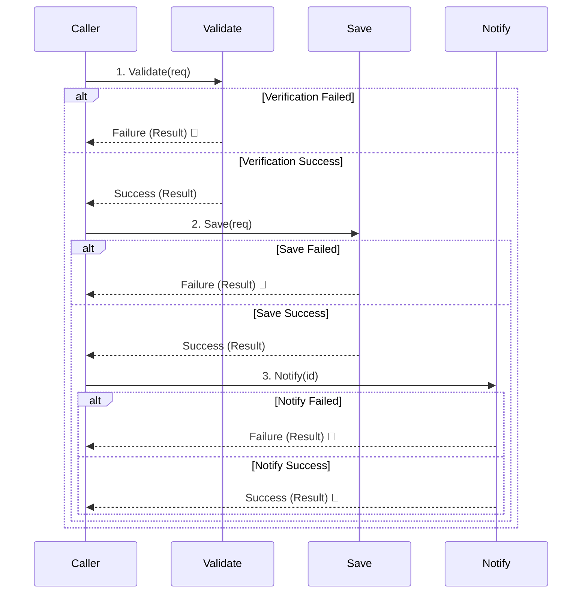

# 第19章：Resultの伝播（つなぐ・早期return）⛓️🛑

## この章のゴール🎯

「失敗したら先に進まない」を、**自然で読みやすい形**で書けるようになるよ😊
特に👇みたいな“複数ステップ処理”で、**ネスト地獄を回避**できるのがゴール！🧩

* ✅ 検証 → ✅ 保存 → ✅ 通知
* 途中で失敗したら **そこで止めて** 上に返す（伝播）⛔️➡️🎁

---

## 1) 伝播ってなに？🤔


Resultを使うと、処理の流れは基本こうなるよ👇

* 成功：次の処理へスッと進む🏃‍♀️💨
* 失敗：**その場でreturnして終了**🛑（＝失敗が上へ伝わる）

これを徹底すると、コードが「成功ルートは一直線✨」「失敗は最短で戻る🛑」になるよ🎀

---

## 2) まずは“ネスト地獄”を見てみよう😵‍💫🌀


### 悪い例：ifが深くなるパターン🙅‍♀️

```csharp
var v = Validate(request);
if (v.IsSuccess)
{
    var s = Save(request);
    if (s.IsSuccess)
    {
        var n = Notify(request);
        if (n.IsSuccess)
        {
            return Result.Ok();
        }
        else
        {
            return Result.Fail(n.Error);
        }
    }
    else
    {
        return Result.Fail(s.Error);
    }
}
else
{
    return Result.Fail(v.Error);
}
```

読んでて疲れるし、修正もしんどいよね…🥺💦
ここを「伝播の型」でスッキリさせるよ！✨

---

## 3) 解決①：早期return（ガード節）で“平らに”する🛡️✨


### 早期return版✅（まずこれが最強の基本💪）

```csharp
var v = Validate(request);
if (v.IsFailure) return Result.Fail(v.Error);

var s = Save(request);
if (s.IsFailure) return Result.Fail(s.Error);

var n = Notify(request);
if (n.IsFailure) return Result.Fail(n.Error);

return Result.Ok();
```

### 何が嬉しいの？😊

* 成功ルートが一直線🚄✨
* 失敗したら即return🛑
* 追加のステップが増えても怖くない🧱

---

## 4) 解決②：Resultを“つなぐ”定番テク（Map / Bind）🔗✨


ガード節でも十分だけど、処理が増えると「毎回 if (IsFailure) return…」が増えがち😅
そこで **“つなぐ関数”** を用意すると、さらにスッキリするよ🎀

### 用語のざっくり感覚🌟

* **Map**：成功なら「値を変換」する（失敗ならそのまま通す）🪄
* **Bind（= FlatMap）**：成功なら「次のResult処理へ進む」🔗
* **Tap**：成功時に“副作用だけ”やる（ログとか）📝
* **Ensure**：成功でも条件がダメなら失敗にする🚦

---

## 5) “つなぐ”ための拡張メソッドを用意しよう🧰✨


> ※ここでは第16章の最小Resultを想定して、分かりやすい形で載せるね😊
> `Result.Ok()` / `Result.Fail(error)` がある想定だよ🎁

### ResultとErrorのイメージ（例）

```csharp
public sealed record Error(string Code, string Message);

public readonly record struct Result(bool IsSuccess, Error? Error)
{
    public bool IsFailure => !IsSuccess;

    public static Result Ok() => new(true, null);
    public static Result Fail(Error error) => new(false, error);
}

public readonly record struct Result<T>(bool IsSuccess, T? Value, Error? Error)
{
    public bool IsFailure => !IsSuccess;

    public static Result<T> Ok(T value) => new(true, value, null);
    public static Result<T> Fail(Error error) => new(false, default, error);
}
```

### つなぐための拡張メソッド（Map / Bind / Tap / Ensure）

```csharp
public static class ResultExtensions
{
    public static Result<U> Map<T, U>(this Result<T> r, Func<T, U> f) =>
        r.IsSuccess ? Result<U>.Ok(f(r.Value!)) : Result<U>.Fail(r.Error!);

    public static Result<U> Bind<T, U>(this Result<T> r, Func<T, Result<U>> f) =>
        r.IsSuccess ? f(r.Value!) : Result<U>.Fail(r.Error!);

    public static Result Tap<T>(this Result<T> r, Action<T> action)
    {
        if (r.IsSuccess) action(r.Value!);
        return r.IsSuccess ? Result.Ok() : Result.Fail(r.Error!);
    }

    public static Result<T> Ensure<T>(this Result<T> r, Func<T, bool> predicate, Error error) =>
        r.IsSuccess && !predicate(r.Value!) ? Result<T>.Fail(error) : r;
}
```

---

## 6) 3ステップ処理をResultでつなぐ🧩✨（検証→保存→通知）




題材：推し活グッズ購入（例）🛍️💖
流れはこんな感じ👇

1. Validate：入力や業務ルールの検証✅
2. Save：DB保存（インフラ要素）💾
3. Notify：通知（外部I/O）📣

### まずは各ステップを「Resultで返す」関数にする😊


```csharp
public sealed record PurchaseRequest(string UserId, string ItemId, int Quantity);

public static class PurchaseFlow
{
    static readonly Error InvalidQuantity = new("Domain.InvalidQuantity", "数量が正しくないよ🥺");
    static readonly Error SaveFailed      = new("Infra.SaveFailed", "保存に失敗しちゃった…もう一回試してね🙏");
    static readonly Error NotifyFailed    = new("Infra.NotifyFailed", "通知に失敗しちゃった…少し時間をおいてね🙏");

    public static Result<PurchaseRequest> Validate(PurchaseRequest req)
    {
        if (req.Quantity <= 0) return Result<PurchaseRequest>.Fail(InvalidQuantity);
        return Result<PurchaseRequest>.Ok(req);
    }

    public static Result<Guid> Save(PurchaseRequest req)
    {
        try
        {
            // 本当はDB保存など
            var purchaseId = Guid.NewGuid();
            return Result<Guid>.Ok(purchaseId);
        }
        catch
        {
            return Result<Guid>.Fail(SaveFailed);
        }
    }

    public static Result Notify(Guid purchaseId)
    {
        try
        {
            // 本当は外部通知など
            return Result.Ok();
        }
        catch
        {
            return Result.Fail(NotifyFailed);
        }
    }
}
```

---

### A) ガード節（早期return）でつなぐ版🛡️✨

```csharp
public static Result Purchase(PurchaseRequest req)
{
    var v = PurchaseFlow.Validate(req);
    if (v.IsFailure) return Result.Fail(v.Error!);

    var s = PurchaseFlow.Save(v.Value!);
    if (s.IsFailure) return Result.Fail(s.Error!);

    var n = PurchaseFlow.Notify(s.Value!);
    if (n.IsFailure) return Result.Fail(n.Error!);

    return Result.Ok();
}
```

---

### B) Bindで“レール”に乗せる版🚄✨（伝播がさらに気持ちいい）


```csharp
public static Result Purchase(PurchaseRequest req)
{
    return PurchaseFlow.Validate(req)
        .Bind(PurchaseFlow.Save)
        .Bind(id => PurchaseFlow.Notify(id) is { IsSuccess: true }
            ? Result<Guid>.Ok(id)
            : Result<Guid>.Fail(new Error("Infra.NotifyFailed", "通知に失敗しちゃった…🙏")))
        .Map(_ => 0) // 返り値合わせのため（例）
        is { IsSuccess: true } ? Result.Ok() : Result.Fail(new Error("Flow.Failed", "失敗したよ🥺"));
}
```

> 実務だと「Result（値なし）」と「Result<T>」を混ぜると少し面倒になりがち😅
> なので次のどっちかがオススメだよ👇
>
> * 通知も `Result<Guid>` を返す（IDをそのまま返す）🧠
> * `Bind` を **Result用 / Result<T>用** の2種類用意する🧰

---

## 7) ミニ演習💪📝（この章の手を動かすポイント！）

### 演習①：ネスト地獄をガード節に直す🛠️✨

* 最初の“悪い例”をコピペして、**早期returnに書き換え**てみてね😊
* 目標：インデントが増えないコードにする🎀

### 演習②：3ステップを4ステップに増やす➕🧩

「検証→保存→通知」に、さらに👇を追加！

* **CheckStock**（在庫が足りる？）📦
* Resultで返して、伝播の流れを壊さずに追加してみよう✨

### 演習③：Ensureで“途中判定”を入れる🚦

* 保存が成功してIDが取れても、「IDが空なら失敗」みたいなチェックを `Ensure` で入れてみよう😊

---

## 8) AI活用🤖✨（この章は“レビュー役”が超ハマる！）

### ✅ 使えるお願いテンプレ（コピペOK）📋💖

* 「このコード、ネストが深いので**早期return**に直して。読みやすさの理由も3つ説明して😊」
* 「このResultの流れ、**Map/Bind/Ensure/Tap** のどれが合うか提案して、差分コードも出して✨」
* 「このResult伝播のコード、**Value!の危険箇所**を指摘して、安全な書き方を提案して🥺」
* 「このエラー文言、ユーザー向けに**やさしく**言い換えて候補を10個出して💬🌷」

---

## 9) よくあるつまずきポイント集🧯（先に潰そ〜！）

* ❌ `Value` を **成功チェックなしで触る**（事故りやすい🥺）
* ❌ 失敗時にログ・通知などをして、**中途半端に副作用が残る**
* ✅ “副作用”は `Tap` でまとめる📝✨
* ✅ 失敗したら **その場でreturn** を合言葉にする🛑💕

---

## まとめ🎀✨

この章で覚えたのはコレ👇

* **成功ルートは一直線**🚄
* **失敗は最短で返す**🛑
* つなぎ方はまず **ガード節**、慣れたら **Bind/Map** でスッキリ🔗✨

次の第20章では、いよいよ **インフラ例外をどうResultに変換するか**（変換ルール）に入るよ🧯➡️🎁
ここまでの「伝播」ができてると、変換したResultを上に返すのがめっちゃ自然になる😊✨

---

### ちょい最新メモ📌✨

C# 14 は「拡張メンバー（extension members）」などが追加されてて、拡張周りがさらに強化されてるよ（.NET 10でサポート）✨ ([learn.microsoft.com][1])

[1]: https://learn.microsoft.com/en-us/dotnet/csharp/whats-new/csharp-14 "What's new in C# 14 | Microsoft Learn"
