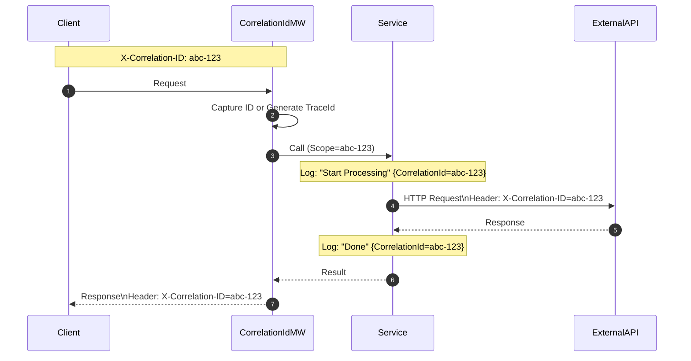

# 第25章：ログ設計② 相関ID＋レジリエンス＋ミニ総合演習🧵⏳🎓

この章は「**追える（追跡）**＋**耐える（レジリエンス）**」を、いちど“実戦っぽく”通しで体験する回だよ〜😊✨
ミニプロジェクト（推し活グッズ購入管理🛍️💖）を題材に、**相関ID（Correlation ID）**と **タイムアウト/キャンセル/リトライ**を入れて「運用で助かる設計」を完成させるよ🔥

---

## この章のゴール✅✨

最後に、受講者がこう言える状態にするよ😊🎓

* 「このエラー、**どのリクエストの出来事か**すぐ追える！🧵🔎」
* 「外部APIが遅い/落ちた時でも、**待ちすぎず**・**壊れにくい**⏳🛡️」
* 「ログにもAPIエラー（ProblemDetails）にも、**問い合わせ用ID**が入ってる🧾🆔」

---

## 0. 今日の授業の流れ（おすすめ⏰）

* 10分：相関IDってなに？🧵
* 25分：相関IDをログへ必ず載せる（実装）🔎
* 25分：外部HTTP呼び出しに相関IDを引き回す＋ProblemDetailsに入れる🧾
* 25分：レジリエンス（タイムアウト/キャンセル/リトライ）実装⏳🔁🛑
* 20分：ミニ総合演習（通しで動かす）🛍️💖

---

## 1. 相関IDってなに？🧵🤔




相関IDは、ざっくり言うと **「このリクエストの一生を追うための番号」**だよ📌✨
ログが1000行あっても、相関IDが同じなら「この一連の出来事だな」って一瞬でつながる😊🔎

### 1-1. “TraceId”が超おすすめな理由🧵✨

HTTPの世界では、分散トレーシング向けに **W3C Trace Context**（`traceparent` ヘッダ）が標準で決まってるよ🌐📏 ([Qiita][1])
ASP.NET Core のログも、設定すると **`TraceId` / `SpanId` / `ParentId`** などを“自動でスコープに載せられる”のが強い✨ ([Microsoft Learn][2])

つまり…

* できれば **TraceId（分散トレースのID）** を「相関IDの本命」にする🧵
* 追加で `X-Correlation-ID` みたいなヘッダも“受付/返却”すると親切（クライアントが使える）💌✨

---

## 2. 実装①：ログに TraceId を自動で載せる🔎🧵


ASP.NET Core のログは、設定しだいで **TraceId などをスコープへ自動付与**してくれるよ✨ ([Microsoft Learn][2])

### 2-1. Program.cs：スコープ＋ActivityTrackingOptions をON✅

```csharp
using Microsoft.Extensions.Logging;
using System.Diagnostics;

var builder = WebApplication.CreateBuilder(args);

// ✅ スコープ表示をON（コンソールでも TraceId が見えるようにする）
builder.Logging.AddSimpleConsole(o => o.IncludeScopes = true);

// ✅ TraceId / SpanId / ParentId / Baggage / Tags をスコープに自動追加
builder.Logging.Configure(o =>
{
    o.ActivityTrackingOptions =
        ActivityTrackingOptions.SpanId |
        ActivityTrackingOptions.TraceId |
        ActivityTrackingOptions.ParentId |
        ActivityTrackingOptions.Baggage |
        ActivityTrackingOptions.Tags;
});

var app = builder.Build();

app.MapGet("/", (ILoggerFactory lf) =>
{
    var logger = lf.CreateLogger("Demo");
    logger.LogInformation("Hello with TraceId!");
    return Results.Ok("ok");
});

app.Run();
```

ポイント💡

* `IncludeScopes = true` が超大事だよ〜😊
* `traceparent` が入ってきた場合、`ParentId` が W3C の値としてログに出る動きも説明されてるよ🧵🌐 ([Microsoft Learn][2])

---

## 3. 実装②：相関IDミドルウェア（X-Correlation-ID 対応）💌🧵


「クライアントが相関IDを送ってきたら尊重する」＋「返す」までやると、問い合わせ対応がめっちゃ楽になるよ😊📞✨

### 3-1. CorrelationIdMiddleware（最小だけど実戦向け）

```csharp
using System.Diagnostics;

public sealed class CorrelationIdMiddleware
{
    public const string HeaderName = "X-Correlation-ID";
    private readonly RequestDelegate _next;
    private readonly ILogger<CorrelationIdMiddleware> _logger;

    public CorrelationIdMiddleware(RequestDelegate next, ILogger<CorrelationIdMiddleware> logger)
    {
        _next = next;
        _logger = logger;
    }

    public async Task InvokeAsync(HttpContext ctx)
    {
        // ① クライアント指定があれば使う（なければ TraceId を採用）
        var fromHeader = ctx.Request.Headers[HeaderName].FirstOrDefault();
        var traceId = Activity.Current?.TraceId.ToString() ?? ctx.TraceIdentifier;

        // ゆるバリデーション（長すぎは捨てる）
        var correlationId = (!string.IsNullOrWhiteSpace(fromHeader) && fromHeader.Length <= 64)
            ? fromHeader
            : traceId;

        // ② 後続で参照できるように保存
        ctx.Items[HeaderName] = correlationId;

        // ③ レスポンスにも返す（クライアントが控えられる）
        ctx.Response.Headers[HeaderName] = correlationId;

        // ④ ログスコープに入れる（どのログ行にも乗る）
        using (_logger.BeginScope(new Dictionary<string, object?>
        {
            ["CorrelationId"] = correlationId
        }))
        {
            await _next(ctx);
        }
    }
}
```

### 3-2. Program.cs に組み込み🔧

```csharp
var builder = WebApplication.CreateBuilder(args);
// (ログ設定は前節のとおり)

var app = builder.Build();

app.UseMiddleware<CorrelationIdMiddleware>();

app.MapGet("/demo", (HttpContext ctx, ILoggerFactory lf) =>
{
    var logger = lf.CreateLogger("Demo");
    var correlationId = ctx.Items[CorrelationIdMiddleware.HeaderName]?.ToString();
    logger.LogInformation("Hello! correlationId={CorrelationId}", correlationId);
    return Results.Ok(new { correlationId });
});

app.Run();
```

---

## 4. 実装③：ProblemDetails に「問い合わせ用ID」を入れる🧾🆔


ProblemDetails は **RFC 9457** の標準形式だよ🧾✨ ([ねののお庭。][3])
そして ASP.NET Core は **`AddProblemDetails`** で ProblemDetails を生成できる（例外/ステータスコードページ等）って公式に書かれてるよ😊 ([Microsoft Learn][4])
さらに RFC 9457 は「拡張メンバー（extension）」も持てるので、`traceId` みたいなのを追加してOKな設計にできるよ🧠✨ ([ねののお庭。][3])

### 4-1. AddProblemDetails + CustomizeProblemDetails

```csharp
using System.Diagnostics;
using Microsoft.AspNetCore.Diagnostics;

var builder = WebApplication.CreateBuilder(args);

builder.Services.AddProblemDetails(options =>
{
    options.CustomizeProblemDetails = ctx =>
    {
        // traceId（本命）🧵
        var traceId = Activity.Current?.TraceId.ToString() ?? ctx.HttpContext.TraceIdentifier;
        ctx.ProblemDetails.Extensions["traceId"] = traceId;

        // correlationId（クライアント向け）💌
        if (ctx.HttpContext.Items.TryGetValue(CorrelationIdMiddleware.HeaderName, out var cid) && cid is string s)
        {
            ctx.ProblemDetails.Extensions["correlationId"] = s;
        }
    };
});

var app = builder.Build();

app.UseMiddleware<CorrelationIdMiddleware>();

// ✅ 例外→ProblemDetails（標準の仕組み）
app.UseExceptionHandler();
app.UseStatusCodePages();

app.MapGet("/boom", () =>
{
    throw new InvalidOperationException("バグっぽい例外💥");
});

app.Run();
```

※ `AddProblemDetails` と、例外/ステータスコードから ProblemDetails を作る流れは公式の説明どおりだよ📘✨ ([Microsoft Learn][4])

---

## 5. レジリエンス入門：待ちすぎない＆壊れにくい⏳🛡️


ここからは「外部APIが遅い/落ちる」は“普通に起こる”前提で守るよ😊🌩️

### 5-1. まずは3点セット🔰

* **タイムアウト**：いつまでも待たない⏳✋
* **キャンセル**：ユーザーが戻った/画面閉じたら止める🛑
* **リトライ**：一時的な失敗だけ、条件つきで再試行🔁

### 5-2. 「リトライしていい？」の判断（超重要⚠️）


* GET みたいな **読み取り**は比較的リトライしやすい😊
* POST で「購入を作る」みたいな **追加/更新**は、リトライすると二重購入になりがち😱
  → だから、**Unsafe HTTP methods のリトライを無効化**するのが実戦ではよくある✨ ([Microsoft Learn][5])

---

## 6. 実装④：HttpClient に標準レジリエンスを付ける🛡️🌐

Microsoft公式で、`Microsoft.Extensions.Http.Resilience` を使って HttpClient にレジリエンスを入れられるよ〜😊✨ ([Microsoft Learn][5])
`AddStandardResilienceHandler()` は、**タイムアウト/リトライ/サーキットブレーカー等を標準構成で積む**って説明されてるよ🧱✨ ([Microsoft Learn][5])

### 6-1. 標準ハンドラの“中身”（知ってると強い💪）


標準ハンドラは、既定でだいたいこういう構成になってるよ（順番も大事）🧠

* Total timeout（全体の制限）
* Retry（最大3回、指数バックオフ＋ジッター）
* Circuit breaker（壊れてる依存先を一時停止）
* Attempt timeout（1回の試行を10秒制限）
  …などなど✨ ([Microsoft Learn][5])

### 6-2. “購入POST”みたいな危険操作はリトライ禁止🚫🔁

公式ドキュメントでも「POSTをリトライすると重複の危険」って例が出てるよ⚠️ ([Microsoft Learn][5])

```csharp
builder.Services.AddHttpClient<ShippingClient>(client =>
{
    client.BaseAddress = new Uri("https://example.invalid/");
})
.AddStandardResilienceHandler(options =>
{
    // ✅ 危険メソッドはリトライしない（まず安全側）
    options.Retry.DisableForUnsafeHttpMethods();
});
```

---

## 7. ミニ総合演習：推し活グッズ購入管理🛍️💖（通しで完成🎓）


### 7-1. 題材（最小の仕様）📌

* グッズには在庫がある📦
* 予算がある💰
* 購入すると在庫が減り、予算も減る🧾
* 配送料は外部APIから取得（たまに遅い/失敗する）🌐🌩️

### 7-2. 成果物（この章の担当ぶん）🎁

* ✅ ログに **TraceId/CorrelationId** が載る🧵
* ✅ ProblemDetails に **traceId/correlationId** が載る🧾
* ✅ 外部API呼び出しが **タイムアウト/リトライ** で耐える⏳🔁
* ✅ それでもダメなら **インフラエラーResult** に変換して返す🎁

---

## 8. 演習ステップ（手順どおりでOK😊🧩）

### Step A：購入APIを1本作る🛍️

* `POST /purchases`

  * 入力：`itemId`, `qty`
  * 成功：200 + 購入結果
  * 失敗（想定内）：在庫不足/予算不足 → Result失敗 → ProblemDetails(409など)

### Step B：相関IDミドルウェアを入れる🧵

* `X-Correlation-ID` を受け取る/返す
* ログスコープに `CorrelationId` を入れる

### Step C：ProblemDetailsにIDを入れる🧾🆔

* `traceId` と `correlationId` を extensions に入れる

  * これで「お問い合わせのとき、このIDください🙏」ができる📞✨

### Step D：外部API（配送料）呼び出しにレジリエンス🛡️

* `ShippingClient.GetFeeAsync()`（GET想定）
* `AddStandardResilienceHandler()` を付ける
* “購入POST自体”は危険なので、**POSTリトライはしない**（ここ大事）⚠️ ([Microsoft Learn][5])

---

## 9. 仕上げのチェックリスト✅✨（ここ通れば合格🎓）

* [ ] ログ1行1行に `TraceId` が入ってる🧵 ([Microsoft Learn][2])
* [ ] `X-Correlation-ID` を送ると、レスポンスにも同じIDが返る💌
* [ ] 失敗レスポンス（ProblemDetails）に `traceId` が入ってる🧾 ([ねののお庭。][3])
* [ ] 外部APIが落ちても、無限に待たずにタイムアウトする⏳🛑 ([Microsoft Learn][5])
* [ ] “危険操作”はリトライされない（重複購入しない）🚫🔁 ([Microsoft Learn][5])

---

## 10. AI活用（Copilot/Codex）おすすめプロンプト集🤖✨

そのままコピペでOKだよ😊💕

* 「ASP.NET Core のミドルウェアで `X-Correlation-ID` を受け取り、レスポンスヘッダに返して、ILogger.BeginScopeでCorrelationIdをスコープに入れる実装を書いて」
* 「AddProblemDetails の CustomizeProblemDetails で traceId と correlationId を extensions に入れるコードを書いて」
* 「HttpClientFactory で AddStandardResilienceHandler を使い、Unsafe HTTP methods のリトライを無効化する設定例を書いて」 ([Microsoft Learn][5])
* 「“購入POSTはリトライ危険”の理由を、初心者向けにやさしく説明して（例つきで）」 ([Microsoft Learn][5])

---


[1]: https://qiita.com/karuakun/items/7f75c774a22d69590125?utm_source=chatgpt.com "SpanId、TraceId、ParentIdってなに？W3C Trace Context を ..."
[2]: https://learn.microsoft.com/en-us/aspnet/core/fundamentals/logging/?view=aspnetcore-10.0 "Logging in .NET and ASP.NET Core | Microsoft Learn"
[3]: https://blog.neno.dev/entry/2023/07/04/181843?utm_source=chatgpt.com "【C#】ASP.NET Core と W3C Trace Context とお手軽 ..."
[4]: https://learn.microsoft.com/en-us/aspnet/core/fundamentals/error-handling-api?view=aspnetcore-10.0 "Handle errors in ASP.NET Core APIs | Microsoft Learn"
[5]: https://learn.microsoft.com/en-us/dotnet/core/resilience/http-resilience "Build resilient HTTP apps: Key development patterns - .NET | Microsoft Learn"
