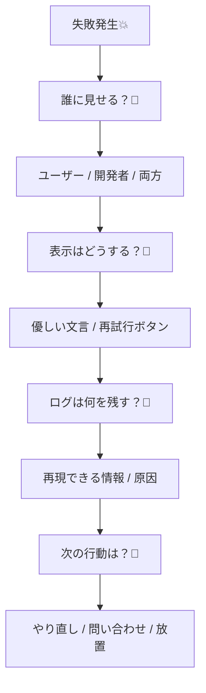

# 第01章：エラーは“バグ”じゃなく“仕様”でもあるよ😊📌

## 0. この章でやること（ゴール）🎯✨

「エラー＝悪いもの💥」じゃなくて、**“失敗も最初から仕様に入ってる”**って視点に切り替えるよ😊
そのうえで、失敗を3種類に分けて「これは設計で受け止めるやつ」「これは開発者に知らせるやつ」を見分けられるようになるのがゴール🧠💡

---

## 1. まず結論：失敗は“仕様の一部”🧩📘


アプリって、成功する時だけ考えて作ると、あとでこうなる👇

* 失敗した瞬間に画面が崩れる😱
* 何が起きたかわからないログが増える🌀
* ユーザーが「どうすればいいの？」ってなる🥺
* 開発者も「再現できない…」ってなる😵‍💫

だから最初からこう考えよう✨

> ✅ **成功ルート**だけじゃなく、**失敗ルート**も同じくらい丁寧に設計する
> ✅ 失敗は「起きうるイベント」だから、**どう振る舞うか**を決めるのが設計🎀

エラーって「実行時の異常（abnormalities）」を表すために作られる、という説明もあるよ📌 ([GitHub][1])

---

## 2. 失敗は3種類に分けると一気にラク😊🗂️


この教材の最初は、細かい型設計よりも「仕分け感覚」を作るのが大事💗
今日覚える分類はこの3つ👇

### A. 想定内の失敗（＝仕様の範囲）🙂✅

**ユーザーや業務のルール的に起きて当たり前**の失敗。

例👇

* パスワード間違い🔑
* 在庫なし📦
* 入力が不正（メール形式じゃない）✉️
* 期限切れ⏰

👉 これは **“怒る”んじゃなくて“案内する”** が正解😊🫶
（のちの章で Domain Error として扱うやつ💗）

---

### B. 想定外の異常（＝バグっぽい）⚡🧱

**本来起きないはず**のやつ。

例👇

* nullのはずがないのにnullだった😨
* 絶対あるはずのデータが無い😵
* 到達しないはずの分岐に来た🚫

👉 これはユーザーに「あなたが悪い」とは言わない🙅‍♀️
開発者に「直して！」って知らせるやつ👩‍💻🔥

---

### C. 運用で起きる失敗（＝現実は落ちる）🌩️🔌

外部要因で普通に起きるやつ。

例👇

* ネットが切れた📶💥
* APIが落ちた🛰️
* タイムアウト⏳
* 一時的に混んでる🚧

👉 これは「再試行できます🔁」とか「少し待ってね🙇‍♀️」みたいに、**運用前提の受け止め**が必要✨

Node.jsだと Promise の失敗が拾われない（unhandled）と、既定で“投げ直し”扱いになって落ちる方向になってたりするよ⚠️ ([nodejs.org][2])
（こういう“現実の落ち方”も、この分類で整理できる😊）

---

## 3. 失敗を設計対象にするって、具体的に何するの？🛠️🎀


この段階では難しい型はまだ不要だよ🙂
まずは **「失敗したらどうする？」を文章で言える**のが最強💪✨

失敗1個につき、最低これだけ決める👇

* **誰に見せる？**（ユーザー？開発者？両方？）👀
* **表示はどうする？**（優しい文言？再試行ボタン？）🫶
* **ログは何を残す？**（再現できる情報）🧾
* **次の行動は？**（やり直し／問い合わせ／放置でOK）🔁📩



ここまで決めると、あとで Result 型やエラーカタログに落とし込むのが超ラクになるよ😊✨

---

## 4. ミニ演習📝：「最近の“困った失敗”」を3つ書いて分類してみよう😊📌

### ステップ1：まず3つ書く✍️

最近あなたが作った・触ったもの（個人開発でもOK）で、困った失敗を3つ思い出してね💭✨

* 失敗①：＿＿＿＿＿＿＿＿＿＿
* 失敗②：＿＿＿＿＿＿＿＿＿＿
* 失敗③：＿＿＿＿＿＿＿＿＿＿

### ステップ2：3種類に分類🏷️

下のどれ？を選ぶだけでOK😊

| 失敗 | A 想定内🙂 | B 想定外⚡ | C 運用🌩️ |
| -- | ------: | -----: | ------: |
| ①  |         |        |         |
| ②  |         |        |         |
| ③  |         |        |         |

### ステップ3：1個だけ深掘り（テンプレ）🧾✨

どれか1つ選んで、これを埋めてね👇

* 状況：いつ／どこで起きた？📍
* 原因：何が原因っぽい？🧠
* 期待結果：本当はどうなってほしい？🌈
* ユーザー対応：どう表示したい？💬
* 開発者向け：ログに何を残したい？🔎

---

## 5. AI活用🤖：失敗の「言語化」を整えてもらおう✨


AIはここでめちゃ強いよ😊
「モヤっとした失敗」を **チームに説明できる文章**に整えてくれる🪄

そのままコピペして使えるプロンプト例👇（短くてOK！）

```text
次の「失敗体験」を、設計に使える形に整理して。
出力は「状況」「原因候補」「期待結果」「ユーザー向け対応」「ログに残すべき情報」の5つ。

失敗体験：
（ここにあなたの失敗を書く）
```

追加でこう頼むのもおすすめ👇😆

```text
この失敗は「想定内」「想定外」「運用」のどれに近い？
理由も1〜2行で。
迷う場合は、判断のための質問も3つ出して。
```

---

## 6. まとめ🧁✨（今日の持ち帰り）

* 失敗は「悪」じゃなくて、**仕様の一部**として設計する😊📘
* まずは3分類👇ができると強い🗂️

  * 想定内🙂 / 想定外⚡ / 運用🌩️
* いきなり難しい型じゃなくて、**文章で“どう振る舞うか”を決める**のが第一歩🫶
* AIで「失敗の説明」を整えると、設計が一気に進む🤖✨

---

## 次回予告📣（第2章）

TS/JSのエラーが難しい理由を3つにまとめて、**ハマりポイントを先に踏み抜いておく**よ😵‍💫🧩
「throwが何でも飛ぶ🎲」とか「Promiseの落ち方⚡」とか、超あるあるをやるよ〜😊💗

[1]: https://github.com/tc39/proposal-error-cause?utm_source=chatgpt.com "tc39/proposal-error-cause"
[2]: https://nodejs.org/en/blog/release/v15.0.0?utm_source=chatgpt.com "Node.js 15.0.0 (Current)"
