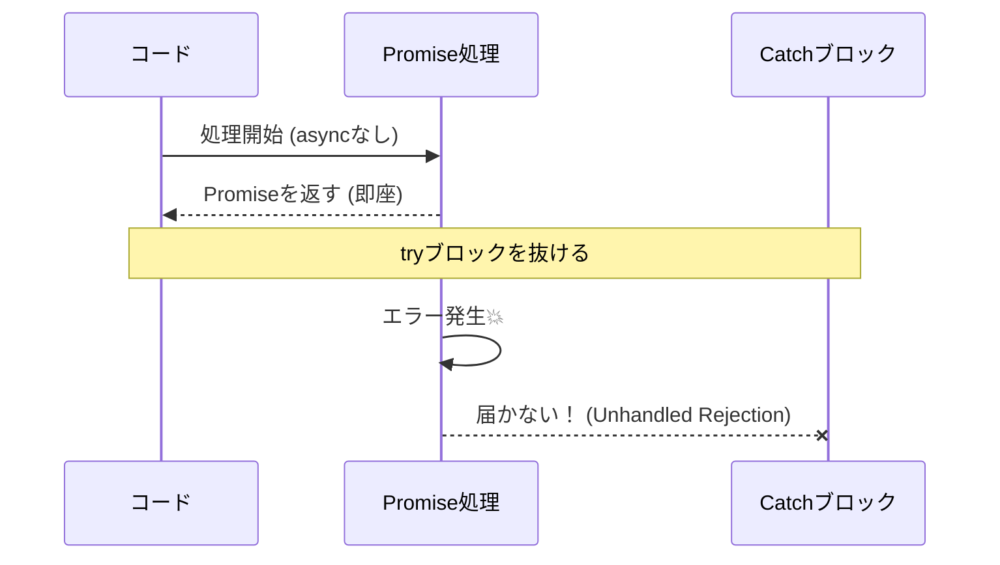
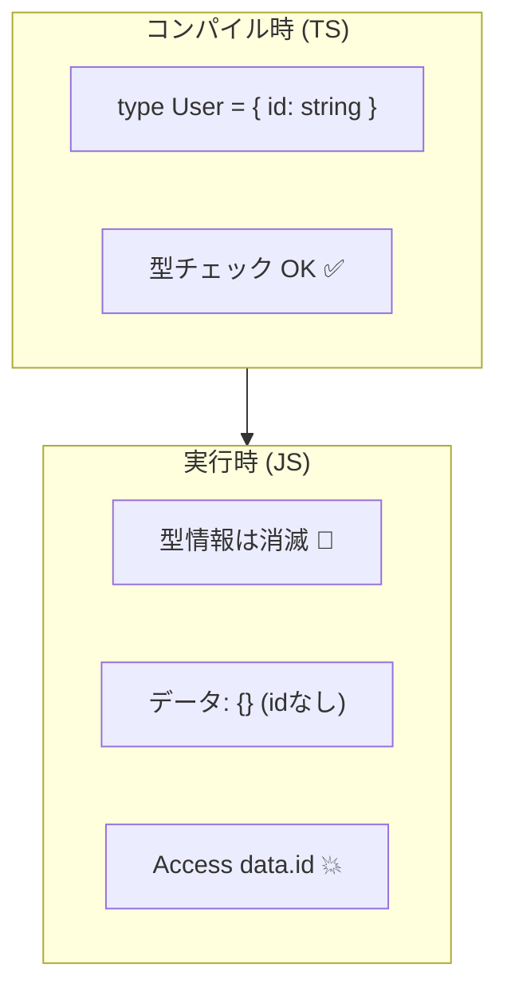

# 第02章：TS/JSのエラーが難しい3つの理由😵‍💫🧩

この章は「エラーモデリング始める前に、まず“地雷ポイント”を知ろうね🧯」って回です✨
C#っぽい感覚のままだとハマりやすいポイントが **ちょうど3つ** あるので、先に潰しちゃいます💪🌸

---

## 2-0. 結論：この3つが“難しさの根っこ”🌱


1. **throw は何でも飛ぶ** 🎲
2. **Promise / async で“落ち方”が変わる** ⚡
3. **TypeScript の型は実行時に消える** 🫥

この3つのせいで、エラーが「形がバラバラ」「落ちた場所が分かりにくい」「型で守られてるつもりが守られてない」になりがちです😇

---

## 2-1. 理由①：throw は何でも飛ぶ🎲（= 受け取る側が地獄になりやすい😵）


### ✅ どういうこと？

JavaScript は `throw` に **どんな値でも** 入れられます（文字列・数・真偽値・オブジェクト…なんでも）🧨
「例外＝Errorオブジェクト」って世界じゃないんです🥺
MDN でも `throw` は “例外の値を投げる” と説明されてて、例として文字列や数値も投げてます。([mdn2.netlify.app][1])

### 😱 ありがちな事故パターン

* `catch (e) { console.log(e.message) }` って書いたら、`e` が文字列で **message が無くて死ぬ** 💥
* `{ message: "x" }` みたいな“それっぽいオブジェクト”が飛んできて、`stack` が無くて調査できない🫠
* ライブラリが `throw "NOT_FOUND"` みたいな雑throwしてて、アプリ側が想定崩壊😇

### 🛡️ 対策の基本：catch したらまず疑う（unknown で受ける）


TypeScript には「catch の変数を `unknown` 扱いにする」設定があります✅
これを有効にすると「投げられた値は信用できない」前提で安全に書けます🛡️✨ ([typescriptlang.org][2])

#### まずこれだけ覚えてね（超重要）📌

* **catch の中では `e` を“Error だと思わない”** 🙅‍♀️
* **Errorっぽく寄せる（正規化）** 🧼✨

#### “怖い throw” の例（わざとヤバい😈）

```ts
throw "TIMEOUT";                 // 文字列
throw 404;                       // 数値
throw { code: "E001", msg: "x" } // それっぽいオブジェクト
throw null;                      // えっ…😇
```

#### “受け止め方”の型（まずはこの形でOK）🧯

```ts
function toError(e: unknown): Error {
  if (e instanceof Error) return e;

  // 文字列や数値でも「Error」に寄せる
  return new Error(`Non-Error thrown: ${String(e)}`);
}

try {
  // 何か処理…
} catch (e: unknown) {
  const err = toError(e);
  console.error(err.message);
  console.error(err.stack);
}
```

---

## 2-2. 理由②：Promise / async で“落ち方”が変わる⚡（= try/catch が効かないことがある😱）


### ✅ どういうこと？

同期処理は `throw` した瞬間にその場で落ちるけど、非同期（Promise）は **“あとで”落ちる** ことがあります⏱️💥
だから `try/catch` の場所を間違えると、エラーが捕まらずに **Unhandled Rejection** になります😇

ブラウザには、未処理の Promise 拒否が起きたときの `unhandledrejection` イベントがあります([MDNウェブドキュメント][3])
さらに「あとから catch された」場合の `rejectionhandled` イベントもあります([MDNウェブドキュメント][4])

Node.js 側も、Unhandled Rejection の扱いは重要で、Node.js 15 で既定動作が `warn` → `throw` に変更された（未設定なら未捕捉例外として扱う）とリリースノートに書かれています([nodejs.org][5])
→ つまり、放置すると本気で落ちやすいです💥

### 😱 ありがちな事故パターン（“await忘れ”が最強に多い）

#### ❌ try/catch が効かない例

```ts
async function boom() {
  throw new Error("どーん💥");
}

try {
  boom(); // await してない！
  console.log("ここ普通に通る😇");
} catch {
  console.log("ここ来ない🥺");
}
```

#### ✅ こうすると捕まる

```ts
try {
  await boom(); // await 必須！
} catch (e: unknown) {
  // ここで拾える✨
}
```

### 🧭 ここで作る“感覚”✨

* 「Promiseの失敗は **throw じゃなくて reject** で落ちることがある」⚡
* 「拾うなら **awaitするか、returnして呼び出し側に拾わせる**」🎁
* 「“どこが最後の受け止め役か”を決めないと、落下地点が迷子になる」🧭💦
  （これが後の“例外境界🚪”に繋がるよ！）



---

## 2-3. 理由③：TypeScript の型は実行時に消える🫥（= 型で守られてる“気がするだけ”になりやすい😵）


### ✅ どういうこと？

TypeScript の型注釈や型アサーションは **コンパイル時に消えて** 実行時の挙動を変えません。
公式ドキュメントでも「型注釈や型アサーションはコンパイラにより取り除かれ、実行時の挙動に影響しない」と説明されています([typescriptlang.org][6])

つまり…

* `type User = { id: string }` を書いても、実行中に `User` というものは存在しない🫥
* APIから来た値が変でも「型があるから安心✨」とはならない（境界で検証しないと危険）⚠️




### 😱 ありがちな事故パターン

* `as User` で無理やり通して、実行時に `undefined` 参照で爆発💥
* `catch` した値を `Error` だと思い込んで `.stack` が無くて調査不能🫠
* “型はあるのに落ちる”＝ **I/O由来のデータが型を破る** あるある😇

### 🛡️ 対策の基本：実行時にチェックできる“形”を用意する

ここでは超入門として **「型ガード」だけ** 覚えればOK👌✨

```ts
type ApiErrorLike = { message: string; code?: string };

function isApiErrorLike(x: unknown): x is ApiErrorLike {
  return (
    typeof x === "object" &&
    x !== null &&
    "message" in x &&
    typeof (x as any).message === "string"
  );
}

try {
  // 何か
} catch (e: unknown) {
  if (e instanceof Error) {
    console.log("Errorだよ🧯", e.message);
  } else if (isApiErrorLike(e)) {
    console.log("それっぽいエラーだよ🧩", e.message, e.code);
  } else {
    console.log("正体不明👻", e);
  }
}
```

---

## 2-4. ミニ演習📝（15〜20分でOKだよ⏰✨）

### 演習A：throw の“怖い例”を3つ書く🎲😈

* ✅ `string` を投げる
* ✅ `object` を投げる
* ✅ `null` とかも投げてみる（勇気💖）
  そして「受け取る側が何に困るか」を1行メモ📝

### 演習B：await忘れで Unhandled を再現する⚡😱

* `async function` を作って `throw new Error()`
* `await` しない呼び出しで `try/catch` が効かないのを確認👀
* `await` したら捕まるのを確認✅

### 演習C：「型は消える」を体感する🫥

* `type User = { id: string }` を作る
* `const u = JSON.parse("...") as User` で通す
* わざと `id` 無しのJSONで落として「型では守れない」を体感😇

---

## 2-5. AI活用🤖💬（コピペでOK✨）

「事故パターン」を早く集めるのにAIめちゃ強いです💪🤖

```text
あなたはTypeScriptのレビュー担当です。
JS/TSのエラー処理で「よくある事故パターン」を、原因→症状→対策の順で10個ください。
throwが何でも飛ぶ / Promiseの落ち方 / 型が実行時に消える、の3観点を必ず含めてください。
初心者にもわかる短い説明でお願いします。
```

```text
このコードのtry/catchが「効かない」可能性を洗い出して、
await忘れ・Promiseチェーン・例外境界の観点で改善案を出してください。
（改善後のコード例も）
```

---

## 2-6. まとめ✨（合言葉はこれだけでOK😊📌）

* **throw は何でも飛ぶ** 🎲 → まず疑う、`unknown`、正規化🧼
* **Promise はあとで落ちる** ⚡ → `await` or `return`、Unhandled注意💥
* **型は実行時に消える** 🫥 → “境界”で実行時チェックを意識🧪

次の第3章では「Errorオブジェクトをちゃんと読む力📖🧯」をつけて、調査できる人になろうね〜🔎✨

[1]: https://mdn2.netlify.app/en-us/docs/web/javascript/reference/statements/throw/?utm_source=chatgpt.com "throw - JavaScript"
[2]: https://www.typescriptlang.org/tsconfig/useUnknownInCatchVariables.html?utm_source=chatgpt.com "useUnknownInCatchVariables - TSConfig Option"
[3]: https://developer.mozilla.org/en-US/docs/Web/API/Window/unhandledrejection_event?utm_source=chatgpt.com "Window: unhandledrejection event - Web APIs | MDN"
[4]: https://developer.mozilla.org/en-US/docs/Web/API/Window/rejectionhandled_event?utm_source=chatgpt.com "Window: rejectionhandled event - Web APIs | MDN"
[5]: https://nodejs.org/en/blog/release/v15.0.0?utm_source=chatgpt.com "Node.js 15.0.0 (Current)"
[6]: https://www.typescriptlang.org/docs/handbook/2/everyday-types.html?utm_source=chatgpt.com "Documentation - Everyday Types"
