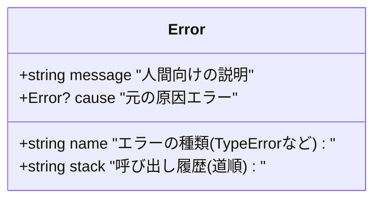
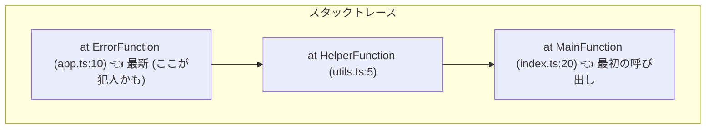

# 第03章：Errorオブジェクト入門（まず読む力）📖🧯

この章は「エラーを直す章」じゃなくて、「エラーを読めるようになる章」だよ〜！🔎💡
読めるようになると、原因特定が爆速になるし、AIに聞くときも精度が上がるよ🤖✨

---

## この章でできるようになること🎯💖

* Errorの基本パーツ（name / message / stack / cause）を説明できる🙂📦
* stack（スタックトレース）を上から読んで「犯人の行」を見つけられる🔍🕵️‍♀️
* TypeScriptでも「元の.tsの行番号」でスタックを読めるようにする🗺️✨
* ログに残す粒度（どこまで出す？）の判断ができる🧾🔐

---

## 3-1. Errorオブジェクトって何？🧠🧯

一言でいうと👇
**「失敗の情報がまとまって入ってる入れ物」**だよ📦💥

よく使うのはこの4つ！

* **name**：エラーの種類名（例：TypeError など）🏷️
* **message**：人間向けの説明文🗣️
* **stack**：どこから呼ばれてここに来たかの道順🧵（※広く使われてるけど非標準扱い） ([MDNウェブドキュメント][1])
* **cause**：原因になった元エラー（エラー連鎖できる！）⛓️💡 ([MDNウェブドキュメント][2])



---

## 3-2. まずは “見える化” しよう👀✨（最小の観察セット）

いったん「Errorを捕まえたら、こう見る」って型を作るよ😊🧩

```ts
function dumpError(e: unknown) {
  if (e instanceof Error) {
    console.error("name:", e.name);
    console.error("message:", e.message);
    console.error("cause:", (e as any).cause);
    console.error("stack:", e.stack);
  } else {
    console.error("non-Error thrown:", e);
  }
}
```

ポイント👇💡

* JS/TSは **Error以外もthrowできちゃう**世界だから（stringとかobjectとか）、「unknown前提で見る」が安全🛡️
  ※この思想は次の章（catchはunknown）で本格的にやるよ😊

---

## 3-3. stackの読み方（ここが本題！）🧵🔎🔥

### ✅ ルール1：基本、**上が最新（いまここ）**、下が過去（入り口）📜

MDNでも「stackは最近の呼び出しから古い呼び出しへ」って説明されてるよ ([MDNウェブドキュメント][1])

### ✅ ルール2：まず見るのは “最初の自分のコード” の行👈✨

ライブラリの中を最初に追いかけると迷子になりがち😵‍💫
**自分のファイル名（src/〜とか）に最初に当たった行**を探そう！

### ✅ ルール3：1行はだいたいこういう形（V8系の例）

* `at 関数名 (ファイル:行:列)`
  V8のスタック仕様（非標準だけど実質標準みたいに広く使われてる）も公式ドキュメントがあるよ ([v8.dev][3])

### ✅ ルール4：深い原因が欲しいときは stackTraceLimit を上げる🧗‍♀️

```ts
Error.stackTraceLimit = 50;
```

これはMDNにもまとまってるよ ([MDNウェブドキュメント][4])



---

## 3-4. TypeScriptのstackを “.tsの行番号” で読む（超大事）🗺️✨

TSはコンパイルされて.jsになるから、そのままだと stack が **distの.js行**を指しちゃうのね🥲
そこで **ソースマップ**を使うよ！

### ✅ Nodeで “元のソース位置” を出す：--enable-source-maps 🎁

Nodeには `--enable-source-maps` ってオプションがあって、スタックを「元の位置に寄せる」努力をしてくれるよ ([nodejs.org][5])

---

## 3-5. ミニ演習：わざと失敗→stackから犯人を特定🔎💥（やろう！）

### ① プロジェクト作成（最小）

```bash
npm init -y
npm i -D typescript
npx tsc --init
```

### ② tsconfig の大事ポイント（最低限）

`tsconfig.json` のイメージ👇（もう既にあるなら、該当項目だけでOK！）

```json
{
  "compilerOptions": {
    "outDir": "dist",
    "sourceMap": true
  }
}
```

### ③ わざと落ちるコードを書く💣

`src/index.ts` を作ってね👇

```ts
function level3() {
  // わざと失敗！
  throw new Error("爆発しました💥");
}

function level2() {
  level3();
}

function level1() {
  level2();
}

level1();
```

### ④ ビルドして実行（ソースマップONで✨）

```bash
npx tsc
node --enable-source-maps dist/index.js
```

### ⑤ 読み取りチェック✅

* stackの **先頭付近**に `level3 → level2 → level1` が並んでる？🧵
* どの行番号が “throwした場所” を指してる？🔎
* それは **.tsの行**になってる？（なってたら勝ち！🏆）

---

## 3-6. “cause”でエラーを連鎖させる（読めると強い）⛓️💖

![causeでエラーを連鎖させる[(./picture/err_model_ts_study_003_error_chain_links.png)

`cause` は「このエラーの原因はこれだよ」って残せる仕組みだよ✨（ES2022で導入、いまは広く利用可能） ([MDNウェブドキュメント][2])

```ts
function parseUserInput(text: string) {
  try {
    return JSON.parse(text);
  } catch (e) {
    // 元エラーを cause に入れて “文脈付き” にする
    throw new Error("ユーザー入力のJSONが壊れてたよ🥲", { cause: e });
  }
}

try {
  parseUserInput("{ broken json }");
} catch (e) {
  dumpError(e);
}
```

読み方のコツ👇

* message は「何をしようとして失敗したか」
* cause は「本当の原因（元の例外）」
  この2段構えがあると、ログもデバッグも一気に楽になるよ〜😊✨

---

## 3-7. ログに残す粒度（どこまで出す？）🧾🔐

### ✅ 開発中（自分用ログ）

* name / message / stack / cause（あれば）を出してOK🙆‍♀️

### ✅ 運用ログ（サーバー等）

* stack は強い武器だけど、**パス情報や内部構造**も出ることがあるので扱い注意⚠️
* **ユーザーに見せるメッセージ**と **ログ**は分けよう（ここ超重要）🙂🔐

---

## 3-8. AI活用（この章の勝ちパターン🤖✨）

AIに聞くときは「情報セット」を渡すと当たりやすいよ🎯

おすすめプロンプト例👇💬

* 「このstackの各行が何を意味してるか、上から順に説明して。犯人の行も特定して！」🔎
* 「このErrorを cause 付きで投げ直す設計にしたい。message設計も含めて提案して」⛓️✨
* 「ログに残すべき項目と、残しちゃダメな項目（秘密・個人情報）をチェックして」🔐✅

※貼る前に、トークン・パス・個人情報が混ざってないかだけは目視チェックね🙈💦

---

## まとめ🎀✨（第4章につながるよ！）

* Errorは **読む道具**。name/message/stack/cause を押さえるだけで世界が変わる🧯✨
* stackは **上が最新**。まず「自分のコードの最初の行」を探す🔎
* TSは **ソースマップ + Nodeの --enable-source-maps** で「.ts行番号」に寄せられる ([nodejs.org][5])
* cause を使うと「文脈」と「元原因」を両方残せて強い ([MDNウェブドキュメント][2])

次の第4章では、try/catchの「やりがち事故」をわざと踏んで、上手に直すよ〜🙅‍♀️💥➡️💖

[1]: https://developer.mozilla.org/en-US/docs/Web/JavaScript/Reference/Global_Objects/Error/stack?utm_source=chatgpt.com "Error.prototype.stack - JavaScript - MDN Web Docs"
[2]: https://developer.mozilla.org/en-US/docs/Web/JavaScript/Reference/Global_Objects/Error/cause?utm_source=chatgpt.com "Error: cause - JavaScript - MDN Web Docs"
[3]: https://v8.dev/docs/stack-trace-api?utm_source=chatgpt.com "Stack trace API"
[4]: https://developer.mozilla.org/en-US/docs/Web/JavaScript/Reference/Global_Objects/Error/stackTraceLimit?utm_source=chatgpt.com "Error.stackTraceLimit - JavaScript - MDN Web Docs"
[5]: https://nodejs.org/download/release/v16.16.0/docs/api/cli.html?utm_source=chatgpt.com "Command-line API | Node.js v16.16.0 Documentation"
