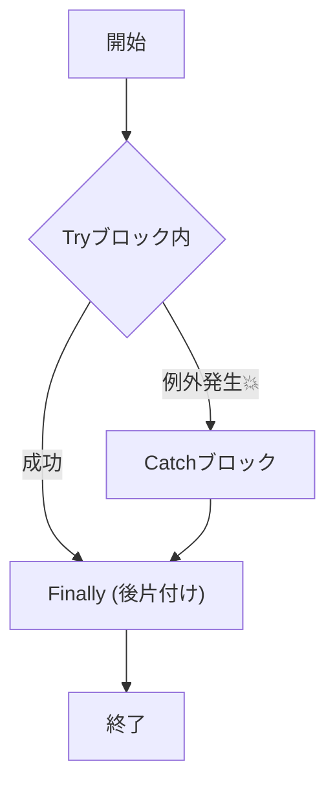
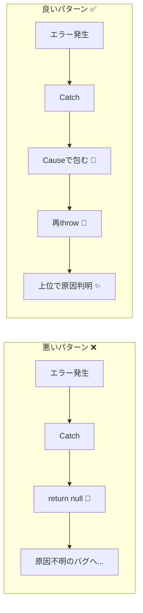

# 第04章：try/catchの基本と“やりがち事故”🙅‍♀️💥

## この章のゴール🎯

try/catch を「とりあえず付けるお守り」じゃなくて、**事故を減らすための道具**として使えるようになることだよ😊✨
特にこの3つの地雷を踏まないようにするよ👇💣

* **握りつぶし**（失敗が無かったことになる😇）
* **広すぎcatch**（どこで壊れたか分からない🌀）
* **情報欠落の再throw**（原因が消える、スタックが薄くなる🫥）

---

## 1) try/catch の超基本📘🧯


### 1-1. 何が起きたら catch に行くの？🤔

`try` の中で例外（throw）が発生したら、**その瞬間に** `catch` に移動するよ。
`finally` は **成功でも失敗でも必ず実行**されるよ。 ([MDN ウェブドキュメント][1])

```ts
try {
  // ここで例外が起きたら…
  doSomething();
} catch (e) {
  // ここに来る
  handle(e);
} finally {
  // 成功でも失敗でも必ず来る（後片付け専用）
  cleanup();
}
```




### 1-2. 例外変数、使わないなら省略できるよ🧼

例外の中身を使わないなら、`catch (e)` を書かずに `catch {}` でOK🙆‍♀️
これ、最近のJSでは普通に使える書き方だよ。 ([MDN ウェブドキュメント][1])

```ts
try {
  JSON.parse(text);
} catch {
  // e を使わないならこれでOK
}
```

### 1-3. finally の「絶対やっちゃダメ」もある😱


`finally` の中で `return` / `throw` しちゃうと、**try/catch側の結果を上書き**しちゃうの…！
（投げた例外すら“なかったこと”にできちゃう）💥 ([MDN ウェブドキュメント][1])

```ts
function doIt() {
  try {
    return 1;
  } finally {
    return 2; // 😱 tryのreturnを潰す！
  }
}

doIt(); // 2
```

✅ **finally は「後片付け専用」**（close / unlock / abort など）って覚えてね🧹✨ ([MDN ウェブドキュメント][1])

---

## 2) やりがち事故①：握りつぶし🙈💥


### ダメ例：失敗を無かったことにする😇

```ts
function loadUser(json: string) {
  try {
    return JSON.parse(json);
  } catch {
    return null; // 😇 原因が消えた！デバッグ地獄！
  }
}
```

**何が困るの？**

* どこで何が起きたかログにも出ない
* その後 `null` が広がって別の場所で爆発💣（しかも原因と遠い）

### 改善の方向性✅

この章では「まず情報を落とさない」を最優先にするよ🙂
やり方は大きく2つ👇

#### 改善A：いったんそのまま投げ直す（最小改善）🔁

```ts
try {
  return JSON.parse(json);
} catch (e) {
  throw e; // これなら原因のスタックを保ちやすい
}
```

#### 改善B：文脈を足して投げ直す（おすすめ）🎁

`Error` に **cause** を付けて「原因を保持しながら説明を足す」感じ✨
この `cause` は今どきのJSで広く使えるよ。 ([MDN ウェブドキュメント][2])

```ts
try {
  return JSON.parse(json);
} catch (e) {
  throw new Error("ユーザー情報のJSON解析に失敗したよ", { cause: e });
}
```




---

## 3) やりがち事故②：広すぎcatch🕸️🌀


### ダメ例：なんでもかんでも try に突っ込む📦

```ts
try {
  const raw = await fetch(url).then(r => r.text());
  const data = JSON.parse(raw);
  const user = convertToUser(data);
  await save(user);
  return user;
} catch (e) {
  // 😵‍💫 fetch？JSON？変換？保存？どれの失敗？
  throw new Error("ユーザー取得に失敗", { cause: e });
}
```

**何が困るの？**

* catch で **原因の種類が混ざる**（通信/パース/保存/バグ…全部同じ扱い）
* “正しい対処”ができない（リトライすべき？ユーザーに入力促す？）

### 改善：try を「壊れそうな1点」に絞る🎯

「壊れうる処理」を小分けにして、**どこで失敗したか**をくっきりさせるよ✨

```ts
const raw = await fetch(url).then(r => r.text());

let data: unknown;
try {
  data = JSON.parse(raw);
} catch (e) {
  throw new Error("サーバーからの返却がJSONじゃなかったよ", { cause: e });
}

const user = convertToUser(data); // ここが落ちるなら「バグ寄り」かも
await save(user);
return user;
```

ポイント💡

* **try は短いほど強い**💪
* “ここが壊れた”が分かれば、次の章以降で分類（ドメイン/インフラ/バグ）もしやすくなる🗺️

---

## 4) やりがち事故③：情報欠落の再throw🫥💔


### ダメ例：messageだけで作り直しちゃう

```ts
try {
  doSomething();
} catch (e) {
  // 😭 元のstackや原因情報が薄くなりやすい
  throw new Error((e as Error).message);
}
```

### 改善：そのまま投げ直す or causeで包む🎁

* **そのまま**：原因保持が簡単
* **causeで包む**：説明を足しつつ原因も保持（おすすめ） ([MDN ウェブドキュメント][2])

```ts
try {
  doSomething();
} catch (e) {
  throw new Error("doSomething が失敗したよ（ここまで来た経路も大事）", { cause: e });
}
```

---

## 5) おまけ地雷：try/catch は「非同期」に弱い⚡😱（予告編）

これ超あるある👇
`try { promise } catch {}` は **捕まらない**ことが多いよ（投げるタイミングが後だから）
ちゃんと捕まえるには `await` したり、`promise.catch()` で受ける必要があるよ⚡
（ここは第6章でガッツリやるね🙂）

---

## 6) ミニ演習📝✨（改善してみよ〜！）

### 演習1：握りつぶしをやめる🙈➡️🙅‍♀️

**お題（悪い例）**

```ts
function parseSettings(text: string) {
  try {
    return JSON.parse(text);
  } catch {
    return {}; // 👻 何も起きなかったことにしてる
  }
}
```

✅ **ゴール**：原因を残して投げ直す（cause付き）に直す🎁

---

### 演習2：広すぎtryを細くする🕸️➡️🎯

**お題（悪い例）**

```ts
async function run(url: string) {
  try {
    const raw = await fetch(url).then(r => r.text());
    const obj = JSON.parse(raw);
    return obj.items.map((x: any) => x.name);
  } catch (e) {
    throw new Error("失敗", { cause: e });
  }
}
```

✅ **ゴール**：

* JSON.parse の部分だけ try にする
* エラーメッセージを“その失敗っぽい言葉”にする💬

---

### 演習3：finallyにreturnがある地雷を見つける👀💥

**お題**：下の関数、何が危ない？どう直す？

```ts
function f() {
  try {
    throw new Error("boom");
  } finally {
    return "ok";
  }
}
```

ヒント：**例外が消える**😱 ([MDN ウェブドキュメント][1])

---

## 7) AI活用🤖✨（この章のおすすめプロンプト）

そのままコピペで使えるよ〜😊💕

* 「この try/catch の地雷を3つ指摘して。握りつぶし/広すぎcatch/情報欠落の観点で！」
* 「catchを短くするために、tryブロックを分割した改善案を2パターン出して」
* 「`Error.cause` を使って、原因を保持しながら文脈を足す書き方に直して」 ([MDN ウェブドキュメント][2])
* 「finallyに書いていい処理/ダメな処理を、このコードを例に説明して」 ([MDN ウェブドキュメント][1])

---

## まとめ🌸（ここだけ覚えればOK✨）

* **try は短く！**（壊れそうな一点に絞る🎯）
* **catch で握りつぶさない！**（原因を残す🧾）
* **投げ直すなら情報を落とさない！**（できれば `cause` で包む🎁） ([MDN ウェブドキュメント][2])
* **finally は後片付け専用！**（return/throwしない😱） ([MDN ウェブドキュメント][1])

次の第5章では、catchした値を「基本 unknown として扱う」安全なさばき方をやるよ🛡️😳（ここから一気に事故が減る✨）

[1]: https://developer.mozilla.org/en-US/docs/Web/JavaScript/Reference/Statements/try...catch "try...catch - JavaScript | MDN"
[2]: https://developer.mozilla.org/en-US/docs/Web/JavaScript/Reference/Global_Objects/Error/cause?utm_source=chatgpt.com "Error: cause - JavaScript - MDN Web Docs"
