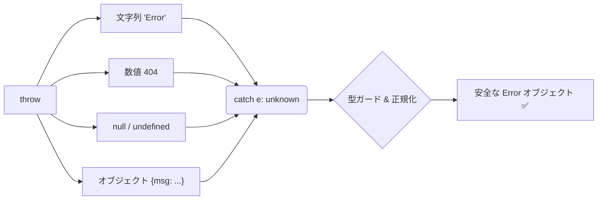
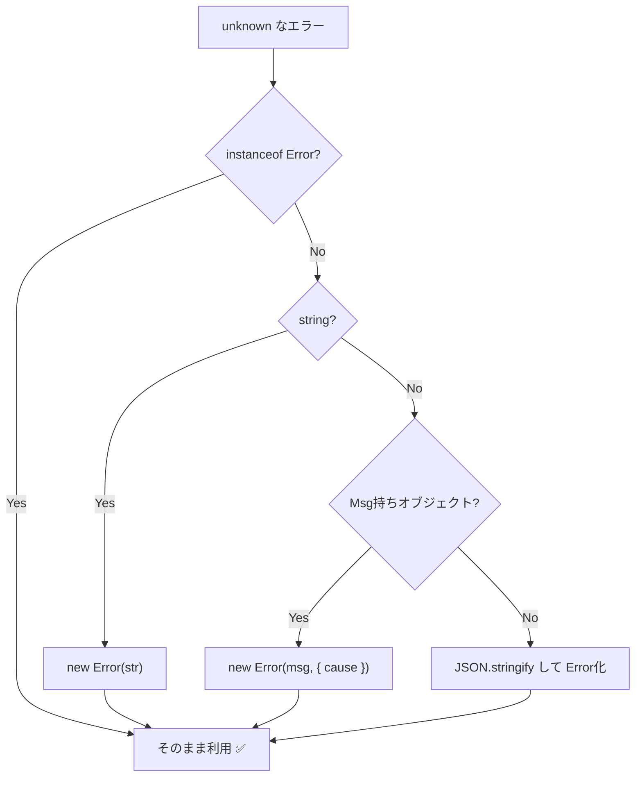

# 第05章：catchは基本「unknown」だと思おう🛡️😳

## この章のゴール🎯✨

* `catch` で受け取る値を「信用しない」クセをつける🙅‍♀️
* `unknown` を **安全に** 扱うための “型ガード” が書けるようになる🧠🔎
* どんな変な `throw` が来ても、アプリの中では **Errorに寄せて扱える**（正規化）ようになる🧼🧺

---

## 1) なんで `unknown` 前提なの？🤔💥

TypeScript/JavaScriptの世界では、`throw` で **なんでも投げられます**🎲
`Error` だけじゃなく、こういうのも普通に来ます👇

* `throw "やばい"`（文字列）🧵
* `throw 404`（数値）🔢
* `throw { message: "失敗", code: "X" }`（オブジェクト）📦
* `throw null`（えっ…）😇

だから `catch (e)` の `e` を `Error` だと思い込むと、`catch` の中でさらに落ちる事故が起きます💣
（「エラー処理がエラーを起こす」やつ…最悪〜😭）



---

## 2) `catch` を “自動で unknown” にする設定🧷✨

TypeScriptには `catch` 変数を `unknown` 扱いにするオプションがあります✅
名前は **`useUnknownInCatchVariables`** です。([typescriptlang.org][1])

しかも最近のTSでは、`strict` を有効にしていると **既定で true 扱い**（= catchがunknown）になりやすいです。([typescriptlang.org][2])

`tsconfig.json` のイメージ👇

```jsonc
{
  "compilerOptions": {
    "strict": true,
    "useUnknownInCatchVariables": true
  }
}
```

ポイント💡

* これを入れると `catch (err)` の `err` が `unknown` になるので、**触る前に型チェックが必須**になります🧯

---

## 3) unknown を安全に触る「型ガード」基本セット🧤🧠

### 3-1) まずは王道：`instanceof Error` 👑

```ts
try {
  // 何かする
} catch (err) {
  if (err instanceof Error) {
    console.log(err.name, err.message);
  } else {
    console.log("Errorじゃないものが投げられた:", err);
  }
}
```

これだけで “だいぶ安全” 😊👍

---

### 3-2) 「Errorっぽい」オブジェクトも拾いたい📦🔎

APIライブラリや自作コードが `{ message: "..." }` みたいな形で投げることもあります。
`message` を読みに行く前にチェックしよ〜🙌

```ts
export function hasStringMessage(x: unknown): x is { message: string } {
  return (
    typeof x === "object" &&
    x !== null &&
    "message" in x &&
    typeof (x as any).message === "string"
  );
}
```

---

### 3-3) 文字列/数値/その他の “投げられがち” を拾う🎣✨

```ts
export function isPrimitiveThrowable(x: unknown): x is string | number | boolean | bigint | symbol {
  const t = typeof x;
  return t === "string" || t === "number" || t === "boolean" || t === "bigint" || t === "symbol";
}
```

---

## 4) いちばん大事：unknown → Error に「正規化」しよう🧼🧺

アプリの中では、エラーをなるべく **同じ形（Error）** で扱えるとラクです😊
そのために “正規化関数” を1個用意しちゃうのが超おすすめ💖

### 4-1) `cause` で元のエラーも保持しよう🧵🎁

`new Error("...", { cause: err })` の `cause` は ES2022 の仕組みで、原因をチェーンできます。([GitHub][3])

### 4-2) 正規化関数 `toError` の例🛠️✨

```ts
export function toError(thrown: unknown, fallbackMessage = "Unknown error thrown"): Error {
  // 1) すでにErrorならそのまま
  if (thrown instanceof Error) return thrown;

  // 2) よくあるプリミティブは文字列化してErrorへ
  if (typeof thrown === "string") return new Error(thrown);
  if (typeof thrown === "number" || typeof thrown === "boolean" || typeof thrown === "bigint" || typeof thrown === "symbol") {
    return new Error(String(thrown));
  }

  // 3) null/undefined は事故りやすいので固定文言で
  if (thrown === null || thrown === undefined) {
    return new Error(fallbackMessage);
  }

  // 4) message を持つ “それっぽい物” は message を採用（原因はcauseへ）
  if (hasStringMessage(thrown)) {
    return new Error(thrown.message, { cause: thrown });
  }

  // 5) 最後の手段：読める形にしてErrorへ（causeで現物は保持）
  try {
    return new Error(JSON.stringify(thrown), { cause: thrown });
  } catch {
    return new Error(fallbackMessage, { cause: thrown });
  }
}
```

> コツ💡
>
> * **ユーザー表示**の文言と、**ログ用**の情報は分けようね🙈🔒
>   `JSON.stringify(thrown)` はログでは便利だけど、表示文言に混ぜると危険なことがあります💦



---

## 5) catchの中で「やっちゃダメ」あるある🙅‍♀️💥

### ❌ そのまま `err.message` を読む

`err` が `string` だったら即死です😇

### ❌ 何もせず握りつぶす

「なかったこと」にすると、後で調査できません😭
最低でも「正規化→ログ」まではやる癖を💪✨

---

## 6) おまけ：Promise の `.catch(e => ...)` も油断しない⚡😱

`try/catch` とは別に、Promiseの `.catch` の引数も “何でも来る” ので同じ発想が必要です🧠
これを助けるルールとして、`typescript-eslint` の **`use-unknown-in-catch-callback-variable`** があります。([TypeScript ESLint][4])

---

## 7) ミニ演習📝💖（手を動かすよ〜！）

### 演習A：わざと “変なthrow” を投げてみる🎲

1. `throw "oops"`
2. `throw { message: "だめでした", code: "X01" }`
3. `throw null`

→ それを `catch` で受けて、**必ず `toError` に通してから** `message` を表示してみてね😊🧼

イメージ👇

```ts
try {
  throw { message: "だめでした", code: "X01" };
} catch (e) {
  const err = toError(e);
  console.log("OK: message取れた👉", err.message);
  console.log("causeある？👉", "cause" in err ? (err as any).cause : undefined);
}
```

### 演習B：自分の “正規化ルール” を文章化📝✨

* 「ユーザーに見せる文言は短く、原因はログに」
* 「Errorじゃない throw は Error に寄せる」
* 「cause で現物を保持する」
  …みたいに、3〜5行でOKだよ〜☺️🌷

---

## 8) AI活用コーナー🤖💬（めっちゃ相性いい！）

コピペで使えるプロンプト例👇✨

* 「`unknown` を `Error` に正規化する関数を、`cause` も使って提案して。想定ケースを10個出してテスト観点も添えて」🤖🧪
* 「この `hasStringMessage` 型ガード、抜けがないか反例を出して改善案を3つ」🔎✨
* 「Promiseの `.catch(e => ...)` でも同じ安全性を保つ書き方を、lintルール込みで教えて」⚡🧷

---

## まとめ🎀✨

* `catch` は **unknown前提**が安全🛡️😳
* 触る前に **型ガード**！`instanceof Error` から始めよう👑
* アプリ内では **unknown→Errorに正規化**すると、設計が一気にラクになる🧼🧺
* `cause` で原因を保持して、調査しやすくしよう🧵🔎([GitHub][3])

次の章（第6章）で、`async/await` の「try/catch効かない!?」系の事故に突っ込んでいくと、さらに強くなれるよ〜⚡😱💪

[1]: https://www.typescriptlang.org/tsconfig/useUnknownInCatchVariables.html "TypeScript: TSConfig Option: useUnknownInCatchVariables"
[2]: https://www.typescriptlang.org/docs/handbook/compiler-options.html "TypeScript: Documentation - tsc CLI Options"
[3]: https://github.com/tc39/proposal-error-cause?utm_source=chatgpt.com "tc39/proposal-error-cause"
[4]: https://typescript-eslint.io/rules/use-unknown-in-catch-callback-variable/?utm_source=chatgpt.com "use-unknown-in-catch-callback-variable"
