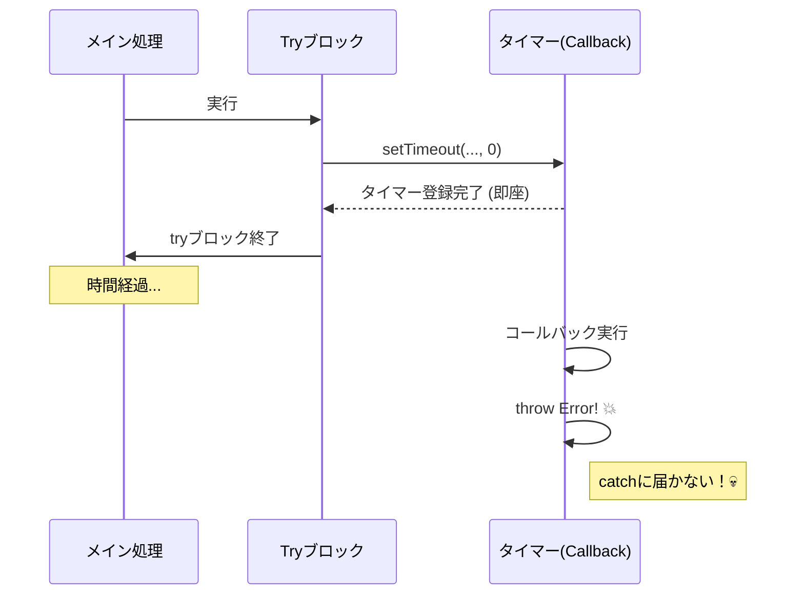
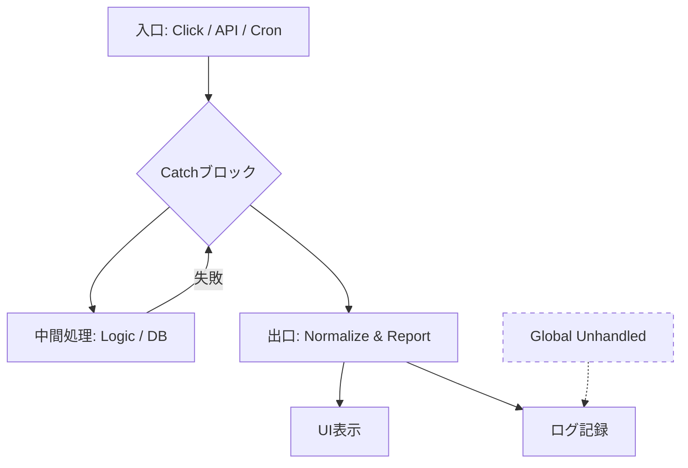

# 第06章：async/awaitの失敗（try/catchが効かない!?）⚡😱

この章は、「非同期の失敗がどこで捕まる／捕まらない」を**体で覚える章**だよ〜！🧠✨
結論から言うと、**try/catchが効かないんじゃなくて、効く範囲がズレてる**ことが多いの😵‍💫💥

---

## 0. 今日のゴール🎯✨

* ✅ 「try/catchで捕まる失敗」と「すり抜ける失敗」を見分けられる
* ✅ “Unhandled Rejection” をわざと起こして、**どこで拾うべきか**決められる🚪
* ✅ 「awaitし忘れ事故」「forEach(async)事故」「火付け役（fire-and-forget）事故」を回避できる🔥🧯
* ✅ AIに「再現条件」「原因」「修正案」をまとめさせる🧾🤖

---

## 1. まず超大事：async/awaitの“捕まえ方ルール”🧷


### ルール①：`async function` は **必ず Promise を返す**🎁

つまり、`throw` は「例外を投げる」じゃなくて、**Promiseをrejectする**に変換される感じ💡

### ルール②：try/catchで捕まるのはこの2つだけ🛡️

* ✅ tryブロック内の「同期throw」
* ✅ tryブロック内で `await` した Promise の「reject」

逆に言うと…

> ❌ **awaitしてない Promise の reject は try/catch では捕まらない**
> これが本章の主役だよ〜😱⚡

---

## 2. try/catchが“効かない”あるある4連発😵‍💫💥

### あるある①：awaitし忘れ（いちばん多い）🥇😇


**ダメ例（try/catchが素通り）**👇

```ts
async function boom(): Promise<void> {
  throw new Error("どかーん💥");
}

async function main(): Promise<void> {
  try {
    boom(); // 👈 await してない！
    console.log("ここは普通に通るよ😇");
  } catch (e) {
    console.log("ここ来ない😭", e);
  }
}

void main();
```

✅ **直し方（awaitする）**👇

```ts
async function main(): Promise<void> {
  try {
    await boom(); // 👈 ここ！
  } catch (e) {
    console.log("捕まえた🫴✨", e);
  }
}
```

🧠メモ：**“Promiseを置き去り”にした瞬間に、try/catchの守備範囲から外れる**よ⚾💨

---

### あるある②：火付け役（fire-and-forget）で燃える🔥😱


「待たなくていいから投げっぱなしで！」ってやるやつ。
実はこれ、設計としてアリなんだけど…**必ず後始末が必要**🧹✨

**ダメ例（Unhandled Rejectionの温床）**👇

```ts
async function sendAnalytics(): Promise<void> {
  throw new Error("通信失敗🌩️");
}

function onClick(): void {
  sendAnalytics(); // 👈 放置！
}
```

✅ **直し方（放置するなら catch を付ける）**👇

```ts
function onClick(): void {
  void sendAnalytics().catch((err) => {
    console.error("分析送信失敗を回収🧯", err);
  });
}
```

> ✅ 「待たない」はOK
> ✅ 「放置」はNG
> って覚えると超ラクだよ🙂🎀

---

### あるある③：タイマー／イベントの中で落ちる⏰🎮


try/catchの外側では、**未来の処理**は捕まえられないよ〜😵‍💫

**ダメ例（try/catchは届かない）**👇

```ts
try {
  setTimeout(() => {
    throw new Error("あとから落ちた💥");
  }, 0);
} catch (e) {
  console.log("ここ来ない😭");
}
```




✅ **直し方（中でcatchする or Promise化してawaitする）**👇

```ts
function wait(ms: number): Promise<void> {
  return new Promise((resolve) => setTimeout(resolve, ms));
}

async function main(): Promise<void> {
  try {
    await wait(0);
    throw new Error("try/catchの中で落ちた💥");
  } catch (e) {
    console.log("捕まえた✨", e);
  }
}
```

---

### あるある④：`forEach(async () => ...)` 事故🌀😇


これ、**罠として有名**！
`forEach` は Promise を待ってくれないの🥲

**ダメ例（forEachは待たない）**👇

```ts
const ids = [1, 2, 3];

ids.forEach(async (id) => {
  if (id === 2) throw new Error("2で落ちた💥");
  console.log("id:", id);
});
```

✅ **直し方A：`for...of` を使う（読みやすい👑）**👇

```ts
for (const id of ids) {
  await doWork(id);
}
```

✅ **直し方B：まとめて待つ（次章の入口でもあるよ🧵）**👇

```ts
await Promise.all(ids.map((id) => doWork(id)));
```

---

## 3. “Unhandled Rejection”って何？どれくらいヤバい？😱⚡

### Node.jsだと：未処理のrejectが“例外扱い”になり得る💥

Nodeは `--unhandled-rejections` の挙動を持ってて、モードがいくつかあるよ（`throw` / `strict` / `warn` / `none` / `warn-with-error-code`）。([nodejs.org][1])
しかも、**デフォルトが `throw`**（＝未処理なら最終的に例外として扱われやすい）という説明があるよ。([nodejs.org][1])

さらに、Nodeには `unhandledRejection` / `rejectionHandled` のイベントがあって、
「未処理が増えた」「後から処理された」を追えるようになってるよ🧵👀([nodejs.org][2])

---

### ブラウザだと：`unhandledrejection` イベントで拾える🌐🧯

ブラウザには `unhandledrejection` と `rejectionhandled` があって、未処理rejectを監視できるよ👀✨([MDNウェブドキュメント][3])
（コンソールの赤いエラーが出て「え、どこ…？」ってなるやつの正体😇）

---

## 4. “どこで拾うか”を先に決めるのが設計💡🚪

非同期は「落ちた瞬間」より、**後から落ちる**が普通。だから…

### おすすめの考え方🧭✨

* ✅ **入口で拾う**（アプリの開始点、APIハンドラ、UIイベントの最上流）
* ✅ **出口で揃える**（ログ、画面表示、HTTPレスポンス）
* ✅ **途中では“握りつぶさない”**（後で困る😭）




---

## 5. ミニ実験🧪：Unhandledをわざと起こして“拾う場所”を決めよう🚪✨

### 実験コード（まずは事故らせる😇）

```ts
async function boom(label: string): Promise<void> {
  await Promise.resolve();
  throw new Error(`失敗したよ💥 label=${label}`);
}

async function main(): Promise<void> {
  try {
    boom("A"); // 👈 awaitなし（事故）
    console.log("Aのあとも動く😇");
    await boom("B"); // 👈 これは捕まる
  } catch (e) {
    console.log("try/catchで捕まえた✨", e);
  }
}

void main();
```

### やること📝

1. どんな表示になる？（コンソールの出方を観察👀）
2. `A` をどう直す？（awaitする？放置する？放置ならcatch？）
3. 「放置する」設計にするなら、**回収係🧯**を作ってみよ！

---

## 6. “放置するなら回収係”テンプレ🧯✨（超よく使う）

```ts
export function fireAndForget(p: Promise<unknown>, label: string): void {
  void p.catch((err) => {
    console.error(`[bg:${label}] 回収した🧯`, err);
  });
}
```

使う側👇

```ts
function onClick(): void {
  fireAndForget(sendAnalytics(), "analytics");
}
```

これで「待たないけど、落ちたら回収する」になって安全度UP🆙🫶

---

## 7. “awaitし忘れ”を仕組みで潰す🧠🧰（めちゃ効く！）


### ESLintで「Promise置き去り」を検出✅

* `@typescript-eslint/no-floating-promises`（Promiseを放置してない？を見つける）([typescript-eslint.io][4])
* `@typescript-eslint/no-misused-promises`（Promiseを渡しちゃダメな場所に渡してない？）([typescript-eslint.io][5])

これ、**事故率が目に見えて下がる**よ📉✨（女子大生チームでも即戦力になるやつ🥰）

---

## 8. すぐ動かす用メモ（NodeでTSをサクッと実行）💻✨

最近のNodeは、条件が合えば **TSをそのまま実行**できるよ（型注釈みたいな“消せるTS構文”だけのとき）。([nodejs.org][6])

* 例：`node example.ts`（一定のバージョン以降＆erasable構文のみ）([nodejs.org][6])
* さらに `enum` みたいに変換が必要な構文は `--experimental-transform-types` が必要、みたいな説明もあるよ🧩([nodejs.org][6])

※ここは「型チェックはしない（実行時は型を消すだけ）」って点も大事！([nodejs.org][7])

---

## 9. AI活用🤖：事故報告テンプレを作らせよう🧾✨

Unhandled系は、**再現条件の言語化**が勝ちゲー🏆

### 事故報告テンプレ（AIに埋めさせる）🧾

* いつ／どこで起きた？🕒📍
* 期待した挙動は？✨
* 実際に起きた挙動は？💥
* 再現手順（最小コード）🧪
* エラーログ／stack🔎
* 「awaitし忘れ」っぽい箇所ある？👀

### AIプロンプト例🤖

* 「このコードでtry/catchが効かない理由を、1行→3行→詳しく の順で説明して」
* 「Unhandled Rejectionになり得る箇所を列挙して、直し方を3案出して」
* 「“待たない設計”にするなら、落ちたときの回収戦略（ログ/通知/黙殺）を提案して」

---

## 10. まとめ🎀✨（ここだけ覚えてOK）

* ✅ try/catchが捕まえるのは **awaitした失敗**だけ
* ✅ **Promise放置＝事故**（awaitするか、catchで回収）
* ✅ `forEach(async)` は罠🌀 → `for...of` or `Promise.all`
* ✅ Unhandledは入口で拾う（最上流に“最後の網”を張る🧯）
* ✅ 仕組み（ESLint）で“awaitし忘れ”を潰すのが最強✅✨

---

次の第7章（Promise合成の罠）に行くと、`Promise.all` で「誰が落ちたの？」問題🧨が出てくるよ〜！
この第6章の感覚ができてると、そこでめっちゃ強い🫶🔥

[1]: https://nodejs.org/api/cli.html "Command-line API | Node.js v25.3.0 Documentation"
[2]: https://nodejs.org/api/process.html "Process | Node.js v25.3.0 Documentation"
[3]: https://developer.mozilla.org/en-US/docs/Web/API/Window/unhandledrejection_event "Window: unhandledrejection event - Web APIs | MDN"
[4]: https://typescript-eslint.io/rules/no-floating-promises/ "no-floating-promises | typescript-eslint"
[5]: https://typescript-eslint.io/rules/no-misused-promises/ "no-misused-promises | typescript-eslint"
[6]: https://nodejs.org/en/learn/typescript/run-natively "Node.js — Running TypeScript Natively"
[7]: https://nodejs.org/api/typescript.html "Modules: TypeScript | Node.js v25.3.0 Documentation"
