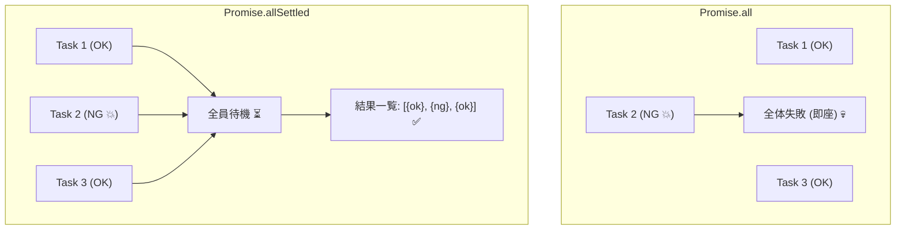
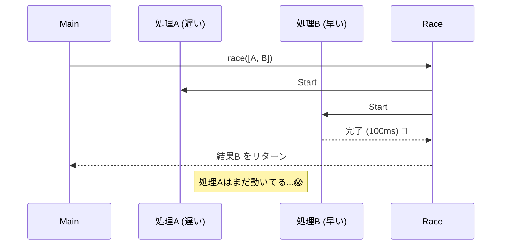

# 第07章：Promise合成の罠（Promise.all など）🧨🧵

この章は「**複数の非同期処理をまとめる**」ときに起きがちな事故を、ぜんぶ先回りして潰す回だよ〜！😆✨
`Promise.all` は便利だけど、**便利すぎて地雷も多い**んだよね…💣💥

---

## この章のゴール 🎯✨

読み終わったら、こんな状態になってるのが目標だよ🫶

* `Promise.all / allSettled / any / race` の「何が起きるか」を説明できる🙂
* `Promise.all` で **「どれが失敗したのか分からない」問題**を解決できる🔎
* 「失敗しても全結果が欲しい」「1個成功でOK」など、目的で使い分けできる🧠✨
* **原因を失わない**合成パターンを、手癖として持てる🧵🎁

---

## 7-1 合成ってなに？　並列のまとめ方 🌈⚡


非同期をまとめたい場面って、だいたいこのどれか👇

* ✅ **全部成功したらOK**：例）ユーザー情報・注文履歴・おすすめを同時に取る
* ✅ **全部の結果が欲しい**：例）10個の画像URLのうち、失敗も含めて結果一覧が欲しい
* ✅ **どれか1個成功でOK**：例）複数ミラーサーバーから「最初に成功したやつ」を採用
* ✅ **一番早いものを採用**：例）タイムアウトと本処理を競争させる

ここで使うのが Promise の合成メソッドたちだよ🧵✨
特に `Promise.all` はよく使われるけど、罠も多い…！😱

---

## 7-2 Promise.all の基本　便利だけど性格が強い😎⚡

`Promise.all` はこういう性格だよ👇

* **全部成功したら成功**（配列で値が返る）
* **1つでも失敗したら即失敗**（最初の失敗理由で reject） ([MDNウェブドキュメント][1])
* ただし！**他の処理は止まらずに走り続ける**（結果は `all` の戻り値からは拾えない） ([MDNウェブドキュメント][2])

この「止まらず走り続ける」が、合成事故の温床〜〜〜！🧨🧨🧨

---

## 7-3 罠その1　1つ落ちた瞬間に全体が落ちる　でも裏で他は動く😱⚡


たとえばこんな感じ👇

```ts
const sleep = (ms: number) => new Promise<void>((r) => setTimeout(r, ms));

async function okFast() {
  await sleep(50);
  return "OK_FAST";
}

async function failMid() {
  await sleep(100);
  throw new Error("FAIL_MID");
}

async function okSlow() {
  await sleep(200);
  return "OK_SLOW";
}

async function main() {
  try {
    const results = await Promise.all([okFast(), failMid(), okSlow()]);
    console.log("ALL OK:", results);
  } catch (e) {
    console.log("ALL FAILED:", e);
  }
}

main();
```

これ、`failMid()` が落ちた瞬間に `Promise.all` は失敗するよね💥
でも `okSlow()` は裏で走り続けるよ！ ([MDNウェブドキュメント][2])

### 何が困るの？😵‍💫

* 「全体失敗」として画面を出したのに、裏で成功して状態が進む😱
* DB更新や課金処理みたいな **副作用**が混ざると、最悪「半分だけ反映」になる💀

### ここでの合言葉🪄

**`Promise.all` は “キャンセル機構” じゃない**
「全体失敗にしたい」なら、**失敗時に他を止める設計**も必要になるよ（後で `race + AbortController` も出すね）🧯

---

## 7-4 罠その2　どれが失敗したのか分からない🙈💥


`Promise.all` が返してくれるのは、基本「最初の失敗理由」だけ！ ([MDNウェブドキュメント][1])
だからこうなる👇

* A も B も C もやってて
* B が失敗した
* でも catch で見えるのは「Error: なんか失敗」だけ
* **どの処理が失敗したの？🤯** ってなる

### 解決策　失敗にラベルを貼る🏷️✨

「どの処理の失敗か」を分かるように、失敗時に情報を足すよ🎁

```ts
type TaggedError = {
  tag: string;
  cause: unknown;
};

function tag<T>(tag: string, p: Promise<T>): Promise<T> {
  return p.catch((cause) => {
    const err: TaggedError = { tag, cause };
    throw err;
  });
}

async function main() {
  try {
    const [user, orders, recs] = await Promise.all([
      tag("fetchUser", fetchUser()),
      tag("fetchOrders", fetchOrders()),
      tag("fetchRecs", fetchRecs()),
    ]);
    console.log({ user, orders, recs });
  } catch (e) {
    // ここで「どれが失敗したか」が分かる✨
    if (typeof e === "object" && e !== null && "tag" in e) {
      const te = e as TaggedError;
      console.log("FAILED TAG:", te.tag);
      console.log("CAUSE:", te.cause);
    } else {
      console.log("FAILED UNKNOWN:", e);
    }
  }
}
```

これだけで **デバッグ難易度が激下がり**するよ〜〜！😆✨

---

## 7-5 罠その3　失敗が1個しか見えない　残りの失敗が消える😶‍🌫️💥

`Promise.all` は「最初の失敗理由」だけで reject するよね。 ([MDNウェブドキュメント][1])
だから、もし他にも失敗があったとしても、

* **all の catch からは見えない**
* 場合によっては「ログに残らない」「監視に引っかからない」みたいな事故が起きる😱

こういうときに使うのが次👇

---

## 7-6 Promise.allSettled　成功も失敗も全部ちょうだい📦✨


`Promise.allSettled` は性格が真逆で、**全員が終わるまで待ってから**結果をくれる！
「成功・失敗を含む一覧」が欲しいときに超強い💪 ([MDNウェブドキュメント][3])

```ts
const results = await Promise.allSettled([fetchUser(), fetchOrders(), fetchRecs()]);

for (const r of results) {
  if (r.status === "fulfilled") {
    console.log("OK:", r.value);
  } else {
    console.log("NG:", r.reason);
  }
}
```




### これが刺さる場面🎯


* 10件中 2件失敗しても「残り8件は表示したい」📺✨
* バッチ処理で「成功と失敗の一覧レポート」が欲しい🧾✅
* エラーの棚卸しをしたい（まさにエラーモデリング向き！）📚🧠

---

## 7-7 Promise.any　どれか1個成功でOK　救世主スタイル🦸‍♀️✨


`Promise.any` はこういう性格👇

* **最初に成功したやつ**で fulfill する
* 全部失敗したら `AggregateError` で reject（`errors` に理由配列） ([MDNウェブドキュメント][4])
* `Promise.race` と違って「最初の成功」を狙う（失敗は無視して進む） ([MDNウェブドキュメント][5])

例：ミラーAPIを3つ叩いて、**一番最初に成功したレスポンスを採用**🌐✨

```ts
async function fetchFromMirror(urls: string[]) {
  try {
    return await Promise.any(urls.map((u) => fetch(u).then((r) => r.json())));
  } catch (e) {
    // 全部失敗したら AggregateError
    if (e instanceof AggregateError) {
      console.log("ALL FAILED 😭");
      console.log("reasons:", e.errors); // 失敗理由の配列
    }
    throw e;
  }
}
```

> `AggregateError` は複数エラーをまとめるための標準エラーだよ 🧺✨ ([MDNウェブドキュメント][6])

---

## 7-8 Promise.race　一番早く決着したものを採用🏁⚡


`Promise.race` は「最初に settle したもの」で決着するよ。
成功でも失敗でも、**先に決まった方**が勝ち🏁 ([MDNウェブドキュメント][7])

### よくある使い方　タイムアウト⏳💥

```ts
function timeout(ms: number): Promise<never> {
  return new Promise((_, reject) =>
    setTimeout(() => reject(new Error(`Timeout ${ms}ms`)), ms)
  );
}

async function withTimeout<T>(p: Promise<T>, ms: number): Promise<T> {
  return Promise.race([p, timeout(ms)]);
}
```




### でも！ここも罠😱

`race` でタイムアウトになっても、**本体の処理は裏で走り続ける**ことがあるよ…（`all` と同じ系統の罠）🧨

#### 対策　AbortController で止める🛑🧯

`fetch` なら中止できる！✨

```ts
async function fetchJsonWithTimeout(url: string, ms: number) {
  const controller = new AbortController();
  const id = setTimeout(() => controller.abort(), ms);

  try {
    const res = await fetch(url, { signal: controller.signal });
    return await res.json();
  } finally {
    clearTimeout(id);
  }
}
```

「合成」って、**止められるかどうか**もセットで考えると事故りにくいよ🧠✨

---

## 7-9 目的別　使い分け早見表🗺️✨

* ✅ **全部成功したらOK・失敗なら全体失敗** → `Promise.all` ([MDNウェブドキュメント][1])

  * ただし「他が走り続ける」前提で副作用に注意⚠️ ([MDNウェブドキュメント][2])
* ✅ **成功も失敗も一覧が欲しい** → `Promise.allSettled` ([MDNウェブドキュメント][3])
* ✅ **どれか1個成功でOK** → `Promise.any`（全部失敗は `AggregateError`） ([MDNウェブドキュメント][4])
* ✅ **成功でも失敗でも最初に決着したもの** → `Promise.race` ([MDNウェブドキュメント][7])

---

## 7-10 ミニ演習📝✨　どれが失敗したか追える Promise.all を作ろう🔎🏷️

### お題🎀

3つの非同期関数があるとして👇

* `loadProfile()`
* `loadOrders()`
* `loadRecs()`

これを同時実行しつつ、失敗したら「どれが失敗したか」が分かるようにしてね🙂✨

### ヒント🧠

* 失敗にラベルを付けて throw し直す🏷️🎁

### 解答例✅

```ts
type TaggedError = { tag: string; cause: unknown };

function tag<T>(tag: string, p: Promise<T>): Promise<T> {
  return p.catch((cause) => {
    throw { tag, cause } satisfies TaggedError;
  });
}

async function loadAll() {
  return await Promise.all([
    tag("profile", loadProfile()),
    tag("orders", loadOrders()),
    tag("recs", loadRecs()),
  ]);
}

async function main() {
  try {
    const [profile, orders, recs] = await loadAll();
    console.log({ profile, orders, recs });
  } catch (e) {
    if (typeof e === "object" && e !== null && "tag" in e) {
      const te = e as TaggedError;
      console.log("FAILED:", te.tag, te.cause);
    } else {
      console.log("FAILED:", e);
    }
  }
}
```

---

## 7-11 AI活用🤖✨　この章で使うと強いプロンプト例

コピペで使ってOKだよ〜！💌😆

* 「TypeScriptで Promise.all の失敗にタグを付けたい。tag関数の実装案を3つ。メリデメも。」🤖
* 「Promise.allSettled の結果を Result っぽい union に変換する関数を書いて。型も丁寧に。」🧠
* 「Promise.race + timeout を作ったけど、裏で処理が残る問題を避ける設計を提案して。fetch前提。」🧯
* 「この並列処理の失敗ケースを洗い出して、UI表示方針もセットで提案して。」🎀

AIに出させた案は、そのまま採用じゃなくて
**“なんでそうなる？”を自分の言葉で説明できるか**をゴールにすると、めちゃ伸びるよ📈✨

---

## 7-12 まとめ　この章の超大事ポイント3つ💎✨

* `Promise.all` は **1個落ちたら即失敗**、でも **他は走り続ける** ([MDNウェブドキュメント][1])
* 「どれが失敗？」問題は **タグ付け**で解決🏷️✨
* 「結果全部ほしい」「1個成功でOK」「タイムアウトしたい」は `allSettled / any / race` を目的で使い分け🗺️ ([MDNウェブドキュメント][3])

---

次の章では、この「複数非同期をどこで受け止める？」みたいな話につながっていくよ🚪🧭✨

[1]: https://developer.mozilla.org/en-US/docs/Web/JavaScript/Reference/Global_Objects/Promise/all?utm_source=chatgpt.com "Promise.all() - JavaScript - MDN Web Docs"
[2]: https://developer.mozilla.org/en-US/docs/Web/JavaScript/Guide/Using_promises?utm_source=chatgpt.com "Using promises - JavaScript - MDN Web Docs"
[3]: https://developer.mozilla.org/en-US/docs/Web/JavaScript/Reference/Global_Objects/Promise/allSettled?utm_source=chatgpt.com "Promise.allSettled() - JavaScript - MDN Web Docs"
[4]: https://developer.mozilla.org/ja/docs/Web/JavaScript/Reference/Global_Objects/Promise/any?utm_source=chatgpt.com "Promise.any() - JavaScript - MDN Web Docs"
[5]: https://developer.mozilla.org/en-US/docs/Web/JavaScript/Reference/Global_Objects/Promise/any?utm_source=chatgpt.com "Promise.any() - JavaScript - MDN Web Docs"
[6]: https://developer.mozilla.org/en-US/docs/Web/JavaScript/Reference/Global_Objects/AggregateError?utm_source=chatgpt.com "AggregateError - JavaScript - MDN Web Docs"
[7]: https://developer.mozilla.org/en-US/docs/Web/JavaScript/Reference/Global_Objects/Promise/race?utm_source=chatgpt.com "Promise.race() - JavaScript - MDN Web Docs"
