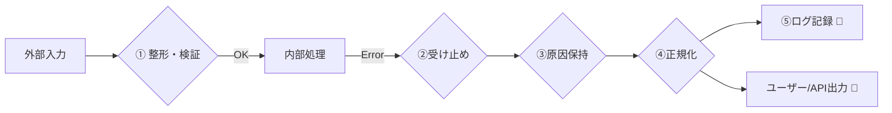

# 第08章：例外境界は“層”より“入口と出口”で考える🚪🧭

この章のゴールはシンプルだよ〜！😊
**「どこで例外を受け止めるか？」を、“層（レイヤ）”じゃなくて“入口と出口”でスパッと決められる**ようになること💪✨

---

## 1) まず結論！境界は「入口」と「出口」だけ見ればOK🧠🚪➡️🚪

レイヤ構造（UI→Service→Repository…）って便利なんだけど、TS/JSのエラーは **非同期** と **throw何でもOK問題** で、レイヤだけで考えると迷子になりがち😵‍💫

だからこう考えるのが最強👇✨

* **入口（Entry）**：外の世界が入ってくる場所
  例）クリック、HTTPリクエスト、キュー受信、バッチ開始…🧾🖱️📦
* **出口（Exit）**：外の世界へ返す場所
  例）画面表示、HTTPレスポンス、ログ、通知、DLQへ…🪞🌐🧵🔔

そして大事な合言葉はこれ👇
**「外から来るものは信用しない、外へ返す形は揃える」**🛡️🎀

---

## 2) “入口”の具体例（ここが例外境界の候補！）🚪📌

あなたのアプリの入口って、だいたいこのへん👇

* **UIのイベント**：ボタン押下、フォーム送信、画面遷移🖱️📝
* **HTTP API**：GET/POST、Webhook受信🌐📩
* **バッチ/CLI**：手動実行、cron実行🕒🖥️
* **キュー/ストリーム**：メッセージ受信、ジョブ実行📦⚙️
* **外部SDKコールバック**：決済SDK、認証SDK、通知SDK📲🔑

入口は「外界との接点」だから、失敗が混ざりやすいの！🌀
（入力が変、相手が落ちる、ネットワーク不安定、などなど🌩️）

---

## 3) “出口”の具体例（ここで失敗を“外向けの形”にする！）🚪🎁

出口は「最終的にユーザーや外部に返す形」が必要な場所✨

* **画面表示**：トースト、ダイアログ、項目別エラー🪞🎀
* **HTTPレスポンス**：ステータス、統一フォーマット🧾🌐
* **ログ/監視**：スタック、原因、文脈、ID🧵🔎
* **リトライ/再実行**：再試行キュー、バックオフ🔁⏳
* **隔離**：DLQ、失敗レコード保管📦🧊

---

## 4) 例外境界で“やること”はだいたい5つだけ✅🧤✨

境界は「なんでも屋」じゃなくて、**外界⇄アプリ内部の変換所**だよ🚉✨
ここでやるのはこの5つだけに絞ると強い💪

### ① 入口で「入力」を整える🧼📝

* パース（JSONなど）📦
* 形式チェック（空文字、数値、範囲）🔎
* 型っぽい形に整える（文字列→数値など）🧩

### ② 失敗を受け止める（最後のcatch地点を決める）🧲🧯

* **境界以外では、むやみにcatchしない**（握りつぶし防止🙅‍♀️）
* **境界では必ず受け止める**（漏れ防止🕳️）

TS/JSは「何でもthrowできる」ので、catchした値は基本信用しない方が安全だよ🛡️
そのための方針として `useUnknownInCatchVariables` が用意されてるよ（catch変数を `unknown` 扱いにして安全にする）([typescriptlang.org][1])

### ③ “原因”を失わない（wrap / cause）🧵🎁

あとで調査できるように、**原因（元のエラー）を持ち回る**のが超大事！
JSには `Error.cause` があるよ〜✨（再throw時に原因を保持できる）([MDNウェブドキュメント][2])

### ④ 外向けの形に変換する（出口の整形）🎀📦

* UI向け：やさしいメッセージにする💗
* API向け：ステータス・形式を揃える🧾
* ジョブ向け：再試行OK/NGや失敗理由を揃える🔁

### ⑤ ログに「調査できる情報」を残す🧵🔎

* 何をしようとしてた？（操作、API名、ジョブ名）🗂️
* どこで？（画面、ルート、ステップ）🧭
* 何が原因？（cause、stack）🧯



---

## 5) 例外境界で“やらないこと”🙅‍♀️🧱

境界でこれをやると、設計がぐちゃる率が爆上がり😱

* ❌ 業務ルール判断（ドメイン判定）を境界でやる
* ❌ その場しのぎの `catch { return undefined }`
* ❌ UI文言を深い層にベタ書き
* ❌ どこでもcatchして「何も起きてない顔」する😇

境界は **「変換」と「封じ込め」**だけ！それ以外は中へ渡す🎁✨

---

## 6) TS/Reactだと“入口と出口”が特に効く理由⚡🧠

### Reactのエラーバウンダリは万能じゃない😳

Reactの Error Boundary は便利だけど、**イベントハンドラ内のエラー**や **非同期のエラー** は捕まえないよ〜！って公式にも書いてあるよ📌
（render/lifecycleのエラーを主に拾う感じ）([legacy.reactjs.org][3])

だからUI側はこう分けるのが気持ちいい👇✨

* **renderの事故** → Error Boundary（出口：画面フォールバック）🪞
* **クリック/送信** → その場で try/catch（入口：イベント）🖱️
* **async処理** → awaitする場所で拾う（入口：asyncの境界）⚡

### Node側も「未処理Promise拒否」は放置すると痛い😱

Promiseの拒否は「いつハンドルされるか」が非同期でズレるから、`unhandledRejection` みたいな話が出てくるよ〜ってNodeのドキュメントでも説明されてるよ📚([nodejs.org][4])
だからこそ **“入口と出口で受け止める場所を決める”** が効く！🧲✨

---

## 7) ミニ例：UI（React想定）での境界の置き方🎀🖱️🧯

### ✅ 7-1) render事故は Error Boundary（出口：フォールバックUI）🪞

![render事故は Error Boundary[(./picture/err_model_ts_study_008_boundary_vs_trycatch.png)

```ts
import React from "react";

type Props = { children: React.ReactNode };

export class AppErrorBoundary extends React.Component<Props, { hasError: boolean }> {
  state = { hasError: false };

  static getDerivedStateFromError() {
    return { hasError: true };
  }

  componentDidCatch(error: unknown) {
    // ここでログ送信とか（詳細は後章で✨）
    console.error("UI render error:", error);
  }

  render() {
    if (this.state.hasError) {
      return (
        <div>
          <h2>ごめんね…画面の表示で失敗しちゃった🥲</h2>
          <p>再読み込みしてもダメなら、少し時間をおいてね⏳</p>
        </div>
      );
    }
    return this.props.children;
  }
}
```

### ✅ 7-2) クリック/送信は try/catch（入口：イベント）🖱️🧯

![クリック/送信は try/catch[(./picture/err_model_ts_study_008_event_firefighter.png)

Error Boundaryはイベント内を拾わないので、ここは自力で守るよ💪([legacy.reactjs.org][3])

```ts
function normalizeUnknown(e: unknown): Error {
  if (e instanceof Error) return e;
  return new Error("Unknown thrown value", { cause: e });
}

async function onSubmit() {
  try {
    // await を忘れると捕まらない事故が起きがち⚡
    await doSomethingAsync();
  } catch (e) {
    const err = normalizeUnknown(e);
    console.error("submit failed:", err, err.cause);
    // ここでトースト表示など（出口：UI）🎀
  }
}
```

ポイント✨

* `unknown` 前提で正規化する（`useUnknownInCatchVariables` と相性◎）([typescriptlang.org][1])
* `Error.cause` で原因を落とさない([MDNウェブドキュメント][2])

---

## 8) ミニ例：API側の境界（入口：ルート、出口：レスポンス）🌐🚪🎁

まだ“分類”は次章だけど、ここでは「境界の形」だけ作っちゃう😊✨
**やること：catch → 正規化 → レスポンスへ変換**！

```ts
type HttpResult =
  | { ok: true; status: number; body: unknown }
  | { ok: false; status: number; body: unknown };

function normalizeUnknown(e: unknown): Error {
  if (e instanceof Error) return e;
  return new Error("Unknown thrown value", { cause: e });
}

export function withHttpBoundary(
  handler: () => Promise<HttpResult>
): () => Promise<HttpResult> {
  return async () => {
    try {
      return await handler();
    } catch (e) {
      const err = normalizeUnknown(e);
      console.error("API crashed:", err, err.cause);

      // いったん「500の統一レスポンス」に寄せる（詳細は後章で育てる🌱）
      return {
        ok: false,
        status: 500,
        body: { message: "サーバで問題が起きたよ…🥲", code: "UNEXPECTED" },
      };
    }
  };
}
```

これだけでも「最後に受け止める場所」ができて、事故が激減するよ〜！🛡️✨

---

## 9) ミニ演習：自分のアプリの“入口と出口”を列挙して境界を引こう🖊️🗺️✨

### ステップ1：入口を全部書く🚪

例）

* 画面：ログインボタン、検索フォーム送信🖱️
* API：`POST /login`、`GET /items`🌐
* バッチ：在庫同期ジョブ🕒
* キュー：決済完了イベント📦

### ステップ2：出口を全部書く🚪

例）

* UI：トースト、項目別エラー、リトライボタン🎀
* API：JSONレスポンス、ステータス🧾
* 運用：ログ、監視通知🔔

### ステップ3：境界に「責務」を書く🧾

テンプレこれ👇（コピペでOK😊）

* 入口で：入力整形・検証🧼
* 境界で：unknown正規化・cause保持🧯🧵
* 出口で：返す形を統一（UI/HTTP/ジョブ）🎀🧾📦
* それ以外：中に入れない🙅‍♀️

---

## 10) AI活用（ツッコミ役にする😆🤖）

使いやすいお願い文（そのまま投げてOK）👇✨

* 「この機能の入口（トリガー）と出口（返却）を全部列挙して🗺️」
* 「例外境界を置く場所の候補を3つ出して、メリデメも書いて⚖️」
* 「境界でやるべきこと/やっちゃダメなことをチェックリスト化して✅」
* 「このコードの catch が握りつぶしになってないか監査して👮‍♀️」

---

## まとめ🎓✨

この章のいちばん大事な持ち帰りはこれだよ😊💗

* **例外境界は“層”じゃなく“入口と出口”で決める**🚪🧭
* **境界でやるのは：整形・受け止め・原因保持・外向け変換・ログ**✅
* **ReactはError Boundary万能じゃない（イベント/非同期は別で守る）**([legacy.reactjs.org][3])
* **TSはcatchをunknown前提にして安全に扱うのが強い**([typescriptlang.org][1])
* **Error.cause で原因を落とさないのが超大事**([MDNウェブドキュメント][2])

次の第9章で「分類の軸（ドメイン/インフラ/バグ）」を作ると、この境界がさらにキレイに育つよ〜🌱✨

[1]: https://www.typescriptlang.org/tsconfig/useUnknownInCatchVariables.html?utm_source=chatgpt.com "useUnknownInCatchVariables - TSConfig Option"
[2]: https://developer.mozilla.org/en-US/docs/Web/JavaScript/Reference/Global_Objects/Error/cause?utm_source=chatgpt.com "Error: cause - JavaScript - MDN Web Docs"
[3]: https://legacy.reactjs.org/docs/error-boundaries.html?utm_source=chatgpt.com "Error Boundaries"
[4]: https://nodejs.org/api/process.html?utm_source=chatgpt.com "Process | Node.js v25.3.0 Documentation"
