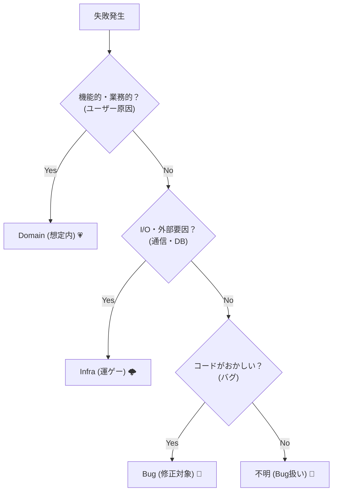

# 第09章：分類の軸を作ろう（迷ったら戻る地図）🗺️🏷️

この章はね、「失敗が起きたときに毎回判断がブレない」ための**地図づくり**だよ〜😊💡
分類があるだけで、実装もログもUIも、ぜんぶスッと決まるようになる👍✨

---

## 1) 今日のゴール🎯✨


最終的にこうなればOK👇😊

* 失敗を見た瞬間に **「これはドメイン？インフラ？バグ？」** が言える🗣️🏷️
* さらに **「軽/中/重（重大度）」** を付けられる⚖️🚦
* 迷ったときに戻れる **判断ルール（質問リスト）** を持つ🧭✨

---

## 2) 分類がないと起きる“あるある事故”😵‍💫💥


分類がない世界だと、こうなる…👇

* ある人は「入力ミス」を例外で投げる、別の人はResultで返す → 画面もAPIもバラバラ😇
* ある画面はトースト、別の画面は無言で失敗 → ユーザー混乱😢
* ログに「Error: failed」だけ残ってて、誰も直せない🫠
* 重要障害なのに気づくのが遅れて大惨事…💣

だから先に、**“判断の型”** を作っちゃうのが最強💪✨

---

## 3) 分類の基本の軸はこの2本でOK🪓✨


この3つが基本セット👇

1. **ドメイン（Domain）** 💗🙂
2. **インフラ（Infra）** 🔌🌩️
3. **バグ（Bug / 不変条件違反）** ⚡🧱

### 軸B：重大度（どれくらいヤバい？）🚦


まずはシンプルに3段階でOK👇

* **軽（Low）** 🍃：困るけど回避できる / 影響が小さい
* **中（Mid）** 🌥️：ユーザーに影響あり / 早めに直したい
* **重（High）** 🔥：広範囲・致命的・信頼やお金に直撃

※ 実運用の世界でも「SEV1/2/3」みたいに重大度を決めるのが一般的だよ〜🧯（例：SEV1は全ユーザー影響で緊急対応、など） ([Atlassian][1])

---

## 4) まずは“失敗の種類”をはっきりさせよ〜🏷️✨

### 4-1) ドメインエラー（Domain）💗🙂

**ユーザーの行動・入力・業務ルールの結果として起こる失敗**だよ🫶
つまり「それは仕様として起きうるよね」ってやつ✨

例👇

* ログイン失敗（パスワード違い）🔑
* 予算オーバー💸
* 在庫なし📦
* 期限切れ⏰

特徴👇

* “想定内” ✅
* ユーザーに**優しく説明**できる🫶💬
* だいたい **Resultで返したい側**（例外にしない）🎁

---

### 4-2) インフラエラー（Infra）🔌🌩️

**外部要因・I/O・通信・DB・外部API**みたいな「落ちることがある現実」系😇

例👇

* ネットワーク切断📡❌
* タイムアウト⏳
* DB接続失敗🗄️💥
* 外部APIが503返す🌐🚧

特徴👇

* “想定内”だけど、**いつ起きるかは運ゲー**🎲
* **リトライできるか？** が超大事🔁
* UIは「再試行」導線が強い💪🔁

---

### 4-3) バグ（Bug / 不変条件違反）⚡🧱

**「ここに来たらおかしい」**ってやつ😱
ユーザーに責任がないのに壊れてる、設計・実装の問題。

例👇

* nullのはずがないのにnullだった🫥
* switchのdefaultに来た（想定漏れ）🧩💥
* “絶対に存在する”はずのデータが存在しない📉

特徴👇

* “想定外” ❌
* **ユーザーには謝る**、内部では**強めにログ＆通知**📣🔥
* ここは例外境界で拾って “事故扱い” に寄せる感じ💥

---

## 5) 迷ったらこの質問順で決める🧭✨（判断フロー）


失敗を見たら、心の中でこれを聞いてね😊👇

1. **ユーザーの入力・業務ルールの結果？**
   → YESなら **Domain** 💗🙂

2. **外部I/O（通信/DB/外部API/FS）絡み？**
   → YESなら **Infra** 🔌🌩️

3. **「ここに来るの変じゃない？」って言える？**
   → YESなら **Bug** ⚡🧱

4. **それでも迷う？**
   → 迷うときは “安全側” で **重め＆Bug寄り** に倒すのが運用の定石だよ（重大度が割れたら高い方で動いて、後で見直す） ([PagerDuty インシデントレスポンス ドキュメント][2])



---

## 6) 重大度（軽/中/重）の付け方🚦✨


次の3つを見ると決めやすいよ😊

### 6-1) 影響範囲👥🌍

* 1人だけ？一部？全員？
* “全員に影響” は重になりやすい🔥（SEVの考え方も同じ） ([Atlassian][1])

### 6-2) お金・信頼・安全💸🛡️

* 決済できない → 重🔥
* 個人情報が絡む → ほぼ重🔥

### 6-3) 回避策がある？🛟

* 回避策あり → 軽〜中
* 回避策なし（詰み）→ 重🔥

---

## 7) 例：10個の失敗を分類してみよう📋✨

（例：推し活グッズ管理アプリ🛍️💗）

| 失敗                  | 種類               | 重大度  | ひとこと        |
| ------------------- | ---------------- | ---- | ----------- |
| 名前が空欄               | Domain           | 軽🍃  | 入力ミス🙂      |
| 予算オーバー              | Domain           | 中🌥️ | ルール違反🙂     |
| 在庫0で購入              | Domain           | 中🌥️ | 仕様として起きる    |
| 外部決済APIがタイムアウト      | Infra            | 重🔥  | リトライ導線ほしい🔁 |
| ネットワーク切断            | Infra            | 中🌥️ | 再試行で復帰しがち🔁 |
| DB接続失敗              | Infra            | 重🔥  | 監視・通知レベル📣  |
| JSONパース失敗（想定フォーマット） | Bug寄り or Infra寄り | 中〜重  | 相手仕様次第😵‍💫 |
| switchのdefault到達    | Bug              | 重🔥  | 想定漏れ🧱      |
| “存在するはず”のユーザーがnull  | Bug              | 重🔥  | データ整合性問題🧨  |
| 予期せぬthrow（string投げ） | Bug              | 中🌥️ | 正規化が必要🧼    |

「JSONパース失敗」みたいに迷うやつ、あるある〜😆
相手が自由に返してくるならInfra寄り、こっちの想定がズレてるならBug寄り、って感じで決めるとスッキリするよ🧭✨

---

## 8) TypeScriptで“分類を形にする”ミニ実装🎁🧩

ここは第15章以降で本格的にやるけど、先に超ミニで雰囲気だけ😊✨
（ポイント：**分類がコードに現れる**とブレにくい！）

```ts
// ① 重大度
export type Severity = "low" | "mid" | "high";

// ② 分類（まず3種でOK）
export type DomainError = {
  kind: "domain";
  severity: Severity;
  code: string;          // "BUDGET_OVER" など
  messageForUser: string;
};

export type InfraError = {
  kind: "infra";
  severity: Severity;
  code: string;          // "TIMEOUT" など
  messageForUser: string;
  retryable: boolean;
  cause?: unknown;       // 例: fetchの失敗など（原因保持）
};

export type BugError = {
  kind: "bug";
  severity: "high";      // 基本は重で扱う
  code: string;          // "INVARIANT_VIOLATION" など
  messageForUser: string; // ユーザーには短く謝る
  cause?: unknown;
};

export type AppError = DomainError | InfraError | BugError;
```

### catch を “unknown前提” にするのも超大事🛡️😳

TSには `catch (e)` を既定で `unknown` にするオプションもあるよ（安全に扱える！） ([TypeScript][3])

あと、JSの `Error` は `cause` で原因をぶら下げられるから、「どこで何が起きたか」を失いやすい問題に強いよ🧵✨ ([MDNウェブドキュメント][4])

---

## 9) ミニ演習📝✨（やってみよ〜！）


### 演習A：あなたのアプリで失敗を10個書く✍️

* 画面入力
* 通信
* DB/外部API
* “ありえないはず” 系

### 演習B：分類＆重大度を付ける🏷️🚦

1つずつ、これを書く👇

* 種類（domain/infra/bug）
* 重大度（軽/中/重）
* 理由（1行でOK）

### 演習C：扱い方を1行で決める💬🧾

* ユーザー表示：どんな文？🙂
* ログ：何を残す？🔎
* 再試行：あり？なし？🔁

---

## 10) AI活用🤖💖（この章で効く使い方）

### 使えるプロンプト例🪄

* 「この機能の失敗ケースを20個出して、domain/infra/bugに分類して」🧠📋
* 「この分類がブレる反例を出して。境界線のルールを改善したい」⚖️
* 「重大度（軽/中/重）を付けて。影響範囲・回避策・信頼の観点で理由も」🚦
* 「分類と重大度が決まった前提で、ユーザー向け文言を優しく整えて」💬🫶

### AIに任せっぱなしにしないチェック✅

* 「それ、ユーザーのせい？システムのせい？」がズレてない？🤔
* 「リトライできる？」が入ってる？🔁
* 「迷ったときのルール」が言語化されてる？🧭✨

---

## 11) まとめ🌸✨

* 分類は **設計のブレ止め**🗺️🏷️
* まずは **Domain / Infra / Bug** の3つで十分😊
* 重大度は **軽/中/重** でシンプルに🚦
* 迷ったら **安全側（重め）** に倒して、後で見直すのが強い💪 ([PagerDuty インシデントレスポンス ドキュメント][2])

---

## 次章チラ見せ👀💗

次は **第10章：ドメインエラー入門（ユーザーに優しい失敗）** だよ〜🫶🙂
「入力ミスや業務ルール違反を、例外じゃなく設計として扱う」って感覚を育てていくよ✨

[1]: https://www.atlassian.com/incident-management/kpis/severity-levels?utm_source=chatgpt.com "Understanding incident severity levels"
[2]: https://response.pagerduty.co.jp/before/severity_levels/?utm_source=chatgpt.com "Severity Levels - PagerDuty インシデントレスポンス ドキュメント"
[3]: https://www.typescriptlang.org/tsconfig/useUnknownInCatchVariables.html?utm_source=chatgpt.com "useUnknownInCatchVariables - TSConfig Option"
[4]: https://developer.mozilla.org/en-US/docs/Web/JavaScript/Reference/Global_Objects/Error/cause?utm_source=chatgpt.com "Error: cause - JavaScript - MDN Web Docs"
