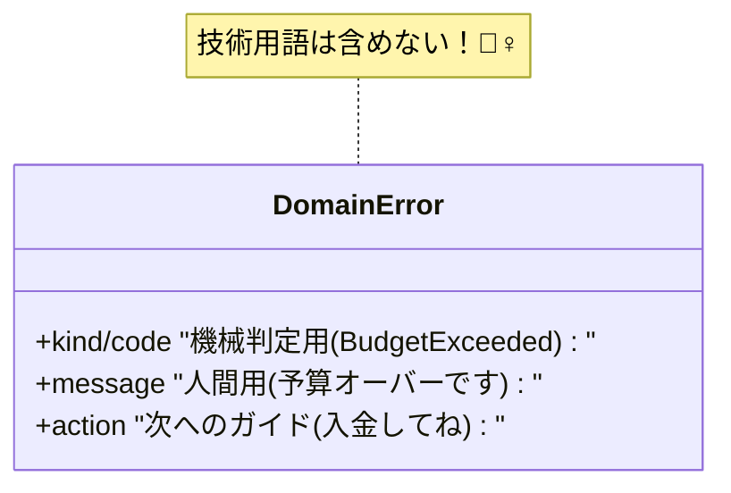

# 第10章：ドメインエラー入門（ユーザーに優しい失敗）💗🙂

## 1. ドメインエラーってなに？🧁

**ドメインエラー**は、「ユーザーの操作や入力、業務ルールの都合で“起きて当然”の失敗」だよ〜✨
たとえばこんなやつ👇

* 予算オーバー💸（買いたいけど残高が足りない）
* 在庫なし📦（もう売り切れ）
* 期限切れ⏰（クーポンや招待コードが期限切れ）
* ルール違反📏（購入数の上限を超えた、年齢制限、締切後…）

ポイントはこれ👇
**「ユーザーが行動を変えれば解決できる」**ことが多い💡🙂

---

## 2. なんで“例外（throw）”にしないの？🙅‍♀️💥

![「例外（throw）」と「戻り値（Result）」の違い[(./picture/err_model_ts_study_003_railway_switch.png)

ドメインエラーは **「想定内」** だから、例外にしちゃうとこうなりがち😵‍💫

* どこで握りつぶされたか分からない🙈
* UIが「謎のエラー」表示になって優しくない🥺
* 非同期だと落ち方がややこしくなりやすい⚡
* 「起きて当然」なのにログが赤くて運用がうるさい🔔

なので、ドメインエラーは基本こう扱うのが気持ちいい👇
✅ **戻り値で返す（Result型）**
✅ **型で分岐できる形にする（判別可能ユニオン）**

---

## 3. ドメインエラー設計の“3点セット”🎁✨

ドメインエラーは、最低これがあると強いよ💪🙂

1. **種類（kind / code）**：機械的に判定できる🧠
2. **表示向け情報**：ユーザーに優しい文章💬
3. **再入力ガイド**：次に何すればいい？➡️

そして大事なのが👇
❌ “技術の事情” を混ぜない（stackとかSQLとか）
✅ “ユーザーの世界” の言葉で説明する（予算、在庫、期限）



---

## 4. 例題：推しグッズ購入ミニドメイン🛍️💖

「推しグッズを買う」ってだけでも、失敗いっぱいあるよね🙂

* 予算が足りない💸
* 在庫がない📦
* 期限切れ⏰
* 購入数が多すぎる🧺

### 4.1 ドメインエラー型（判別可能ユニオン）🏷️

```ts
type DomainError =
  | { kind: "BudgetExceeded"; required: number; current: number }
  | { kind: "OutOfStock"; itemId: string }
  | { kind: "Expired"; target: "coupon" | "reservation"; expiredAt: string }
  | { kind: "QuantityLimitExceeded"; limit: number; requested: number };
```

ここでのコツ✨

* `kind` は **英単語で短く・ブレない**（後で超助かる）🙂
* UIに必要な数字やIDだけ持つ（技術詳細は持たない）🧼

---

## 5. Result型で「成功/失敗」を普通に分岐できるようにする🎁🌈

### 5.1 最小のResult型

```ts
type Result<T, E> =
  | { ok: true; value: T }
  | { ok: false; error: E };

const ok = <T>(value: T): Result<T, never> => ({ ok: true, value });
const err = <E>(error: E): Result<never, E> => ({ ok: false, error });
```

### 5.2 購入処理は「例外」じゃなく「Result」で返す🙂

![購入処理は「例外」じゃなく「Result」で返す[(./picture/err_model_ts_study_010_result_package.png)

```ts
type PurchaseReceipt = { purchaseId: string };

function purchase(itemId: string, requestedQty: number, budget: number): Result<PurchaseReceipt, DomainError> {
  const price = 3000;
  const stock = 2;
  const limit = 3;

  if (requestedQty > limit) {
    return err({ kind: "QuantityLimitExceeded", limit, requested: requestedQty });
  }

  if (requestedQty > stock) {
    return err({ kind: "OutOfStock", itemId });
  }

  const total = price * requestedQty;
  if (total > budget) {
    return err({ kind: "BudgetExceeded", required: total, current: budget });
  }

  return ok({ purchaseId: crypto.randomUUID() });
}
```

---

## 6. UIに優しく変換する（表示文言はここで！）🎀💬

**ドメインエラーの型**と **ユーザー表示**は分けようね🙂
（型は機械用、文言は人間用👭）

```ts
function toUserMessage(e: DomainError): string {
  switch (e.kind) {
    case "BudgetExceeded":
      return `予算が足りないよ💦（あと ${e.required - e.current} 円必要！）`;
    case "OutOfStock":
      return "ごめんね…在庫がなくなっちゃった📦💦";
    case "Expired":
      return "期限が切れてるみたい⏰ 新しいものを用意してね🙂";
    case "QuantityLimitExceeded":
      return `一度に買えるのは ${e.limit} 個までだよ🧺`;
  }
}
```

この形にしておくと、UIはいつでも👇
✅ `message = toUserMessage(error)` で統一できる✨

---

## 7. “エラーカタログ”のミニ版を作ろう📚🏷️

「kindの意味」「見せ方」「ユーザーの次の行動」を1枚にまとめると強いよ🙂
ここで `satisfies` を使うと「書き漏れ」検出に役立つ✨（型を変えずにチェックできるよ） ([TypeScript][1])

```ts
const domainErrorCatalog = {
  BudgetExceeded: { userTitle: "予算オーバー", action: "金額を下げる / 予算を追加する" },
  OutOfStock: { userTitle: "在庫なし", action: "入荷通知を待つ / 別商品にする" },
  Expired: { userTitle: "期限切れ", action: "新しいクーポンを使う" },
  QuantityLimitExceeded: { userTitle: "数量制限", action: "個数を減らす" },
} satisfies Record<DomainError["kind"], { userTitle: string; action: string }>;
```

---

## 8. ミニ演習（手を動かそ〜！）📝💗

### 演習A：ドメインエラーを5個作って命名🏷️✨

あなたのアプリ（または想像のアプリ）でOK🙂
例：予約、課金、投稿、登録、検索…なんでも！

* `kind` を **5個**
* それぞれ「ユーザーが直せる行動」を1行で書く✍️

### 演習B：Resultにしてみる🎁

* 1つの処理を選んで
* `Result<成功, DomainError>` を返す関数にする🙂

---

## 9. AI活用プロンプト（そのままコピペOK）🤖💞

* 「この機能で起きうる“ユーザーが直せる失敗”を10個出して。業務ルール違反も入れてね」
* 「次のDomainErrorの `kind` 命名案を10個。短くてブレない名前で」
* 「ユーザーに優しい表示文言に言い換えて（責めないトーンで、短め）」
* 「このResult設計、分岐漏れが起きない？レビューして」
* 「この関数のドメインエラー中心のテスト観点を列挙して」🧪

---

## 10. まとめ🎀

* ドメインエラーは **“想定内の失敗”** だから、例外より **Resultで返す**のが相性いい🙂
* `kind` 付きユニオンで **分岐が安全＆読みやすい**✨
* 表示文言は **変換関数に集約**するとUIが統一できる💗
* カタログ化すると、設計がブレなくなる📚

次の章（インフラエラー）では、「通信落ちる🌩️」「DB死ぬ💥」「リトライできる？できない？」みたいな現実の失敗を整理していくよ〜🔌🔁

[1]: https://www.typescriptlang.org/docs/handbook/release-notes/typescript-4-9.html?utm_source=chatgpt.com "Documentation - TypeScript 4.9"
