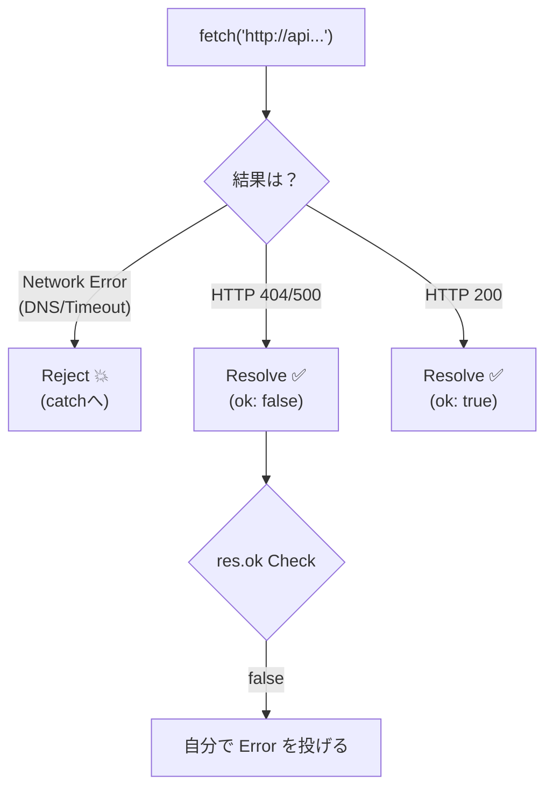

# 第11章：インフラエラー入門（現実は落ちる🌩️）🔌

外部I/O（ネットワーク・DB・外部API・ストレージ…）って、**ちゃんと作ってても普通に落ちます**😇
この章は「落ちる前提で、落ち方を“設計”する」ための入門だよ〜💪✨

---

## 1) インフラエラーってなに？🤔🌐

ざっくり言うと **「自分のコードの外で起きる失敗」** だよ🔌

* ネットが不安定📶
* DNSが引けない（名前解決できない）🔎
* TLS/証明書で握手できない🔐
* タイムアウト（待ちすぎ）⏳
* 相手が落ちてる（5xx）🧯
* 混みすぎで弾かれる（429）🚦

ここで大事なのは👇
インフラエラーは「直す」より **“耐える”** がメインになることが多いってこと🙂🛡️

---

## 2) まず最初に覚える2分類：一時的？恒久的？🔁🧱

![Transient（一時的） vs Permanent（永続的）[(./picture/err_model_ts_study_011_transient_cloud.png)

### ✅ 一時的（リトライで治る可能性がある）🔁

* 一瞬の通信エラー、瞬断📶
* タイムアウト⏳
* 429（混雑・レート制限）🚦
* 502/503/504（相手の一時不調）🧯
  こういうのは **「時間を置いて再試行」** が効くことがあるよ✨
  （ただし無限にやるのはダメ！後でやるよ🫣）

### ❌ 恒久的（リトライしてもほぼ無意味）🧱

* URLが間違い（ずっとダメ）🧩
* 認証ミス（401/403）🔐
* 入力が悪い（400/422）✍️
* 404（基本は無いものは無い）🫠

---

## 3) “再試行していいか”は、実はもう1個条件がある⚠️🧨

それが **「同じリクエストをもう一回送っても安全？」** だよ🙂

HTTPには「冪等（idempotent）」って概念があって、**同じ操作を何回やっても結果が同じになりやすいメソッド**があるの👇
RFCでは **PUT / DELETE と “safe method（GET/HEADなど）” は冪等** とされてるよ📘✨ ([RFCエディタ][1])

* ✅ 再試行しやすい：GET / HEAD / PUT / DELETE 👍
* ⚠️ 注意：POST（同じ注文が2回通ったら地獄😱）

> だから「一時的に落ちたからリトライしよ〜」は、**操作の種類**もセットで判断が必要なんだよね🧠💡

---

## 4) fetchの“超重要ポイント”🌐🧠（ここで事故る人が多い）

### ✅ fetchは「HTTPエラー（404とか）」では失敗扱いにならない😳

`fetch()` の Promise が reject されるのは、主に **ネットワークエラー等**のとき。
**404/500みたいなHTTPエラーでも、Promiseは成功（resolve）して Response が返る**から、`response.ok` / `response.status` を自分でチェックする必要があるよ👀✨ ([MDN Web Docs][2])



---

## 5) まずは“タイムアウト”を標準装備しよ⏳🛑

「待ち続ける」は最悪のUX＆最悪の運用…😇
最近は `AbortSignal.timeout()` が使いやすいよ✨
（ブラウザでも現行環境で広く使える扱いになってるよ📌 ([MDN Web Docs][3])）
Node側でも `AbortSignal.timeout(delay)` が用意されてるよ🧰 ([Node.js][4])

```ts
// タイムアウト付き fetch（基本形）⏳
export async function fetchWithTimeout(
  input: RequestInfo | URL,
  init: RequestInit & { timeoutMs?: number } = {}
) {
  const { timeoutMs = 10_000, ...rest } = init;

  // timeoutシグナル（現行環境で便利）✨
  const signal = AbortSignal.timeout(timeoutMs);

  return fetch(input, { ...rest, signal });
}
```

---

## 6) インフラエラーを“種類”で扱う（文字列で判定しない😵‍💫）

この章では、まず **「インフラ失敗」を1つの形にまとめる** ところまでやろう🙂✨
（次の章以降で、もっと綺麗に“正規化”していくよ🧼）

```ts
// インフラエラー（入門版）🔌
export type InfraError =
  | { kind: "timeout"; retryable: true; message: string }
  | { kind: "network"; retryable: true; message: string }
  | { kind: "rate_limit"; retryable: true; retryAfterMs?: number; message: string }
  | { kind: "http"; retryable: boolean; status: number; message: string }
  | { kind: "unknown_infra"; retryable: false; message: string; original?: unknown };
```

---

## 7) 「再試行OK/NG」のルール（入門のおすすめ）🧾✅

クラウド系の公式ガイドでも、**408 / 429 / 5xx** と、ソケットタイムアウトやTCP切断などが “リトライ対象” として挙げられることが多いよ📌 ([Google Cloud Documentation][5])

### ✅ リトライしやすいHTTP（入門セット）

* 408 Request Timeout
* 429 Too Many Requests（混雑）🚦
* 500 / 502 / 503 / 504（相手の一時不調）🧯

### ❌ 基本リトライしない

* 400/422（入力が悪い）
* 401/403（認証/権限）
* 404（基本は無いものは無い）

---

## 8) 429 は “Retry-After” を尊重しよう⏱️🙏

429やメンテ系の応答で `Retry-After` が来ることがあるよ。
これは「どれくらい待ってから再試行してね」を伝えるヘッダー📮 ([MDN Web Docs][6])

```ts
function parseRetryAfterMs(retryAfter: string | null): number | undefined {
  if (!retryAfter) return undefined;

  // まずは「秒」形式だけ対応（入門）⏱️
  const sec = Number(retryAfter);
  if (Number.isFinite(sec) && sec >= 0) return sec * 1000;

  // HTTP-date形式は次の章以降で拡張してOK🙂
  return undefined;
}
```

---

## 9) バックオフ（待ち時間）＋ジッター（ゆらぎ）で安全にリトライ🔁🎲

![バックオフ（待ち時間）＋ジッター（ゆらぎ）で安全にリトライ[(./picture/err_model_ts_study_011_backoff_steps.png)

リトライを雑にやると、みんな一斉に突撃して **障害が悪化**することがあるよ😱（リトライ嵐🌪️）

そこで定番が👇

* **Exponential backoff（指数的に待ち時間を増やす）**
* **Jitter（待ち時間にランダム性を足す）**

AWSもこの考え方（バックオフ＆ジッター）を推してるよ📌 ([Amazon Web Services, Inc.][7])
Googleのガイドでも「指数バックオフ＋ジッター」を推奨してるよ📌 ([Google Cloud Documentation][5])

```ts
function calcBackoffMs(attempt: number, base = 200, cap = 5_000): number {
  // attempt: 1,2,3... として
  const exp = Math.min(cap, base * 2 ** (attempt - 1));
  // jitter: 0.5x〜1.0x くらい（入門）🎲
  const jitter = 0.5 + Math.random() * 0.5;
  return Math.floor(exp * jitter);
}

function sleep(ms: number): Promise<void> {
  return new Promise((resolve) => setTimeout(resolve, ms));
}
```

---

## 10) fetch を InfraError に変換する（入門版）🧩✨

```ts
function isRetryableStatus(status: number): boolean {
  return status === 408 || status === 429 || (status >= 500 && status <= 599);
}

export async function fetchJsonAsInfra<T>(
  url: string,
  init: RequestInit & { timeoutMs?: number } = {}
): Promise<{ ok: true; data: T } | { ok: false; error: InfraError }> {
  try {
    const res = await fetchWithTimeout(url, init);

    // fetchはHTTPエラーでもrejectしないので自分で見る👀
    if (!res.ok) {
      if (res.status === 429) {
        const retryAfterMs = parseRetryAfterMs(res.headers.get("Retry-After"));
        return {
          ok: false,
          error: {
            kind: "rate_limit",
            retryable: true,
            retryAfterMs,
            message: "混雑してるみたい。少し待ってからもう一回やってね🙏",
          },
        };
      }

      return {
        ok: false,
        error: {
          kind: "http",
          status: res.status,
          retryable: isRetryableStatus(res.status),
          message: `通信はできたけどエラーだったよ（HTTP ${res.status}）💦`,
        },
      };
    }

    const data = (await res.json()) as T;
    return { ok: true, data };
  } catch (e: unknown) {
    // ここに来るのは主にネットワーク/中断/変なURLなど📶
    // fetchはネットワーク等でrejectするよ📌
    // （HTTP 404/500ではrejectしない） :contentReference[oaicite:8]{index=8}

    // タイムアウトの見分けは環境差があるので、入門は「timeoutっぽい/それ以外」くらいでOK🙂
    const msg = e instanceof Error ? e.message : "不明なエラー";

    const maybeTimeout = msg.toLowerCase().includes("timeout");
    return {
      ok: false,
      error: maybeTimeout
        ? { kind: "timeout", retryable: true, message: "時間切れだったよ⏳ もう一回やってみよ🔁" }
        : { kind: "network", retryable: true, message: "通信がうまくいかなかったよ📶 もう一回試してみよ🔁" },
    };
  }
}
```

---

## 11) “再試行OK/NG表”を作るミニ演習📝🔁

あなたのアプリを想像して、外部I/Oを10個くらい書いてみてね✍️✨
例：外部API、画像CDN、決済、ログ送信、DB、ファイル保存…など

### ステップ①：失敗例を列挙する📋

* 例）「外部APIが503」
* 例）「DNS引けない」
* 例）「429で弾かれた」
* 例）「証明書エラー」

### ステップ②：リトライOK/NGを決める✅❌

決めるときの観点はこの2つだよ🙂

1. **一時的？恒久的？** 🔁🧱
2. **同じ操作をもう一回やって安全？（冪等？）** 🧨🛡️ ([RFCエディタ][1])

### ステップ③：ユーザーへの見せ方も1行添える💬

* 「再試行ボタンを出す」🔁
* 「自動で1回だけ再試行」🤖
* 「問い合わせ導線」📩

---

## 12) AI活用（この章でめっちゃ効くやつ🤖💖）

### ✅ 失敗の洗い出し（漏れ防止）

* 「この機能の外部依存を列挙して、起きうるインフラ失敗を20個出して」🤖🧾

### ✅ リトライ表の下書き

* 「次の失敗を “一時的/恒久的” に分類して、リトライ可否も提案して：…」🔁✅❌

### ✅ ユーザー文言の統一

* 「女子大生向けに、安心させる感じで“再試行”の文言を5案ちょうだい」🫶💬✨

### ✅ 実装の叩き台

* 「fetchの失敗を network/http/rate_limit/timeout に分類して戻すTS関数を書いて」🧩🛠️

---

## まとめ（この章のゴール）🎯✨

* インフラエラーは **“落ちる前提”** で設計する🌩️🔌
* まずは **一時的/恒久的** の2分類が超大事🔁🧱
* リトライは **冪等性（安全に繰り返せるか）** とセットで考える🧠 ([RFCエディタ][1])
* `fetch` は **HTTPエラーではrejectしない** ので `res.ok` を必ず見る👀 ([MDN Web Docs][2])
* リトライは **バックオフ＋ジッター** で安全に🔁🎲 ([Amazon Web Services, Inc.][7])
* 429は `Retry-After` を尊重⏱️🙏 ([MDN Web Docs][6])

---

次の章（第12章）では、「ここに来たらおかしい⚡（バグ/不変条件違反）」を**インフラやドメインと分離**して、もっと設計がスッキリする感じに進めるよ〜🧱✨

[1]: https://www.rfc-editor.org/rfc/rfc9110.html?utm_source=chatgpt.com "RFC 9110: HTTP Semantics"
[2]: https://developer.mozilla.org/en-US/docs/Web/API/Fetch_API/Using_Fetch?utm_source=chatgpt.com "Using the Fetch API - MDN Web Docs"
[3]: https://developer.mozilla.org/ja/docs/Web/API/AbortSignal/timeout_static?utm_source=chatgpt.com "AbortSignal: timeout() 静的メソッド - Web API | MDN"
[4]: https://nodejs.org/api/globals.html "Global objects | Node.js v25.3.0 Documentation"
[5]: https://docs.cloud.google.com/storage/docs/retry-strategy?utm_source=chatgpt.com "Retry strategy | Cloud Storage"
[6]: https://developer.mozilla.org/en-US/docs/Web/HTTP/Reference/Headers/Retry-After?utm_source=chatgpt.com "Retry-After header - HTTP - MDN Web Docs"
[7]: https://aws.amazon.com/builders-library/timeouts-retries-and-backoff-with-jitter/?utm_source=chatgpt.com "Timeouts, retries and backoff with jitter"
