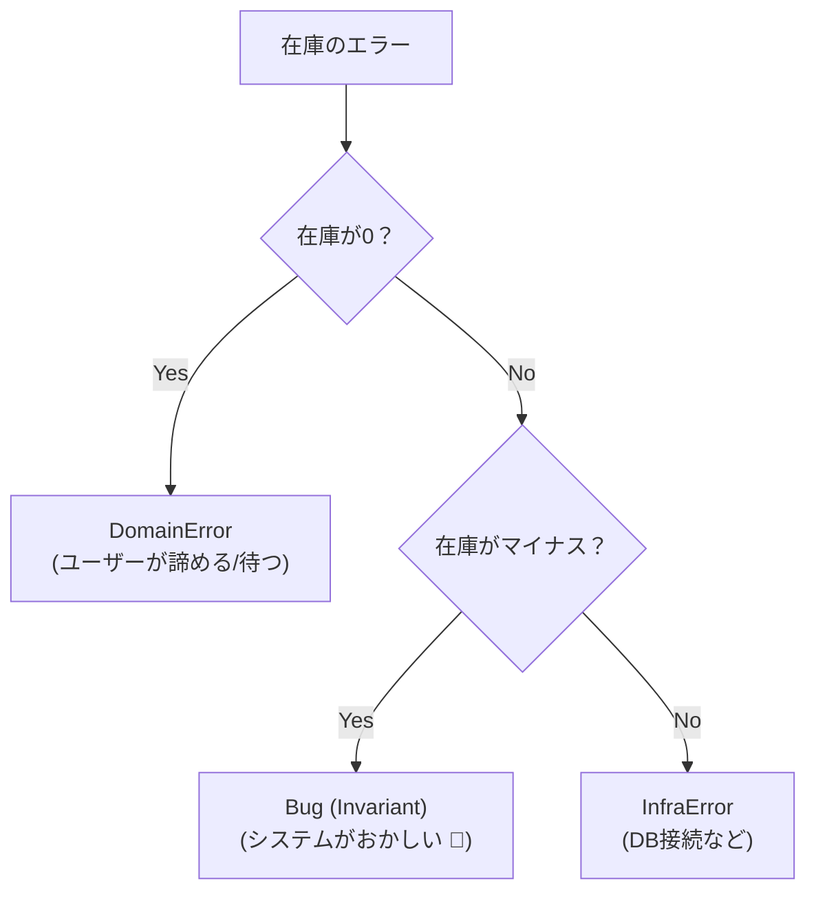

# 第12章：バグ（不変条件違反）を分離する⚡🧱

〜「ここに来たらおかしい」を“設計として”扱えるようになるよ😊✨〜

---

## 0. この章でできるようになること🎯✨

この章のゴールはこれ👇💡

* 「ドメインエラー」「インフラエラー」「バグ（不変条件違反）」を混ぜないで扱える🙅‍♀️🧺
* 「ここに来たら絶対おかしい！」をコードで明文化できる✍️🧱
* バグが起きたとき **ユーザーに見せる情報** と **開発者が欲しい情報** を分離できる👩‍💻🧑‍💻🔍
* TSで「到達しないはず」の場所を `never` で守れる🛡️✨（網羅性チェック）

ちなみに、今どきのTSは **TypeScript 5.9** が安定版として扱われています（GitHub Releases基準）📌 ([GitHub][1])

---

## 1. まず結論：バグは「エラー」だけど、**ユーザーに返す“失敗”じゃない**🙅‍♀️⚡


いままでの章で出てきた分類を思い出してね🗺️✨

* **ドメインエラー**💗：ユーザーの入力ミス / 業務ルール違反（想定内）
* **インフラエラー**🔌：通信・DB・外部APIなど現実的に落ちる（想定内）
* **バグ（不変条件違反）**🧱⚡：**想定してない状態** / **ここに来たらおかしい**

ここ超大事👇😳
**バグは「ユーザーが直すべき失敗」じゃない**の。
だからユーザーに「あなたが悪いです」みたいに出したらダメ🙈💦

---

## 2. 「不変条件（Invariant）」ってなに？🧱🙂


不変条件は、ひとことで言うと👇

> **“この世界（このドメイン）では常に成り立っていてほしい条件”** 🧱✨

例を出すね🧸🛒

* 注文の合計金額は **0円以上** 💴
* カートの数量は **1以上** 🧺
* 「支払い済み」なら「支払いID」が **必ずある** 💳
* `status` が `"paid"` なのに `paidAt` が `null` → **それ、もう世界が壊れてる**🧨😱

こういうのが崩れてたら、それは **入力ミス** じゃなくて
**コードのどこかが壊してる可能性が高い** → つまりバグ🧱⚡

---

## 3. Fail Fast（早く壊す）は“優しさ”だよ💥🫶


バグが起きたときの基本方針はこれ👇✨

* ユーザーに見せる：

  * 「問題が発生しました。時間をおいて再度お試しください」みたいな **安全メッセージ**🙂🙏
* 開発者が欲しい：

  * どの不変条件が破れた？
  * どの入力・状態だった？
  * どの経路でそこに来た？
  * 元の例外（cause）がある？

ここで便利なのが **Error の `cause`** だよ🎁🧵
いまは `new Error("msg", { cause })` の形で「原因をぶら下げられる」✨ ([MDN Web Docs][2])

---

## 5. TSで「不変条件」をコードにする3点セット🧰✨

### 5-1. ① `invariant()` を作る（Assertion Function）🛡️🙂


TSには「これが真じゃなかったら投げる」みたいな **アサーション関数**が作れるよ✨
`asserts condition` ってやつ（TS 3.7以降の仕組み）📌 ([TypeScript][3])

```ts
export function invariant(
  condition: unknown,
  message: string,
  options?: { cause?: unknown }
): asserts condition {
  if (!condition) {
    // cause があると、あとで原因追跡がめっちゃ楽🎁🧵
    throw new Error(message, options);
  }
}
```

使い方👇😊

```ts
invariant(cart.items.length > 0, "Invariant violated: cart.items must not be empty");
```

> ポイント💡
> `invariant()` は **“ユーザー入力チェック”に使わない** のがコツ🙅‍♀️
> ユーザー入力はドメインエラーとして返す（第10章の担当）💗

---

### 5-2. ② `assertNever()` で「到達しない」場所を守る🧱🛡️


TSの `never` を使うと、switchの網羅性チェックができるよ✨
公式ハンドブックにも例があるやつ📌 ([TypeScript][4])

```ts
export function assertNever(x: never): never {
  throw new Error(`Invariant violated: unreachable case: ${String(x)}`);
}
```

例：注文ステータスの分岐👇🧾

```ts
type OrderStatus = "draft" | "paid" | "shipped";

function statusLabel(s: OrderStatus): string {
  switch (s) {
    case "draft": return "下書き";
    case "paid": return "支払い済み";
    case "shipped": return "発送済み";
    default: return assertNever(s); // ここが“地雷センサー”💣✨
  }
}
```

これ、未来に `"canceled"` を追加したのに分岐追加を忘れたら、
**コンパイル時に気づける**確率が爆上がりするよ😆💖

---

### 5-3. ③ Nodeの `assert` は「テストで使う」が相性良い🧪🧡

Nodeには `node:assert` っていう公式アサートもあるよ✨ ([Node.js][5])
ただ、アプリ本体で多用するより **テストで使う** のがやりやすいことが多いかな🙂

---

## 6. 具体例：同じ“失敗”でも分類が違うよ🧸🧠


### ケース：在庫から引いて注文確定🛒📦

* 在庫が0 → **ドメインエラー**（在庫なし）💗
* DB接続が落ちた → **インフラエラー**🔌
* 在庫が -3 になった → **バグ（不変条件違反）**🧱⚡（世界崩壊）

バグのときはこう考えるとラク👇😊
「それ、ユーザーが操作を変えたら直る？」

* 直る → ドメイン寄り💗
* 直らない / そもそも起きちゃダメ → バグ🧱⚡



---

## 7. ミニ演習📝✨（超大事！）


### 演習1：あなたのアプリの不変条件を3つ決めよう🧱🧠

例テンプレ👇（コピペOK）✨

* 不変条件①：＿＿＿＿＿＿＿＿（例：合計金額は0以上）
* 不変条件②：＿＿＿＿＿＿＿＿
* 不変条件③：＿＿＿＿＿＿＿＿

そして次も書く👇✍️
「破ったらどうする？」

* どこで検出する？（関数の入口？状態遷移？）🚪
* どう止める？（throw？境界でキャッチ？）🧯
* ユーザー表示は？🙂
* 開発者ログは何が必要？🔍

---

### 演習2：`invariant()` を1箇所入れてみよう🛡️✨

おすすめはここ👇

* 状態遷移の直前（例：`pay()` の中）💳
* 集計結果の直後（例：合計金額）🧾

---

### 演習3：switchに `assertNever()` を入れてみよう💣✨

「ステータス」「種別」「モード」みたいな union があるところに入れると効果抜群😆

---

## 8. AI活用🤖💖（この章での“勝ち”プロンプト集）

コピペで使ってね😊✨

* 「この処理にあり得ない状態（不変条件）を10個列挙して」🧱🔎
* 「ドメインエラーとバグ（不変条件違反）の境界が曖昧な点を指摘して」⚖️👀
* 「この union の switch を網羅的にするための assertNever パターンを書いて」🧩🛡️
* 「ユーザー表示に出して良い情報 / ダメな情報を分けて、文言案も出して」🎀📝
* 「この例外の cause を残す設計に変えて（Error cause を使って）」🎁🧵 ([MDN Web Docs][2])

---

## 9. よくある事故💥🙅‍♀️（ここ超ひっかけ）

* `invariant()` を **入力チェック** に使ってしまう（＝ユーザー操作で起きる失敗を“バグ扱い”にしちゃう）😵‍💫
* `any` で型が崩れて、不変条件がすり抜ける🫥
* 例外を握りつぶして「何も起きなかったこと」にする🙈（Fail Fastの逆😱）
* バグ詳細をそのまま画面に表示（情報漏えい・UX最悪）🙅‍♀️💦

---

## 10. まとめ🎁✨（この章の合言葉）

* バグ＝不変条件違反＝「ここに来たらおかしい」🧱⚡
* 見つけたら **Fail Fast** 💥
* ユーザー表示と開発者情報は **分離** 🎀🔍
* TSでは `asserts` と `never` が強い🛡️✨ ([TypeScript][3])
* `cause` で原因をつなぐと追跡がラク🎁🧵 ([MDN Web Docs][2])

---

## 次章チラ見せ👀✨

次の第13章は「カスタムErrorの作り方（JS流）🧰✨」！
ここで作る「エラーの型」が、**分類（domain/infra/bug）を崩さない武器**になるよ😆💖

[1]: https://github.com/microsoft/typescript/releases "Releases · microsoft/TypeScript · GitHub"
[2]: https://developer.mozilla.org/en-US/docs/Web/JavaScript/Reference/Global_Objects/Error/cause?utm_source=chatgpt.com "Error: cause - JavaScript - MDN Web Docs"
[3]: https://www.typescriptlang.org/docs/handbook/release-notes/typescript-3-7.html?utm_source=chatgpt.com "Documentation - TypeScript 3.7"
[4]: https://www.typescriptlang.org/docs/handbook/2/narrowing.html?utm_source=chatgpt.com "Documentation - Narrowing"
[5]: https://nodejs.org/api/assert.html?utm_source=chatgpt.com "Assert | Node.js v25.3.0 Documentation"
