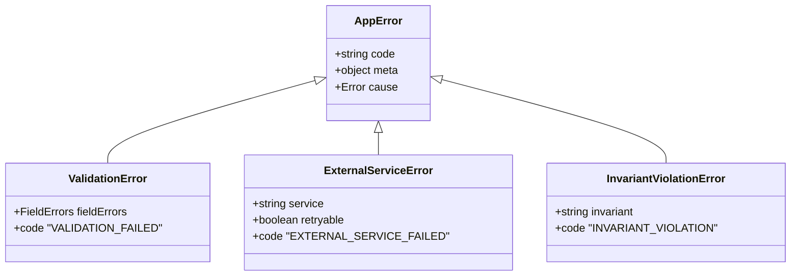

# 第13章：カスタムErrorの作り方（JS流）🧰✨

この章は「エラーの種類を“メッセージ文字列”で判定しない」ための超重要回だよ〜！😆💖
ここでしっかり型（クラス）とコードで区別できるようになると、あとがめっちゃ楽になる✨

---

## この章のゴール🎯✨

* 「目的別のカスタムError」を作れるようになる💪🙂
* エラー判定を「文字列解析」から卒業する🎓🚫📝
* “投げ分け”ができて、受け取り側がスッキリする🧹✨

---

## 1) なんでカスタムErrorが必要なの？🤔💭


### ✅ メッセージ解析は壊れやすい💥

エラーメッセージって、人間が読むための文章だから、句読点や言い回しが変わるだけで判定ロジックが崩れがち😵‍💫
MDNでも「メッセージを解析させるより、区別できる仕組みを使う」方向がオススメされてるよ。 ([MDNウェブドキュメント][1])

### ✅ 「種類」があると、扱いが機械的になる🤖✨

* ValidationError → フォームに出す💄📝
* ExternalServiceError → リトライ案内🔁🌩️
* InvariantViolationError → バグ扱いで監視＆即対応🚨🧱

この“分岐”が、ちゃんと安定して書けるようになる💪✨

---

## 2) カスタムErrorに入れておくと強い情報たち🧺✨


最低限ここが強いよ👇

* **name**：種類名（クラス名にするのが定番）🏷️
* **code**：機械判定用の固定コード（超大事！）🔑
* **meta**：ログ用の追加情報（安全な範囲だけ）🧾🔒
* **cause**：原因のエラー（「元のエラー」を失わない）🧵🎁

ちなみに cause は主要ブラウザで 2021年9月ごろから広く使える機能として定着してるよ。 ([MDNウェブドキュメント][2])
TypeScript側でも、ES2022ターゲット/ライブラリで「new Error の cause」が使えるようになってる。 ([TypeScript][3])

---

## 3) まずは土台：AppError（共通の親）を作ろう🏗️✨


ポイントはこれ👇🙂

* **code を必ず持つ**（メッセージ解析を卒業🎓）
* **name をクラス名に揃える**
* **stack を整える（ただし非標準もあるので安全運転）**
  stack や captureStackTrace は “標準外” 扱いなので、使うなら存在チェックしてね〜！ ([MDNウェブドキュメント][1])

```ts
// src/errors/AppError.ts
export type AppErrorCode =
  | "VALIDATION_FAILED"
  | "EXTERNAL_SERVICE_FAILED"
  | "INVARIANT_VIOLATION";

export type AppErrorMeta = Record<string, unknown>;

export type AppErrorOptions = {
  cause?: unknown;
  meta?: AppErrorMeta;
};

export class AppError extends Error {
  readonly code: AppErrorCode;
  readonly meta?: AppErrorMeta;

  constructor(code: AppErrorCode, message: string, options: AppErrorOptions = {}) {
    // cause を使うなら ES2022 系の lib/target があると型が通りやすいよ（後述）
    super(message, options.cause !== undefined ? { cause: options.cause } : undefined);

    this.code = code;
    this.meta = options.meta;

    // ここで name を揃えるとログが読みやすい✨
    this.name = new.target.name;

    // 念のためプロトタイプを補正（環境差の保険🛡️）
    Object.setPrototypeOf(this, new.target.prototype);

    // V8系（Chrome/Nodeなど）で stack を綺麗にする保険（標準外なので存在チェック✅）
    const anyError = Error as unknown as { captureStackTrace?: (obj: object, ctor?: Function) => void };
    if (typeof anyError.captureStackTrace === "function") {
      anyError.captureStackTrace(this, new.target);
    }
  }
}
```

---

## 4) 3種類のErrorクラスを作って投げ分けよう🎯🪄

![まずは土台：AppError（共通の親）を作ろう[(./picture/err_model_ts_study_013_three_robots.png)

ここからが本番！✨
「ドメイン」「インフラ」「バグ（不変条件）」の3つに寄せた例だよ🙂💕



### 4-1) ValidationError（入力や業務ルールの失敗）📝💗

```ts
// src/errors/ValidationError.ts
import { AppError } from "./AppError";

export type FieldErrors = Record<string, string[]>;

export class ValidationError extends AppError {
  readonly fieldErrors: FieldErrors;

  constructor(fieldErrors: FieldErrors, options?: { cause?: unknown; meta?: Record<string, unknown> }) {
    super("VALIDATION_FAILED", "Validation failed.", {
      cause: options?.cause,
      meta: { ...options?.meta, fieldErrors },
    });
    this.fieldErrors = fieldErrors;
  }
}
```

### 4-2) ExternalServiceError（外部I/Oの失敗）🌩️🔌

```ts
// src/errors/ExternalServiceError.ts
import { AppError } from "./AppError";

export class ExternalServiceError extends AppError {
  readonly service: string;
  readonly retryable: boolean;
  readonly httpStatus?: number;

  constructor(params: {
    service: string;
    retryable: boolean;
    httpStatus?: number;
    cause?: unknown;
    meta?: Record<string, unknown>;
  }) {
    super("EXTERNAL_SERVICE_FAILED", "External service failed.", {
      cause: params.cause,
      meta: {
        ...params.meta,
        service: params.service,
        retryable: params.retryable,
        httpStatus: params.httpStatus,
      },
    });

    this.service = params.service;
    this.retryable = params.retryable;
    this.httpStatus = params.httpStatus;
  }
}
```

### 4-3) InvariantViolationError（ここに来たらおかしい）🧱⚡

```ts
// src/errors/InvariantViolationError.ts
import { AppError } from "./AppError";

export class InvariantViolationError extends AppError {
  readonly invariant: string;

  constructor(invariant: string, options?: { cause?: unknown; meta?: Record<string, unknown> }) {
    super("INVARIANT_VIOLATION", "Invariant violated.", {
      cause: options?.cause,
      meta: { ...options?.meta, invariant },
    });
    this.invariant = invariant;
  }
}
```

---

## 5) “投げ分け”の実例：ミニ業務ロジック🍰🛍️


```ts
// src/example.ts
import { ValidationError } from "./errors/ValidationError";
import { ExternalServiceError } from "./errors/ExternalServiceError";
import { InvariantViolationError } from "./errors/InvariantViolationError";

type PurchaseInput = { userId: string; amount: number };

function validate(input: PurchaseInput) {
  const fe: Record<string, string[]> = {};
  if (!input.userId) fe.userId = ["ユーザーIDは必須だよ🙂"];
  if (!(input.amount > 0)) fe.amount = ["金額は1以上にしてね🙂"];

  if (Object.keys(fe).length > 0) throw new ValidationError(fe);
}

async function callPaymentApi(amount: number) {
  try {
    // ここでは例として失敗させる
    throw new Error("Payment gateway timeout");
  } catch (e) {
    throw new ExternalServiceError({
      service: "PaymentGateway",
      retryable: true,
      cause: e,
      meta: { amount },
    });
  }
}

export async function createPurchase(input: PurchaseInput) {
  validate(input);

  // ありえない値が来たらバグ扱いで即止める🚨
  if (input.userId === "admin" && input.amount > 1_000_000_000) {
    throw new InvariantViolationError("admin should not create huge purchase", {
      meta: { userId: input.userId, amount: input.amount },
    });
  }

  await callPaymentApi(input.amount);
  return { ok: true as const };
}
```

cause は「原因のエラー」を保持できるので、上で握った情報（service / retryable / amount）も一緒に上位へ渡せるよ🧵✨ ([MDNウェブドキュメント][2])

---

## 6) 受け取り側：文字列じゃなくて “型 or code” で分岐しよう🧠✨


```ts
// src/handle.ts
import { AppError } from "./errors/AppError";
import { ValidationError } from "./errors/ValidationError";
import { ExternalServiceError } from "./errors/ExternalServiceError";
import { InvariantViolationError } from "./errors/InvariantViolationError";

export function handle(err: unknown) {
  if (err instanceof ValidationError) {
    return { type: "show-form-errors", fieldErrors: err.fieldErrors };
  }

  if (err instanceof ExternalServiceError) {
    return { type: "toast", message: err.retryable ? "通信が不安定みたい…もう一回やってみて🙏" : "外部サービスで失敗したよ🙏" };
  }

  if (err instanceof InvariantViolationError) {
    return { type: "report-bug", message: "内部エラーっぽい…！運営に連絡するね🚨" };
  }

  // “知らない何か” は最後の砦へ🛡️
  if (err instanceof AppError) {
    return { type: "toast", message: "失敗しちゃった…🙏" };
  }

  return { type: "toast", message: "予期しないエラーが起きたよ🙏" };
}
```

---

## 7) よくある落とし穴😵‍💫🧨（ここ超大事！）

* **GeneralError みたいな何でも屋を作らない**🙅‍♀️
  → 受け取り側が分岐できなくなる😭
* **meta に個人情報や秘密を入れない**🔒🙈
  → ログに出る前提で考える
* **stack / captureStackTrace に依存しすぎない**⚠️
  どっちも標準外扱いなので、使うなら存在チェック必須だよ〜！ ([MDNウェブドキュメント][1])
* **message で判定しない**📝🚫
  文章は変わる。判定は code / 型で✨ ([MDNウェブドキュメント][1])

---

## 8) ミニ演習📝🎓（15〜25分）


### お題🛍️💳

「推し活グッズ購入」の処理があるとして、次の3つを作って投げ分けてみてね🙂✨

1. BudgetExceededError（予算オーバー）💸
2. PaymentUnavailableError（決済が落ちてる）🌩️
3. InvariantViolationError（既に作ったやつでOK）🧱

**やること🎯**

* 3つのクラスを作る（Budget/Payment/Invariant）
* createOrder(input) の中で条件で投げ分ける
* handle(err) 側で 3種類それぞれ違う対応にする

---

## 9) AI活用🤖💖（この章の“使いどころ”）

そのままコピペでOKだよ〜！🧁✨

* 「BudgetExceededError に持たせるべきプロパティ案を、code/meta/ユーザー表示の観点で箇条書きして」🧠
* 「このエラー命名、責務が広すぎないかレビューして。広いなら分割案も」👀
* 「handle(err) の分岐が増えすぎない設計にするコツを提案して」🪄
* 「meta に入れてよい情報/ダメな情報を例つきで仕分けして」🔒
* 「この3つのエラーの code 名を、一貫性ある命名規則で10案」🏷️✨

---

## まとめ🌟😊

* カスタムErrorは「**種類の区別**」のために作る🏷️✨
* 判定は **message じゃなくて code / 型** にする🧠🔑
* 追加情報は **meta / cause** で安全に持ち運ぶ🧵🎁 ([MDNウェブドキュメント][2])

---

次の第14章は、この章で入れた cause を使って「原因を失わずに包む」テク（wrap）に進むよ〜！🎁🧵✨

[1]: https://developer.mozilla.org/ja/docs/Web/JavaScript/Reference/Global_Objects/Error "Error - JavaScript | MDN"
[2]: https://developer.mozilla.org/ja/docs/Web/JavaScript/Reference/Global_Objects/Error/cause "Error: cause - JavaScript | MDN"
[3]: https://www.typescriptlang.org/docs/handbook/release-notes/typescript-4-6.html "TypeScript: Documentation - TypeScript 4.6"
