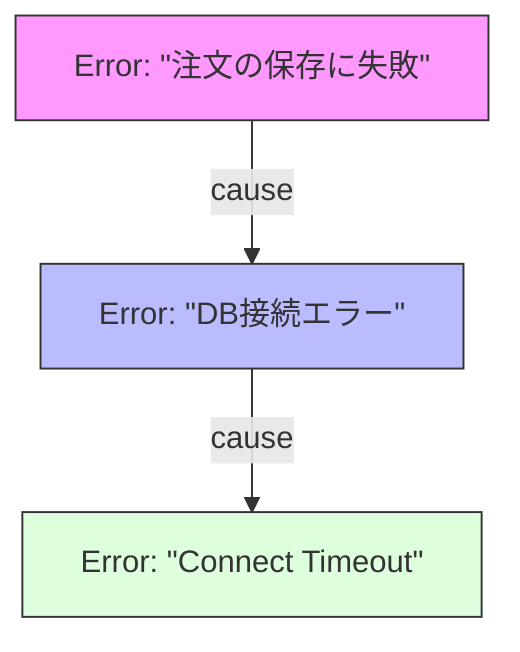

# 第14章：Errorを“包む”技術（原因を失わない）🎁🧵

この章は「**エラーの“原因”を落とさずに、文脈だけ足す**」がテーマだよ〜😊
やりたいのはこれ👇

* **元のエラー（原因）**はそのまま残す🧵
* その上に「何をしてて失敗したの？」という**説明（文脈）**を足す🎁
* あとからログやスタックトレースで、**根っこまで辿れる**ようにする🔎✨

---

## 14.1 なぜ「包む」が必要なの？🥺💭

![なぜ「包む」が必要なの？[(./picture/err_model_ts_study_014_nesting_dolls.png)

たとえば、DBやAPIが落ちたときに、画面側でこんな風にしがち👇

```ts
try {
  await loadProfile();
} catch (e) {
  throw new Error("プロフィール取得に失敗しました");
}
```

これ、ユーザー向けメッセージとしては良さそうなんだけど…

* **元の原因（タイムアウト？DNS？認証？）が消える**😇
* `stack` も “新しい Error を作った場所” の情報になりがちで、**根っこが遠くなる**🫠
* 結果、障害対応が「手がかり無しの鬼ごっこ」になる👹💨

そこで登場するのが **`cause`（原因チェーン）** だよ〜！🧵✨
ES2022で `new Error(message, { cause })` が正式に入って、今は主要環境で広く使えるよ😊 ([MDN Web Docs][1])

---

## 14.2 `cause` ってなに？🧵💡（超ざっくり）

`cause` は **「このエラーの元になったエラー」** を入れておく場所だよ✨
“包み直す”ときに、原因を紐づけておけるの！

```ts
try {
  await fetch("/api/profile");
} catch (err) {
  throw new Error("プロフィール取得に失敗", { cause: err });
}
```

* 外側のError：**状況説明**（プロフィール取得に失敗）
* `cause`：**本当の原因**（ネットワーク、タイムアウト等の元エラー）

MDNも「捕捉して、より具体的なメッセージで再スローするときに使う」って説明してるよ😊 ([MDN Web Docs][1])



---

## 14.3 まずは “包む” の基本形（最小でOK）🎁🧵

### ✅ ルール：文脈を足して、原因は cause に入れる

```ts
try {
  await saveOrder(order);
} catch (err) {
  throw new Error("注文の保存に失敗しました", { cause: err });
}
```

これだけで「何をしてたか」が分かるし、原因も辿れる✨
Node.js のドキュメントでも `cause` は「別メッセージで投げ直すけど元原因にアクセスできるようにする」用途って書いてあるよ📘 ([Node.js][2])

---

## 14.4 TypeScriptでハマりやすい所：`cause` が型エラーになる😵‍💫🧩

もし `cause` で型エラーが出たら、だいたいこれ👇

* `tsconfig` の `target` / `lib` が古くて、`ErrorOptions` に `cause` が入ってない
* 対策は **ES2022以上**にすること✨（どっちかでOK）

例：`target` を上げる

```json
{
  "compilerOptions": {
    "target": "ES2022"
  }
}
```

または `lib` に `ES2022` を入れる

```json
{
  "compilerOptions": {
    "lib": ["ES2022", "DOM"]
  }
}
```

このあたりは定番の注意点としてよくまとまってるよ😊 ([Stack Overflow][3])

（ちなみに2026年1月時点で、TypeScriptは 5.9 系が安定版ラインだよ📌 ([Microsoft for Developers][4])）

---

## 14.5 “包む” の上手いメッセージの作り方📝✨

### ✅ 良いラップメッセージの型

**「何をしようとして」＋「どう困るか」** が入ると強いよ💪

* ❌「失敗しました」だけ → 情報ゼロ🥲
* ✅「注文の保存に失敗（DBへの書き込み）」→ 行動が見える✨
* ✅「プロフィール取得に失敗（API呼び出し）」→ 入口が分かる✨

### ✅ “原因の説明”は cause 側に任せる

外側メッセージに原因を書きすぎるとゴチャるよ😵‍💫
原因は `cause` に “そのまま” 入れるのが基本🧵

---

## 14.6 カスタムErrorで “上品に包む” 🧰🎀

ここから一歩進めて、**「種類」と「文脈」を安定して持つError**にするよ✨
（前章のカスタムErrorの流れと相性バツグン🫶）

### 例：Infra（外部I/O）っぽい包み方🔌🌩️

```ts
type WrapOptions = {
  cause?: unknown;
  context?: Record<string, unknown>;
};

class InfraError extends Error {
  readonly code: string;
  readonly context?: Record<string, unknown>;

  constructor(message: string, code: string, options: WrapOptions = {}) {
    super(message, { cause: options.cause });
    this.name = "InfraError";
    this.code = code;
    this.context = options.context;
  }
}
```

使う側👇

```ts
try {
  const res = await fetch("/api/profile");
  if (!res.ok) throw new Error(`HTTP ${res.status}`);
  return await res.json();
} catch (err) {
  throw new InfraError(
    "プロフィール取得に失敗（API呼び出し）",
    "INFRA_PROFILE_FETCH_FAILED",
    { cause: err, context: { path: "/api/profile" } }
  );
}
```

* `message`：人間向けの状況説明📝
* `code`：機械的に識別できる（後で台帳に載せやすい）🏷️
* `context`：ログに残して嬉しい追加情報📎
* `cause`：根っこ（絶対に失わない）🧵

---

## 14.7 ログで「原因チェーン」をちゃんと見える化する🔎🧾

### ✅ ブラウザ：DevTools は cause チェーンを表示できることがあるよ👀✨

Chrome DevTools では、`cause` チェーンを辿って `Caused by:` 付きで見せてくれる説明があるよ📌 ([Chrome for Developers][5])
（ただし表示のされ方は環境差があるから、運用ログでは “自前で辿る” のが安定！）

### ✅ 安定運用：自分で cause を辿って文字列化しよ🧵

```ts
function isError(x: unknown): x is Error {
  return x instanceof Error;
}

export function formatErrorChain(err: unknown): string {
  const lines: string[] = [];
  const seen = new Set<unknown>();

  let current: unknown = err;
  let depth = 0;

  while (current && !seen.has(current) && depth < 10) {
    seen.add(current);

    if (isError(current)) {
      const header = `${current.name}: ${current.message}`;
      lines.push(depth === 0 ? header : `Caused by: ${header}`);

      if (typeof current.stack === "string") {
        // stack の先頭だけで十分なことが多い（長すぎ注意）
        const stackTop = current.stack.split("\n").slice(0, 6).join("\n");
        lines.push(stackTop);
      }

      current = (current as any).cause;
    } else {
      // Errorじゃないのが飛んできた場合（JSあるある😇）
      lines.push(`Caused by (non-Error): ${String(current)}`);
      break;
    }

    depth++;
  }

  return lines.join("\n");
}
```

使い方👇

```ts
try {
  await doSomething();
} catch (e) {
  console.error(formatErrorChain(e));
}
```

これで **どの環境でも** 原因チェーンが見えるよ〜！🥳🧵

---

## 14.8 ありがちな “ダメ包み” 集🙅‍♀️💥（事故るやつ）

### ❌ 1) メッセージだけコピーして原因消滅

```ts
throw new Error((err as Error).message);
```

→ 原因・種類・追加情報・スタックの文脈が消える😇

### ❌ 2) `JSON.stringify(err)` で無理やり詰める

```ts
throw new Error(`失敗: ${JSON.stringify(err)}`);
```

→ `Error` は stringify で情報落ちやすいし、読むのもつらい🫠

### ❌ 3) 独自プロパティに入れて満足

```ts
const e = new Error("失敗");
(e as any).original = err;
throw e;
```

→ ツールや標準の恩恵を受けにくい（`cause` の方が強い）🧵✨ ([MDN Web Docs][6])

---

## 14.9 ミニ演習📝💖：外部失敗を「わかる言葉」で包み直す（原因は保持）

### お題🎀

「ユーザー情報取得」が失敗したとき、

* 外側：状況説明のメッセージ
* `cause`：元のエラー
  を保ったまま投げ直してね✨

#### たたき台👇

```ts
async function fetchUser(userId: string) {
  // ここで失敗する想定
  const res = await fetch(`/api/users/${userId}`);
  if (!res.ok) throw new Error(`HTTP ${res.status}`);
  return res.json();
}

async function loadScreen(userId: string) {
  try {
    return await fetchUser(userId);
  } catch (err) {
    // TODO: ここで包む
    throw err;
  }
}
```

### 期待する形（例）🌟

* `"ユーザー情報の取得に失敗（API呼び出し）"` みたいに状況が分かる
* `cause` を必ず入れる🧵

---

## 14.10 AI活用🤖✨（Copilot / Codex に頼るポイント）

そのまま貼って使えるプロンプト例だよ💬💕

* 「`Error.cause` を使って、エラーを wrap する関数を TypeScript で作って。`unknown` を受け取って `Error` に正規寄せしつつ `cause` に入れて」
* 「`formatErrorChain` のテスト観点を追加して。`cause` が循環参照になるケースも入れて」
* 「ユーザー向けメッセージを “優しい日本語” に言い換え候補10個出して😊」

---

## まとめ🌸（この章でできるようになったこと）

* エラーを投げ直すときに **原因を `cause` で絶対に落とさない**🧵✨ ([MDN Web Docs][1])
* “文脈だけ足す” メッセージの作り方がわかった🎁
* ログで cause チェーンを **安定して見える化**できるようになった🔎🧾
* TS で `cause` が型エラーになるときの直し方もOK✌️ ([Stack Overflow][3])

---

次の第15章では、この「包めるようになったエラー」を **unknown → アプリ標準のErrorへ“正規化”**して、「どんな変なthrowが来ても同じ形にする🧼🧺」に進むよ〜！😊💖

[1]: https://developer.mozilla.org/en-US/docs/Web/JavaScript/Reference/Global_Objects/Error/cause?utm_source=chatgpt.com "Error: cause - JavaScript - MDN Web Docs"
[2]: https://nodejs.org/api/errors.html?utm_source=chatgpt.com "Errors | Node.js v25.3.0 Documentation"
[3]: https://stackoverflow.com/questions/73378375/error-cause-property-not-recognized-in-typescript?utm_source=chatgpt.com "Error cause property not recognized in TypeScript"
[4]: https://devblogs.microsoft.com/typescript/announcing-typescript-5-9/?utm_source=chatgpt.com "Announcing TypeScript 5.9"
[5]: https://developer.chrome.com/docs/devtools/console/reference?utm_source=chatgpt.com "Console features reference | Chrome DevTools"
[6]: https://developer.mozilla.org/en-US/docs/Web/JavaScript/Reference/Global_Objects/Error?utm_source=chatgpt.com "Error - JavaScript - MDN Web Docs - Mozilla"
