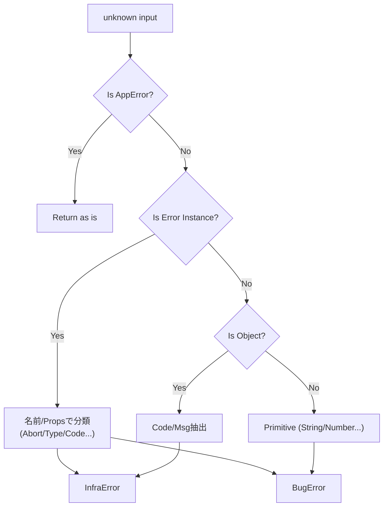

# 第15章：unknown → アプリ標準のErrorへ“正規化”🧼🧺

([Past chat][1])([Past chat][2])

この章は、**どんな変な throw が飛んできても**、最終的にアプリ内では **同じ形（AppError）** に揃えるための回だよ〜！😊
（これができると、UI表示もログもテストも「迷子」にならない💪）

ちなみに本日時点（2026-01-19）だと、TypeScript は **5.9.3 が Latest（GitHub Releases 表示）** になってるよ〜📌 ([GitHub][3])

---

## 1) 今日のゴール🎯✨


* `catch (e)` の `e`（＝**unknown**）を、必ず **AppError** に変換できるようにする🧠
* 変換のときに、できるだけ **情報（原因・文脈）を失わない** ようにする🎁
* 変換後は、アプリの中で

  * `DomainError` / `InfraError` / `BugError`
  * `severity`
  * `code`
  * `messageForUser`
  * （必要なら `cause`）
    が揃ってる状態にする✅

---

## 2) なんで “unknown を正規化” が必要なの？😵‍💫💥

### ✅ 理由その1：JS は「何でも throw できる」🎲


`throw "文字列"` とか `throw {…}` とか、普通に飛んでくる世界…！
だから TypeScript も「捕まえた値は信用しないでね」って方向に寄ってるよ🛡️
（`useUnknownInCatchVariables` を使うと `catch` 変数が `unknown` になるやつ） ([TypeScript][4])

### ✅ 理由その2：Promise の `.catch()` は別腹🍰

`try/catch` の `unknown` 対応をちゃんとやってても、`promise.catch(e => …)` は別で事故りがち！
TypeScript 側の都合で「rejection は型で縛れない」問題があるの🥲 ([typescript-eslint.io][5])
だからこそ「unknown を AppError に統一する関数」を 1 個持つのが強い💪✨

---

## 3) まずは “アプリ標準の型” を固定しよう🧱✨

（ここは前の章までの前提と同じ形でいくね😊）

```ts
export type Severity = "low" | "mid" | "high";

export type DomainError = {
  kind: "domain";
  severity: Severity;
  code: string;
  messageForUser: string;
};

export type InfraError = {
  kind: "infra";
  severity: Severity;
  code: string;
  messageForUser: string;
  retryable: boolean;
  cause?: unknown;
};

export type BugError = {
  kind: "bug";
  severity: "high";
  code: string;
  messageForUser: string;
  cause?: unknown;
};

export type AppError = DomainError | InfraError | BugError;
```

---

## 4) 正規化の “基本ルール” 🗺️🧼


![「正規化」ってなに？（洗濯機だよ！）[(./picture/err_model_ts_study_015_laundry_filter.png)

正規化は、**優先順位**が大事だよ〜！

1. **すでに AppError なら、そのまま返す**（情報を増やしてもOK）✅
2. `Error` インスタンスなら、**名前・プロパティ・状況**から分類する🧠
3. `string / number / boolean / null / undefined / symbol` などなら、基本 **BugError** に寄せる⚡

   * 「そんな throw され方、設計的に事故率高い」からね🙈
4. `object` なら「それっぽい情報（code/status/message）」を拾って Infra に落とす（できる範囲で）🔎
5. 最後は **UnknownBug** にまとめる（必ず AppError で返す）🧯

> 💡 ポイント
> **正規化は “完全な推理” じゃない**よ！
> “アプリが運用できる形に整える” のが目的✨



---

## 5) 実装してみよう：normalizeUnknown 🧺✨

### 5-1) 小道具（型ガード＆安全 stringify）🧰

```ts
const isRecord = (v: unknown): v is Record<string, unknown> =>
  typeof v === "object" && v !== null;

const hasString = (obj: Record<string, unknown>, key: string): obj is Record<string, string> =>
  typeof obj[key] === "string";

const safeToString = (v: unknown): string => {
  try {
    if (typeof v === "string") return v;
    return JSON.stringify(v);
  } catch {
    return String(v);
  }
};

const isAppError = (e: unknown): e is AppError => {
  if (!isRecord(e)) return false;
  const kind = e["kind"];
  if (kind !== "domain" && kind !== "infra" && kind !== "bug") return false;
  return typeof e["code"] === "string" && typeof e["messageForUser"] === "string";
};
```

---

### 5-2) いちばん大事：normalizeUnknown 本体🧼🧺


```ts
export type NormalizeContext = {
  op?: string;        // 例: "loadUser", "saveOrder"
  requestId?: string; // 例: ログ相関用
};

export function normalizeUnknown(err: unknown, ctx: NormalizeContext = {}): AppError {
  // 1) すでに AppError ならそのまま（必要ならここで op などを cause/ログ側に足してもOK）
  if (isAppError(err)) return err;

  // 2) Error インスタンス（JS標準の代表）
  if (err instanceof Error) {
    // Error.cause は “どんな型でも入る” ので、ここでも「unknown」として扱うよ🧠
    // （cause は 2021年9月以降、多くの環境で広く利用可能） :contentReference[oaicite:3]{index=3}
    const name = err.name;

    // 2-1) AbortError（キャンセル系）は “インフラ” で OK（必ずしも異常じゃないけど、扱いは統一）


    if (name === "AbortError") {
      return {
        kind: "infra",
        severity: "low",
        code: "INFRA_ABORTED",
        messageForUser: "操作がキャンセルされました🫶（もう一度試してもOKだよ）",
        retryable: true,
        cause: err,
      };
    }

    // 2-2) TypeError：fetch のネットワーク失敗とかでよく出る（環境差はあるので “推定”）
    if (name === "TypeError") {
      return {
        kind: "infra",
        severity: "mid",
        code: "INFRA_TYPE_ERROR",
        messageForUser: "通信や処理に失敗しました🌧️ もう一度試してね",
        retryable: true,
        cause: err,
      };
    }

    // 2-3) Node系/ライブラリ系の “code” を持つ Error（例: ECONNRESET など）
    // TS上は型がないので（anyキャストは局所でOK）
    const anyErr = err as any;
    if (typeof anyErr?.code === "string") {
      const code = String(anyErr.code);
      return {
        kind: "infra",
        severity: "mid",
        code: `INFRA_${code}`,
        messageForUser: "外部サービスとの接続で失敗しました🔌 もう一度試してね",
        retryable: true,
        cause: err,
      };
    }

    // 2-4) それ以外の Error は、とりあえず “不明なエラー”
    return {
      kind: "infra",
      severity: "mid",
      code: "INFRA_UNKNOWN_ERROR",
      messageForUser: "エラーが発生しました💦 少し待ってからもう一度試してね",
      retryable: true,
      cause: err,
    };
  }

  // 3) string / number / boolean / null / undefined / symbol など
  //   → こういう throw は基本「設計として危険」なので Bug 扱いに寄せる（安全側）
  if (
    err === null ||
    err === undefined ||
    typeof err === "string" ||
    typeof err === "number" ||
    typeof err === "boolean" ||
    typeof err === "symbol" ||
    typeof err === "bigint"
  ) {
    return {
      kind: "bug",
      severity: "high",
      code: "BUG_THROWN_NON_ERROR",
      messageForUser: "予期しない不具合が起きました🙏（時間をおいて再度お試しください）",
      cause: err,
    };
  }

  // 4) object（だけど Error じゃない）
  if (isRecord(err)) {
    // 4-1) “よくある形” を救出：{ message, code, status, retryable } みたいなやつ
    const code =
      hasString(err, "code") ? err["code"] :
      hasString(err, "errorCode") ? err["errorCode"] :
      undefined;

    const message =
      hasString(err, "message") ? err["message"] :
      hasString(err, "error") ? err["error"] :
      undefined;

    const retryable =
      typeof err["retryable"] === "boolean" ? err["retryable"] : true;

    // status があれば “インフラ寄り” と推定（HTTPなど）
    const hasStatus = typeof err["status"] === "number";

    if (code || message || hasStatus) {
      return {
        kind: "infra",
        severity: hasStatus ? "mid" : "low",
        code: code ? `INFRA_${code}` : "INFRA_THROWN_OBJECT",
        messageForUser: "外部処理で失敗しました💦 もう一度試してね",
        retryable,
        cause: err,
      };
    }

    // 4-2) 形が読めない object は Bug に寄せる（安全側）
    return {
      kind: "bug",
      severity: "high",
      code: "BUG_THROWN_OBJECT_UNKNOWN_SHAPE",
      messageForUser: "予期しない不具合が起きました🙏（時間をおいて再度お試しください）",
      cause: err,
    };
  }

  // 5) 万が一ここまで来たら最終保険🧯
  return {
    kind: "bug",
    severity: "high",
    code: "BUG_UNKNOWN_THROWABLE",
    messageForUser: "予期しない不具合が起きました🙏（時間をおいて再度お試しください）",
    cause: safeToString(err),
  };
}
```

---

## 6) 使い方（try/catch と Promise.catch で統一）🧩✨

### 6-1) try/catch で Result に落とす🎁

```ts
type Ok<T> = { ok: true; value: T };
type Err = { ok: false; error: AppError };
type Result<T> = Ok<T> | Err;

const Err = (error: AppError): Err => ({ ok: false, error });
const Ok = <T>(value: T): Ok<T> => ({ ok: true, value });

export async function loadUser(userId: string): Promise<Result<{ id: string }>> {
  try {
    const user = await fakeFetchUser(userId);
    return Ok(user);
  } catch (e) {
    return Err(normalizeUnknown(e, { op: "loadUser" }));
  }
}
```

### 6-2) Promise.catch の世界でも同じ関数を使う🌈

```ts
fakeFetchUser("1")
  .then((u) => console.log("ok", u))
  .catch((e) => {
    const appErr = normalizeUnknown(e, { op: "loadUser" });
    console.error(appErr);
  });
```

> 📝 補足
> `.catch()` 側は “unknown になってくれない” ことがあるので、**normalizeUnknown を噛ませる**のが超大事だよ〜！ ([typescript-eslint.io][5])

---

## 7) ミニ演習📝✨（変な throw を全部 AppError にしてね！）


次の “投げられ方” を想定して、`normalizeUnknown` がどう変換するか、紙に書いてみて〜😊🫶

* `throw "oops";`
* `throw 404;`
* `throw null;`
* `throw { message: "timeout", status: 504, retryable: true };`
* `throw { foo: "bar" };`
* `throw new Error("boom");`
* `throw Object.assign(new Error("conn"), { code: "ECONNRESET" });`
* `throw new DOMException("Aborted", "AbortError");`（環境によるけど雰囲気でOK）

できたら、**「どれが domain/infra/bug で、severity はなぜ？」**も一言で✨

---

## 8) AI活用🤖💖（この章での使いどころ）

そのままコピペで使えるよ〜！

* 「TypeScriptで `unknown` を `AppError` に正規化する時の **漏れやすい edge case** を10個出して」🤖🔎
* 「この `normalizeUnknown` のルールで、**危ない判定（誤分類）** が起きそうな例を挙げて」⚠️
* 「`INFRA_*` の code 命名を、エラーカタログ向けに **一貫した規則** にして提案して」🏷️✨
* 「ユーザー向け文言 `messageForUser` を **優しく・短く・同じトーン** に直して」🫶💬

---

## 9) まとめ✅🧼


* JS/TS は **何でも throw** されるので、`catch` の値は基本信用しない🛡️ ([TypeScript][4])
* だから **unknown → AppError** の “洗濯機” を 1 個作る🧺✨
* `Error.cause` を使うと、原因を失わずに “包める” よ（cause は広く利用可能）🎁 ([MDNウェブドキュメント][6])
* `Promise.catch` 側でも同じ正規化関数を使って、事故率を下げる💪 ([typescript-eslint.io][5])

---

次の章（第16章）に行くと、この `code` を **エラーカタログ（台帳）** に落として「運用できる形」にしていくよ〜📚🏷️😊

[1]: https://chatgpt.com/c/696e1a0a-1ab8-8321-b12d-40cc76dedcee "分類の軸作成法■■"
[2]: https://chatgpt.com/c/696c6ca4-9a08-8321-97b9-e5b080c756f2 "エラー設計と例外処理■■■"
[3]: https://github.com/microsoft/typescript/releases "Releases · microsoft/TypeScript · GitHub"
[4]: https://www.typescriptlang.org/tsconfig/useUnknownInCatchVariables.html "TypeScript: TSConfig Option: useUnknownInCatchVariables"
[5]: https://typescript-eslint.io/blog/avoiding-anys?utm_source=chatgpt.com "Avoiding `any`s with Linting and TypeScript"
[6]: https://developer.mozilla.org/en-US/docs/Web/JavaScript/Reference/Global_Objects/Error/cause "Error: cause - JavaScript | MDN"
