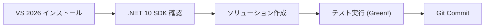
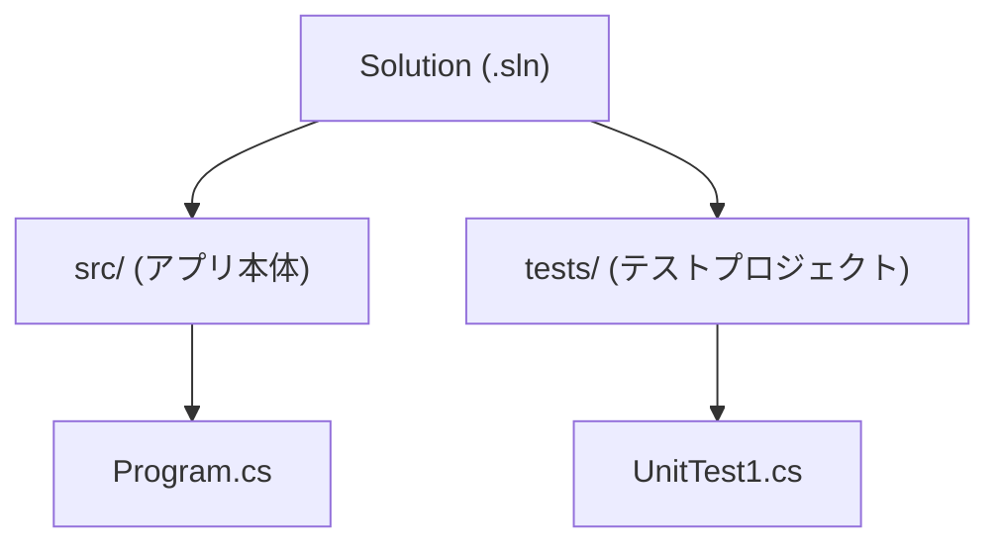

# 第04章：環境セットアップ（VS 2026）🪟🛠️

この章では「イベントソーシングの学習を進めるための土台」を、最短で“ちゃんと動く状態”まで作ります🚀✨
ゴールはこれ👇

* ✅ C# プロジェクトを作れる
* ✅ テストが1本動く（これ超大事🧪💕）
* ✅ Gitでコミットできる
* ✅ AI支援（Copilotなど）を呼び出せる🤖✨

---

## 4.1 まず完成形イメージ🧩✨


この教材では、最初はこんな「小さくて分かりやすい」構成で進めます😊

* 📁 `src/` …… アプリ本体（まずは Console でOK）
* 📁 `tests/` …… テスト（xUnitでOK）
* 📄 `YourSolution.sln` …… まとめ役（ソリューション）

イベントソーシングは後半でプロジェクトが増えがちなので、最初に“散らからない形”を作るのが勝ちです🏆✨





---

## 4.2 Visual Studio 2026 をインストール🧰🪄

1. **Visual Studio 2026** をダウンロードしてインストールします📥
   （公式ダウンロードページから入れるのが一番安全だよ） ([Visual Studio][1])

2. インストール中に **ワークロード（Workloads）** を選びます✅
   あとで追加もできるので、最初は“必要最低限＋ちょい安心”でOK😊

---

## 4.3 ワークロード選び（迷わないセット）🎯🧁


最低限これでOK👇

* ✅ **.NET desktop development**（C# のコンソール/テストを確実に作れる） ([Microsoft Learn][2])
* ✅ **ASP.NET and web development**（後でAPI化したくなった時にラク） ([Microsoft Learn][3])

💡この2つ入れておくと「Console→Web API」に寄り道したくなっても詰まりにくいです😊✨

---

## 4.4 「.NET 10」が入ってるか確認する🧪🔍


イベントソーシング教材は **.NET 10** 前提で進めます。
.NET 10 の配布ページでは、Visual Studio 2026 がサポート対象として案内されています ([Microsoft][4])

### 確認方法（コマンドで一発）💻✨

Windows のターミナル（PowerShell）で👇

```powershell
dotnet --version
dotnet --info
```

* `10.0.xxx` みたいに出ていればOKです😊
  （例：SDK 10.0.102 などが配布されています） ([Microsoft][4])

---

## 4.5 インストール後に「足りない！」となったら🧯✨

Visual Studio はあとから機能追加できます🧩
困ったらここ👇

* Visual Studio を開いて **Tools > Get Tools and Features**
* もしくは Windows で **Visual Studio Installer** を開く

追加・削除の流れは公式手順があります ([Microsoft Learn][5])

---

## 4.6 最初のソリューションを作る（おすすめ手順）📁✨


### A) Visual Studio の画面で作る（いちばん分かりやすい）🪟💕

1. **Create a new project**
2. **Console App**（.NET）で作成
3. 次に **xUnit Test Project** を追加
4. テストが通るか実行（Test Explorer）✅

---

### B) コマンドで作る（速い＆再現性◎）⚡🧁

フォルダを作って👇（例：`EventSourcingStudy`）

```powershell
mkdir EventSourcingStudy
cd EventSourcingStudy

dotnet new sln -n EventSourcingStudy

mkdir src
mkdir tests

dotnet new console -n EventSourcingStudy.App -o src/EventSourcingStudy.App
dotnet new xunit  -n EventSourcingStudy.Tests -o tests/EventSourcingStudy.Tests

dotnet sln add src/EventSourcingStudy.App/EventSourcingStudy.App.csproj
dotnet sln add tests/EventSourcingStudy.Tests/EventSourcingStudy.Tests.csproj

dotnet test
```

`dotnet test` が **Green ✅** になったら勝ちです🎉🧪

---

## 4.7 “Hello + テスト1本”を入れて動作確認💖🧪


ここでは「教材のこれから全部がスムーズになる」最小チェックをします😊✨

### Console 側（例：`Program.cs`）📝

```csharp
using System;

Console.WriteLine("Hello Event Sourcing! 🚀");
```

### テスト側（例：`UnitTest1.cs`）🧪

```csharp
using Xunit;

public class UnitTest1
{
    [Fact]
    public void AlwaysTrue()
    {
        Assert.True(true);
    }
}
```

* ✅ これで `dotnet test` が通る
* ✅ “環境OK”の証明になる
* ✅ 以後の章の不具合切り分けが超ラクになる✨

---

## 4.8 Git をつなぐ（最低限）🐙✨


「イベントソーシング」は試行錯誤が多いので、**小さくコミット**が正義です😊💕

```powershell
git init
git add .
git commit -m "ch04: initial solution with tests"
```

---

## 4.9 AI支援（Copilotなど）を“使える状態”にする🤖💬✨

Visual Studio では、ワークロードを選んでインストールしていると **GitHub Copilot が既定で入る**案内があります（外していたら後から追加も可能） ([Visual Studio][6])

やることはシンプル👇

* 🔑 GitHub でサインイン
* 💬 Copilot Chat を開けるか確認
* 🧪 「このテスト、読みやすくして」みたいに軽く投げて反応を見る

（この“動作確認”だけやっておくと、次章のAI活用がスムーズです😊✨）

---

## 4.10 VS Code でもやりたい人向け（付録）🧷🧁

VS Code は Insiders 版のリリースノートが **2026-01-26 更新**になっていて、継続的にアップデートされています ([Visual Studio Code][7])

VS Code でやる場合の最低ラインは👇

* ✅ .NET 10 SDK（`dotnet --version` で確認） ([Microsoft][4])
* ✅ C# 拡張（C# Dev Kit など）
* ✅ `dotnet test` が通ること

※教材の演習コードは「VS / VS Code どっちでも動く」形で書いていきます😊✨

---

## 4.11 ミニ演習（10〜20分）⏱️🌸

やることはこれだけ👇（全部できたら100点💯）

* ✅ `dotnet --version` が `10.0.xxx`
* ✅ `dotnet test` が成功🎉
* ✅ `git commit` が1回できた🐙
* ✅ AIチャットが開けた🤖💬

---

## 4.12 よくあるつまずき（サクッと回避）🧯💡

* 😵 `dotnet` が見つからない
  → .NET 10 SDK を入れる（または VS Installer で Individual components を見直す） ([Microsoft Learn][8])

* 😵 テンプレが出てこない
  → ワークロードが足りないことが多い（.NET desktop / ASP.NET） ([Microsoft Learn][2])

* 😵 VS は入れたのに機能が足りない
  → Installer で Modify（あとから追加できる） ([Microsoft Learn][5])

[1]: https://visualstudio.microsoft.com/downloads/?utm_source=chatgpt.com "Visual Studio & VS Code Downloads for Windows, Mac, Linux"
[2]: https://learn.microsoft.com/en-us/visualstudio/install/workload-component-id-vs-community?view=visualstudio&utm_source=chatgpt.com "Visual Studio Community workload and component IDs"
[3]: https://learn.microsoft.com/en-us/visualstudio/install/workload-component-id-vs-professional?view=visualstudio&utm_source=chatgpt.com "Visual Studio Professional workload and component IDs"
[4]: https://dotnet.microsoft.com/en-US/download/dotnet/10.0?utm_source=chatgpt.com "Download .NET 10.0 (Linux, macOS, and Windows) | .NET"
[5]: https://learn.microsoft.com/en-us/visualstudio/install/modify-visual-studio?view=visualstudio&utm_source=chatgpt.com "Modify Visual Studio Workloads and Components"
[6]: https://visualstudio.microsoft.com/github-copilot/?utm_source=chatgpt.com "Visual Studio With GitHub Copilot - AI Pair Programming"
[7]: https://code.visualstudio.com/updates/v1_109?utm_source=chatgpt.com "January 2026 Insiders (version 1.109)"
[8]: https://learn.microsoft.com/en-us/dotnet/core/install/windows?utm_source=chatgpt.com "Install .NET on Windows"
