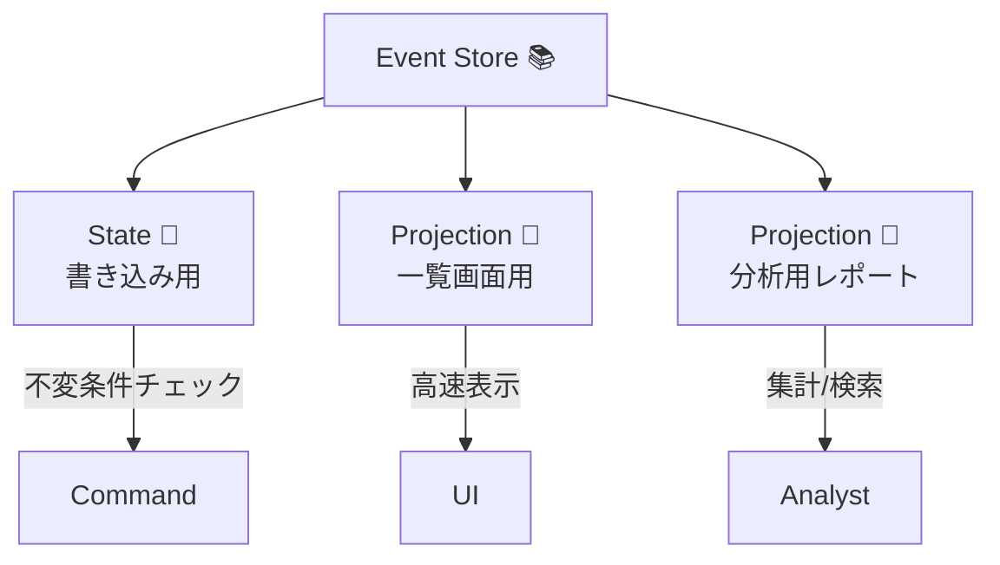
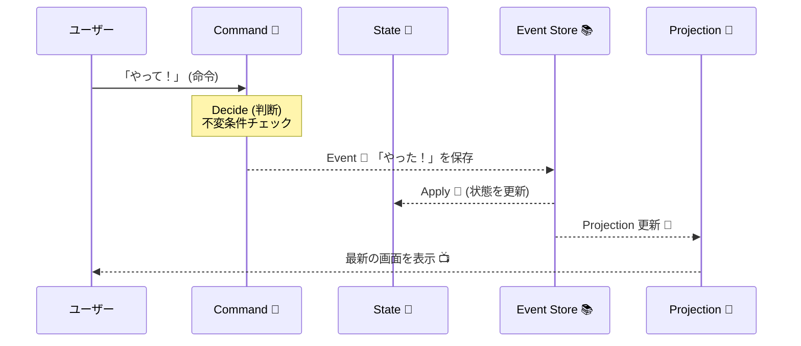

# 第07章：用語セット（Command / Event / State / Projection）📮📜🧠🔎

## 今日のゴール🎯✨

この章を読み終わったら、次の4語を**混ぜずに**話せる＆書けるようになります😊💪

* **Command**：やって！のお願い（命令）📮
* **Event**：やった！の記録（出来事）📜
* **State**：いまどうなってる？の状態🧠
* **Projection**：見やすい形に整えた表示用データ🔎

---

## まずは“1行ずつ”で覚えよう📌😊


### Command（コマンド）📮

* **ひとことで**：システムに「こうして！」と頼む“お願い”🙋‍♀️
* **形**：命令形（Add / Remove / Change など）
* **ポイント**：まだ成功してるか分からない（失敗するかも）😵‍💫

**例（買い物カート）🛒**

* `AddItemToCart`（カートに商品を追加して！）
* `RemoveItemFromCart`（商品を削除して！）

---

### Event（イベント）📜

* **ひとことで**：起きた事実を“過去形で”記録したもの📖
* **形**：過去形（Added / Removed / Changed など）
* **ポイント**：**「起きた」こと**なので、基本は後から書き換えない✋
* **イベントソーシングのコア**：状態の変化をイベントとして残し、イベント列から状態を再現できる考え方🌱
  （イベントが“真実の履歴”になるイメージ） ([martinfowler.com][1])

**例（買い物カート）🛒**

* `ItemAddedToCart`（商品が追加された）
* `ItemRemovedFromCart`（商品が削除された）

---

### State（状態）🧠

* **ひとことで**：「今この瞬間のカートはこう！」という“結果”📸
* **形**：合計金額、商品一覧、数量など
* **ポイント**：イベント列を順に適用（Apply）して作れる🔁

**例（買い物カート）🛒**

* Items：[(りんご, 2), (みかん, 1)]
* Total：580円

---

### Projection（プロジェクション）🔎

* **ひとことで**：画面・検索・一覧のために、**読みやすい形へ作り直した**データ📋✨
* **ポイント**：書き込みモデル（厳密）と、読みモデル（見やすい）を分ける発想と相性が良いよ😊
  （読みと書きを分けて最適化する考え方はCQRSでもよく語られるよ） ([Microsoft Learn][2])
* **実装イメージ**：イベントを受け取って“表示用の表”を更新する💡
  （EventStoreDB系の世界だと“Projections”という名前で仕組みが用意されていたりする） ([Kurrent Docs][3])




**例（買い物カート）🛒**

* 画面用：`CartSummary`（商品数、合計、最後に更新した時間…など）
* 一覧用：`CartListRow`（カートID、合計、アイテム数）

---

## 4語の関係を“1枚”で理解🧠🖼️




```text
（ユーザー）        （システム）
   │                  │
   │  Command 📮       │  「やって！」
   ├──────────────▶  Decide（判断）🧠
   │                  │  不変条件チェック✅
   │                  │
   │                  │  Event 📜  「やった！」
   │                  ├───────────▶ Event Store（履歴）📚
   │                  │
   │                  │  State 🧠（いまの状態）
   │                  └── Apply 🔁（イベントを適用）
   │
   │  Projection 🔎（表示用）
   └──────────────▶  画面/検索/一覧に使う📋✨
```

覚え方の合言葉💬✨

* **Command = お願い**📮
* **Event = 事実**📜
* **State = 現在地**🧠
* **Projection = 見せ方**🔎

---

## “混ぜると事故る”あるある集🚑😵‍💫

### 事故①：イベントを命令形で作っちゃう📜❌


* ❌ `AddItemToCart`（命令）をイベントとして保存
* ✅ `ItemAddedToCart`（事実）をイベントとして保存
  👉 イベントは「起きたこと」なので過去形が超大事⏳✨

---

### 事故②：コマンドに“結果”を書いちゃう📮❌

* ❌ `AddItemSucceeded`（もう成功してる前提になってる）
* ✅ `AddItemToCart`（お願い） → 成功したら `ItemAddedToCart`（事実）
  👉 成功したかどうかは**判断のあと**に決まるよ🧠✅

---

### 事故③：Projectionを“真実”として編集しはじめる🔎❌

* ❌ 画面用テーブルを直接更新して「これが正！」にする
* ✅ **イベント（履歴）**が正で、Projectionは“派生物”🌿
  👉 Projectionは壊れても作り直せる思想が強いよ🔁🧹

---

### 事故④：Stateを保存して「イベントソーシングです！」って言っちゃう🧠❌


* 状態保存は全然悪くないけど、**イベントソーシング**は「状態変化をイベントで残す」が核🌱 ([martinfowler.com][1])
  👉 “履歴”が残る設計が欲しい時に効いてくる💪📚

---

### 事故⑤：イベントにUI都合の項目を入れすぎる📜🍱❌

* ❌ `ButtonColor = "Red"` みたいな“画面都合”が混ざる
* ✅ 「事実」として意味がある情報だけ（誰が/何を/いくつ/いつ など）🧾✅
  👉 UIはProjection側で好きに整えよう🔎✨

---

## ミニ演習：要件を4分類してみよう🗂️😊


### お題：カートの要件（例）🛒

次の文章を、**Command / Event / State / Projection** に分類してね✍️✨

1. 「商品をカートに追加したい」
2. 「商品が追加された履歴を残したい」
3. 「今の合計金額を表示したい」
4. 「カート一覧画面で “アイテム数” をすぐ見たい」
5. 「商品を削除したい」
6. 「今カートに入ってる商品一覧がほしい」
7. 「“いつ誰が追加したか” が追えるようにしたい」
8. 「検索で“合計金額が1000円以上のカート”を出したい」

### ヒント💡

* 「〜したい」→ **Command候補**📮
* 「〜された」→ **Event候補**📜
* 「今どうなってる」→ **State候補**🧠
* 「画面で早く見たい / 検索したい」→ **Projection候補**🔎

---

## ちいさなC#例：型を分けるだけで事故が減る🧩😊


> ここでは“用語を混ぜない”ために、**名前と型の置き場所**を分ける練習をするよ✍️✨

```csharp
// Command 📮（お願い）: 命令形
public sealed record AddItemToCart(Guid CartId, string Sku, int Quantity);

// Event 📜（事実）: 過去形
public sealed record ItemAddedToCart(Guid CartId, string Sku, int Quantity, DateTimeOffset OccurredAt);

// State 🧠（現在の状態）: Event列をApplyして作る
public sealed class CartState
{
    private readonly Dictionary<string, int> _items = new();
    public IReadOnlyDictionary<string, int> Items => _items;

    public void Apply(ItemAddedToCart e)
    {
        _items.TryGetValue(e.Sku, out var current);
        _items[e.Sku] = current + e.Quantity;
    }
}

// Projection 🔎（表示用）: 画面のための形
public sealed class CartSummaryProjection
{
    public Guid CartId { get; private set; }
    public int TotalItems { get; private set; }
    public DateTimeOffset LastUpdatedAt { get; private set; }

    public void When(ItemAddedToCart e)
    {
        CartId = e.CartId;
        TotalItems += e.Quantity;
        LastUpdatedAt = e.OccurredAt;
    }
}
```

### このコードで大事なこと🌟

* **Command**は“お願い”だから、成功・失敗どっちもありえる📮😵‍💫
* **Event**は“起きた事実”だから、過去形で確定📜✅
* **State**はイベントを適用して作る🧠🔁
* **Projection**は表示最適（あとで壊して作り直してもOK）🔎🧹

---

## チェッククイズ（サクッと）🧠✅


1. 「RemoveItemFromCart」はどれ？（Command / Event）
2. 「ItemRemovedFromCart」はどれ？（Command / Event）
3. 「カート合計金額」はどれ？（State / Projection）
4. 「一覧画面の行データ（CartId, Total, Count）」はどれ？（State / Projection）
5. イベント名が過去形なのはなぜ？（一言で）
6. Projectionを直接更新して“真実”にしてはいけない理由は？（一言で）

答え合わせの目安📌

* 1. Command 📮 / 2) Event 📜 / 3) StateかProjection（用途で分かれる！）/ 4) Projection 🔎
* 5. “起きた事実”だから / 6) 真実はイベントで、Projectionは派生物だから🌿

---

## AI活用：4分類を一瞬で“仮”に作るプロンプト例🤖✨

### ① 要件を4分類して、理由も書かせる🗂️💬

```text
次の要件リストを Command / Event / State / Projection に分類して。
各項目について「なぜその分類か」を1行で説明して。
要件：
- （ここに箇条書きで貼る）
```

### ② コマンド→イベント候補を出させる📮➡️📜

```text
次のCommand案それぞれについて、
成功した場合に発生しうる Event 名（過去形）を3案ずつ出して。
Command:
- AddItemToCart
- RemoveItemFromCart
出力は「Command → Event候補（3つ）」の形で。
```

### ③ “混ぜ事故”を検出するレビュー🤖👀

```text
この設計のCommand/Event/State/Projectionの分け方で、
混ざっている箇所や危ない命名があれば指摘して、修正案も出して。
（コード or 箇条書きを貼る）
```

---

## コラム：2026年の.NETの動き（超短く）🪟⚡

* .NET 10 は 2025年11月に公開され、LTS（長期サポート）として案内されているよ📌 ([Microsoft for Developers][4])
* 2026年1月時点でも更新が出ている（例：10.0.2 のリリース日表示）🧩 ([Microsoft][5])

---

## まとめ：この章で覚えた4つの“置き場所”📦😊

* Command📮：お願い（命令形）
* Event📜：事実（過去形）＋履歴が大事 ([martinfowler.com][1])
* State🧠：イベントをApplyしてできる現在地
* Projection🔎：画面/検索のための読みやすい形（読みと書きを分ける発想と相性◎） ([Microsoft Learn][2])

[1]: https://martinfowler.com/eaaDev/EventSourcing.html?utm_source=chatgpt.com "Event Sourcing"
[2]: https://learn.microsoft.com/en-us/azure/architecture/patterns/cqrs?utm_source=chatgpt.com "CQRS Pattern - Azure Architecture Center"
[3]: https://docs.kurrent.io/server/v22.10/projections?utm_source=chatgpt.com "Projections | Kurrent Docs"
[4]: https://devblogs.microsoft.com/dotnet/announcing-dotnet-10/?utm_source=chatgpt.com "Announcing .NET 10"
[5]: https://dotnet.microsoft.com/en-US/download/dotnet/10.0?utm_source=chatgpt.com "Download .NET 10.0 (Linux, macOS, and Windows) | .NET"
