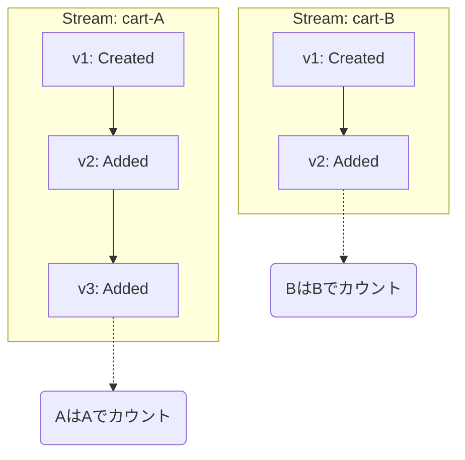
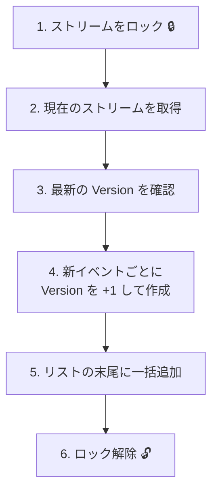

# 第14章：最小EventStore②：ストリームIDと順番（version）📼🔢

## この章でできるようになること🎯✨

* 「1つの集約（Aggregate）＝1つのストリーム」という感覚がわかる🧺➡️📼
* ストリームIDを“事故らない形”で決められる🏷️✅
* イベントに **version（通し番号）** をつけて、順番を守って保存できる🔢🧷
* 「2つの集約を別ストリームで積む」を動かして確認できる🧺🧺✨

---

## まず超ざっくり理解しよ😊🧠

イベントソーシングのEventStoreは、イメージとしてこう👇

* **ストリーム（Stream）**：ある集約の出来事ログ（イベント列）📼
* **ストリームID（streamId）**：そのログの名前（どの集約のログ？）🏷️
* **version**：そのストリーム内での「何番目のイベント？」🔢

ポイントはこれだけ💡
✅ **順番が崩れると復元（Rehydrate）で“違う状態”になる** → だから version が命💥

---

## “最新”の前提メモ（2026-02-01時点）🗓️✨

* .NET 10 は **2025-11-11 にリリースされた LTS** で、2026-01-13 時点の最新パッチは **10.0.2** として掲載されてるよ🧊✅ ([Microsoft][1])
* C# 14 は **.NET 10 でサポート**される最新の C# リリースとして案内されてるよ🧁✨ ([Microsoft Learn][2])
* .NET 10 はリリース告知で、Visual Studio 2026 などの更新と一緒に提供されてるよ📦✨ ([Microsoft for Developers][3])

---

# 1. ストリームIDの決め方🏷️✨

## 1-1. 原則：集約IDから“一意に”作る✅

ストリームIDは、だいたいこれでOK👇

* 例）カート集約（Cart）なら

  * streamId = `"cart-" + cartId`
* 例）家計簿（Account）なら

  * streamId = `"account-" + accountId`

**大事な条件**は3つ💡

1. **一意（ユニーク）**：別の集約と被らない
2. **安定**：同じ集約ならずっと同じID
3. **意味がわかる**：デバッグ時に助かる（プレフィックス最高）🧯✨

## 1-2. ありがちな事故🙅‍♀️💥

* 「毎回Guid.NewGuid()でストリームID作っちゃう」
  → 同じ集約なのにログが分裂😵‍💫
* 「プレフィックス無しで数字だけ」
  → 集約タイプが増えた瞬間に衝突しやすい⚔️

---

# 2. version（通し番号）の決め方🔢🧷

## 2-1. versionは“ストリーム内の番号”📼🔢


versionは **ストリームごと** に数えるよ✨



* cart-A の 1,2,3…
* cart-B の 1,2,3…

つまり、**別ストリーム同士は比較しない**（ここ大事）🧠

## 2-2. どっちがいい？ 0始まり or 1始まり🤔

どっちでもOKだけど、教材では **1始まり** にするね😊

* 1個目のイベントが version=1
* 2個目が version=2

理由：人間が見て直感的🧁✨
（実務では 0 始まりも普通にあるよ）

---

# 3. 最小EventStoreを“複数ストリーム対応”に進化させよう🧪🚀

ここから実装だよ〜💻✨
前章（読み書きだけ）を、こう変える👇

* “全イベント1本のリスト” → “streamIdごとの辞書” にする📦➡️🗂️
* Append時に、versionを自動で振る🔢

---

# 4. 実装：InMemoryEventStore（streamId と version）🧱✨

## 4-1. ドメインイベントの最小インターフェース📮

```csharp
namespace EventSourcingMini;

public interface IDomainEvent;
```

## 4-2. 保存される形（StoredEvent）📦

今回は「まず順番が命！」なので、イベント本体をそのまま持たせる最小にするよ🍱
（永続化やJSONは後半でやるよ🗄️✨）

```csharp
namespace EventSourcingMini;

public sealed record StoredEvent(
    string StreamId,
    long Version,
    IDomainEvent DomainEvent,
    DateTimeOffset RecordedAtUtc
);
```

## 4-3. EventStore本体（複数ストリーム＋version採番）📼🔢

```csharp
using System.Collections.Concurrent;

namespace EventSourcingMini;

public sealed class InMemoryEventStore
{
    private readonly ConcurrentDictionary<string, List<StoredEvent>> _streams = new();

    // いまの章は「順番」の話に集中したいので、排他は最低限だけ🙂
    private readonly object _gate = new();

    public IReadOnlyList<StoredEvent> ReadStream(string streamId)
    {
        if (_streams.TryGetValue(streamId, out var list))
        {
            // 念のため version 順にして返す（Appendが正しければ常に昇順）
            return list.OrderBy(e => e.Version).ToList();
        }

        return Array.Empty<StoredEvent>();
    }

    public long GetCurrentVersion(string streamId)
    {
        var events = ReadStream(streamId);
        return events.Count == 0 ? 0 : events[^1].Version;
    }

    public IReadOnlyList<StoredEvent> Append(string streamId, IReadOnlyList<IDomainEvent> newEvents)
    {
        if (string.IsNullOrWhiteSpace(streamId))
            throw new ArgumentException("streamId is required.", nameof(streamId));

        if (newEvents is null || newEvents.Count == 0)
            return Array.Empty<StoredEvent>();

        lock (_gate)
        {
            var list = _streams.GetOrAdd(streamId, _ => new List<StoredEvent>());

            long lastVersion = list.Count == 0 ? 0 : list[^1].Version;

            var appended = new List<StoredEvent>(newEvents.Count);
            foreach (var ev in newEvents)
            {
                lastVersion++;

                appended.Add(new StoredEvent(
                    StreamId: streamId,
                    Version: lastVersion,
                    DomainEvent: ev,
                    RecordedAtUtc: DateTimeOffset.UtcNow
                ));
            }

            list.AddRange(appended);
            return appended;
        }
    }
}
```




---

# 5. ミニ題材：カートで2ストリーム作ってみよう🧺🧺✨

## 5-1. イベントを2つだけ定義🧁

```csharp
namespace EventSourcingMini;

public sealed record CartCreated(Guid CartId) : IDomainEvent;

public sealed record ItemAdded(Guid CartId, Guid ItemId, int Quantity) : IDomainEvent;
```

## 5-2. streamIdの作り方（事故防止）🏷️✅

```csharp
namespace EventSourcingMini;

public static class StreamId
{
    public static string Cart(Guid cartId) => $"cart-{cartId:N}";
}
```

---

# 6. 演習①：2つのカートに別々に積む🧪🎉

## 6-1. 動作確認用コード（コンソールでもOK）🖥️

```csharp
using EventSourcingMini;

var store = new InMemoryEventStore();

var cartA = Guid.NewGuid();
var cartB = Guid.NewGuid();

store.Append(StreamId.Cart(cartA), new IDomainEvent[]
{
    new CartCreated(cartA),
    new ItemAdded(cartA, Guid.NewGuid(), 1),
    new ItemAdded(cartA, Guid.NewGuid(), 2),
});

store.Append(StreamId.Cart(cartB), new IDomainEvent[]
{
    new CartCreated(cartB),
    new ItemAdded(cartB, Guid.NewGuid(), 1),
});

var aEvents = store.ReadStream(StreamId.Cart(cartA));
var bEvents = store.ReadStream(StreamId.Cart(cartB));

Console.WriteLine("=== cartA ===");
foreach (var e in aEvents)
    Console.WriteLine($"v{e.Version} {e.DomainEvent.GetType().Name}");

Console.WriteLine("=== cartB ===");
foreach (var e in bEvents)
    Console.WriteLine($"v{e.Version} {e.DomainEvent.GetType().Name}");
```

## 期待する結果イメージ👀✨

* cartA は v1, v2, v3 …
* cartB は v1, v2 …
* それぞれ混ざらない✅

---

# 7. 演習②：テストで“順番が守られてる”を固定しよう🧪🧷

xUnit は v3 が .NET 8 以降をサポートしてるので、.NET 10でも使えるよ🧪✨ ([xUnit.net][4])

## 7-1. テスト：versionが連番になる✅

```csharp
using EventSourcingMini;
using Xunit;

public class InMemoryEventStoreTests
{
    [Fact]
    public void Append_assigns_sequential_versions_per_stream()
    {
        var store = new InMemoryEventStore();
        var cartId = Guid.NewGuid();
        var streamId = StreamId.Cart(cartId);

        store.Append(streamId, new IDomainEvent[]
        {
            new CartCreated(cartId),
            new ItemAdded(cartId, Guid.NewGuid(), 1),
            new ItemAdded(cartId, Guid.NewGuid(), 1),
        });

        var events = store.ReadStream(streamId);

        Assert.Equal(3, events.Count);
        Assert.Equal(1, events[0].Version);
        Assert.Equal(2, events[1].Version);
        Assert.Equal(3, events[2].Version);
    }
}
```

## 7-2. テスト：別ストリームは別カウント✅

```csharp
using EventSourcingMini;
using Xunit;

public class InMemoryEventStoreStreamTests
{
    [Fact]
    public void Different_streams_have_independent_versions()
    {
        var store = new InMemoryEventStore();

        var a = Guid.NewGuid();
        var b = Guid.NewGuid();

        store.Append(StreamId.Cart(a), new IDomainEvent[]
        {
            new CartCreated(a),
            new ItemAdded(a, Guid.NewGuid(), 1),
        });

        store.Append(StreamId.Cart(b), new IDomainEvent[]
        {
            new CartCreated(b),
        });

        var aEvents = store.ReadStream(StreamId.Cart(a));
        var bEvents = store.ReadStream(StreamId.Cart(b));

        Assert.Equal(new long[] { 1, 2 }, aEvents.Select(e => e.Version));
        Assert.Equal(new long[] { 1 }, bEvents.Select(e => e.Version));
    }
}
```

---

# 8. よくある“つまずき”チェック👀💥

## 8-1. 「同じ集約なのに別ストリームに書いちゃう」😵‍💫

原因：streamId生成が安定してない
対策：**集約ID → streamId変換関数を1個に固定**（さっきの StreamId クラスみたいに）🏷️✅

## 8-2. 「versionが飛ぶ／重複する」😇💥

原因：Append時の採番が壊れてる or 同時更新
対策：

* まずは **採番が必ず lastVersion+1 になる**かテストで固定🧪
* 同時更新の守り（expectedVersion）は、後の章で“ちゃんと”やるよ🔒✨

## 8-3. 「別ストリームも1本に混ぜて保存してる」🙅‍♀️

それ、ほぼ確実に後で詰むやつ…！
復元時に「どの集約の履歴？」が分からなくなる🧨

---

# 9. AI活用（Copilot / Codex）プロンプト例🤖✨

## 9-1. テスト追加をお願いする🧪

* 「InMemoryEventStore の Append が version を連番で振ることを保証する xUnit テストを3本作って。境界ケース（空配列、別ストリーム、複数イベント一括）を含めてね」🧁

## 9-2. レビュー観点を出してもらう👀

* 「このEventStore実装の設計上の落とし穴を、初心者向けに箇条書きで教えて。特に streamId と version の観点で！」📌✨

## 9-3. バグ注入ゲーム（理解が爆速になる）🎮💡

* 「わざと version が重複するバグを1つ作って、どういうテストで検出できるかセットで提案して」😈🧪

---

# 10. まとめ（この章の芯）🌸✨

* **ストリームID**は「集約ごとの履歴ログの名前」🏷️
* **version**は「そのログ内の順番」🔢
* **1集約＝1ストリーム**に分けて、**ストリーム内だけは絶対に順番を守る**📼✅

次章は、このイベント列を使って **復元（Rehydrate）** に入るよ〜🔁🧠✨

[1]: https://dotnet.microsoft.com/ja-jp/platform/support/policy?utm_source=chatgpt.com "公式の .NET サポート ポリシー | .NET"
[2]: https://learn.microsoft.com/ja-jp/dotnet/csharp/whats-new/csharp-14?utm_source=chatgpt.com "C# 14 の新機能"
[3]: https://devblogs.microsoft.com/dotnet/announcing-dotnet-10/?utm_source=chatgpt.com "Announcing .NET 10"
[4]: https://xunit.net/?utm_source=chatgpt.com "xUnit.net: Home"
