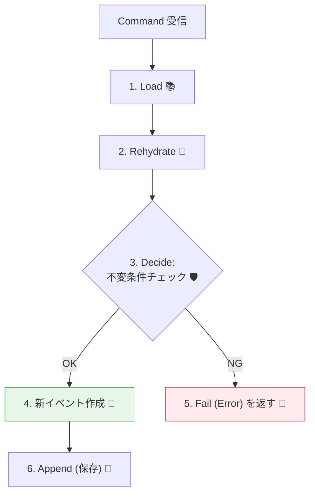
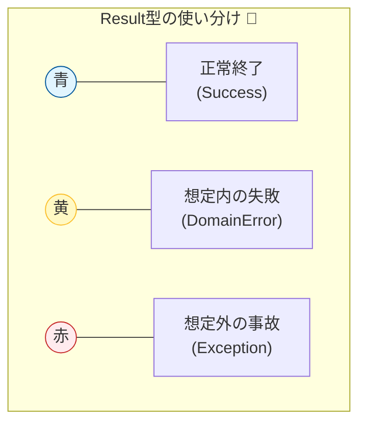

# 第17章：Command処理の“型”②（不変条件で弾く）🛡️🚧

## この章でできるようになること 🎯✨

* **ルール違反のコマンドを、イベントを1つも積まずに止める**🙅‍♀️🧱
* 「なぜダメか」を **ドメインエラー（失敗理由）** として返せる📮💬
* **Load → Decide → Append** の “Decide” に **不変条件（Invariants）** を集めて、設計がブレないようにできる🧠🧷

---

# 1. 不変条件ってなに？🧷🛡️


不変条件（Invariant）は、ざっくり言うと…

* **「このドメインでは、絶対にこうでなきゃダメ！」**というルール✅
* 例：

  * カートは **チェックアウト後に商品追加できない**🛒❌
  * 数量は **1以上**じゃないとダメ🔢❌
  * 空のカートは **チェックアウトできない**🧺❌

ここで大事なのは、**“入力チェック”よりも強い**ってこと🌟
UIの入力チェックは「親切」だけど、**不変条件は“最後の砦”**🛡️✨
（UIをすり抜けても、ドメインが守る！）

---

# 2. どこで不変条件をチェックするの？🧭


答え：**Decide（イベントを作る直前）** でチェックする✅

## ✅ 正しい流れ



1. 過去イベントを読む（Load）📚
2. 状態を復元（Rehydrate）🔁
3. **不変条件チェック → OKなら新イベントを作る（Decide）**🧠✨
4. Append（保存）📦

## ❌ よくある事故

* **Appendした後に「あ、ルール違反だった」** → もう履歴が汚れる😱
* いろんな層（UI/Service/Repository）にチェックが散って、**ルールが食い違う**🥲

だから、**Decideにルールを集める**のが強い💪✨

---

# 3. “例外”じゃなくて “ドメインエラー” で返す 🚦😊




ルール違反は、たいてい **「想定内の失敗」** だよね？
そのときに例外を投げると…

* ログがエラーで埋まる🪵💥
* try/catchだらけになりがち🕸️
* 失敗理由の扱いが雑になりやすい🥺

そこでこの章では、まず一歩として **ドメインエラーを返す型** を用意するよ✅
（もっと洗練した設計は後の章で強化していくよ〜💖）

---

# 4. 実装してみよう：Result と DomainError 🧱✨


```csharp
public interface IDomainEvent { }

public sealed record DomainError(string Code, string Message);

public readonly record struct Result<T>(T? Value, DomainError? Error)
{
    public bool IsOk => Error is null;

    public static Result<T> Ok(T value) => new(value, null);

    public static Result<T> Fail(string code, string message)
        => new(default, new DomainError(code, message));
}
```

## コツ🧠✨

* `Code` は **機械向け（安定した識別子）** 🏷️
* `Message` は **人間向け（表示文）** 💬
* `Code` は後で翻訳や表示切替に使えるから、**短く・一貫性ある命名**がおすすめ✨

  * 例：`cart.alreadyCheckedOut` / `cart.empty` / `quantity.outOfRange`

---

# 5. 例：ショッピングカートで「不変条件で弾く」🛒🛡️

## 5.1 イベント定義 📜

```csharp
public sealed record CartCreated(Guid CartId) : IDomainEvent;
public sealed record ItemAdded(Guid CartId, string Sku, int Quantity) : IDomainEvent;
public sealed record CartCheckedOut(Guid CartId, DateTimeOffset At) : IDomainEvent;
```

## 5.2 状態（復元用）🔁

```csharp
public sealed class ShoppingCartState
{
    public bool Created { get; private set; }
    public bool CheckedOut { get; private set; }

    private readonly Dictionary<string, int> _items = new();
    public IReadOnlyDictionary<string, int> Items => _items;

    public void Apply(IDomainEvent e)
    {
        switch (e)
        {
            case CartCreated:
                Created = true;
                break;

            case ItemAdded ia:
                if (_items.TryGetValue(ia.Sku, out var current))
                    _items[ia.Sku] = current + ia.Quantity;
                else
                    _items[ia.Sku] = ia.Quantity;
                break;

            case CartCheckedOut:
                CheckedOut = true;
                break;
        }
    }

    public static ShoppingCartState From(IEnumerable<IDomainEvent> history)
    {
        var state = new ShoppingCartState();
        foreach (var e in history) state.Apply(e);
        return state;
    }
}
```

## 5.3 Decide：ここが本題！不変条件で弾く🛡️🚧


```csharp
public static class ShoppingCartDecider
{
    public static Result<IReadOnlyList<IDomainEvent>> AddItem(
        Guid cartId, ShoppingCartState state, string sku, int quantity)
    {
        // 不変条件①：作成されてないカートには追加できない
        if (!state.Created)
            return Result<IReadOnlyList<IDomainEvent>>.Fail(
                "cart.notCreated",
                "カートがまだ作成されていないみたい…🥺 先に作成してね！");

        // 不変条件②：チェックアウト後は変更できない
        if (state.CheckedOut)
            return Result<IReadOnlyList<IDomainEvent>>.Fail(
                "cart.alreadyCheckedOut",
                "このカートは購入確定済みだよ🧾✨ 追加はできないの…");

        // 不変条件③：SKUは空にしない
        if (string.IsNullOrWhiteSpace(sku))
            return Result<IReadOnlyList<IDomainEvent>>.Fail(
                "sku.required",
                "商品コードが空っぽだよ😵 ちゃんと指定してね！");

        // 不変条件④：数量は1〜99（例）
        if (quantity is < 1 or > 99)
            return Result<IReadOnlyList<IDomainEvent>>.Fail(
                "quantity.outOfRange",
                "数量は1〜99の範囲でお願い🙏✨");

        // OK！イベントを作る（まだ保存はしない）
        return Result<IReadOnlyList<IDomainEvent>>.Ok(
            new IDomainEvent[] { new ItemAdded(cartId, sku, quantity) }
        );
    }

    public static Result<IReadOnlyList<IDomainEvent>> Checkout(
        Guid cartId, ShoppingCartState state, DateTimeOffset now)
    {
        if (!state.Created)
            return Result<IReadOnlyList<IDomainEvent>>.Fail(
                "cart.notCreated",
                "カートがまだ作成されていないみたい…🥺");

        if (state.CheckedOut)
            return Result<IReadOnlyList<IDomainEvent>>.Fail(
                "cart.alreadyCheckedOut",
                "もう購入確定済みだよ🧾✨");

        // 不変条件：空のカートは購入できない
        if (state.Items.Count == 0)
            return Result<IReadOnlyList<IDomainEvent>>.Fail(
                "cart.empty",
                "空っぽのカートは購入できないよ🧺💦 先に商品を入れてね！");

        return Result<IReadOnlyList<IDomainEvent>>.Ok(
            new IDomainEvent[] { new CartCheckedOut(cartId, now) }
        );
    }
}
```

---

# 6. Command Handler側：失敗なら Append しない 🧯✅


“DecideがFailならイベントは積まない” が最重要ルールだよ💡

```csharp
public interface IEventStore
{
    Task<IReadOnlyList<IDomainEvent>> ReadStream(Guid streamId);
    Task Append(Guid streamId, IReadOnlyList<IDomainEvent> events);
}

public sealed class CartApplicationService
{
    private readonly IEventStore _store;

    public CartApplicationService(IEventStore store) => _store = store;

    public async Task<Result<IReadOnlyList<IDomainEvent>>> HandleAddItem(
        Guid cartId, string sku, int quantity)
    {
        var history = await _store.ReadStream(cartId);
        var state = ShoppingCartState.From(history);

        var decision = ShoppingCartDecider.AddItem(cartId, state, sku, quantity);

        if (!decision.IsOk)
            return decision; // ✅ ここで止める（Appendしない）

        await _store.Append(cartId, decision.Value!);
        return decision;
    }
}
```

---

# 7. ミニ演習：NGケースを作って弾こう🙅‍♀️🧪

## お題🎁

「チェックアウト済みカートに AddItem したら弾く」をテストで確認しよう✅

※ xUnit は v3 が .NET 8 以降をサポートしてるので、この教材の環境でもそのまま使えるよ🧪✨ ([xUnit.net][1])

```csharp
using Xunit;

public sealed class CartInvariantsTests
{
    [Fact]
    public void AddItem_should_fail_when_cart_is_already_checked_out()
    {
        // Given（過去イベント）
        var cartId = Guid.NewGuid();
        var history = new IDomainEvent[]
        {
            new CartCreated(cartId),
            new ItemAdded(cartId, "SKU-APPLE", 1),
            new CartCheckedOut(cartId, DateTimeOffset.UtcNow),
        };
        var state = ShoppingCartState.From(history);

        // When（コマンド相当）
        var result = ShoppingCartDecider.AddItem(cartId, state, "SKU-BANANA", 1);

        // Then（失敗していること）
        Assert.False(result.IsOk);
        Assert.Equal("cart.alreadyCheckedOut", result.Error!.Code);
    }
}
```

---

# 8. エラーメッセージ設計のコツ 💬✨


ユーザー向けの `Message` は、こうすると優しくて強い😊🌸

* 何がダメ？（事実）📌
* どうすればいい？（次の行動）🧭
* 責めない言い方にする💖

例：

* ❌「不正です」
* ✅「購入確定済みだから追加できないよ🧾✨ もし変更したいなら新しいカートでやってみてね！」

---

# 9. ありがちな落とし穴と対策 🕳️🪜

## 落とし穴①：UIで弾いたから大丈夫と思う

→ API直叩きやバグで突破される😱
✅ **ドメインで必ず守る**🛡️

## 落とし穴②：Applyの中で検証し始める

→ 「過去の履歴が読み直せない」事故になることがある💥
✅ **Applyは黙って状態反映**、検証はDecideへ🧠

## 落とし穴③：エラーコードが場当たりになる

✅ 命名ルールを決める（例：`cart.*`, `quantity.*`）🏷️✨

---

# 10. AI活用：ここはAIが超得意🤖💖

## 10.1 不変条件を洗い出すプロンプト🧠

```text
あなたはDDDの観点で不変条件をレビューする役です。
ショッピングカートの仕様は以下：
- カート作成、商品追加、購入確定
- 購入確定後は変更不可
- 数量は1以上
このとき「不変条件」を5〜10個、短い理由つきで提案して。
また、それぞれにエラーコード案（例: cart.empty）も付けて。
```

## 10.2 エラーメッセージ改善プロンプト💬

```text
次のエラーメッセージを、ユーザーが次に何をすればいいか分かるように、
やさしく短く直して。責める言い方は禁止。絵文字も少し入れて。
- code: cart.alreadyCheckedOut
- message: "Checkout済み"
```

## 10.3 テスト生成プロンプト🧪

```text
Given-When-Then形式で、失敗ケースのxUnitテストを2本作って。
対象は ShoppingCartDecider.AddItem と Checkout。
「イベント履歴（Given）→ Decide呼び出し（When）→ Error.Code検証（Then）」の形にして。
```

---

# 11. この章のチェックリスト ✅📝

* Decideの中に不変条件がまとまっている🧠
* 失敗したら **イベントを返さない**（Appendしない）🛑
* エラーコードが一貫している🏷️
* 失敗ケースのテストが最低1本ある🧪
* 例外は「想定外」だけに寄せられている💥

---

## 本日時点の“環境の最新っぽさ”メモ 🆕🪟

* **.NET 10 は LTS**で、公開日やサポート期限が明記されているよ（2025-11-11 リリース、サポートは 2028-11-14 まで）。([Microsoft][2])
* **Visual Studio 2026 + .NET 10** では、F5起動が最大30%速くなる、という案内も出てるよ🚀 ([learn.microsoft.com][3])

[1]: https://xunit.net/?utm_source=chatgpt.com "xUnit.net: Home"
[2]: https://dotnet.microsoft.com/en-us/platform/support/policy/dotnet-core?utm_source=chatgpt.com "NET and .NET Core official support policy"
[3]: https://learn.microsoft.com/ja-jp/visualstudio/releases/2026/release-notes?utm_source=chatgpt.com "Visual Studio 2026 リリース ノート"
