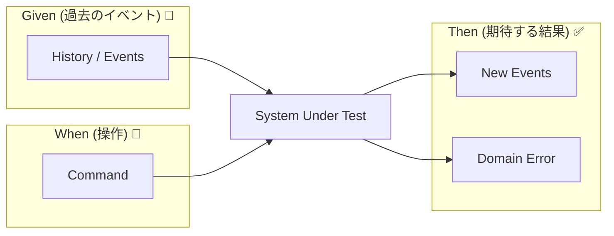
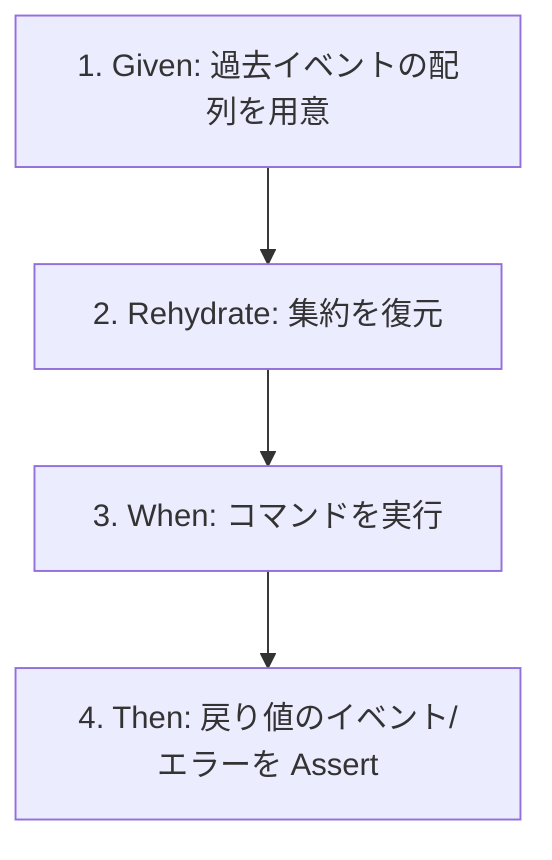

# 第20章：テストの型①（Given-When-Then）🧪🌸

イベントソーシングのテストは、**「状態」じゃなく「出来事（イベント）」を確認する**のがポイントだよ〜😊✨
だから基本はこれだけ👇

* **Given**：過去に起きたイベント（履歴）📜
* **When**：コマンドを投げる📮
* **Then**：新しく積まれるべきイベント（または失敗）✅🙅‍♀️

---

# 20.1 なんでテストが大事なの？🧠✨

イベントソーシングは「保存＝イベント」だから、

* “このコマンドを投げたら、どのイベントが出る？”
* “ダメな入力なら、イベントは出ない？”

ここがズレると、**履歴が壊れる**のね😵‍💫💥


なのでテストは **イベントの契約書** みたいなもの📄✨

---

# 20.2 Given-When-Then を「イベントソーシング用」に訳すと？🔁📮✅




普通のテスト（AAA）だと

* Arrange（準備）
* Act（実行）
* Assert（検証）

なんだけど、イベントソーシングではこう置き換えると超ラク😊

* **Arrange = Given（過去イベント）**
* **Act = When（コマンド）**
* **Assert = Then（出るイベント or エラー）**


---

# 20.3 テストプロジェクトを作る最短ルート 🛠️🚀

## CLIで作る（いちばん早い）💨

.NET 10 は「テストランナーの選択」もテンプレで扱えるよ（既定は VSTest）。([Microsoft Learn][1])
.NET 10 自体も 10.0.2 が配布されてるよ。([Microsoft][2])

```bash
dotnet new sln -n EsTutorial
dotnet new classlib -n EsTutorial.Domain
dotnet new xunit -n EsTutorial.Tests

dotnet sln EsTutorial.sln add EsTutorial.Domain/EsTutorial.Domain.csproj
dotnet sln EsTutorial.sln add EsTutorial.Tests/EsTutorial.Tests.csproj

dotnet add EsTutorial.Tests/EsTutorial.Tests.csproj reference EsTutorial.Domain/EsTutorial.Domain.csproj
dotnet test
```


## Visual Studio（GUIでやる）🪟✨

* ソリューション作成 → Class Library（Domain）＋ xUnit テストプロジェクト追加
* **Test Explorer** で実行 ▶️🧪

> xUnit の基本的な流れは Microsoft Learn のチュートリアルも参考になるよ。([Microsoft Learn][3])

---

# 20.4 今日の題材：超ミニ「ショッピングカート」🛒🍎

ここでは “イベントが出るか” だけに集中するね😊✨
（永続化とか競合は後の章でやるよ〜）

---

# 20.5 ドメインの最小コード（イベント・コマンド・Decision）🧩

> ✅ ここは「テストで使う最低限」だけ！


```csharp
// EsTutorial.Domain

namespace EsTutorial.Domain;

public interface IEvent { }
public interface ICommand { }

public sealed record CartCreated(Guid CartId) : IEvent;
public sealed record ItemAdded(Guid CartId, string Sku, int Quantity) : IEvent;
public sealed record CheckedOut(Guid CartId) : IEvent;

public sealed record CreateCart(Guid CartId) : ICommand;
public sealed record AddItem(Guid CartId, string Sku, int Quantity) : ICommand;
public sealed record Checkout(Guid CartId) : ICommand;

public sealed record DomainError(string Code, string Message);

public sealed record Decision(
    bool IsSuccess,
    IReadOnlyList<IEvent> Events,
    DomainError? Error
)
{
    public static Decision Success(params IEvent[] events)
        => new(true, events, null);

    public static Decision Fail(string code, string message)
        => new(false, Array.Empty<IEvent>(), new DomainError(code, message));
}

public sealed class ShoppingCart
{
    private bool _created;
    private bool _checkedOut;

    public static ShoppingCart FromHistory(IEnumerable<IEvent> history)
    {
        var cart = new ShoppingCart();
        foreach (var e in history) cart.Apply(e);
        return cart;
    }

    public Decision Handle(ICommand command) =>
        command switch
        {
            CreateCart c => Decide(c),
            AddItem c    => Decide(c),
            Checkout c   => Decide(c),
            _            => Decision.Fail("unknown_command", "Unknown command")
        };

    private Decision Decide(CreateCart c)
    {
        if (_created) return Decision.Fail("already_created", "Cart is already created");
        return Decision.Success(new CartCreated(c.CartId));
    }

    private Decision Decide(AddItem c)
    {
        if (!_created) return Decision.Fail("not_created", "Cart is not created");
        if (_checkedOut) return Decision.Fail("already_checked_out", "Cart is already checked out");
        if (string.IsNullOrWhiteSpace(c.Sku)) return Decision.Fail("invalid_sku", "Sku is required");
        if (c.Quantity <= 0) return Decision.Fail("invalid_quantity", "Quantity must be positive");

        return Decision.Success(new ItemAdded(c.CartId, c.Sku, c.Quantity));
    }

    private Decision Decide(Checkout c)
    {
        if (!_created) return Decision.Fail("not_created", "Cart is not created");
        if (_checkedOut) return Decision.Fail("already_checked_out", "Cart is already checked out");
        return Decision.Success(new CheckedOut(c.CartId));
    }

    private void Apply(IEvent e)
    {
        switch (e)
        {
            case CartCreated:
                _created = true;
                break;
            case CheckedOut:
                _checkedOut = true;
                break;
        }
    }
}
```

---

# 20.6 Given-When-Then テストの型（成功パターン）✅🧪



ここからが本題🌸
コメントで **Given / When / Then** を固定するだけで、めちゃ読みやすくなるよ😊


```csharp
// EsTutorial.Tests

using EsTutorial.Domain;
using Xunit;

public class ShoppingCart_GivenWhenThen_Specs
{
    [Fact]
    public void AddItem_emits_ItemAdded()
    {
        var cartId = Guid.Parse("11111111-1111-1111-1111-111111111111");

        // Given（過去）
        IEvent[] given =
        {
            new CartCreated(cartId)
        };

        // When（コマンド）
        var when = new AddItem(cartId, "APPLE", 2);

        // Then（新イベント）
        IEvent[] expected =
        {
            new ItemAdded(cartId, "APPLE", 2)
        };

        var cart = ShoppingCart.FromHistory(given);
        var decision = cart.Handle(when);

        Assert.True(decision.IsSuccess, decision.Error?.Message);
        Assert.Equal(expected, decision.Events);
    }
}
```

## 🎀 ここでの「Then」って何を見てる？

* decision.Events が **期待イベントと一致するか** ✅
* つまり「このコマンドはこのイベントを積む」という契約確認📜✨

---

# 20.7 Given-When-Then テストの型（失敗パターン）🙅‍♀️🧪

イベントソーシングは **失敗したらイベントを出さない** が超大事😊
だから失敗テストもセットで書くよ！


```csharp
using EsTutorial.Domain;
using Xunit;

public class ShoppingCart_Failure_Specs
{
    [Fact]
    public void AddItem_before_create_fails()
    {
        var cartId = Guid.Parse("22222222-2222-2222-2222-222222222222");

        // Given
        IEvent[] given = Array.Empty<IEvent>();

        // When
        var when = new AddItem(cartId, "APPLE", 1);

        var cart = ShoppingCart.FromHistory(given);
        var decision = cart.Handle(when);

        // Then
        Assert.False(decision.IsSuccess);
        Assert.Equal("not_created", decision.Error!.Code);
        Assert.Empty(decision.Events); // ✅ 失敗ならイベント0件
    }
}
```

---

# 20.8 さらに読みやすくする小ワザ 3つ✨📚

## ① テスト名は「〜すると〜になる」風にする📝

* `AddItem_emits_ItemAdded`
* `AddItem_before_create_fails`

## ② 期待イベントは “配列で1行” に寄せる📦

`IEvent[] expected = { ... };` って置くと見通し最高😊

## ③ “状態” を直接 Assert しすぎない🧠

イベントソーシングでは、基本は **イベントが正しいか** を見る✅
（状態はイベントの結果だから、重要なときだけでOK）


---

# 20.9 よくある落とし穴 😵‍💫🕳️

* **Guid.NewGuid() をそのまま期待値に書いちゃう**
  → テストが毎回変わる😇（固定値 or 変数共有にしよう）
* **日時（DateTime.Now）をイベントに入れて Assert し始める**
  → 揺れる😭（メタデータは次の章で扱うと楽）
* **失敗時にイベントが出ちゃう**
  → 履歴が汚れる💥（失敗は events=空、を守る）

---

# 20.10 便利ライブラリの話：FluentAssertions は注意点あり🍯⚠️

FluentAssertions は読みやすさが爆上がりするんだけど、**v8 以降はライセンス条件が変わってる**よ（商用利用は要注意）。([Fluent Assertions][4])
「学習用途・非商用・OSS」ならOKなケースもあるので、使うなら条件確認してね😊

---

# 20.11 ミニ演習 🧩✍️✨

## 演習1：成功テストをもう1本追加しよう✅

**Given**：`CartCreated`
**When**：`Checkout`
**Then**：`CheckedOut`

## 演習2：失敗テストをもう1本追加しよう🙅‍♀️

**Given**：`CartCreated` + `CheckedOut`
**When**：`AddItem`
**Then**：失敗（code = `already_checked_out`、events = 空）

---

# 20.12 AI活用プロンプト例 🤖💬✨

## ① Given-When-Then のテスト雛形を作らせる

```text
C# xUnit で Given-When-Then 形式のテストを書いてください。
ドメインはイベントソーシングです。
Given: [CartCreated(cartId)]
When: AddItem(cartId,"APPLE",2)
Then: [ItemAdded(cartId,"APPLE",2)]
可読性重視で、Given/When/Then コメントを必ず入れてください。
```

## ② “失敗時にイベントが出ない” を強制チェックさせる

```text
次のコマンド処理が失敗したとき、events が空になることを保証するテストを書いて。
失敗コードも Assert して。
```

---

## 参考（この章で使った最新情報ソース）📚🔎

* .NET 10 のダウンロード情報（10.0.2 など）([Microsoft][2])
* `dotnet new` テンプレのテストランナー指定（.NET 10 SDK）([Microsoft Learn][1])
* Microsoft Learn の xUnit テスト入門([Microsoft Learn][3])
* FluentAssertions のリリースとライセンス変更（v8）([Fluent Assertions][4])

[1]: https://learn.microsoft.com/ja-jp/dotnet/core/tools/dotnet-new-sdk-templates?utm_source=chatgpt.com "'dotnet new' の .NET の既定のテンプレート - .NET CLI"
[2]: https://dotnet.microsoft.com/en-US/download/dotnet/10.0?utm_source=chatgpt.com "Download .NET 10.0 (Linux, macOS, and Windows) | .NET"
[3]: https://learn.microsoft.com/en-us/dotnet/core/testing/unit-testing-csharp-with-xunit?utm_source=chatgpt.com "Unit testing C# in .NET using dotnet test and xUnit"
[4]: https://www.fluentassertions.com/releases/?utm_source=chatgpt.com "Releases"
