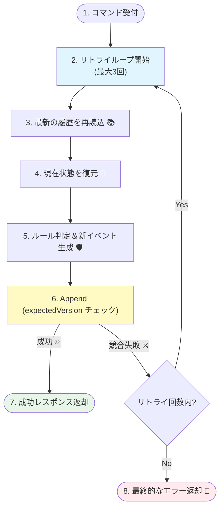
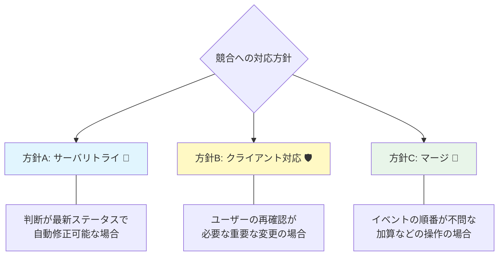

# 第24章：競合したとき、どうする？（方針だけ）🧯🧠

## この章でできるようになること🎯✨

* 「競合（同時更新）」が起きたときに、どう対応するかの**現実的な選択肢**を説明できる😊
* そのうち1つ（この章では **サーバー側リトライ**）を、**最小実装**できる✅
* 競合を「バグ」じゃなく「起こりうる前提」として扱えるようになる🌿

---

# 1. 競合って、実際なにが起きてるの？⚔️💥




イベントソーシングでは、だいたいこういう流れです👇

1. ある人（または処理）が、集約のイベント列を読む（version = 10 だった）📚
2. その間に別の人が先に保存して、version が 11 になった📈
3. 最初の人が「version=10 のつもりで Append」すると、**“期待したversionと違うよ！”** で失敗する💣

この「期待したversion（expectedVersion / expectedRevision）」で守る仕組みが、**楽観ロック（Optimistic Concurrency）**だよ🔒✨
たとえば EventStoreDB 系のイベントストアは、期待したリビジョンと現状が違うとエラーにして「古い状態で判断して書き込むのを止める」動きをするよ。([Kurrent - event-native data platform][1])
また、イベントストア実装でも「wrong expected version なら OptimisticConcurrencyException を投げる」みたいな扱いが一般的。([Eventuous][2])

---

# 2. 競合したときの“よくある3方針”🧭✨

## 方針A：サーバー側で自動リトライする🔁⚡（この章で実装する）

**やること**：競合したら、最新を読み直して、もう一回 Decide → Append を試す✨
**向いてる**：

* そのコマンドが「最新状態で再判断してもだいたい通る」ケース😊
* ユーザー体験を途切れさせたくないケース🌸

同期（HTTP等）だと、競合時に即リトライして吸収する、という考え方もよく出てくるよ。([Ecotone][3])

---

## 方針B：クライアントに「更新競合」を返して、やり直してもらう🧑‍💻🔄

**やること**：サーバーは「競合です！」で返す → クライアントは最新を取得 → もう一度操作

* REST APIなら **409 Conflict** が代表例📮([MDN Web Docs][4])
* ETag を使う方式だと、`If-Match` が一致しない場合に **412 Precondition Failed** を返す、という設計も定番🧾([Event-Driven][5])

**向いてる**：

* 「勝手にリトライして通すと、ユーザーの意図とズレる」ケース😵‍💫
  （例：残り在庫が変わった、別の人が内容を大きく変更した、など）

---

## 方針C：マージ（自動解決）する🤝🧠（難しいけど強い）

**やること**：競合した場合でも、差分を見て「両方成立するなら合成」する
ただし、どの順番でもOKかどうかは **ドメイン次第**で、ケースバイケースになりやすい💡([Taskscape][6])

**向いてる**：

* “足し算系”で衝突しにくい（例：閲覧回数の加算、在庫の補充）📈
* ルールが明確で「自動合成しても意味が変わらない」操作✅

---

# 3. どれを選ぶ？超かんたん判断ガイド🧩😊



迷ったら、まずこれ👇

* 競合しても「最新状態で再計算すれば同じ結果になりやすい」？
  → **方針A（サーバー側リトライ）**がラク😊🔁
* 競合したら「ユーザーが見て判断しないと危ない」？
  → **方針B（409/412でやり直し）**が安全🛡️
* 操作が「順番入れ替えても意味が変わらない」＆「自動合成ルールが書ける」？
  → **方針C（マージ）**に挑戦🤝✨

---

# 4. 最小実装：方針A「サーバー側リトライ（最大3回）」🔁✅

ここでは、**競合エラーだけ**を捕まえて、最大3回だけやり直す形にします🌸
（無限リトライは地獄になるので回数制限が大事😇）

## 4.1 例外（競合）を表す型💥

```csharp
public sealed class OptimisticConcurrencyException : Exception
{
    public string StreamId { get; }
    public long ExpectedVersion { get; }
    public long ActualVersion { get; }

    public OptimisticConcurrencyException(string streamId, long expected, long actual)
        : base($"Concurrency conflict on {streamId}. expected={expected}, actual={actual}")
    {
        StreamId = streamId;
        ExpectedVersion = expected;
        ActualVersion = actual;
    }
}
```

---

## 4.2 EventStore の最小インターフェース📦

```csharp
public interface IEventStore
{
    Task<(IReadOnlyList<object> Events, long Version)> ReadStreamAsync(string streamId, CancellationToken ct);
    Task AppendAsync(string streamId, long expectedVersion, IReadOnlyList<object> newEvents, CancellationToken ct);
}
```

---

## 4.3 「Load → Decide → Append」を、競合時だけリトライする🧠🔁

例として「カートに商品を追加する」コマンドを想定するね🛒✨
（集約 `Cart` の `Decide` は既にある前提でOK！）

```csharp
public sealed record AddItemToCart(Guid CartId, string Sku, int Quantity);

public sealed class CartCommandHandler
{
    private readonly IEventStore _store;

    public CartCommandHandler(IEventStore store) => _store = store;

    public async Task<CommandResult> Handle(AddItemToCart cmd, CancellationToken ct)
    {
        const int maxRetries = 3;

        for (int attempt = 1; attempt <= maxRetries; attempt++)
        {
            var streamId = $"cart-{cmd.CartId}";
            var (history, version) = await _store.ReadStreamAsync(streamId, ct);

            var cart = Cart.Rehydrate(history);               // Applyで復元🔁
            var newEvents = cart.Decide(cmd);                 // 不変条件チェック→イベント生成🛡️

            try
            {
                await _store.AppendAsync(streamId, version, newEvents, ct); // expectedVersionで守る🔒
                return CommandResult.Ok();
            }
            catch (OptimisticConcurrencyException) when (attempt < maxRetries)
            {
                // 競合した！→ もう一回 “最新を読み直して” やり直す🔁
                continue;
            }
        }

        // 3回やってもダメなら、利用者に「更新競合」を伝えるのが無難😊
        return CommandResult.Conflict("更新が競合しました。最新の状態で再度お試しください。");
    }
}

public abstract record CommandResult
{
    public sealed record OkResult : CommandResult;
    public sealed record ConflictResult(string Message) : CommandResult;

    public static CommandResult Ok() => new OkResult();
    public static CommandResult Conflict(string message) => new ConflictResult(message);
}
```

ポイントはここだよ👇✨

* **競合したら必ず Read からやり直す**（古い状態で再Appendしない）🔁
* リトライするのは **競合系だけ**（不変条件違反はリトライしても同じになりがち）🛡️
* 回数制限をつける（maxRetries）🧯

---

# 5. ミニ演習（手を動かすパート）✍️💪

## 演習1：競合を“わざと”起こす💥

* テスト内で、`ReadStreamAsync` の直後に別の Append が走ったことにする
* `AppendAsync` が `OptimisticConcurrencyException` を投げるようにする

## 演習2：リトライで最終的に成功するのを確認✅

* 1回目は失敗
* 2回目は最新を読み直して成功🎉

---

# 6. テスト例（Given-When-Thenっぽく）🧪🌸

※「競合が一度だけ起きる偽イベントストア」を使う例だよ😊

```csharp
using Xunit;

public sealed class ConflictOnceEventStore : IEventStore
{
    private readonly List<object> _events = new();
    private bool _alreadyConflicted;

    public Task<(IReadOnlyList<object> Events, long Version)> ReadStreamAsync(string streamId, CancellationToken ct)
        => Task.FromResult(((IReadOnlyList<object>)_events.ToArray(), (long)_events.Count));

    public Task AppendAsync(string streamId, long expectedVersion, IReadOnlyList<object> newEvents, CancellationToken ct)
    {
        var actualVersion = _events.Count;

        // 1回だけ「誰かが先に書いた」ことにして競合させる💥
        if (!_alreadyConflicted)
        {
            _alreadyConflicted = true;
            _events.Add(new SomethingElseHappened()); // 横入りイベント
            actualVersion = _events.Count;

            throw new OptimisticConcurrencyException(streamId, expectedVersion, actualVersion);
        }

        // 2回目以降は普通にチェックして追加
        if (expectedVersion != _events.Count)
            throw new OptimisticConcurrencyException(streamId, expectedVersion, _events.Count);

        _events.AddRange(newEvents);
        return Task.CompletedTask;
    }

    private sealed record SomethingElseHappened;
}

public class Chapter24Tests
{
    [Fact]
    public async Task Retries_on_concurrency_conflict_and_succeeds()
    {
        var store = new ConflictOnceEventStore();
        var handler = new CartCommandHandler(store);

        var result = await handler.Handle(new AddItemToCart(Guid.NewGuid(), "SKU-1", 1), CancellationToken.None);

        Assert.IsType<CommandResult.OkResult>(result);
    }
}
```

---

# 7. よくある落とし穴（ここ注意！）⚠️😵‍💫

* **無限リトライ**：混雑時に一生終わらないことがある🌀 → 回数制限必須🧯
* **リトライ前に副作用がある**：メール送信・外部API呼び出しを先にやると地獄📨🔥
  → Append 成功後にやるか、Outboxなどの仕組みへ（後の章で扱うやつ）📦
* **“競合”と“不変条件違反”をごっちゃにする**：

  * 競合＝読み直せば通るかも🔁
  * 不変条件違反＝読み直しても通らないことが多い🛡️

---

# 8. AI活用（メリデメ表＆テスト案を一瞬で出す）🤖🪄

## 8.1 メリデメ表を作るプロンプト例📋✨

「イベントソーシングの競合対応として、(A)サーバー側リトライ (B)409/412でやり直し (C)マージ のメリット/デメリット、向いている例、向いていない例を表で出して。前提：expectedVersion の楽観ロック。」

## 8.2 テストケースを増やすプロンプト例🧪✨

「上の CartCommandHandler の競合リトライについて、落とし穴込みでテストケースを10個提案して。成功/失敗/境界値/同時実行っぽいケースを混ぜて。」

---

# 9. まとめ🎀😊

競合は「たまに起きるけど、起きたときの扱いが大事」な現象だよ⚔️✨

* まずは **リトライ（方針A）** で吸収できる場面が多い🔁
* 危ない操作は **409/412でやり直し（方針B）** が安全🛡️
* 自動合成できるなら **マージ（方針C）** が強いけど、ルール設計が難しい🤝🧠

次の章の「スナップショット」につながるように、競合も“運用で起こる前提”として扱えるようになったら最高だよ〜📸✨

[1]: https://www.kurrent.io/blog/how-to-model-event-sourced-systems-efficiently/?utm_source=chatgpt.com "How To Model Event-Sourced Systems Efficiently - Kurrent.io"
[2]: https://eventuous.dev/docs/persistence/event-store/?utm_source=chatgpt.com "Event store"
[3]: https://docs.ecotone.tech/modelling/recovering-tracing-and-monitoring/resiliency/concurrency-handling?utm_source=chatgpt.com "Concurrency Handling - DDD, CQRS, Event Sourcing in PHP"
[4]: https://developer.mozilla.org/en-US/docs/Web/HTTP/Reference/Status/409?utm_source=chatgpt.com "409 Conflict - HTTP - MDN Web Docs - Mozilla"
[5]: https://event-driven.io/en/how_to_use_etag_header_for_optimistic_concurrency/?utm_source=chatgpt.com "How to use ETag header for optimistic concurrency"
[6]: https://taskscape.com/201904-how-to-resolve-concurrent-commands-in-event-sourcing.html?utm_source=chatgpt.com "How to resolve concurrent commands in event sourcing"
