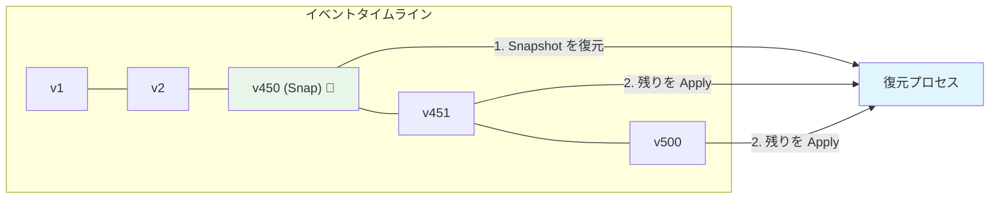
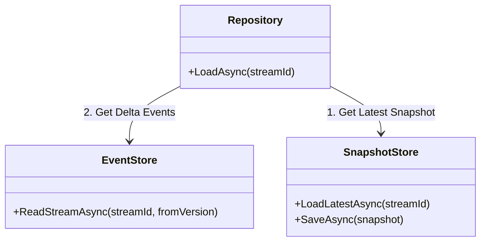
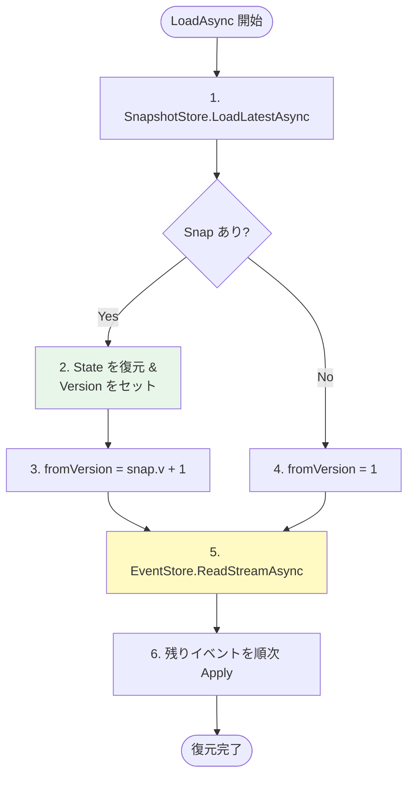

# 第26章：スナップショット実装（最小）📸🧪

## この章でできるようになること🎯✨

* スナップショット（Snapshot）を **最小構成** で実装できる📸
* **「最新スナップショット + 残りイベント」** で高速に復元できる🔁⚡
* スナップショットを **いつ保存するか（ルール）** を決められる🧠📏
* 「保存」「読み出し」「取り込み」の実装漏れを潰せる🔍✅

---

# 1. スナップショットって何？📸🤔

イベントソーシングでは、状態を作るときに **イベントを先頭から全部 Apply** して復元しますよね🔁
でもイベントが増えると……復元がだんだん重くなる😵‍💫💦

そこで **途中の状態を「写真📸」みたいに保存** しておくのがスナップショットです✨

* イベント：出来事の履歴📜
* スナップショット：ある時点の「状態の写し」📸

スナップショットは **“正しさ” のためじゃなくて “速さ” のため** の仕組みだよ⚡😊
だから扱いは **キャッシュ** に近いです🧊（壊れても作り直せるのが理想）🔁✨

---

# 2. 復元の流れ（スナップ有り）を図で理解📌🧠


スナップ無しだとこう👇

* 先頭イベントから最後まで全部読む → 全部Apply → いまの状態完成

スナップ有りだとこう👇

* 最新スナップを読む → その続きのイベントだけ読む → 残りだけApply → いまの状態完成

```text
（スナップ無し）
Events: 1 2 3 4 5 6 7 8 9 ... 500
Apply:  全部ぜんぶぜんぶ…😇

（スナップ有り）
Snapshot(v=450) 📸  +  Events: 451 452 ... 500
Apply:  50個だけでOK😎✨
```



---

# 3. 最小の設計（これだけで動く）🧩✅




## 3.1 スナップショットに入れるもの🍱🏷️

最低限、これがあれば動きます👇

* `StreamId`：どの集約のスナップ？🧺
* `Version`：そのスナップは **何番目のイベントまで反映済み？** 🔢
* `StateJson`：状態を JSON にしたもの🧾
* `CreatedAt`：いつ作った？🕒（任意だけど便利）

> ポイント💡：Version が命！
> 「Snapshot の続きのイベント」だけ適用するために必須だよ🔁✅

## 3.2 いつスナップを取る？（最小ルール）📏✨

まずは迷わずこれでOK👇

* **Version が N の倍数になったら保存**（例：50・100 など）📸
* 例：`Version % 50 == 0` のとき保存

---

# 4. 実装：必要な部品を増やしていく🧱🪄

ここから **動く最小実装** を作るよ😊✨
（この章は「スナップ導入」に集中したいので、イベントストアはインメモリ想定のままでもOK👌）

---

# 4.1 スナップショット用の型を作る📦📸

```csharp
public sealed record SnapshotEnvelope(
    string StreamId,
    long Version,
    string StateType,
    string StateJson,
    DateTimeOffset CreatedAt
);
```

* `StateType` は「これは何の状態？」っていう保険🛟（将来ちょい便利）

---

# 4.2 ISnapshotStore（保存/読取）を作る🧰✅

```csharp
public interface ISnapshotStore
{
    Task SaveAsync(SnapshotEnvelope snapshot, CancellationToken ct = default);
    Task<SnapshotEnvelope?> LoadLatestAsync(string streamId, CancellationToken ct = default);
}
```

---

# 4.3 最小：インメモリの SnapshotStore を作る🧠📦

まずは雑に「最新だけ持つ」実装でOK👌✨
（本番では履歴管理したりDBに入れたりするけど、今は最小！）

```csharp
using System.Collections.Concurrent;

public sealed class InMemorySnapshotStore : ISnapshotStore
{
    private readonly ConcurrentDictionary<string, SnapshotEnvelope> _latest = new();

    public Task SaveAsync(SnapshotEnvelope snapshot, CancellationToken ct = default)
    {
        _latest.AddOrUpdate(
            snapshot.StreamId,
            snapshot,
            (_, current) => snapshot.Version >= current.Version ? snapshot : current
        );

        return Task.CompletedTask;
    }

    public Task<SnapshotEnvelope?> LoadLatestAsync(string streamId, CancellationToken ct = default)
    {
        _latest.TryGetValue(streamId, out var snapshot);
        return Task.FromResult(snapshot);
    }
}
```

* **Version が古いスナップで上書きしない** のが大事だよ🔒✅

---

# 4.4 集約側：スナップの “出し入れ” を用意する🧺📸

「状態をJSONにして保存」するには、状態の型が必要だよね😊
ここでは例として “カート” を使うよ🛒✨

## 4.4.1 スナップ用の状態（DTO）を作る🧾

```csharp
public sealed record ShoppingCartSnapshot(
    bool IsCreated,
    IReadOnlyDictionary<string, int> Items
);
```

## 4.4.2 集約に ToSnapshot / LoadSnapshot を用意🔁

```csharp
using System.Text.Json;

public sealed class ShoppingCart
{
    private readonly Dictionary<string, int> _items = new();
    public bool IsCreated { get; private set; }
    public long Version { get; private set; } // 反映済みイベント番号（例：0=まだ何もない）

    // 章の目的のため、Apply回数を見える化👀
    public int ApplyCount { get; private set; }

    public void ApplyEvent(object @event, long eventVersion)
    {
        ApplyCount++;

        switch (@event)
        {
            case CartCreated:
                IsCreated = true;
                break;

            case ItemAdded e:
                _items[e.Sku] = _items.TryGetValue(e.Sku, out var q) ? q + e.Quantity : e.Quantity;
                break;
        }

        Version = eventVersion;
    }

    public ShoppingCartSnapshot ToSnapshot()
        => new(IsCreated, new Dictionary<string, int>(_items));

    public void LoadSnapshot(ShoppingCartSnapshot snapshot, long snapshotVersion)
    {
        IsCreated = snapshot.IsCreated;

        _items.Clear();
        foreach (var kv in snapshot.Items)
            _items[kv.Key] = kv.Value;

        Version = snapshotVersion;
    }

    public string DebugView()
        => $"Created={IsCreated}, Items={_items.Count}, Version={Version}, ApplyCount={ApplyCount}";
}

public sealed record CartCreated();
public sealed record ItemAdded(string Sku, int Quantity);
```

---

# 4.5 「スナップ + 残りイベント」で復元する Repository を作る🔁📦

ここがこの章のメイン！🔥📸

ポイントはこれ👇

1. まずスナップを読む
2. スナップがあれば、そのVersion以降のイベントだけ読む
3. Applyして完成

## 4.5.1 まず StoredEvent（保存されるイベント）を定義📜

```csharp
public sealed record StoredEvent(
    string StreamId,
    long Version,
    string EventType,
    string EventJson
);
```

## 4.5.2 EventStore の読み取りインターフェース（最小）📦

```csharp
public interface IEventStore
{
    Task<IReadOnlyList<StoredEvent>> ReadStreamAsync(
        string streamId,
        long fromVersionInclusive,
        CancellationToken ct = default
    );
}
```

## 4.5.3 Repository：Load の実装（スナップ対応）📸✨



```csharp
using System.Text.Json;

public sealed class ShoppingCartRepository
{
    private readonly IEventStore _eventStore;
    private readonly ISnapshotStore _snapshotStore;
    private readonly JsonSerializerOptions _json;

    public ShoppingCartRepository(IEventStore eventStore, ISnapshotStore snapshotStore)
    {
        _eventStore = eventStore;
        _snapshotStore = snapshotStore;
        _json = new JsonSerializerOptions { PropertyNameCaseInsensitive = true };
    }

    public async Task<ShoppingCart> LoadAsync(string streamId, CancellationToken ct = default)
    {
        var cart = new ShoppingCart();

        // 1) スナップ読み込み📸
        var snap = await _snapshotStore.LoadLatestAsync(streamId, ct);
        long fromVersion = 1;

        if (snap is not null)
        {
            var snapshotObj = JsonSerializer.Deserialize<ShoppingCartSnapshot>(snap.StateJson, _json)
                              ?? throw new InvalidOperationException("Snapshot JSON is invalid.");

            cart.LoadSnapshot(snapshotObj, snap.Version);

            // 2) スナップの“続き”から読む🔁
            fromVersion = snap.Version + 1;
        }

        // 3) 残りイベントを適用🧩
        var events = await _eventStore.ReadStreamAsync(streamId, fromVersion, ct);
        foreach (var e in events)
        {
            object domainEvent = e.EventType switch
            {
                nameof(CartCreated) => JsonSerializer.Deserialize<CartCreated>(e.EventJson, _json)!,
                nameof(ItemAdded)   => JsonSerializer.Deserialize<ItemAdded>(e.EventJson, _json)!,
                _ => throw new NotSupportedException($"Unknown event type: {e.EventType}")
            };

            cart.ApplyEvent(domainEvent, e.Version);
        }

        return cart;
    }
}
```

---

## 5. スナップショットを「いつ保存するか」を実装📸🗓️

復元側ができたら、次は **保存する側** だよ😊✨

最小ルール：

* **Version が 50 の倍数になったら保存**📸

### 5.1 ルール（Policy）を関数にする📏

```csharp
public static class SnapshotPolicy
{
    public static bool ShouldTakeSnapshot(long version, int everyNEvents = 50)
        => version > 0 && version % everyNEvents == 0;
}
```

### 5.2 保存する処理（例：Append後に呼ぶ）📸✅

「AppendしてVersionが進んだあと」にスナップを作るのが自然だよ🌷

```csharp
using System.Text.Json;

public static class SnapshotSaver
{
    public static async Task TrySaveAsync(
        string streamId,
        ShoppingCart cart,
        ISnapshotStore snapshotStore,
        int everyNEvents = 50,
        CancellationToken ct = default)
    {
        if (!SnapshotPolicy.ShouldTakeSnapshot(cart.Version, everyNEvents))
            return;

        var snapshotObj = cart.ToSnapshot();
        var json = JsonSerializer.Serialize(snapshotObj);

        var envelope = new SnapshotEnvelope(
            StreamId: streamId,
            Version: cart.Version,
            StateType: nameof(ShoppingCartSnapshot),
            StateJson: json,
            CreatedAt: DateTimeOffset.UtcNow
        );

        await snapshotStore.SaveAsync(envelope, ct);
    }
}
```

---

## 6. ミニ演習：スナップ有/無で Apply 回数を比べよう🔁📸👀

「ほんとに短くなるの？」を体で感じる演習だよ😊✨

### 6.1 実験の流れ🧪

1. イベントを 200 個ぶん積んだ想定にする（例：ItemAddedを200回）
2. スナップ無しで復元 → ApplyCount を見る
3. 途中（Version=150）でスナップを入れる
4. スナップ有りで復元 → ApplyCount が減るのを見る

### 6.2 時間も測りたいなら Stopwatch ⏱️

`Stopwatch` は .NET の標準で使えるよ⏱️✨（高精度カウンタ対応の説明あり）([Microsoft Learn][1])

```csharp
using System.Diagnostics;

var sw = Stopwatch.StartNew();
// LoadAsync を呼ぶ（スナップ有り/無しで比較）
sw.Stop();

Console.WriteLine($"Elapsed: {sw.ElapsedMilliseconds} ms");
```

---

## 7. テスト観点（最小）🧪✅

この章でまず欲しいテストはこれ👇

### 7.1 正しさテスト（同じ状態になる）🎯

* **スナップ無し復元** と **スナップ有り復元** が **同じ状態** になること✅

  * `IsCreated` が一致
  * `Items` が一致
  * `Version` が一致

### 7.2 効果テスト（Apply回数が減る）📉

* スナップ有りの `ApplyCount` が小さいこと✅

> 注意⚠️：時間（ms）での断定テストは環境差が出やすいから、まずは **Apply回数** が安全だよ😊

---

## 8. よくある実装ミス集（ここで詰まりがち）😵‍💫🧯

* **スナップVersionを更新し忘れる** → 続きのイベントがズレる😇
* **fromVersion の計算ミス**（`snap.Version + 1` を忘れる）→ イベント二重適用💥
* **スナップが古いのに上書きしてしまう** → 逆に遅くなる/壊れる😱
* **イベントType→復元の分岐が増えて地獄** → まずは最小でOK、あとで改善🌱

---

## 9. AI活用（この章向けプロンプト例）🤖✨

### 9.1 実装レビューしてもらう🔍

* 「スナップVersionの扱い」
* 「fromVersionの計算」
* 「古いスナップで上書きしてないか」

例👇

```text
次のC#コードをレビューして、スナップショット導入で起きやすいバグ
（Versionズレ、二重適用、古いスナップ上書き、読み出し漏れ）を重点的に指摘して。
修正案は “差分” で提案してね。
```

### 9.2 テスト生成（Given-When-Then）🧪

```text
ShoppingCartのスナップショット復元をテストしたい。
(1) スナップ無し復元とスナップ有り復元の状態一致
(2) ApplyCountが減る
この2つをxUnitで書いて。テストデータはItemAddedを200回でOK。
```

---

## 10. 2026年2月時点の周辺メモ📝✨

* .NET 10 の “What’s new” は Microsoft 公式ドキュメントで確認できるよ📚([Microsoft Learn][2])
* Visual Studio 2026 のリリースノートも公式にまとまってるよ🛠️([Microsoft Learn][3])
* .NET 10 のアナウンス（GA/LTSの文脈など）は公式ブログが基点になるよ📰([devblogs.microsoft.com][4])

[1]: https://learn.microsoft.com/en-us/dotnet/api/system.diagnostics.stopwatch?view=net-10.0&utm_source=chatgpt.com "Stopwatch Class (System.Diagnostics)"
[2]: https://learn.microsoft.com/en-us/dotnet/core/whats-new/dotnet-10/overview?utm_source=chatgpt.com "What's new in .NET 10"
[3]: https://learn.microsoft.com/ja-jp/visualstudio/releases/2026/release-notes?utm_source=chatgpt.com "Visual Studio 2026 リリース ノート"
[4]: https://devblogs.microsoft.com/dotnet/announcing-dotnet-10/?utm_source=chatgpt.com "Announcing .NET 10"
