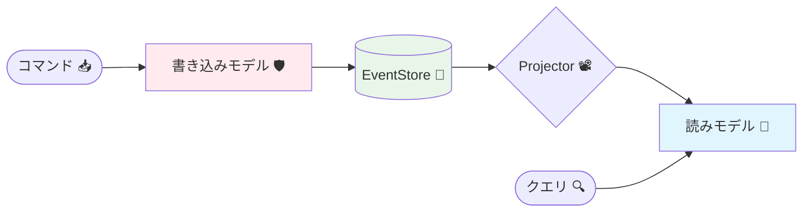
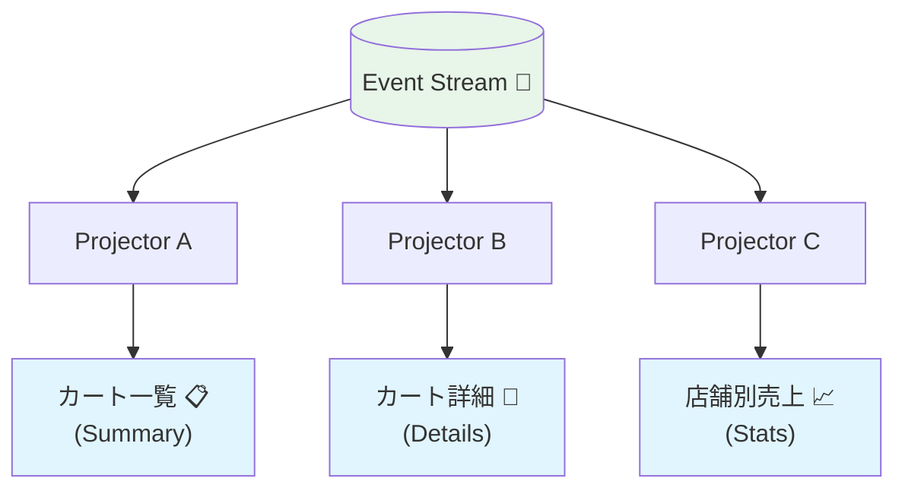

# 第28章：Projectionって何？（読みやすい形を別で作る）🔎✨

## この章のゴール🎯💕

* **「イベントの履歴」から、画面や検索に使いやすい“読み取り用の形”を作れる**ようになる🪄
* **書き込み（Command側）と読み取り（Query側）を分ける理由**が、ふわっとじゃなく説明できるようになる😊
* 最小の **Projection（読みモデル）** を **C#で動く形**に落とすところまでやる💻✨

---

# 1) Projectionってなに？🧁🔎

イベントソーシングでは「真実」は **イベント（出来事の履歴）** だよね📜✨
でも…イベント列って、そのままだと **画面表示や検索に向いてない**ことが多いの🥺💦

そこで登場するのが **Projection（投影）** 🎥✨
ざっくり言うと：

* **イベント列（事実の履歴）** → 見たい形に **集計・整形** → **読み取り用データ（Read Model）** を作る
* この「イベントから読みやすい形を作る処理」や、その結果できた「読み取り用の形」をまとめて **Projection** と呼ぶことが多いよ🧠✨

「イベントからビュー（見やすい形）を materialize（具体化）する」って説明は、Microsoftのパターン解説にも出てくる考え方だよ📚✨ ([Microsoft Learn][1])

---

# 2) なんで必要なの？（Projectionが欲しくなる瞬間）😵‍💫➡️😊

たとえば「カート」のイベントがこう積まれてるとするね🛒📮

* `CartCreated`
* `ItemAdded (りんご, 1, 120円)`
* `ItemAdded (バナナ, 2, 200円)`
* `QuantityChanged (バナナ, 3)`
* `ItemRemoved (りんご)`

ここで画面が欲しいのは例えば👇みたいなやつ：

* カート一覧：`合計金額` / `商品数` / `最終更新日時`
* カート詳細：`商品ごとの数量` / `小計` / `合計`
* 検索：`「バナナを含むカート」だけ出して！`

でもイベント列を毎回ぜんぶ読んで毎回計算するのって、だるいし遅いし事故りやすい😇💦
だから **イベントから“表示に最適な形”を作って保存**しておく（＝Projection）と楽になるの🎀

この「書き込みモデル（厳密）と読みモデル（表示最適）」を分ける話は、CQRSの定番の考え方としても整理されてるよ📌 ([Microsoft Learn][2])

---

# 3) 書き込みモデル🛡️ vs 読みモデル👀（ここ超大事！）✨




## 書き込みモデル（Write Model）📮🧱

* **不変条件**を守る（例：数量がマイナスは禁止❌）
* **Command → Decide → Event** を作る場所
* “正しさ最優先”💎

## 読みモデル（Read Model / Projection）🔎🍱

* 画面・検索・一覧のために **読みやすく整形**する場所
* **正しさ（ルール）は基本的に書き込み側で保証**して、読み側は **表示最適**に寄せる🌷
* “速さ・使いやすさ優先”⚡

MicrosoftのCQRS解説でも「イベントが読みモデルの入力になって、クエリのためのスナップ（ビュー）を作れる」って趣旨が書かれてるよ🧠✨ ([Microsoft Learn][2])

---

# 4) Projection設計のコツ：イベントから作るんじゃなく、画面から逆算🪞✨

初心者がやりがちなミス：
「イベントを見て、なんとなくProjection作る」😵‍💫

おすすめは逆！
**画面（Query）→ 必要な項目 → 形（Read Model）→ 更新方法** の順だよ💡

## 手順（テンプレ）🧩

1. 画面・APIで欲しいものを列挙🖥️📝
2. それに合わせた Read Model を1つ決める🍱
3. どのイベントで、どの項目が変わるか対応表を作る🔁
4. Projector（イベントを受けてRead Modelを更新する処理）を書く🧰

---

# 5) ミニ演習：画面に必要な項目を列挙してみよう🖥️💗




## お題：カート一覧（1行で見たい）📋✨

最低限、何が欲しい？👇

* `CartId`
* `TotalItems`（商品数）
* `TotalPrice`（合計）
* `LastUpdatedAt`

## お題：カート詳細（中身を見たい）🔎🛒

* `CartId`
* `Items[]`（商品名、単価、数量、小計）
* `TotalPrice`
* `LastUpdatedAt`

この2つは「欲しいクエリ」が違うから、**Read Modelも別でOK**だよ💞
（Projectionは “質問ごとに形が違っていい” のが強み🌟）

---

# 6) 最小実装：イベントを受けてProjectionを更新する⚡🧪

ここでは「カート一覧用Projection」だけを最小で作るよ📦✨
（永続化はまだ気にしないでOK！ まず動かすのが勝ち🏆）

## 6-1. イベント定義（例）📮

```csharp
using System;

public interface IDomainEvent
{
    Guid CartId { get; }
    DateTimeOffset OccurredAt { get; }
}

// 例：作成
public sealed record CartCreated(Guid CartId, DateTimeOffset OccurredAt) : IDomainEvent;

// 例：商品追加
public sealed record ItemAdded(
    Guid CartId,
    string Sku,
    int Quantity,
    int UnitPriceYen,
    DateTimeOffset OccurredAt
) : IDomainEvent;

// 例：数量変更
public sealed record QuantityChanged(
    Guid CartId,
    string Sku,
    int NewQuantity,
    int UnitPriceYen,
    DateTimeOffset OccurredAt
) : IDomainEvent;

// 例：商品削除
public sealed record ItemRemoved(Guid CartId, string Sku, DateTimeOffset OccurredAt) : IDomainEvent;
```

## 6-2. Read Model（カート一覧の1行）📋

```csharp
using System;

public sealed class CartSummaryReadModel
{
    public Guid CartId { get; init; }
    public int TotalItems { get; set; }
    public int TotalPriceYen { get; set; }
    public DateTimeOffset LastUpdatedAt { get; set; }
}
```

## 6-3. Projector（イベント→Read Model更新）🔁🧰

「Read Model専用の更新処理」って感じだよ😊✨

```csharp
using System;
using System.Collections.Generic;

public sealed class CartSummaryProjector
{
    private readonly Dictionary<Guid, CartSummaryReadModel> _store = new();

    // 取得（Query側が使うイメージ）
    public CartSummaryReadModel? Find(Guid cartId)
        => _store.TryGetValue(cartId, out var rm) ? rm : null;

    // ここが「Projection更新」
    public void Apply(IDomainEvent ev)
    {
        switch (ev)
        {
            case CartCreated e:
                _store[e.CartId] = new CartSummaryReadModel
                {
                    CartId = e.CartId,
                    TotalItems = 0,
                    TotalPriceYen = 0,
                    LastUpdatedAt = e.OccurredAt
                };
                break;

            case ItemAdded e:
            {
                var rm = Ensure(e.CartId, e.OccurredAt);
                rm.TotalItems += e.Quantity;
                rm.TotalPriceYen += e.Quantity * e.UnitPriceYen;
                rm.LastUpdatedAt = e.OccurredAt;
                break;
            }

            case QuantityChanged e:
            {
                // ⚠️ 本当は「以前の数量」を知らないと差分計算できない
                // → ここが “一覧Projectionだけだと情報が足りない” 例！
                // 今回は最小章なので「詳細Projectionで数量を持つ」前提にして、ここは割愛/例示にする✨
                var rm = Ensure(e.CartId, e.OccurredAt);
                rm.LastUpdatedAt = e.OccurredAt;
                break;
            }

            case ItemRemoved e:
            {
                var rm = Ensure(e.CartId, e.OccurredAt);
                rm.LastUpdatedAt = e.OccurredAt;
                break;
            }

            default:
                throw new NotSupportedException($"Unknown event type: {ev.GetType().Name}");
        }
    }

    private CartSummaryReadModel Ensure(Guid cartId, DateTimeOffset at)
    {
        if (_store.TryGetValue(cartId, out var rm)) return rm;

        // 最小実装：作成イベントが来る前提だけど、保険で作っちゃう
        rm = new CartSummaryReadModel { CartId = cartId, LastUpdatedAt = at };
        _store[cartId] = rm;
        return rm;
    }
}
```

### 🔥ここで大事ポイント

`QuantityChanged` や `ItemRemoved` を正しく一覧に反映するには、**「その商品の現在数量」みたいな状態が必要**になることが多いのね。
だから実務ではよく👇のどっちかをやるよ💡

* **詳細Projection（Itemsを持つ）を作って、そこから合計も作る**
* もしくは **一覧Projectionの内部に最小の状態（SKU→数量）を持たせる**

Projectionは「質問に答えるために、必要な最小状態を持ってOK」って感覚が大事だよ🍬✨
（イベントは真実、Projectionは“答えを作るための計算結果”）

---

# 7) テストで「Projectionが更新される」を確認🧪✅

Projectionはバグると画面が壊れるので、**軽いテスト**がめちゃ効くよ〜！💕

```csharp
using System;
using Xunit;

public class CartSummaryProjectorTests
{
    [Fact]
    public void Apply_creates_and_updates_summary()
    {
        var projector = new CartSummaryProjector();
        var cartId = Guid.NewGuid();
        var t1 = DateTimeOffset.Parse("2026-02-01T10:00:00+09:00");
        var t2 = DateTimeOffset.Parse("2026-02-01T10:01:00+09:00");

        projector.Apply(new CartCreated(cartId, t1));
        projector.Apply(new ItemAdded(cartId, "APPLE", 2, 120, t2));

        var rm = projector.Find(cartId)!;

        Assert.Equal(cartId, rm.CartId);
        Assert.Equal(2, rm.TotalItems);
        Assert.Equal(240, rm.TotalPriceYen);
        Assert.Equal(t2, rm.LastUpdatedAt);
    }
}
```

---

# 8) Projectionあるある落とし穴🚧🥺（先に知っておくと強い）

## ① 読みモデルにビジネスルールを入れちゃう😇

* ルールは基本 **Write Model側**で守る
* 読み側は「見せ方」中心🎀

## ② 更新漏れ（イベント追加したのにProjection更新し忘れ）🙃

* イベント追加＝Projectionの `Apply` も見直しが必要✅
* 「イベント追加したら、Projectionとテストもセット」って癖づけると事故減るよ🧸✨

## ③ 同じイベントを2回食べると壊れる（重複）🔁💥

* 実務では **チェックポイント（どこまで処理したか）** を持って重複を避けることが多いよ
* 「最後に処理した位置（position）」の考え方は、投影の定番テクとしてよく出てくるよ📌 ([Kurrent - event-native data platform][3])

---

# 9) AI活用プロンプト例🤖✨（丸投げじゃなく“設計を早くする”）

## 画面→Projection設計を出してもらう🪄

* 「カート一覧画面に必要な項目はこれ。イベントはこれ。
  どんなRead Modelが良い？フィールド案と更新ルール案を出して！」

## Apply漏れをレビューしてもらう🔍

* 「このProjectorのswitchを見て、更新漏れ・矛盾・将来バグりそうな点を指摘して！」

## テスト観点を増やす🧪

* 「成功ケース2つ、失敗（または未対応イベント）ケース1つのテスト案をGiven-When-Thenで提案して！」

---

# 10) 2026年時点のメモ🗒️✨（“今の最新版”）

* **.NET 10 はLTS（長期サポート）**で、サポート期限も明示されてるよ📅 ([Microsoft for Developers][4])
* **Visual Studio 2026** は 2026年1月時点でも更新が出ていて、リリースノートがまとまってる📌 ([Microsoft Learn][5])
* **VS Code** 側も 2026年1月の更新内容が公開されてるよ🧩 ([Visual Studio Code][6])

---

## まとめ🍓✨

* **Projection＝イベントから「見たい答えの形」を作る仕組み**🔎
* 設計は **イベント起点じゃなく、画面（クエリ）起点**がラク🖥️💕
* 最小でも **Projector（Apply）＋Read Model＋テスト1本** があると一気に安心する🧪✅

[1]: https://learn.microsoft.com/en-us/azure/architecture/patterns/event-sourcing?utm_source=chatgpt.com "Event Sourcing pattern - Azure Architecture Center"
[2]: https://learn.microsoft.com/en-us/azure/architecture/patterns/cqrs?utm_source=chatgpt.com "CQRS Pattern - Azure Architecture Center"
[3]: https://www.kurrent.io/blog/turning-the-database-inside-out?utm_source=chatgpt.com "Turning the database inside out with Event Store - Kurrent.io"
[4]: https://devblogs.microsoft.com/dotnet/announcing-dotnet-10/?utm_source=chatgpt.com "Announcing .NET 10"
[5]: https://learn.microsoft.com/ja-jp/visualstudio/releases/2026/release-notes?utm_source=chatgpt.com "Visual Studio 2026 リリース ノート"
[6]: https://code.visualstudio.com/updates/v1_109?utm_source=chatgpt.com "January 2026 Insiders (version 1.109)"
