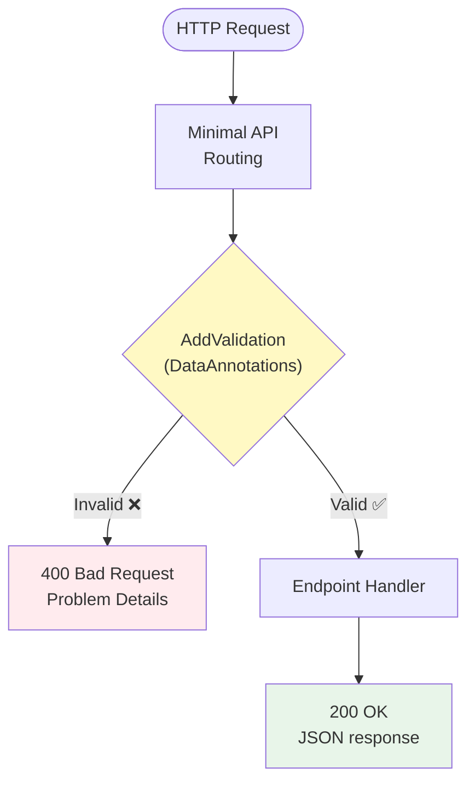

# 第30章：Query API（読むためのAPI/画面）を作る📮👀

## この章のゴール🎯💡

* **Projection（読みモデル）**を返す **読み取り専用API（Query API）** を2本つくる🙌

  * 一覧：`GET /api/query/carts` 📋
  * 詳細：`GET /api/query/carts/{cartId}` 🔎
* **DTO（返却用データ）**をきれいに設計できる🍱✨（返しすぎない！）
* **.NET 10のMinimal API標準バリデーション**で、クエリパラメータを安全にする🧷✅（`AddValidation()`） ([Microsoft Learn][1])
* **OpenAPI**で仕様を自動生成して、確認しやすくする📘✨（`AddOpenApi()` / `MapOpenApi()`） ([Microsoft Learn][2])

---

## 1. まずイメージ：書く側と読む側を分ける理由🧠🔀


イベントソーシングでは、**書く側（Command → Event）**は厳密で、**読む側（画面表示）**は“見やすさ最優先”になりがちだよね😊✨
だから **読む専用のAPI（Query API）** を作って、**Projectionを返す**のがスッキリするよ〜🎀

```text
[Command API]  --(Event append)-->  EventStore
     |
     v
 Projection更新（同期 or 非同期）
     |
     v
[Query API]  --(GETで読むだけ)-->  Projection Store
```

ASP.NET Coreでは新規プロジェクトは **Minimal APIs** が推奨されていて、軽く作りやすいよ✨ ([Microsoft Learn][3])

---

## 2. エンドポイント設計：この2本だけでOK🙆‍♀️📮

### ✅ 一覧（画面のリスト用）📋

* `GET /api/query/carts`
* だいたい「ページング」「検索」「並び替え」が欲しくなる✨

例：

* `GET /api/query/carts?pageSize=50&cursor=...&q=apple`

### ✅ 詳細（画面の詳細ページ用）🔎

* `GET /api/query/carts/{cartId}`
* 「そのカートの中身・合計・更新時刻」みたいな感じ

---

## 3. DTO設計：Projectionをそのまま返さない🍱🙅‍♀️


Query APIで返すのは **DTO（表示・通信に最適化した形）** が基本だよ😊✨
理由👇

* Projectionの内部構造をそのまま公開すると、将来の変更がつらい😵‍💫
* 画面に不要な情報まで出すと、帯域もセキュリティも微妙💦
* “見せたい形”に整えるほうが、フロントも楽🪄

この章では例としてこうするよ👇

* 一覧DTO：`CartSummaryDto`（軽い📋）
* 詳細DTO：`CartDetailDto`（必要な分だけ🔎）

---

## 4. .NET 10の「標準バリデーション」をQueryにも効かせる🧷✅✨

.NET 10（ASP.NET Core 10）では、Minimal APIで **DataAnnotations** によるバリデーションが標準サポートされてるよ🎉
`AddValidation()` を呼ぶと、**Query / Header / Body** に対して検証して、失敗したら **400** を返してくれる✨ ([Microsoft Learn][1])

> つまり「`pageSize`が0とか9999」みたいな変な入力を、入口で止められる🛑😊

---

## 5. 実装してみよう：Query API（Minimal API）🛠️✨

> 📌 ここは「読み取り専用」の例だよ（GETだけ）😊
> Projection（読みモデル）の作り方は前章（Projection更新）でやった想定で、ここでは **“読むためのAPI”** を作るよ〜📮👀

### 5.1 Program.cs（このまま貼って動く最小例）🚀


```csharp
using System.Collections.Concurrent;
using System.ComponentModel.DataAnnotations;
using Microsoft.AspNetCore.Http.HttpResults;
using Microsoft.AspNetCore.Mvc;

var builder = WebApplication.CreateBuilder(args);

// ✅ OpenAPI（仕様の自動生成）
builder.Services.AddOpenApi(); // /openapi/{documentName}.json がデフォルト :contentReference[oaicite:4]{index=4}

// ✅ .NET 10: Minimal API の標準バリデーション
builder.Services.AddValidation(); // Query/Header/Body を DataAnnotations で検証 :contentReference[oaicite:5]{index=5}

// ✅ Query用の読みモデルストア（ここではインメモリ例）
builder.Services.AddSingleton<ICartReadModelStore, InMemoryCartReadModelStore>();

var app = builder.Build();

if (app.Environment.IsDevelopment())
{
    // ✅ OpenAPI JSON を公開（開発時だけ）
    app.MapOpenApi(); // /openapi/v1.json が一般的（documentName=v1） :contentReference[oaicite:6]{index=6}

    // ✅ おまけ：YAMLでも出したいなら（.NET 10）
    app.MapOpenApi("/openapi/{documentName}.yaml"); :contentReference[oaicite:7]{index=7}
}

// -------------------------
// Query API（読むだけ）📮👀
// -------------------------
var query = app.MapGroup("/api/query")
               .WithTags("Query"); // OpenAPI上でまとまって見やすい✨

// ✅ 一覧：GET /api/query/carts?pageSize=..&cursor=..&q=..
query.MapGet("/carts",
    async Task<Ok<PagedResult<CartSummaryDto>>> (
        [AsParameters] CartListQuery q,
        ICartReadModelStore store,
        CancellationToken ct) =>
    {
        var result = await store.ListAsync(q, ct);
        return TypedResults.Ok(result);
    })
    .WithOpenApi();

// ✅ 詳細：GET /api/query/carts/{cartId}
query.MapGet("/carts/{cartId:guid}",
    async Task<Results<Ok<CartDetailDto>, NotFound>> (
        Guid cartId,
        ICartReadModelStore store,
        CancellationToken ct) =>
    {
        var dto = await store.GetAsync(cartId, ct);
        return dto is null
            ? TypedResults.NotFound()
            : TypedResults.Ok(dto);
    })
    .WithOpenApi();

app.Run();
```

// -------------------------
// Query params（＋Validation）🧷✅
---

## 3. クエリパラメータのバリデーション（.NET 10）🛡️✨





```csharp
// -------------------------
public record CartListQuery(
    [Range(1, 200)] int PageSize = 50,
    string? Cursor = null,
    string? Q = null
);

// -------------------------
// DTO（返す形）🍱✨
// -------------------------
public record CartSummaryDto(
    Guid CartId,
    int ItemCount,
    decimal Total,
    DateTimeOffset UpdatedAt
);

public record CartItemDto(
    string Sku,
    string Name,
    int Quantity,
    decimal UnitPrice
);

public record CartDetailDto(
    Guid CartId,
    IReadOnlyList<CartItemDto> Items,
    decimal Total,
    DateTimeOffset UpdatedAt
);

public record PagedResult<T>(
    IReadOnlyList<T> Items,
    string? NextCursor
);

// -------------------------
// Query用ストア（読みモデル）📦
// -------------------------
public interface ICartReadModelStore
{
    Task<PagedResult<CartSummaryDto>> ListAsync(CartListQuery query, CancellationToken ct);
    Task<CartDetailDto?> GetAsync(Guid cartId, CancellationToken ct);
}

// -------------------------
// インメモリ実装（サンプル）🧪
// ※ 本番はSQLiteや別DBでもOK
// -------------------------
public sealed class InMemoryCartReadModelStore : ICartReadModelStore
{
    private readonly ConcurrentDictionary<Guid, CartDetailDto> _details = new();
    private readonly ConcurrentDictionary<Guid, CartSummaryDto> _summaries = new();

    public InMemoryCartReadModelStore()
    {
        // 例データ（動作確認用）✨
        var id = Guid.NewGuid();
        var items = new List<CartItemDto>
        {
            new("SKU-APPLE", "Apple", 2, 120),
            new("SKU-BREAD", "Bread", 1, 240),
        };
        var total = items.Sum(x => x.Quantity * x.UnitPrice);
        var now = DateTimeOffset.UtcNow;

        _details[id] = new CartDetailDto(id, items, total, now);
        _summaries[id] = new CartSummaryDto(id, items.Sum(x => x.Quantity), total, now);
    }

    public Task<PagedResult<CartSummaryDto>> ListAsync(CartListQuery query, CancellationToken ct)
    {
        // 超簡易：Q は名前に含まれるかでフィルタ（デモ用）
        var list = _summaries.Values
            .OrderByDescending(x => x.UpdatedAt)
            .AsEnumerable();

        if (!string.IsNullOrWhiteSpace(query.Q))
        {
            var q = query.Q.Trim();
            // 本当は検索用Projectionを別に作るのが王道だよ😊
            // ここではデモとして「総額が0じゃない」など適当フィルタでもOK
            list = list.Where(x => x.Total.ToString().Contains(q, StringComparison.OrdinalIgnoreCase));
        }

        var page = list.Take(query.PageSize).ToList();
        return Task.FromResult(new PagedResult<CartSummaryDto>(page, NextCursor: null));
    }

    public Task<CartDetailDto?> GetAsync(Guid cartId, CancellationToken ct)
    {
        _details.TryGetValue(cartId, out var dto);
        return Task.FromResult(dto);
    }
}
```


### 5.2 ここで使ってる“最新ポイント”✨

* **TypedResultsが推奨**（`Results`より型がしっかりして、OpenAPIや戻り値も綺麗✨） ([Microsoft Learn][1])
* **OpenAPIは `MapOpenApi()`** で `/openapi/{documentName}.json` に出るよ📘（だいたい `v1`） ([Microsoft Learn][4])
* **YAML出力**も `.yaml` ルートを生やせばOK（.NET 10）🐳📄 ([Microsoft Learn][5])
* **OpenAPIのUI表示は別ツール**（Swagger UI / ReDocなど）を組み合わせるのが一般的だよ👀 ([Microsoft Learn][6])

---

## 6. 動作確認してみよう🧪✨

### ✅ 1) 一覧📋

* ブラウザで：`/api/query/carts`
* ちょい指定：`/api/query/carts?pageSize=10`

### ✅ 2) バリデーション確認🧷🛑

* `pageSize=0` にすると、**400 Bad Request** が返るはず！
  （DataAnnotationsの `[Range(1,200)]` が効く✨） ([Microsoft Learn][1])

### ✅ 3) OpenAPI確認📘

* `/openapi/v1.json`（だいたいこれ） ([Microsoft Learn][4])
* `/openapi/v1.yaml`（設定した場合） ([Microsoft Learn][5])

---

## 7. ミニ演習（手を動かす）🧤✨

### 演習A：一覧に「更新日時で絞る」🕒🔎

* `updatedAfter=2026-01-01` みたいなクエリを追加してみよう😊

  * `CartListQuery` に `DateOnly? UpdatedAfter` を足す
  * `[AsParameters]` で受けて、フィルタする

### 演習B：一覧を「カーソルページングっぽく」する🧵📌


* `NextCursor` を「最後に返した `UpdatedAt`」にしてみよう✨
  （本格的には検索用Projectionを作ると超強い💪）

---

## 8. AI活用（Copilot / Codex向けプロンプト例）🤖✨

### ✅ DTOレビュー（返しすぎ防止🍱）

「このDTO、画面に必要な最小限になってる？余計な情報ない？将来変更に強い？」って観点で見てもらう💡

```text
今からC#のMinimal APIでQuery APIを作っています。
Cartの一覧DTO/詳細DTOを設計しました。
返しすぎ・責務の混在・将来変更の弱さがないか、具体的に指摘してください。
改善案は「DTOの形」「エンドポイント」「クエリパラメータ」を分けて提案してください。
```

### ✅ バリデーション追加案🧷✅

```text
Minimal API（.NET 10）のAddValidationを使っています。
CartListQueryに入れるべきDataAnnotations（Range/Required/RegularExpressionなど）を提案して。
「ユーザーがやりがちな入力ミス」も例に出してね。
```

---

## 9. この章のチェックリスト✅📌

* [ ] `GET /api/query/carts` が返る📋
* [ ] `GET /api/query/carts/{cartId}` が返る🔎（なければ404）
* [ ] `AddValidation()` で `pageSize=0` を **400** にできた🧷🛑 ([Microsoft Learn][1])
* [ ] `/openapi/v1.json` でAPI仕様が見える📘 ([Microsoft Learn][4])
* [ ] DTOが“画面に必要な分だけ”になってる🍱✨

[1]: https://learn.microsoft.com/en-us/aspnet/core/fundamentals/minimal-apis?view=aspnetcore-10.0 "Minimal APIs quick reference | Microsoft Learn"
[2]: https://learn.microsoft.com/ja-jp/aspnet/core/fundamentals/openapi/overview?view=aspnetcore-10.0 "ASP.NET Core API アプリでの OpenAPI サポートの概要 | Microsoft Learn"
[3]: https://learn.microsoft.com/en-us/aspnet/core/fundamentals/apis?view=aspnetcore-10.0 "APIs overview | Microsoft Learn"
[4]: https://learn.microsoft.com/en-us/aspnet/core/fundamentals/openapi/aspnetcore-openapi?view=aspnetcore-10.0&utm_source=chatgpt.com "Generate OpenAPI documents"
[5]: https://learn.microsoft.com/en-us/aspnet/core/release-notes/aspnetcore-10.0?view=aspnetcore-10.0 "What's new in ASP.NET Core in .NET 10 | Microsoft Learn"
[6]: https://learn.microsoft.com/en-us/aspnet/core/fundamentals/openapi/using-openapi-documents?view=aspnetcore-10.0&utm_source=chatgpt.com "Use the generated OpenAPI documents"
