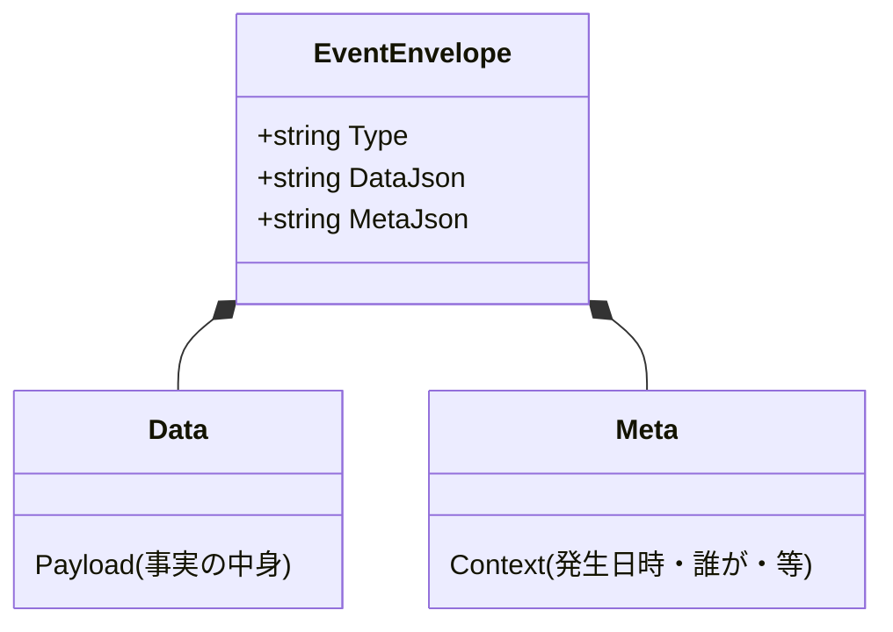
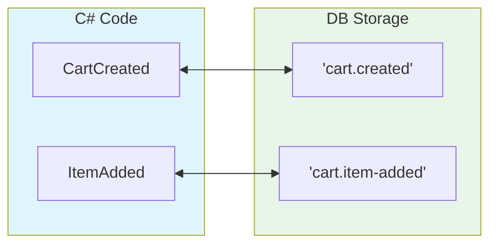

# 第34章：シリアライズ（JSON）と互換性の第一歩🧾🧊

## この章でできるようになること🎯✨

* イベントを **JSONで安全に保存＆読み戻し**できるようになる🔁✅
* 未来の自分（or 未来のチーム）が困らないための **「壊しにくい保存形式」** を作れる🧠🛡️
* `.NET 10` の `System.Text.Json` で増えた **安全オプション** をイベント保存に活かせる🔒✨ ([Microsoft Learn][1])

---

# 34.1 なぜ「JSONと互換性」が超重要なの？😳💥


イベントソーシングでは、イベントは「履歴」じゃなくて **真実そのもの** だよね📜✨
だから一度保存したイベントは、基本 **ずっと読めないと困る** 😱

ここでありがちな事故👇

* 「クラス名を変えたら、昔のイベントが読めなくなった」😇
* 「プロパティ名をちょっと整理したら、復元が壊れた」💣
* 「JSONに同じキーが2回出てきて、値がすり替わった」👻

`.NET 10` では **重複プロパティを禁止**できたり、**Strict（厳格）プリセット**が入ったりして、こういう事故を減らせるようになってるよ🔒✨ ([Microsoft Learn][1])

---

# 34.2 今日つくる「保存の形」📦✨


SQLiteのEventsテーブル（前章）には、だいたいこう入ってる想定だったよね👇

* `streamId`（どの集約のイベント列？）
* `version`（順番）
* `type`（イベント種類）
* `data`（イベント本体）
* `meta`（メタ情報）

この章のポイントはここ👇
**type / data / meta を “壊れにくく” 設計する** 🧊✨

## ✅ 結論：typeは「明示の文字列」にする

やっちゃダメ寄り（後で苦しみがち）👇

* `typeof(MyEvent).FullName`（名前変更で死亡💀）
* assembly-qualified name（バージョンやnamespace変更で死亡💀）

おすすめ👇

* `"cart.created"`
* `"cart.item-added"`
* `"cart.item-removed"`

こういう **自分で決めた安定名** にするのが強いよ💪😊

---

# 34.3 JSON互換性の「最初の4ルール」🧷🛡️


## ルール1：イベントtypeは契約📜（変えない）

`type` は「歴史のラベル」🏷️
**一度出したら変えない** が基本だよ✅

## ルール2：プロパティは「追加」は比較的安全、削除/改名は危険⚠️

* ✅ 追加（新しい項目が増える）
* ❌ 改名（昔のJSONが読めなくなる）
* ❌ 削除（復元に必要だったら終わる）

※ もっと本格的な「イベント進化」は次章でやるよ🧬✨

## ルール3：日時は `DateTimeOffset` でUTC寄せ🕰️🌍

イベントはタイムゾーン事故が起きやすい😵‍💫
`DateTimeOffset`＋UTCに寄せるのが扱いやすいよ👍

## ルール4：JSONは「曖昧さ」を許さない🔒

`.NET 10` では **重複キー**を禁止できるようになったよ（セキュリティ的にも大事）🛡️✨ ([Microsoft Learn][1])

---

# 34.4 `.NET 10` の新しい武器：Strictと重複キー禁止🔒✨

## ① 重複プロパティを禁止できる（.NET 10）

`AllowDuplicateProperties = false` にすると、
`{"Value":1,"Value":-1}` みたいな **怪しいJSON** を弾ける🛑 ([Microsoft Learn][1])

## ② Strictプリセット（.NET 10）

`.NET 10` には `JsonSerializerOptions.Strict` が追加されたよ✨ ([Microsoft Learn][1])
これ、ざっくり言うと「安全寄りの設定セット」なんだけど、含まれてる代表が👇

* 不明なメンバーを禁止（UnmappedをDisallow）
* 重複プロパティ禁止
* 大文字小文字を区別
  など ([Microsoft Learn][1])

💡 ただし！
イベントソーシングは「昔のイベントも読む」ので、**StrictをそのままEventStore読込に使うと、将来の進化で詰むことがある**😵
だから今日は、**“イベント保存向けの安全オプション”** を自分で作るよ😊🧊

---

# 34.5 実装：イベント用JSONオプションを用意しよう🧰✨




ポイントは👇

* **重複キーは禁止**（壊れたJSONを検知したい）
* **大文字小文字は区別**（`Sku` と `sku` が混ざると混乱）
* 不明プロパティは…（ここが悩みどころ🤔）

  * 「将来の追加に耐える」なら **許可**
  * 「入力の安全性」なら **禁止（Strict）**

今回は「イベント保存」なので、**許可寄り**でいくよ（Strictは別用途で紹介）😊

```csharp
using System.Text.Json;
using System.Text.Json.Serialization;

public static class EventJson
{
    // ✅ イベントを書き込む用（こちらは自分たちが生成するので安定）
    public static readonly JsonSerializerOptions Write = new(JsonSerializerDefaults.Web)
    {
        PropertyNameCaseInsensitive = false,
        AllowDuplicateProperties = false, // .NET 10
        // nullをどうするかは好みだけど、まずは書く側を安定させるのが大事
        // DefaultIgnoreCondition = JsonIgnoreCondition.WhenWritingNull,
        Converters =
        {
            // enumを文字列にする派なら（改名しないことが前提だよ！）
            new JsonStringEnumConverter(JsonNamingPolicy.CamelCase)
        }
    };

    // ✅ イベントを読み戻す用（将来の追加に耐えるなら “Unknown許可” のまま）
    public static readonly JsonSerializerOptions Read = new(JsonSerializerDefaults.Web)
    {
        PropertyNameCaseInsensitive = false,
        AllowDuplicateProperties = false, // .NET 10
        // UnmappedMemberHandling は “あえて設定しない”（= デフォルトは無視）
        // 将来フィールドが増えても、古いコードが即死しにくい🙂
    };

    // 🔒 参考：外部入力や「絶対に曖昧さを許したくない」場面では Strict
    public static readonly JsonSerializerOptions Strict = JsonSerializerOptions.Strict; // .NET 10
}
```

* `AllowDuplicateProperties` と `Strict` は `.NET 10` の新しめ要素だよ✨ ([Microsoft Learn][1])
* 「Unmapped禁止（不明プロパティ禁止）」は `.NET 8` から設定できる（Strictにも入ってる）よ🧷 ([Microsoft Learn][2])

---

# 34.6 実装：type文字列 ⇄ .NET型 のマップを作る🗺️✨




イベントは **多態（ポリモーフィズム）** で `IEvent` をそのままSerializeすると事故りやすいので、
イベントソーシングではだいたい👇をやるよ😊

1. DBには `type`（文字列）と `data`（JSON）を入れる
2. 読むときは `type` を見て「どの型にDeserializeするか」を決める

```csharp
public interface IDomainEvent { }

// サンプルイベント（題材は自由に置き換えてOK）
public sealed record CartCreated(Guid CartId, DateTimeOffset CreatedAtUtc) : IDomainEvent;
public sealed record ItemAdded(Guid CartId, string Sku, int Quantity) : IDomainEvent;

public sealed class EventTypeMap
{
    private readonly Dictionary<string, Type> _typeByName = new();
    private readonly Dictionary<Type, string> _nameByType = new();

    public EventTypeMap Register<TEvent>(string name) where TEvent : IDomainEvent
    {
        var t = typeof(TEvent);
        _typeByName[name] = t;
        _nameByType[t] = name;
        return this;
    }

    public string GetName(Type eventType)
        => _nameByType.TryGetValue(eventType, out var name)
            ? name
            : throw new InvalidOperationException($"Event type not registered: {eventType.Name}");

    public Type GetType(string name)
        => _typeByName.TryGetValue(name, out var type)
            ? type
            : throw new InvalidOperationException($"Unknown event name: {name}");
}
```

登録はこんな感じ👇

```csharp
var map = new EventTypeMap()
    .Register<CartCreated>("cart.created")
    .Register<ItemAdded>("cart.item-added");
```

---

# 34.7 実装：EventSerializer（保存↔読み戻し）を作る🔁🧾

```csharp
using System.Text.Json;

public sealed class EventSerializer
{
    private readonly EventTypeMap _map;

    public EventSerializer(EventTypeMap map) => _map = map;

    public (string eventType, string dataJson) Serialize(IDomainEvent evt)
    {
        var eventType = _map.GetName(evt.GetType());
        var dataJson = JsonSerializer.Serialize(evt, evt.GetType(), EventJson.Write);
        return (eventType, dataJson);
    }

    public IDomainEvent Deserialize(string eventType, string dataJson)
    {
        var type = _map.GetType(eventType);
        var obj = JsonSerializer.Deserialize(dataJson, type, EventJson.Read);
        return (IDomainEvent)(obj ?? throw new JsonException("Deserialized event was null"));
    }
}
```

---

# 34.8 メタデータ（meta）もJSONにしよう🏷️✨


イベント本体（data）とは別に、metaには「追跡したい情報」を入れると便利だよ📌

例👇

* `correlationId`（この処理の一連ID）
* `causationId`（このイベントを起こした直前の原因イベント）
* `actor`（誰がやった？）
* `recordedAtUtc`（保存した時刻）

```csharp
public sealed record EventMeta(
    Guid CorrelationId,
    Guid? CausationId,
    string? Actor
);
```

保存するとき👇

```csharp
var meta = new EventMeta(
    CorrelationId: Guid.NewGuid(),
    CausationId: null,
    Actor: "demo-user"
);

string metaJson = JsonSerializer.Serialize(meta, EventJson.Write);
```

---

# 34.9 ミニ演習①：イベントを保存→読み戻し→復元🔁✅

## やること😊

1. `CartCreated` を1件保存
2. `ItemAdded` を2件保存
3. DBから3件読み戻す
4. `Deserialize` してイベント列を取り出す
# 5. それを `Apply` して状態復元（第15章の復元と合体！）🎉

## チェック✅

* 3件とも `Deserialize` できる？
* イベント名（type）が想定どおり `"cart.created"` / `"cart.item-added"` になってる？
* JSONの中身が読みやすい？（未来の自分が読める？）👀✨

---

## 34.10 ミニ演習②：重複キーを弾く（.NET 10）🛡️💥


わざと「危ないJSON」を作ってみよう😈

```csharp
using System.Text.Json;

string json = """{ "CartId":"00000000-0000-0000-0000-000000000001", "Sku":"ABC", "Quantity":1, "Quantity":999 }""";

var options = new JsonSerializerOptions(JsonSerializerDefaults.Web)
{
    AllowDuplicateProperties = false
};

try
{
    var e = JsonSerializer.Deserialize<ItemAdded>(json, options);
    Console.WriteLine(e);
}
catch (JsonException ex)
{
    Console.WriteLine("Blocked! " + ex.Message);
}
```

`.NET 10` で追加された `AllowDuplicateProperties` により、こういう **曖昧なJSON** を弾けるようになったよ🔒✨ ([Microsoft Learn][1])

---

## 34.11 ミニ演習③：「予約語」や「Type衝突」に注意しよう⚠️🧨

`System.Text.Json` のポリモーフィズムを使うと、JSONに `$type`（型判別子）みたいな **メタデータ** が入ることがあるよ🧾 ([Microsoft Learn][3])

そして `.NET 10` では、そういうメタデータ名と **ユーザー定義プロパティ名が衝突**すると、早めにエラーで止めてくれるようになった（地味に超助かる）✨ ([Microsoft Learn][4])

### ありがちな衝突例😵

* 「イベントのpayloadに `Type` プロパティがある」
* でもポリモーフィズム設定で `TypeDiscriminatorPropertyName = "Type"` にしてた

→ `.NET 10` では **最初のSerialize時点で InvalidOperationException** になりやすいよ⚡ ([Microsoft Learn][4])

### 回避策✅

* discriminator名は `kind` とか `eventType` とかにする
* `$type` / `$id` / `$ref` 系の名前は payloadに使わない
* そもそもイベント保存は、今回みたいに **type文字列＋data JSON** の分離方式にする（事故りにくい）😊

---

## 34.12 AI活用🤖💡（Copilot / GitHub Copilot / OpenAI系ツール前提）

### ① event schemaのレビューをさせる（破壊的変更を早期発見🚨）

```text
次のイベントのJSONスキーマ（プロパティ一覧）を見て、
「追加はOK / 改名・削除は危険」など互換性の観点で危ない点を指摘して。
さらに、壊しにくい改善案（例：新イベント追加、デフォルト値、別名プロパティ等）も提案して。

イベント:
- type: cart.item-added
- payload: { CartId: Guid, Sku: string, Quantity: int }
変更案:
- Sku -> ProductCode に改名したい
```

### ② type命名を揃える（英語表記ブレ防止🧊）

```text
次のイベント一覧を「安定したtype文字列」に統一して。
ルール: 小文字・ドット区切り・動詞は過去形ニュアンスで。
例: cart.item-added

イベント候補:
- CartCreated
- ItemAdded
- ItemRemoved
- QuantityChanged
```

### ③ `EventTypeMap.Register<>()` を生成させる（手作業ミス減らす✅）

```text
次のC#イベント型一覧から EventTypeMap の Register 行を生成して。
type文字列も一緒に提案して。

- CartCreated
- ItemAdded
- ItemRemoved
```

### ④ JSONオプションの安全性チェック🔒

```text
System.Text.Json の JsonSerializerOptions をイベント保存に使う。
AllowDuplicateProperties や Strict の考え方も含めて、
「イベント保存向け」「外部入力向け」で推奨オプションを分けて提案して。
```

---

## 34.13 まとめチェックリスト✅📌

* [ ] `type` は **明示の安定文字列**にした？🏷️
* [ ] JSONは **重複キー禁止**で曖昧さを排除した？🔒 ([Microsoft Learn][1])
* [ ] 将来の互換性を考えて、読み込み側は **Strictにしすぎてない？**（用途分離できてる？）🧠 ([Microsoft Learn][1])
* [ ] ポリモーフィズムを使う場合、`$type` 系や discriminator名の **衝突**を避けた？⚠️ ([Microsoft Learn][3])
* [ ] meta（correlation/causationなど）を入れて、後で追えるようにした？🕵️‍♀️✨

次章では、この「互換性の第一歩」を踏まえて、**イベントの進化（バージョニング）＋冪等性**に進むよ🧬🧷

[1]: https://learn.microsoft.com/en-us/dotnet/core/whats-new/dotnet-10/libraries "What's new in .NET libraries for .NET 10 | Microsoft Learn"
[2]: https://learn.microsoft.com/en-us/dotnet/standard/serialization/system-text-json/missing-members "Handle unmapped members during deserialization - .NET | Microsoft Learn"
[3]: https://learn.microsoft.com/ja-jp/dotnet/standard/serialization/system-text-json/polymorphism "
              System.Text.Json で派生クラスのプロパティをシリアル化する方法 - .NET | Microsoft Learn"
[4]: https://learn.microsoft.com/en-us/dotnet/core/compatibility/serialization/10/property-name-validation "Breaking change: System.Text.Json checks for property name conflicts - .NET | Microsoft Learn"
