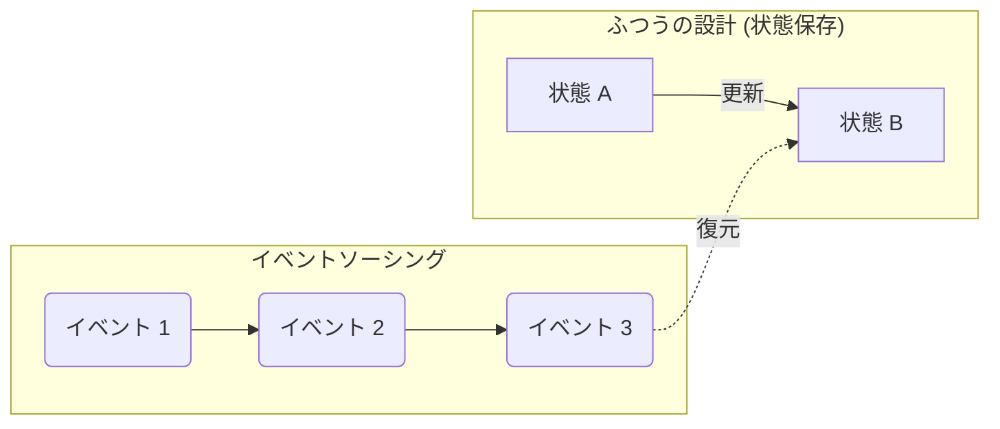
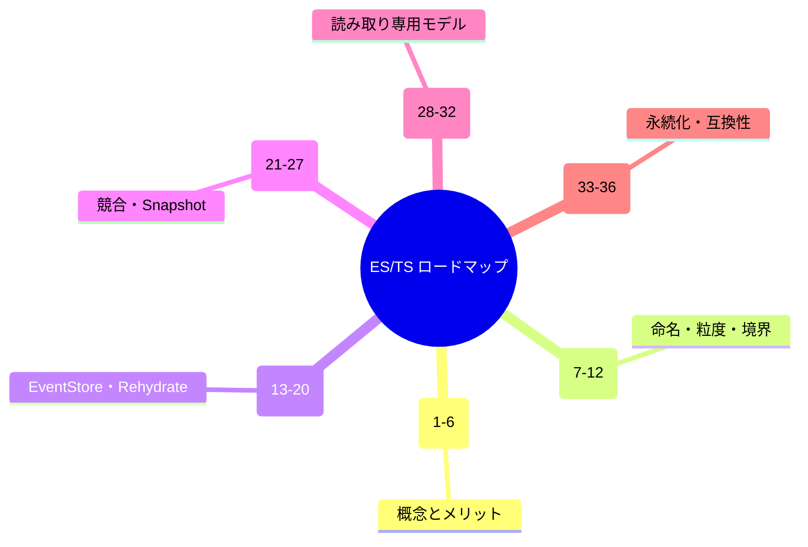

# 第01章：このコースのゴールと進め方🎒✨

## この章でできるようになること🎯🌸

この章が終わったら、次の3つがスッと説明できるようになります😊✨

* 「イベントソーシング」って結局なに？を**一言で言える**🗣️💡
* この36章（ロードマップ）を、**どういう順番で学べば迷子にならないか**が分かる🧭🐾
* 途中で折れやすいポイントを先に知って、**回避ルート**を持てる🚧➡️✅

---

## まずは“全体像”を一枚で🗺️✨

イベントソーシングの超ざっくりイメージはこれ👇


* ふつうの設計：**いまの状態（State）**を保存する📌
* イベントソーシング：**起きた出来事（Event）**を順番に保存する📚➡️
  そして必要なら、出来事を最初から順に当てて**状態を作り直す（復元）**🔁



この考え方は、状態の変化を「イベントとして記録し続ける」ことがコアです。([martinfowler.com][1])

---

## このコースのゴール（36章でたどり着く場所）🏁🎉

このコースの最終ゴールは「イベントソーシングが分かった！」で終わらず、**最小でも筋の通った形**で作れるようになることです😊🧩

* イベントを**それっぽく命名**できる（過去形・粒度）📝✅
* イベント列から**状態を復元**できる（Rehydrate）🔁🧠
* **Command → Event** の流れを“型”として書ける📮✨
* 画面用の読みやすいデータ（Projection）を作れる🔎📋
* 競合・永続化・最低限のテストまで触れて「実戦の入口」に立てる🚪🔥

---

## 学びの順番（迷子にならないルート）🧭🐣

この36章は、ちゃんと「軽い→重い」の順に並んでいます😊✨
第1章では、**どう進むとスムーズか**だけ先に共有するね🌸

1. **導入（1〜6章）**：雰囲気と理由をつかむ☕
2. **言葉と設計の芯（7〜12章）**：命名・粒度・不変条件・境界で事故らない🛡️
3. **最小実装（13〜20章）**：小さいEventStoreから“体で理解”する🧪
4. **現実の課題（21〜27章）**：例外/競合/スナップショット/計測😵‍💫➡️😌
5. **Projection（28〜32章）**：読みモデルを作って「使える形」に🔎✨
6. **永続化と運用（33〜36章）**：保存・互換・冪等・卒業制作🎓🎉



---

## よくある挫折ポイント（先に知ると強い）🚧🫶

イベントソーシングは、ここでつまずきやすいです👇（先に知っておくと安心！）

### ① 「イベント＝通知？」って混ざる📣😵

イベントソーシングの“イベント”は、**保存する事実の記録**（履歴）だよ📚
「誰かに飛ばす通知」とは別物になりがち。ここが混ざると設計がぐちゃっとしやすい🌀
（このあたりの誤解が起きやすい話も整理されています）([martinfowler.com][2])

### ② イベント名が現在形になっちゃう⏳➡️❌

イベントは「起きたこと」だから、基本は**過去形**がしっくりくる😊
例：`ItemAddedToCart` みたいな感じ🛒✨

### ③ 粒度が迷子（デカすぎ・細かすぎ）📏😵‍💫

* デカすぎ：あとで困る（詳細が残らない）
* 細かすぎ：運用がしんどい（数が増えすぎる）
  この“ちょうどよさ”を、章を追うごとに体で覚えるよ💪🌸

### ④ 「イベントに何でも入れたくなる」問題🍱💥

イベントは「事実」を残す場所。
**画面に便利な形**（表示用の合計・整形済みテキスト等）まで詰めると、あとで変更に弱くなりがち🥲
この対策がProjectionにつながるよ🔎✨

---

## 学び方のコツ（ラクして伸びるやつ）🧠✨

### ✅ コツ1：最初は“完璧な設計”を目指さない

イベントソーシングは、最初から美しくやろうとすると疲れます😵‍💫
このコースは、**最小実装 → 失敗しやすい所を知る → 直す**の順で進むよ🔁🌸

### ✅ コツ2：「なぜ嬉しい？」を毎回1行で言う

各章の最後に、これだけ言えればOK😊✨

> 「これがあると、何がラクになるの？」

---

## ミニ演習：身近な出来事を“イベント”で書き出す📝🎀

### お題：カフェのポイントカード☕⭐（例）

「状態」で考えると…

* いまのポイント：`37pt` みたいに“現在だけ”を持ちがち📌

「イベント」で考えると…

* `PointsEarned`（◯pt増えた）
* `PointsRedeemed`（◯pt使った）
* `CardCreated`（カード作った）
  みたいに「起きたこと」を積んでいく📚✨

### やってみよう（3分）⏱️😊

次のルールで、イベントを **5個** 書いてみてね✍️✨

* 1行＝1イベント
* できるだけ「起きたこと」を短く
* 「気持ち」じゃなく「事実」

例（書き方の雰囲気）👇

* `CardCreated`（カード発行）
* `PointsEarned`（+10）
* `PointsRedeemed`（-20）

---

## AI活用：たとえ話を3パターン作ってもらう🤖💭✨

イベントソーシングは「比喩」があると急に分かりやすくなるよ😊🌸
AIには、まず**分かりやすい例え**を量産してもらおう🧃✨

### コピペ用プロンプト（そのまま使える）📌

```text
目的：イベントソーシングの説明を、女子大学生にも分かるたとえ話で理解したいです。
条件：
- 1つ目：日常（家計簿、SNS、買い物など）
- 2つ目：ゲームっぽい例
- 3つ目：学校生活っぽい例
出力：
- 各たとえ話は3〜5行
- 「状態を保存」と「出来事を保存」の違いが分かるように
- 最後に一言でまとめ
```

### AIの答えをチェックするポイント✅👀

* 「イベント＝通知」の話に寄ってない？📣
* 「いまの状態」しか出てきてない？📌
* “出来事の積み上げ”から“状態を作れる”まで言えてる？🔁

---

## 今日のチェック問題（かるく確認）🧪💡

### Q1：イベントソーシングの中心アイデアを一言で言うと？🗣️

**A：** 状態の変化をイベントとして記録し、必要ならイベント列から状態を再構成できるようにすること📚🔁 ([martinfowler.com][1])

### Q2：「イベント」と「現在の状態」の違いは？🧠

**A：** 状態は“いま”、イベントは“起きた履歴”。イベントを積むと、過去から状態を作り直せる📌➡️📚➡️🔁 ([martinfowler.com][2])

---

## ちょい最新トピック（安心材料）🆕✨

TypeScriptは **5.9.3** が npm 上で “Latest” として案内されています（2025-09-30公開）。([NPM][3])
また、TypeScriptは今後ネイティブ化（Goでの移植）を進めていて、6.0を“橋渡し”的な位置づけとして説明しています。([Microsoft for Developers][4])
つまりこのコースは「特定のバージョン小ネタ」よりも、**考え方（設計の芯）**を身につけるのがいちばん強い💪🌸

---

## 次に進む前のひとこと🎒😊

第2章では、「イベントソーシングって何？」を、もっとやさしく “超入門” として腹落ちさせていくよ🌸🧠

[1]: https://martinfowler.com/eaaDev/EventSourcing.html?utm_source=chatgpt.com "Event Sourcing"
[2]: https://martinfowler.com/articles/201701-event-driven.html?utm_source=chatgpt.com "What do you mean by “Event-Driven”?"
[3]: https://www.npmjs.com/package/typescript?activeTab=versions&utm_source=chatgpt.com "typescript"
[4]: https://devblogs.microsoft.com/typescript/progress-on-typescript-7-december-2025/?utm_source=chatgpt.com "Progress on TypeScript 7 - December 2025"
