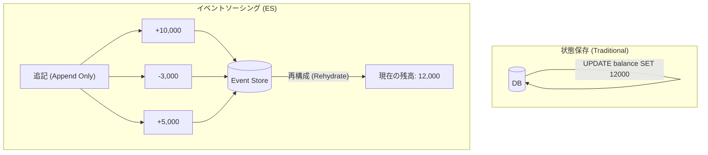
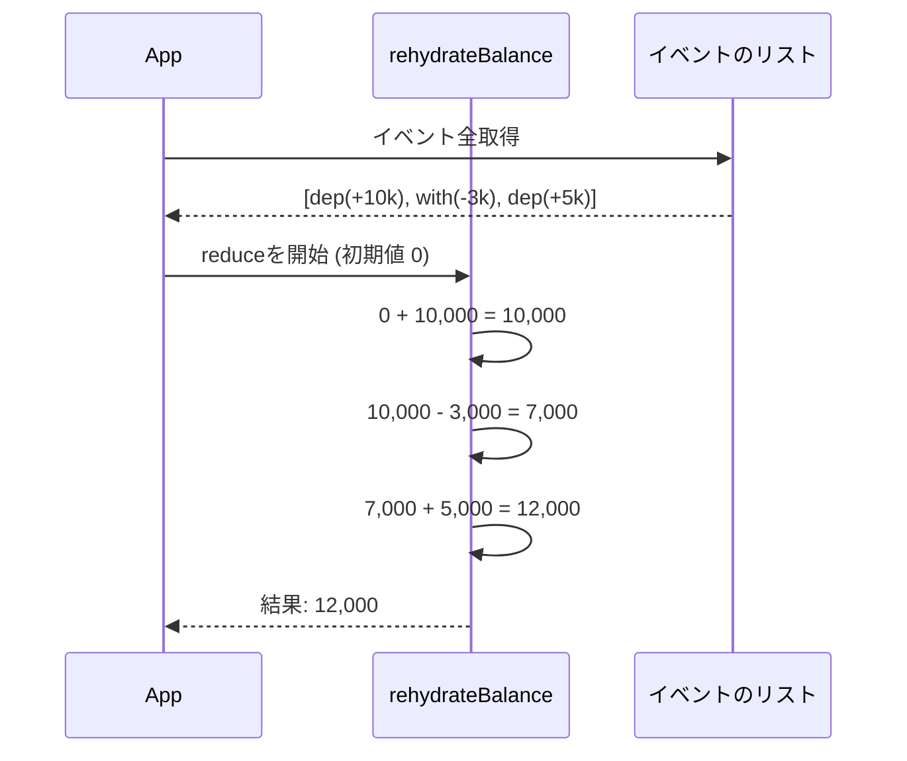

# 第02章：イベントソーシングって何？（超入門）🌸🧠

## この章のゴール🎯✨

* 「状態」じゃなくて「出来事」をためる感覚がわかる😊🧺
* 「残高（いま）」と「入出金（履歴）」の違いを、手を動かして体感できる💰✍️
* “なんで嬉しいの？”が、ふわっとじゃなく説明できるようになる🌈🗣️

---

## まず一言でいうと…🧡

イベントソーシングは、**アプリの状態変化を「イベント（出来事）」として全部記録して、あとから何度でも状態を作り直せる**考え方だよ🔁✨
つまり「いまの状態」を保存する代わりに、「どう変わったか（履歴）」を保存するの📝
（“状態の変化をイベントとして記録して、それを順番に保存する”というのが基本アイデアだよ）([martinfowler.com][1])

---

## 「状態保存」と「イベントソーシング」どこが違うの？🤔💭


### ① よくある保存（状態保存）📌

* 例：口座の **残高 = 12,000円** を保存する💰
* 良いところ：読みやすい／すぐ取り出せる📤✨
* 困るところ：

  * 「なんで12,000円になったの？」が追えない😵‍💫
  * 監査（いつ誰が何した？）が弱い👀💦
  * “過去のある時点”の状態が欲しいときに困る⏳

### ② イベントソーシング📚

* 例：

  * **入金した**（+10,000円）
  * **出金した**（-3,000円）
  * **入金した**（+5,000円）
    …みたいに、**出来事を順番に保存**する🧾➡️🧾➡️🧾
* 状態（残高）は、あとから **イベントを順に適用して作る**🔁✨
  この考え方は、Microsoftの設計パターン解説でも「イベントの列を追記型ストアに記録して扱う」って説明されてるよ🧠📌([Microsoft Learn][2])



---

## どうして嬉しいの？（超ざっくり3つ）🎁✨

### 1) 監査ログが最初から強い🕵️‍♀️📜


「いつ・何が起きたか」が出来事として残るから、後から説明しやすい😊💬
（会計の取引ログみたいな感じだよ💰）([martinfowler.com][3])

### 2) 過去の状態に“戻れる”🕰️🔁


イベントを途中まで再生すれば、**その時点の状態**が作れる✨
「昨日の20:00の残高みたい！」って要求に強くなる😺💪([martinfowler.com][3])

### 3) “もしも”ができる🌙✨


「もしこの入金が無かったら？」みたいな仮想のイベントを混ぜて、別の未来を試せる（デバッグ・検証に便利）🧪🔮([martinfowler.com][3])

---

## でも注意！しんどいところもあるよ⚠️😵


イベントソーシングは魔法じゃない🪄❌
最初にここだけ知っておくと安心だよ😊

* **イベント設計がむずい**（名前・粒度・何を入れる？）🧩💦
* “いまの一覧”を出すには、別の形（Projection）を作りたくなる🔎📄
* 「イベント＝非同期」って思いがちだけど、**必ずしも非同期じゃない**よ（Gitの更新は同期でも成り立つのと同じ）🧠✅([martinfowler.com][3])

---

## ミニ演習：残高（状態）vs 入出金（イベント）💰📝✨

### お題🎒


次の入出金があったよ👇

1. 入金 +10,000
2. 出金 -3,000
3. 入金 +5,000

**Q1:** 状態保存なら、何を保存する？📌
**Q2:** イベントソーシングなら、何を保存する？📚
**Q3:** 「2番目まで終わった時点の残高」はどっちが得意？🕰️

---

## 手を動かす（TypeScriptで超ミニ再生）🧸🔁


「イベントを順に足して、残高を作る」だけの超ミニだよ😊
（ここでは“イベント列から状態が作れる”感覚だけ掴もう！）

```ts
type MoneyDeposited = { type: "MoneyDeposited"; amount: number };
type MoneyWithdrawn = { type: "MoneyWithdrawn"; amount: number };

type AccountEvent = MoneyDeposited | MoneyWithdrawn;

function rehydrateBalance(events: AccountEvent[]): number {
  return events.reduce((balance, e) => {
    switch (e.type) {
      case "MoneyDeposited":
        return balance + e.amount;
      case "MoneyWithdrawn":
        return balance - e.amount;
    }
  }, 0);
}

const events: AccountEvent[] = [
  { type: "MoneyDeposited", amount: 10_000 },
  { type: "MoneyWithdrawn", amount: 3_000 },
  { type: "MoneyDeposited", amount: 5_000 },
];

console.log(rehydrateBalance(events)); // 12000
```



### ちょい追加🌟「途中まで再生」してみよ🕰️

```ts
console.log(rehydrateBalance(events.slice(0, 2))); // 7000
```

✅ これで「2番目までの時点」が簡単に出せるよ！
イベントが残ってると、こういうのが自然にできる😊✨

---

## よくある勘違いベスト3（ここ超大事）🧯✨


1. **「イベント＝画面のクリックイベント？」**
   → ちがうよ🙅‍♀️
   ここでいうイベントは「ドメインの出来事」：例）“商品が追加された”“支払いが完了した”みたいなやつ📮📜

2. **「イベントログをみんなが直接読む必要がある？」**
   → 基本は読まないでOK🙆‍♀️
   人や画面が見たい形は、別に作れる（あとで出てくるProjectionの発想）🔎✨([martinfowler.com][3])

3. **「イベントソーシング＝非同期必須？」**
   → 必須じゃないよ🙆‍♀️
   同期でも成り立つ（Gitの例がわかりやすい）🐙✅([martinfowler.com][3])

---

## AI活用：やさしい説明に言い換えさせよう🤖💭✨

### ① “自分の言葉”を作るプロンプト🫶

コピペして使ってOKだよ📋💡

```text
イベントソーシングを、女子大学生にもわかるように、
たとえ話を2つ（家計簿・推し活・カフェポイント等）使って説明して。
条件：
- 「状態保存」との違いを必ず入れる
- 1つの説明は200文字くらい
- やさしい口調、絵文字多め
```

### ② 演習の答え合わせ用プロンプト✅

```text
次の入出金の例について、
(1) 状態保存で保存する情報
(2) イベントソーシングで保存する情報
(3) 「途中時点の残高」を出しやすいのはどちらか
を理由つきで説明して。

入金 +10000, 出金 -3000, 入金 +5000
```

---

## ちょこっと最新メモ（2026-02-01時点）🗓️✨

* TypeScriptは GitHub Releases で **5.9.3 が Latest** 扱いだよ📦([GitHub][4])
* TypeScript 5.9 のリリースノートには `import defer` などの更新がまとまってる📘([TypeScript][5])
* VS Codeは **1.108（2026-01-08リリース）** の案内があり、Insidersは **1.109（2026-01-26更新）** のノートがあるよ🧠🛠️([Visual Studio Code][6])
* Node/TypeScriptでイベントストア製品に触れるとき、例として **@eventstore/db-client（EventStoreDB 20+ / gRPC）** があるよ📡([jsDelivr][7])

---

## 理解チェック（3問）🧠✅

1. イベントソーシングで「保存の主役」になるのは、状態？出来事？📌
2. 「昨日の20時の状態」を作りやすいのはどっち？🕰️
3. イベントソーシングは非同期必須？🙅‍♀️✅

### こたえ合わせ🎀

1. **出来事（イベント）**📚
2. **イベントソーシング**（途中まで再生できるから）🔁
3. **必須じゃない**（同期でも成り立つ）✅([martinfowler.com][3])

[1]: https://martinfowler.com/eaaDev/EventSourcing.html?utm_source=chatgpt.com "Event Sourcing"
[2]: https://learn.microsoft.com/en-us/azure/architecture/patterns/event-sourcing "Event Sourcing pattern - Azure Architecture Center | Microsoft Learn"
[3]: https://martinfowler.com/articles/201701-event-driven.html "What do you mean by “Event-Driven”?"
[4]: https://github.com/microsoft/typescript/releases "Releases · microsoft/TypeScript · GitHub"
[5]: https://www.typescriptlang.org/docs/handbook/release-notes/typescript-5-9.html "TypeScript: Documentation - TypeScript 5.9"
[6]: https://code.visualstudio.com/updates "December 2025 (version 1.108)"
[7]: https://www.jsdelivr.com/package/npm/%40eventstore/db-client?tab=stats "@eventstore/db-client CDN by jsDelivr - A CDN for npm and GitHub"
