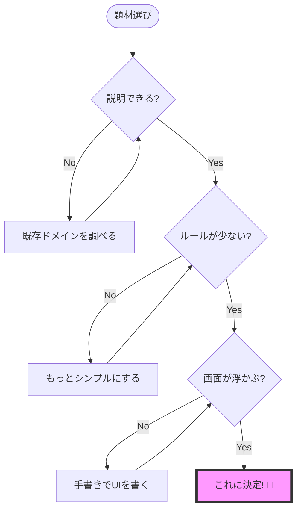
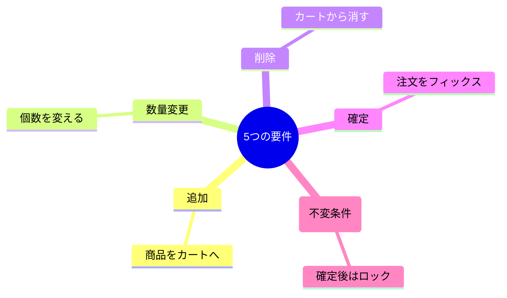

# 第03章：題材ドメイン決め（小さく！）🧺✅

## この章でやること 🎯✨

イベントソーシング学習の“舞台”になる **小さな題材（ドメイン）** を1つ決めて、迷子にならないようにします🧭💕

この章のゴールはこれ👇

* 題材を **1つ** 決める（途中で変えない！）🙅‍♀️
* 要件を **5つだけ** 書く（増やさない！）🖐️
* 要件を **Command候補** に変換する📮✨

---

## まず「題材ドメイン」ってなに？🤔🧠


ここでいう題材ドメインは、学習用に扱う **ミニ世界** のことだよ🌍✨
例：ToDo、買い物カート、家計簿…みたいな「小さくて説明しやすい世界」😊

イベントソーシングでは「状態」じゃなくて「出来事（イベント）」を積むから、題材がブレると…

* 何をイベントにするか迷う😵‍💫
* ルール（不変条件）も増えまくる🌀
* 実装が進まない😭

なので最初に **小さく固定** が大事💎✨

---

## おすすめ題材（迷ったらここから）🐣📚


どれも「イベントっぽい出来事」が作りやすいよ😊✨

1. **ToDo（タスク管理）** ✅📝

* 追加／完了／取り消し／期限変更…などイベントが自然
* UIもシンプルで終わらせやすい✨

2. **買い物カート** 🛒🍎

* 商品追加／数量変更／削除／注文確定…がイベントになりやすい
* “確定したら変更できない”みたいなルールも作れる🛡️

3. **家計簿** 💰📒

* 入金／出金／カテゴリ変更…がイベント化しやすい
* 「残高はイベントの結果として出る」が体験しやすい🔁

> この教材では例として **買い物カート🛒** で説明するね（他を選んでもOKだよ）😊

---

## 「小さく！」の基準（これ超大事）🧊✨


学習用は、**わざと弱くてOK** です😊🌸
次のものは今回“禁止”にしよ🙅‍♀️💦（難しくなるから！）

* ログイン／ユーザー管理 🔑
* 決済 💳
* 在庫のリアル連携 🏭
* 通知（メール/Push）📩
* 検索の高度化 🔎（まずは一覧でOK）
* 外部API連携 🌐
* マルチテナント 🏢🏢

✅ 代わりにやるのはこれだけ：
**「出来事が積める」＋「ルールが少しある」＋「終わる」** 🎀

---

## ステップ1：題材を“1つだけ”選ぶ 🧺✅

### 決め方のコツ（30秒で決める）⏱️💕


* あなたが **説明できる**（使ったことある）
* ルールが **少ない**
* 画面イメージが浮かぶ（一覧→詳細くらい）🖥️✨



迷ったら **ToDo** が最強に進めやすいよ✅😊

---

## ステップ2：要件を5つだけ書く 🖐️📝


## ルール：5つに固定（6つ目は“捨てる”）🗑️✨

ここは筋トレ💪🔥
イベントソーシング以前に「スコープを絞る力」が身につくよ😊

### 例：買い物カートの場合 🛒

要件（5つ）👇

1. 商品をカートに追加できる ➕🍎
2. 商品の数量を変更できる 🔢
3. 商品をカートから削除できる 🗑️
4. 注文を確定できる ✅📦
5. 確定後はカートを編集できない 🔒



> 「配送先」「クーポン」「在庫」…は今回は捨てる🙅‍♀️✨（後でやればOK）

---

## ステップ3：要件をCommand候補に変換する 📮✨


## Commandって？🤔

Commandは「やりたいこと（要求）」だよ😊
イベントソーシングでは基本、ユーザー操作やAPI呼び出しは **Commandとして受け取る** 📮

### 変換ルール（超かんたん）🎀

* 「〜できる」を **“〜しろ”** っぽい命令にする
* 英語にするなら **動詞から**（Add/Remove/Change/Confirm…）
* 1つのCommandは **1つの意思決定** にする🧠✨

### 例：買い物カート（Command候補）🛒

* `AddItemToCart` ➕
* `ChangeItemQuantity` 🔢
* `RemoveItemFromCart` 🗑️
* `ConfirmOrder` ✅
* （5つ目の要件が「確定後編集禁止」なので、Commandではなくルール側で守るのが自然だよ🛡️）

---

## ミニ演習（この章の手を動かすところ）✍️🌸

## 演習A：あなたの題材で「要件5つ」🖐️📝


1. 題材を1つ選ぶ（ToDo/カート/家計簿）🎯
2. 要件を5つだけ書く🖐️
3. “捨てた要件”を下にメモしておく（安心するため）🧺✨

おすすめの書き方👇

```md
## 題材：◯◯

## 要件（5つだけ）
1.
2.
3.
4.
5.

## 今回やらない（捨てる）
- 
- 
```

（このメモを `docs/domain.md` に置くと迷子防止にめっちゃ効くよ📌✨）

---

## 演習B：要件→Command候補に変換📮✨

要件5つをそれぞれCommandにしてみよ😊

```md
## Command候補
- 
- 
- 
- 
```

✅ ここも「5つで止める」ね🖐️✨

---

## AI活用（Copilot / Codexの使い方）🤖💖

ここは“丸投げ”じゃなくて、**あなたが決めるための補助** に使う感じ😊✨
（AIは候補を出すのが得意、最終決定はあなたが強い💪）

## プロンプト①：題材に合う要件を5つだけ出す🧺🖐️

```text
あなたはイベントソーシング入門の講師です。
題材は「（ここに題材）」です。
学習用なのでスコープは小さく、要件は“必ず5つだけ”にしてください。

出力:
- 要件を日本語で5つ（番号付き）
- 今回やらない要素を5つ（箇条書き）
- なぜ捨てたかを1行で
```

「絶対5つ」って縛るのがコツだよ🖐️✨

---

## プロンプト②：要件→Command候補（名前案も）📮✨

```text
次の要件をイベントソーシングのCommand候補に変換してください。
- Commandは“意思決定の単位”になるようにする
- それぞれ PascalCase の英語名 + 日本語説明 をセットで
- 5個だけ出す（増やさない）

要件:
1) ...
2) ...
3) ...
4) ...
5) ...
```

英語名は「後でコードにする」から、早めに形を作ると楽だよ😊🧩

---

## プロンプト③：スコープが膨らんでないかチェック👀🧯

```text
以下の要件/Command候補が、学習用として大きすぎないかレビューしてください。
- 大きい場合は「削る/後回しにする」提案をしてください
- ただし要件は5つを維持してください

要件:
...
Command候補:
...
```

AIに「削らせる」のも上手な使い方だよ✂️😊

---

## “小ささ”セルフチェック✅🧊

最後にこれだけ確認してね✨

* [ ] 題材は1つに決まった🎯
* [ ] 要件は5つ（増えてない）🖐️
* [ ] Command候補も5つ（増えてない）📮
* [ ] ログイン/決済/外部連携を入れてない🙅‍♀️
* [ ] 画面は「一覧＋詳細」くらいを想定できる🖥️

全部OKなら、この章はクリア🎉✨

---

## 安全メモ（AI拡張を入れるとき）🔐🧯

VS Codeの拡張には、見た目がそれっぽくても **危ないものが混ざる** ことがあるよ😱
特に「AI系っぽい名前」の拡張は、提供元や評価をちゃんと見てね👀✨  ([TechRadar][1])

---

## 参考（最新状況の確認用）📌

TypeScriptやVS Codeはアップデートが速いので、公式の更新ページをたまに見る習慣があると安心だよ😊✨

* VS Code Insiders の 1.109 リリースノート（2026-01-26更新） ([Visual Studio Code][2])
* TypeScript 5.9 のリリースノート（2026-01-27更新） ([TypeScript][3])
* Codex をVS Codeで使うための案内（OpenAI公式） ([OpenAI Developers][4])

- [TechRadar](https://www.techradar.com/pro/security/malicious-microsoft-vscode-ai-extensions-might-have-hit-over-1-5-million-users?utm_source=chatgpt.com)
- [theverge.com](https://www.theverge.com/news/808032/github-ai-agent-hq-coding-openai-anthropic?utm_source=chatgpt.com)
- [TechRadar](https://www.techradar.com/pro/openai-launches-gpt-5-codex-with-a-74-5-percent-success-rate-on-real-world-coding?utm_source=chatgpt.com)

[1]: https://www.techradar.com/pro/security/malicious-microsoft-vscode-ai-extensions-might-have-hit-over-1-5-million-users?utm_source=chatgpt.com "Malicious Microsoft VSCode AI extensions might have hit over 1.5 million users"
[2]: https://code.visualstudio.com/updates/v1_109?utm_source=chatgpt.com "January 2026 Insiders (version 1.109)"
[3]: https://www.typescriptlang.org/docs/handbook/release-notes/typescript-5-9.html?utm_source=chatgpt.com "Documentation - TypeScript 5.9"
[4]: https://developers.openai.com/codex/ide/?utm_source=chatgpt.com "Codex IDE extension"
