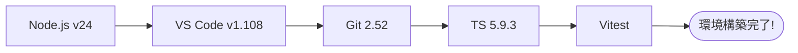

# 第04章：環境セットアップ（VS 2026）🪟🛠️

## ねらい 🎯✨

この章が終わったら、次の章からの実装が“迷子にならずに”進められるように、土台をサクッと作るよ〜😊💕

* エディタ（VS Code）でTypeScriptが快適に書ける✍️✨
* ターミナルでコマンドが動く💻⚡
* テストが1本動く（これがあると安心感が段違い🧪🌸）
* Gitでコミットできる📦✅



---

## 1. 必要な道具を揃えよう🧰✨


### 1) VS Code（エディタ）💻
最新安定版のリリースノートは「version 1.108（Release date: 2026-01-08）」が基準になってるよ。([Visual Studio Code][1])

### 2) Node.js（LTS）🟩🧩
学習用途は “Current（最新機能）” よりも **Active LTS** が安定でおすすめだよ〜😊
2026年1月時点で **v24（Krypton）がActive LTS** で、v25はCurrent（最新機能枠）になってるよ。([Node.js][2])

**③ Git for Windows** 🧷📚
Gitの最新版（Windows向け）は「2.52.0（2025-11-17）」が案内されてるよ。([Git][3])

**④ TypeScript（プロジェクトに入れる）** 🟦🧠
TypeScriptは **プロジェクトごとに devDependencies として入れる**のが基本だよ（環境差の事故が減る✨）。
TypeScriptの最新リリース表示は **5.9.3 が “Latest”** になってるよ。([GitHub][4])

---

## 4-2. インストール後の動作チェック（ここ大事）✅🔍


VS Codeでターミナルを開いて（`Ctrl + @` で出るよ💡）、次を確認するよ〜😊

```powershell
node -v
npm -v
git --version
```

* `node -v` が **v24.x** っぽい数字ならOK（Active LTSのラインだよ）([Node.js][2])
* `git --version` が出ればOK🎉

💡 もし `node` が「見つかりません」って言われたら…

* いったん **VS Codeを再起動**（PATHの反映が遅れることあるある😵‍💫）
* それでもダメなら **Windowsを再起動**（最終兵器🪄）

---

## 4-3. VS Codeに入れる拡張（“最低限”で気持ちよく）🧩💖


VS Codeの拡張（Extensions）で、まずはこれだけ✨

* **ESLint** 🧹（変な書き方を早めに注意してくれる）
* **Prettier** 💅（自動整形で見た目が揃う）
* **GitHub Copilot / AI拡張** 🤖✨（下書き→レビュー→修正の流れが早くなる）

※ AI拡張は「書いて終わり」じゃなくて、**“レビュー係”にすると強い**よ👀📝💕

---

## 4-4. 学習用プロジェクトを作る（最小構成）🧪🚀

ここからは、イベントソーシングの題材を作る前に、**TypeScript + テストが動く箱**を用意するよ📦✨
（この“箱”があるだけで、後の章が超スムーズになるの🥹💗）

### 1) フォルダ作成 & 初期化 📁✨


```powershell
mkdir es-tutorial
cd es-tutorial
npm init -y
```

### 2) 必要パッケージを入れる（TypeScript + テスト）🧠🧪

テストは **Vitest** を使うよ（最近の案内も更新が続いてるタイプのやつ✨）([vitest.dev][5])

```powershell
npm i -D typescript vitest @types/node
```

### 3) tsconfig を作る ⚙️✨


```powershell
npx tsc --init
```

次に、`tsconfig.json` を “学習向けに” 軽く整えるよ😊
（ここでは難しいことしない！ちゃんと動くのが優先💖）

例：こんな感じ（最低限）👇

```json
{
  "compilerOptions": {
    "target": "ES2023",
    "module": "NodeNext",
    "moduleResolution": "NodeNext",
    "outDir": "dist",
    "rootDir": "src",
    "strict": true,
    "esModuleInterop": true,
    "skipLibCheck": true
  }
}
```

💡 TypeScript 5.9 では Node向け設定の話も整理されてきてる（`node20` みたいな安定オプションも追加されてる）ので、Node系の設定は今後も改善される流れだよ。([TypeScript][6])

### 4) ソースを作る（Helloの代わりに小さな関数）🧸✨

`src` フォルダを作って…

```powershell
mkdir src
```

`src/index.ts` を作成👇

```ts
export function add(a: number, b: number) {
  return a + b;
}
```

### 5) テストを1本作る 🧪🌸

`src/index.test.ts` を作成👇

```ts
import { describe, it, expect } from "vitest";
import { add } from "./index";

describe("add", () => {
  it("2 + 3 = 5", () => {
    expect(add(2, 3)).toBe(5);
  });
});
```

### 6) package.json にスクリプトを足す 🏃‍♀️💨

`package.json` の `"scripts"` をこんな感じにするよ👇

```json
{
  "scripts": {
    "test": "vitest",
    "test:watch": "vitest --watch",
    "build": "tsc",
    "start": "node dist/index.js"
  }
}
```

### 7) テスト実行！（成功体験〜！）🎉✨


```powershell
npm test
```

✅ 緑で通ったらOK〜〜〜🥳🟢
ここまで来たら「環境の土台」が完成だよ💗

---

## 4-5. よくある詰まりポイント集（ここ見ればだいたい助かる）🧯😵‍💫


### 🌀 1) `npx` や `npm` が動かない

* VS Code再起動 → ダメならWindows再起動
* 会社PCだとプロキシで詰まることもあるよ（その場合はネットワーク担当に相談が早い…！😿）

### 🌀 2) テストで `Cannot find module` 系

* `npm i` が途中で失敗してることが多いよ
* `node_modules` と `package-lock.json` を消して入れ直しが効くこと多め🧹✨

```powershell
rmdir /s /q node_modules
del package-lock.json
npm i
```

### 🌀 3) TypeScriptの設定が難しく見える

* 今は “完璧なtsconfig” を目指さないでOK😊
* **「ビルドできる」「テストできる」** が正義だよ〜💖

---

## 4-6. ミニ演習（チェックリスト）📝✅✨


今日のゴールはこれだけっ🌸

* [ ] `node -v` が表示される
* [ ] `git --version` が表示される
* [ ] `npm test` が成功する（テスト1本）
* [ ] 1回コミットできる📦✅

コミットはこれ👇（やっておくと後で本当に助かる…！）

```powershell
git init
git add .
git commit -m "ch04: setup typescript + vitest"
```

---

## 4-7. AI活用（この章で使うと強いプロンプト例）🤖💡✨

VS CodeのAI拡張に、こんな感じで頼むとめっちゃ捗るよ〜😊💗

**🧩 tsconfig を学習向けに整える**
「NodeのTypeScriptプロジェクトで、学習用にシンプルなtsconfig.jsonにしたい。テストはVitest。Windowsで動く前提で、複雑にしない構成を提案して。」

**🧪 テストが落ちたときの切り分け**
「このエラーの原因候補を “優先度順” に3つ出して。確認コマンドも一緒に。」

**🧹 ESLint/Prettierの最小セット**
「TypeScriptの学習用。ルールは厳しすぎない。VS Codeで保存時整形が効く最小設定を作って。」

---

ここまでできたら、次の章からイベントソーシングの中身に入っても“環境で転ばない”よ〜😊🛡️💕

[1]: https://code.visualstudio.com/updates?utm_source=chatgpt.com "December 2025 (version 1.108)"
[2]: https://nodejs.org/en/about/previous-releases?utm_source=chatgpt.com "Node.js Releases"
[3]: https://git-scm.com/install/windows?utm_source=chatgpt.com "Git - Install for Windows"
[4]: https://github.com/microsoft/typescript/releases "Releases · microsoft/TypeScript · GitHub"
[5]: https://vitest.dev/guide/?utm_source=chatgpt.com "Getting Started | Guide"
[6]: https://www.typescriptlang.org/docs/handbook/release-notes/typescript-5-9.html?utm_source=chatgpt.com "Documentation - TypeScript 5.9"
