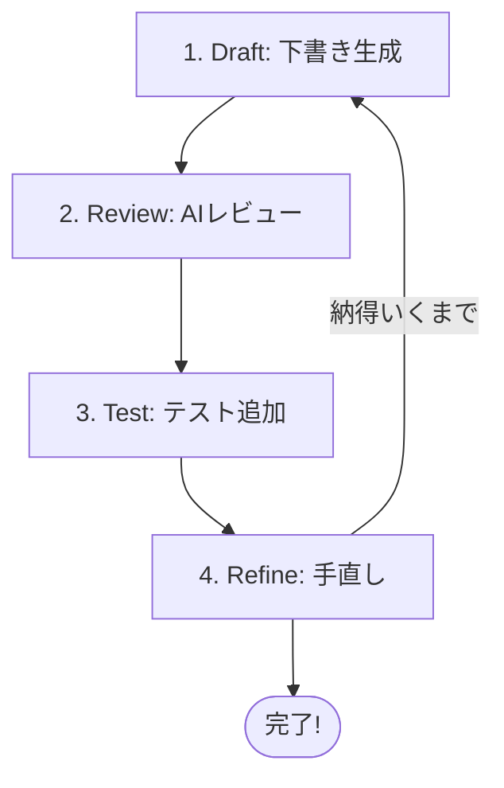

# 第05章：GitHubとAI拡張の“使い方の型”🤖🧠✨

## この章のゴール🎯

AIを「丸投げ道具」じゃなくて、**開発の流れの中で安定して使える“型”**にするよ〜💪😊
この章が終わると、こんな感じで回せるようになる👇

* ① 下書き生成 ✍️ → ② レビュー 🔍 → ③ テスト追加 🧪 → ④ 手直し 🛠️
* PR（プルリク）で **AIレビューを受けてから** 自分で最終判断できる✅ ([GitHub Docs][1])
* リポジトリに「AIへの指示（ルール）」を置いて、毎回ブレにくくする📌 ([GitHub Docs][2])

---

## 5.1 まず覚える“鉄板の考え方”🧠✨

## ✅ AIは「優秀だけど早とちりする後輩」👩‍💻🧑‍💻


* 仕事は速いけど、たまに **前提を勝手に決めて** 走る💨
* だから「指示の型」「テスト」「レビュー」が超大事🧪🔍



## ✅ “型”がないと起きがちな事故😵‍💫

* それっぽいコードができて満足 → **テストなし**で壊れる💥
* 依存パッケージが増える → **セキュリティ的に怖い**😱
* PR説明がふわっとする → レビューが進まない🌀

---

## 5.2 今日から使う「4ステップの型」🔁✨

ここからが本編の型だよ〜💡😊
どの機能（エディタ補完/チャット/PRレビュー/エージェント）を使っても、基本は同じ！

---

## ① 下書き生成（Draft）✍️🤖


**目的：ゼロから悩む時間を減らす**🕒✨
ただし「正解を出してもらう」じゃなくて、**叩き台を作る**のがコツ！

やること👇

* 仕様を短く書く（目的・制約・入力/出力）🧾
* 叩き台コードを出してもらう🧱
* “どこが怪しいか”も一緒に出させる👀

**プロンプトの型（例）**📌

```text
目的：◯◯を実装したい
制約：新しい依存は増やさない／例外は投げずResultで返す／関数は小さめ
入出力：入力は〜、出力は〜
テスト：最低でも成功1・失敗1の観点を提示して
お願い：まず設計の方針→次にコード案→最後に危険ポイントを列挙して
```

🌟ポイント：
「いきなりコード」より、**方針→コード→リスク**の順が安定するよ😊

---

## ② レビュー（Review）🔍🤖✅


**目的：AIに“引っかかりポイント”を先に見つけてもらう**🧠✨

## A) エディタ内レビュー（軽く）🪄

* 変更した関数や差分を選んで「レビューして」って頼む
* ここはスピード重視💨

## B) PRでレビュー（しっかり）📮🔍

PR（プルリク）では、**Copilotをレビュワーにできる**よ✅ ([GitHub Docs][1])
さらに **PRサマリー（要約）**もあるけど、万能じゃないので「責任ある使い方」が前提だよ〜🧯 ([GitHub Docs][3])

**レビューでAIに必ず聞く観点（テンプレ）**🧾

* 仕様とズレてない？🎯
* 例外/エラーは整理されてる？🚦
* 型は安全？（any増えてない？）🧷
* 境界（入力チェック）が弱くない？🧱
* テスト観点が足りてる？🧪

---

## ③ テスト追加（Test）🧪✨


**目的：AIの“それっぽい”を現実の動作に縛る**🔒😺

AIにお願いするときは、次の順が安定するよ👇

1. 観点（テストケース）を先に出す🧠
2. そのあとテストコード🧪
3. 実装がテストに沿ってるか再チェック🔁

**プロンプトの型（例）**📌

```text
この変更のテスト観点を5つ出して（成功/失敗/境界/異常系を混ぜて）
次に、観点に対応するテストコード案を出して
最後に、テストが不足していそうな箇所を指摘して
```

---

## ④ 手直し（Refine）🛠️✨


**目的：AIが作ったものを“自分のコード”に仕上げる**💅😊

ここでやること👇

* 命名を整える（読みやすさUP）📛
* 関数を小さくする（責務を分ける）✂️
* 依存を増やしすぎない（後で泣かない）😭
* コメントより「コードで説明」寄りにする🧼

---

## 5.3 “ブレないAI”にする：指示ファイルを置こう📌📁


AIが安定する最大のコツはこれ！
**リポジトリにルールを書いておく**と、Copilot Chat・コードレビュー・エージェントにも効きやすいよ✅ ([GitHub Docs][2])

## ✅ `.github/copilot-instructions.md`（リポジトリ共通ルール）🧾

* ここに「ビルド/テスト方法」「コーディング規約」「禁止事項」などを書く✍️
* しかも **Copilot code reviewにも反映**される前提で説明されてるよ🔍 ([GitHub Docs][2])

**サンプル（そのまま使える雰囲気）**👇

```md
## Copilot Instructions

## 基本
- 返答・コメントは日本語
- TypeScriptは strict を前提に、any を増やさない
- 例外で制御しない（ドメインエラーは Result で返す）

## コーディング
- 関数は短め、1関数1責務
- 命名は「意図が伝わる」こと優先（短さより明確さ）

## テスト
- 変更があったらテストも更新
- 成功1 + 失敗1 は最低ライン

## 禁止
- 新しい依存ライブラリ追加は必ず理由を説明してから
- シークレット/APIキーっぽい文字列をコードに入れない
```

---

## 5.4 さらに安定：VS Codeの「Prompt Files」も使う📚🤖

“毎回同じお願い”をするなら、**プロンプトをファイル化**しちゃうのがラク！📌
VS Codeには「Prompt files（再利用プロンプト）」の仕組みがあるよ〜✨ ([Visual Studio Code][4])

例：`.github/prompts/review.md` を作る（イメージ）👇

```md
## PRレビュー用プロンプト

- 仕様とズレていないか
- 型安全性（any、as乱用）チェック
- エラー処理の一貫性
- テスト観点の不足
- 将来の拡張で壊れそうな点

最後に「危険度：低/中/高」で一言つけて
```

---

## 5.5 発展：Copilotの“エージェント”と、OpenAI Codex系🧑‍🚀🧰

## 🧑‍🚀 Copilot coding agent（Issueを渡すとPRを作る）

「IssueをCopilotにアサインして、修正→PR作成」みたいな流れが用意されてるよ📮✨ ([GitHub Docs][5])
しかも最近の更新では、エージェントが作ったコードに対して **セキュリティ/品質チェック（CodeQLや依存のチェック、シークレット検出）**を自動でやる方向が示されてるよ🔐🧯 ([The GitHub Blog][6])

## 🧰 OpenAI Codex CLI（ターミナルで動くコーディング支援）

OpenAI側も「Codex CLI」という形で、ターミナルUIでの支援やコードレビュー、承認モード、MCPでの外部コンテキスト連携などを提供してるよ🖥️🤖 ([OpenAI Developers][7])

※この教材ではまず「4ステップの型」を軸にして、どのAIを使っても崩れない基礎体力を作るよ💪😊

---

## 5.6 セキュリティ注意（超だいじ）🔐⚠️


## ✅ 拡張機能は“公式っぽい名前”でも危ないことがある😱

VS Codeの拡張機能として、AI系を名乗る悪性拡張が問題になった例も報告されてるよ…🧨 ([TechRadar][8])

**やること（最低ライン）**✅

* 拡張の提供元（Publisher）をちゃんと見る👀
* 変な権限要求が多い拡張は避ける🙅‍♀️
* APIキーやトークンは貼らない（ログや共有で事故る）🧯
* リポジトリ側のシークレット検出やスキャンも活用する🔍🧷 ([The GitHub Blog][6])

---

## 5.7 ミニ演習：レビュー観点チェックリストをAIに作らせる✅📝

## ステップ1：題材の“今回の変更”を1行で書く🖊️

例：

* 「カートの数量変更コマンドを追加した」🛒
* 「イベントのApply漏れがないよう整理した」🔁

## ステップ2：AIに“観点”を作らせる🤖✨

```text
この変更のコードレビュー観点チェックリストを作って。
初心者が見落としやすい項目も混ぜて、10個。
各項目に「なぜ重要か」を1行で添えて。
```

## ステップ3：そのチェックリストで自分の差分を見る🔍✅

* 3つでも引っかかったら勝ち！🎉（早めに直せるから）

---

## 5.8 この章のまとめ🌸✨

* AIは「叩き台→レビュー→テスト→手直し」の **4ステップの型**で安定する🔁🤖
* `.github/copilot-instructions.md` で **毎回のブレ**を減らせる📌 ([GitHub Docs][2])
* PRでのCopilotレビューや要約は便利だけど、**最後は自分で判断**が基本だよ🔍✅ ([GitHub Docs][1])
* 拡張機能の安全性チェックはほんと大事🔐⚠️ ([TechRadar][8])

---

* [TechRadar](https://www.techradar.com/pro/security/malicious-microsoft-vscode-ai-extensions-might-have-hit-over-1-5-million-users?utm_source=chatgpt.com)
* [TechRadar](https://www.techradar.com/pro/angry-github-users-want-to-ditch-copilot-features-forced-upon-them?utm_source=chatgpt.com)
* [theverge.com](https://www.theverge.com/command-line-newsletter/668251/chatgpt-is-getting-an-ai-coding-agent?utm_source=chatgpt.com)

[1]: https://docs.github.com/ja/copilot/how-tos/use-copilot-agents/request-a-code-review/use-code-review?utm_source=chatgpt.com "GitHub Copilot コード レビューの使用"
[2]: https://docs.github.com/copilot/how-tos/agents/copilot-coding-agent/best-practices-for-using-copilot-to-work-on-tasks?utm_source=chatgpt.com "Best practices for using GitHub Copilot to work on tasks"
[3]: https://docs.github.com/en/copilot/responsible-use/pull-request-summaries?utm_source=chatgpt.com "Responsible use of GitHub Copilot pull request summaries"
[4]: https://code.visualstudio.com/docs/copilot/customization/prompt-files?utm_source=chatgpt.com "Use prompt files in VS Code"
[5]: https://docs.github.com/en/copilot/get-started/features?utm_source=chatgpt.com "GitHub Copilot features"
[6]: https://github.blog/changelog/2025-10-28-copilot-coding-agent-now-automatically-validates-code-security-and-quality/?utm_source=chatgpt.com "Copilot coding agent now automatically validates ..."
[7]: https://developers.openai.com/codex/cli/?utm_source=chatgpt.com "Codex CLI"
[8]: https://www.techradar.com/pro/security/malicious-microsoft-vscode-ai-extensions-might-have-hit-over-1-5-million-users?utm_source=chatgpt.com "Malicious Microsoft VSCode AI extensions might have hit over 1.5 million users"
