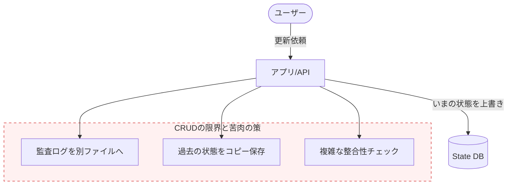

# 第06章：まずCRUDを作って“限界”を見る😺🧱

## この章でできるようになること🎯✨

* CRUD（Create / Read / Update / Delete）を **“状態を保存する”やり方** でサクッと作れる😊
* そのやり方が **どこで苦しくなるか** を、手を動かして体感できる😵‍💫
* 「だから“出来事（履歴）”を積みたくなるんだ…！」の気持ちが分かる🔁✨

---

## 1) 今日の題材：ミニ「お買い物カート」🛒💕


最小でいくよ〜！✨
カートに対して、こんなCRUDを作るよ😊

* **Create**：カートを作る🆕
* **Read**：カートの中身を見る👀
* **Update**：商品を追加 / 数量変更 / 削除🔧
* **Delete**：カートを消す🗑️

> ここでは「状態（いまの中身）」を **丸ごと保存** する方式で作るよ📦
> （あとで“履歴が欲しい…”って泣くために…！😂）

---

## 2) まずは“状態保存CRUD”を作る🧱✨

## 2-1. 使うバージョン感（2026-02時点）📝

* TypeScript の最新は **5.9.3**（npmのLatest）だよ😊 ([NPM][1])
* Node.js は **v24 が Active LTS**（安定して使うならこのへんが安心）🟢 ([Node.js][2])

---

## 2-2. フォルダ構成（最小）📁✨

こんな感じにするよ〜😊

```text
cart-crud/
  package.json
  tsconfig.json
  data/
    carts.json
  src/
    cart.ts
    cartStore.ts
    cartService.ts
    demo.ts
```

---

## 2-3. 初期化（コマンド）🪄

（npmで例を書くね😊）

```powershell
mkdir cart-crud
cd cart-crud
npm init -y
npm i -D typescript tsx @types/node
```

---

## 2-4. tsconfig.json（Node向けにスッキリ）🧠✨

TypeScript 5.9 には `module: "node20"` みたいな **Node向けの安定オプション** があるよ😊（設定がブレにくくておすすめ） ([TypeScript][3])

```json
{
  "compilerOptions": {
    "target": "ES2023",
    "module": "node20",
    "moduleResolution": "node20",

    "strict": true,
    "skipLibCheck": true,

    "outDir": "dist"
  },
  "include": ["src"]
}
```

---

## 2-5. package.json（スクリプト追加）🏃‍♀️💨

```json
{
  "name": "cart-crud",
  "private": true,
  "type": "module",
  "scripts": {
    "dev": "tsx watch src/demo.ts",
    "build": "tsc -p .",
    "start": "node dist/demo.js"
  }
}
```

---

## 3) コードを書くよ〜✍️✨（状態を保存するCRUD）

## 3-1. ドメイン（Cartの型）🛒

`src/cart.ts`

```ts
export type CartId = string;
export type ItemId = string;

export type CartItem = {
  itemId: ItemId;
  name: string;
  price: number; // 今回は number で雑に（通貨は後で丁寧にするのが本当は◎）
  qty: number;
};

export type Cart = {
  id: CartId;
  items: CartItem[];
  createdAt: string;
  updatedAt: string;
};

export function nowIso(): string {
  return new Date().toISOString();
}

export function newId(prefix: string): string {
  // ざっくりID（本番はUUIDなどにするのが普通だよ😊）
  return `${prefix}_${Math.random().toString(16).slice(2)}_${Date.now()}`;
}
```

---

## 3-2. “状態”をJSONに保存するストア📦🗄️

`src/cartStore.ts`

```ts
import { promises as fs } from "node:fs";
import path from "node:path";
import { Cart } from "./cart.js";

const dataDir = path.resolve("data");
const cartsPath = path.join(dataDir, "carts.json");

type DbShape = {
  carts: Record<string, Cart>;
};

async function ensureFile(): Promise<void> {
  await fs.mkdir(dataDir, { recursive: true });
  try {
    await fs.access(cartsPath);
  } catch {
    const init: DbShape = { carts: {} };
    await fs.writeFile(cartsPath, JSON.stringify(init, null, 2), "utf-8");
  }
}

export class CartStore {
  async load(): Promise<DbShape> {
    await ensureFile();
    const text = await fs.readFile(cartsPath, "utf-8");
    return JSON.parse(text) as DbShape;
  }

  async save(db: DbShape): Promise<void> {
    await ensureFile();
    await fs.writeFile(cartsPath, JSON.stringify(db, null, 2), "utf-8");
  }
}
```

---

## 3-3. CRUDサービス（状態を直接いじる）🔧✨

`src/cartService.ts`

```ts
import { Cart, CartItem, ItemId, newId, nowIso } from "./cart.js";
import { CartStore } from "./cartStore.js";

export class CartService {
  constructor(private readonly store: CartStore) {}

  async createCart(): Promise<Cart> {
    const db = await this.store.load();
    const id = newId("cart");
    const t = nowIso();

    const cart: Cart = { id, items: [], createdAt: t, updatedAt: t };
    db.carts[id] = cart;

    await this.store.save(db);
    return cart;
  }

  async getCart(cartId: string): Promise<Cart | null> {
    const db = await this.store.load();
    return db.carts[cartId] ?? null;
  }

  async addItem(cartId: string, input: Omit<CartItem, "qty"> & { qty?: number }): Promise<Cart> {
    const db = await this.store.load();
    const cart = db.carts[cartId];
    if (!cart) throw new Error("Cart not found");

    const qty = input.qty ?? 1;
    if (qty <= 0) throw new Error("qty must be positive");

    const existing = cart.items.find(x => x.itemId === input.itemId);
    if (existing) {
      existing.qty += qty;
    } else {
      cart.items.push({ ...input, qty });
    }

    cart.updatedAt = nowIso();
    await this.store.save(db);
    return cart;
  }

  async changeQty(cartId: string, itemId: ItemId, qty: number): Promise<Cart> {
    const db = await this.store.load();
    const cart = db.carts[cartId];
    if (!cart) throw new Error("Cart not found");
    if (qty <= 0) throw new Error("qty must be positive");

    const item = cart.items.find(x => x.itemId === itemId);
    if (!item) throw new Error("Item not found");

    item.qty = qty;
    cart.updatedAt = nowIso();
    await this.store.save(db);
    return cart;
  }

  async removeItem(cartId: string, itemId: ItemId): Promise<Cart> {
    const db = await this.store.load();
    const cart = db.carts[cartId];
    if (!cart) throw new Error("Cart not found");

    cart.items = cart.items.filter(x => x.itemId !== itemId);
    cart.updatedAt = nowIso();
    await this.store.save(db);
    return cart;
  }

  async deleteCart(cartId: string): Promise<void> {
    const db = await this.store.load();
    delete db.carts[cartId];
    await this.store.save(db);
  }
}
```

---

## 3-4. 動作確認デモ🎬✨

`src/demo.ts`

```ts
import { CartService } from "./cartService.js";
import { CartStore } from "./cartStore.js";

const svc = new CartService(new CartStore());

const cart = await svc.createCart();
console.log("🆕 created:", cart.id);

await svc.addItem(cart.id, { itemId: "apple", name: "りんご", price: 120, qty: 2 });
await svc.addItem(cart.id, { itemId: "milk", name: "牛乳", price: 220, qty: 1 });
await svc.changeQty(cart.id, "apple", 5);
await svc.removeItem(cart.id, "milk");

const after = await svc.getCart(cart.id);
console.log("✅ current state:", JSON.stringify(after, null, 2));
```

実行😊

```powershell
npm run dev
```

ここまでで「状態を保存するCRUD」完成〜！🎉✨
…でもね、ここからが本番😂

---

## 4) “限界”を追加要求で殴ってみる🥊😵‍💫

## 4-1. 追加要求①「いつ・誰が・何をしたか知りたい」🕵️‍♀️📝

先生（または未来の自分）がこう言い出す：

* 「監査で必要だから、変更履歴が欲しいんだけど？」😇
* 「誰が数量変えたの？」😇
* 「理由も残して」😇

今の `carts.json` って、**最新の状態しかない** よね？😵
「なぜそうなったか」が消えてるの…！

### CRUDでのありがちな対処（つらいやつ）😭

* `updatedBy` を Cart に足す
* 操作ごとに `reason` を足す
* でも、更新って何種類もある

  * 追加、数量変更、削除…
* 結果：「状態の中に“履歴っぽいもの”が混ざり始める」🌀

**状態の器に、ログを無理やり詰める感じ**になっていくよ…😵‍💫



---

## 4-2. 追加要求②「昨日の状態に戻したい」⏪🕰️

さらに言われる：

* 「間違えて消したから、昨日の15:03の状態に戻して」🙏

CRUDだと、よくある案は2つ👇

### 案A：スナップショット（状態のコピー）を毎回残す📸

* 更新のたびに “前のCart” を丸ごとコピーして保存
* すぐ実装できるけど…

**問題：データが爆増**😂
カートが大きいほど、コピーも大きい😇

### 案B：操作ログを別に残す（追加するたびにログを書く）📜

「じゃあログファイル作るか！」ってなるよね😊
でもここで重要な地獄がある👇

* 状態の更新（carts.json書き換え）
* ログの追記（audit.log追記）

この2つが **ズレたら終わり** 😭
（片方だけ成功したら、履歴と状態が一致しない…！）

---

## 4-3. 追加要求③「履歴を検索したい」🔎😵‍💫

* 「りんごを追加した人だけ一覧で」
* 「価格が変わった瞬間だけ抽出して」
* 「キャンセル理由が“在庫切れ”のやつだけ」

CRUDの状態保存だと、**履歴がないから検索できない**。
結局「ログを増やす」「別テーブル増やす」「整合性が崩れる」…って、追加設計が止まらない🌀🌀

---

## 5) CRUD（状態保存）が苦しくなる“本質”🧠💥

## 5-1. 状態には「なぜ」が入ってない😵

状態は「結果」だけ。
でも実務で欲しいのは、だいたいこっち👇

* 何が起きた？（出来事）📌
* いつ起きた？（時刻）🕒
* 誰がやった？（主体）🙋‍♀️
* どういう意図？（理由）💬

CRUDは、ここを後付けし始めると **構造が崩れやすい** 😭

---

## 5-2. “巻き戻し”が設計にない😵‍💫

状態保存は「上書き」が基本。
だから「昔に戻す」は **別の仕組み** を作らないと無理😇

---

## 5-3. 結局、ログを足して…それって…？🤔

ここで気づきが来る✨

* 状態を保存する
* でも履歴が欲しくてログを足す
* さらに巻き戻したくてログを解釈し始める
* ログが正で、状態は派生物っぽくなる…

これ、もう「出来事（履歴）を積む発想」に寄ってるよね？😳🔁

---

## 6) ミニ演習：CRUDを“壊して”みよう😺🧨

## 演習A：未来要求を10個出す🔮

次の問いに答えてね😊
（自分で考えてもいいし、AIに出させてもOK！）

* 「カート機能に、将来入りそうな要求」を10個📝
* そのうち、**状態保存CRUDが苦しくなるやつ**に ✅ を付ける

例：

* ✅「過去の状態を見たい」
* ✅「誰が操作したか欲しい」
* ✅「監査ログが必要」
* ✅「戻す（Undo）したい」
* 「商品一覧を表示したい」
* 「合計金額を表示したい」

---

## 演習B：1個だけ“履歴対応”してみる🧪

おすすめはこれ👇

* 「商品を追加したら、`data/audit.jsonl` に1行追記する」

ただし！😊
**状態更新とログ追記がズレる怖さ** を、ちゃんと観察してね👀💦
（わざと例外を投げて、片方だけ書けた状態を作ると超わかる😇）

---

## 7) AI活用コーナー🤖💞（丸投げ禁止でね！）

## 7-1. 要件→CRUD関数に落とすプロンプト📮

```text
あなたはTypeScriptのレビューが得意な先輩エンジニアです。
「状態をJSONに保存する」方式で、ミニお買い物カートのCRUD関数を設計してください。

要件:
- createCart/getCart/addItem/changeQty/removeItem/deleteCart
- 例外メッセージは短くわかりやすく
- qtyは正の整数のみ
- データは data/carts.json に保存（carts: Record<string, Cart>）

出力:
- 関数シグネチャ一覧
- 依存する型定義
- つまずきやすい点の指摘
```

---

## 7-2. “未来要求10個”を出させるプロンプト🔮

```text
あなたはプロダクト企画者です。
ミニお買い物カートに、将来入りそうな要求を10個出してください。
そのうち「状態保存CRUDだけだと苦しくなる要求」に理由も添えてください。
```

---

## 8) まとめ🧁✨

* CRUD（状態保存）は **作るのは簡単** 😊
* でも実務で出がちな

  * 監査
  * 履歴
  * 巻き戻し
  * 検索
    が来た瞬間、後付けが地獄化しやすい😵‍💫
* だから次は、「操作」「出来事」「状態」「表示用」の言葉を整理して、履歴ベースの考え方へ進むよ📚✨

[1]: https://www.npmjs.com/package/typescript?activeTab=versions&utm_source=chatgpt.com "typescript"
[2]: https://nodejs.org/en/about/previous-releases?utm_source=chatgpt.com "Node.js Releases"
[3]: https://www.typescriptlang.org/docs/handbook/release-notes/typescript-5-9.html?utm_source=chatgpt.com "Documentation - TypeScript 5.9"
