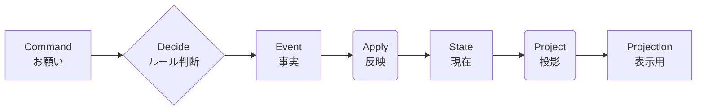

# 第07章：用語セット（Command / Event / State / Projection）📮📜🧠🔎

## この章でやること🎯✨

イベントソーシングの会話で絶対に出てくる4語を、**混ぜずに使える**ようにします😊
この4つがスッと分かれるだけで、設計が一気にラクになります💪🌸

---

## まずは4語を1行で覚えよう📌🧠


* **Command（コマンド）**：ユーザー（や外部）が「こうして！」と**お願い**するもの📮
* **Event（イベント）**：システムが「起きた事実です！」と**確定させた記録**📜
* **State（状態）**：今この瞬間の「こうなってる！」という**現在の姿**🧠
* **Projection（プロジェクション）**：画面や検索に都合いいように作る**読みやすい形**🔎

> ざっくり言うと、
> **Command = お願い**、**Event = 事実**、**State = 今**、**Projection = 見やすい表示用** です😊✨

---

## 例：ショッピングカートでイメージしよ🛒🍎

## Command（お願い）📮

* `AddItemToCart`（カートに商品を入れて！）
* `RemoveItemFromCart`（カートから商品を消して！）
* `Checkout`（購入確定して！）

✅ポイント：Commandは **「命令」じゃなくて“リクエスト”** だと思うと分かりやすいよ😊
（通るとは限らない。ルール違反なら拒否もある🙅‍♀️）

## Event（起きた事実）📜

* `ItemAddedToCart`（商品がカートに追加された）
* `ItemRemovedFromCart`（商品がカートから削除された）
* `CheckedOut`（購入が確定した）

✅ポイント：Eventは **過去形っぽい** ＆ **取り消さない前提の記録** 🧾✨
「やろうとした」じゃなくて「起きた」がEvent！

## State（いまの状態）🧠

* カートの中身（商品と数量）
* 合計金額
* 購入確定済みかどうか

✅ポイント：StateはEventの積み重ねから作れる（あとで第15章でやるやつ🔁）

## Projection（画面用の見やすい形）🔎

* カート一覧画面用：`{ items: [...], totalPrice, canCheckout }`
* 注文履歴一覧用：`{ orderId, date, totalPrice }`

✅ポイント：Projectionは **「表示・検索に最適」** が正義👀✨
Stateと同じ形じゃなくてOK！

---

## 4語を混ぜると起きる“事故”あるある💥😵‍💫

## 事故1：CommandをEventとして保存しちゃう📮➡️📜（ダメ！）

* `AddItemToCart` を「履歴」として残す
  → それ、**お願い**が残ってるだけで、成功したか不明🤯
  ✅正しくは：`ItemAddedToCart` を保存する✨

## 事故2：Eventを“更新命令”っぽく書いちゃう📜➡️📮（ダメ！）

* `ChangeQuantity` みたいなEvent名
  → それは「して！」っぽい🥺
  ✅正しくは：`QuantityChanged` / `ItemQuantityUpdated` みたいに **起きた事実** に寄せる✨

## 事故3：Stateを直接書き換えて満足しちゃう🧠✍️（危険！）

* 「合計金額だけ更新しとこ」
  → 監査・巻き戻し・理由の説明が弱くなりがち😵
  ✅イベントで理由が残ると強い💪📜

## 事故4：Projectionを“真実”扱いする🔎👑（危険！）

* 表示用のDBが壊れたら「終わり」になるやつ
  ✅Projectionは **作り直せる前提** が強み🔁✨
  （真実はEvent側にある）

---

## これが超大事：流れの固定（最小）🔁✨

**Command →（ルールチェック）→ Event →（Apply）→ State →（更新）→ Projection**

* Command：入力📮
* Event：確定した履歴📜
* State：イベント列から復元🧠
* Projection：読むために整形🔎

この“役割分担”を崩さないのがコツです😊🌸



---

## ミニ演習：要件を4分類しよう🗂️✨

## お題：カートの要件（例）🛒

次の文章を **Command / Event / State / Projection** に分けてみてね👇

1. 「商品をカートに入れる」
2. 「カートから商品を削除する」
3. 「同じ商品を2回入れたら数量が増える」
4. 「購入確定したら、以後カート変更できない」
5. 「カート一覧画面に、商品名・数量・小計・合計を出したい」
6. 「購入確定の履歴を残したい」
7. 「“購入済み”のラベルを画面に出したい」
8. 「カートの現在の商品点数を知りたい」

---

## ヒント💡😊

* 「〜して！」っぽい → **Command**📮
* 「〜された」っぽい → **Event**📜
* 「今どうなってる？」 → **State**🧠
* 「画面に出したい／一覧で欲しい」 → **Projection**🔎

---

## 解答例（答え合わせ）✅✨

* **Command**📮：1, 2
* **Event**📜：6（※購入確定は `CheckedOut` みたいなEventになる）
* **State**🧠：3, 4, 8（数量の増え方／変更不可ルール／点数は状態の一部）
* **Projection**🔎：5, 7（画面都合の形）

※3と8は「仕様」っぽく見えるけど、実装では **StateがそうなるようにEventをApplyして作る**感じになるよ😊🔁

---

## TypeScriptで最小の型を作ってみよう🧩✨

「4語を混ぜない」ために、まず**型で分ける**のが超おすすめ！😊
（この章は“雰囲気”でOK。第13章以降で育てるよ🌱）

```ts
// ✅ Command（お願い）
export type Command =
  | { type: "AddItemToCart"; cartId: string; itemId: string; qty: number }
  | { type: "RemoveItemFromCart"; cartId: string; itemId: string }
  | { type: "Checkout"; cartId: string };

// ✅ Event（起きた事実）
export type Event =
  | { type: "ItemAddedToCart"; cartId: string; itemId: string; qty: number; occurredAt: string }
  | { type: "ItemRemovedFromCart"; cartId: string; itemId: string; occurredAt: string }
  | { type: "CheckedOut"; cartId: string; occurredAt: string };

// ✅ State（いまの状態）
export type CartState = {
  cartId: string;
  items: Record<string, number>; // itemId -> qty
  isCheckedOut: boolean;
};

// ✅ Projection（画面用：読みやすい形）
export type CartView = {
  cartId: string;
  lines: Array<{ itemId: string; qty: number }>;
  totalItems: number;
  canCheckout: boolean;
};
```

---

## 「混ぜない」ための関数の形（超ミニ）🧠🔁

## Decide：Command + State → 新しいEventたち📮🧠➡️📜

```ts
export function decide(state: CartState, cmd: Command): Event[] {
  // ここで不変条件チェック（例：購入後は変更不可）などをする
  // OKなら Event を返す / NGなら空配列じゃなくてエラー扱い（第21章あたりで整える）
  return [];
}
```

## Apply：State + Event → 次のState🧠📜➡️🧠

```ts
export function apply(state: CartState, ev: Event): CartState {
  // Eventの事実に沿ってStateを更新する
  return state;
}
```

✅この2つが分かれるだけで、「お願い」と「事実」が混ざらなくなるよ😊✨

---

## AI活用：4分類を“理由つき”でやらせるプロンプト🤖💬✨

## プロンプト1：分類だけじゃなく「理由」も出す🗂️

```text
以下の要件を Command / Event / State / Projection に分類してください。
さらに「なぜそう分類したか」を1行で添えてください。
出力はJSON配列で、各要件に {text, category, reason} を付けてください。

要件:
- （ここに箇条書きで貼る）
```

## プロンプト2：「混ざってる可能性」を指摘させる🕵️‍♀️

```text
次の分類結果に、役割が混ざっている/曖昧なものがあれば指摘して、
より良い言い換え（特に Event名の過去形）を提案してください。
（Commandはお願い、Eventは確定した事実、Stateは現在、Projectionは表示用）
分類結果:
（ここに貼る）
```

## プロンプト3：Event名のダメ例も作らせる🙅‍♀️➡️✅

```text
次のイベント候補について、
1) ダメな命名例（Commandっぽい/曖昧）を3つ
2) 良い命名例（過去形で事実）を3つ
を出してください。短くて意味が明確なものにしてください。
対象: （例）カートの数量変更
```

---

## ちょいクイズ（3問）🌸📝

1. `Checkout` は Command？Event？📮📜
2. `CheckedOut` は Command？Event？📮📜
3. 「注文履歴一覧に出す “日付＋合計”」は State？Projection？🧠🔎

**答え**：1) Command📮  2) Event📜  3) Projection🔎

---

## まとめ✨🎀

* **Commandはお願い**📮（通らないこともある）
* **Eventは確定した事実**📜（履歴として残る）
* **Stateは現在**🧠（イベント列から作れる）
* **Projectionは表示用**🔎（作り直せる前提）

この4つが混ざらなければ、イベントソーシングはかなり怖くなくなります😊💪🌸

---

## 最新情報ミニメモ📰✨

* TypeScriptの安定版は **5.9.3** が「Latest」として公開されています。([NPM][1])
* TypeScript 5.9 の正式リリース告知（Microsoft公式）はこちら。([Microsoft for Developers][2])
* VS Codeの安定版 1.108（2025年12月版）は **2026-01-08** リリースです。([Visual Studio Code][3])
* VS Code Insiders 1.109（2026年1月Insiders）の更新状況。([Visual Studio Code][4])

[1]: https://www.npmjs.com/package/typescript?activeTab=versions&utm_source=chatgpt.com "typescript"
[2]: https://devblogs.microsoft.com/typescript/announcing-typescript-5-9/?utm_source=chatgpt.com "Announcing TypeScript 5.9"
[3]: https://code.visualstudio.com/updates?utm_source=chatgpt.com "December 2025 (version 1.108)"
[4]: https://code.visualstudio.com/updates/v1_109?utm_source=chatgpt.com "January 2026 Insiders (version 1.109)"
