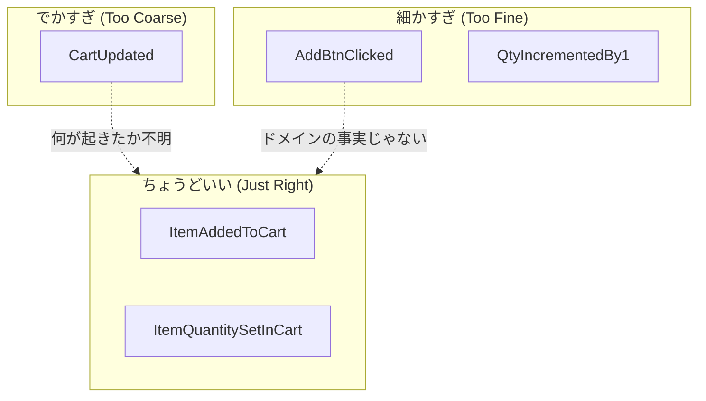

# 第08章：イベント命名（過去形）と“粒度”の感覚⏳✅

## この章でできるようになること🎯✨

* イベント名を「過去形」でスパッと決められる😊
* 「でかすぎ」「細かすぎ」を避けて、ちょうどいい粒度にできる⚖️
* Command と Event を名前だけで見分けやすくできる📮📜

---

## 1. まず最重要ルール：イベントは過去形🕰️✅


イベントは「すでに起きた事実」なので、**名前は過去形**にするのが基本だよ〜！
Command は「〜しろ」だけど、Event は「〜した」だから、ここが混ざると一気に迷子になる🥺🌀 ([Microsoft Learn][1])

## 命名イメージ🍀

* Command（命令）📮：`AddItemToCart` / `ChangeQuantity`
* Event（事実）📜：`ItemAddedToCart` / `ItemQuantityChangedInCart`

---

## 2. 良いイベント名の型：短く・具体的に・ドメインの言葉で🧠✨


イベント名は「技術の都合」じゃなくて、**その世界の言い方**に寄せるのが強いよ😊
（会話しても伝わる名前がベスト！） ([Mathias Verraes' Blog][2])

## 2.1 ありがちなダメ例🙅‍♀️💦

* `CartUpdated`（何が起きたのか不明…😵）
* `UpdateCart`（命令っぽい＝Commandに見える）
* `ButtonClicked`（UI都合で、ドメインの事実じゃない🥲）
* `ItemChanged`（どこがどう変わったの？が残らない）

## 2.2 いい感じの例👍✨

* `ItemAddedToCart`（カートに商品が追加された）
* `ItemRemovedFromCart`（カートから商品が削除された）
* `ItemQuantitySetInCart`（数量が「設定された」）
* `CartCheckedOut`（購入確定した、みたいな事実）

> コツ：イベント名だけ読んで「何が起きた？」が答えられること👀✅

---

## 3. 粒度の悩みポイント：でかすぎ・細かすぎ問題⚖️😵‍💫


イベントは「事実のログ」だから、粒度がズレると後でつらい…！
ここで感覚を作っちゃおう✊✨

## 3.1 でかすぎイベントの症状🐘💥

* 1イベントに「いろいろ全部」が詰まってる
  例：`CartUpdated` の payload にカート丸ごと入れてる…など
* リプレイしても「何が起きたのか」が読みにくい📉
* 将来「監査」「分析」「通知」をしたくなったとき困る🥲

## 3.2 細かすぎイベントの症状🐜💦

* UI操作の単位に寄りすぎ
  例：`QuantityIncrementedBy1` が大量に並ぶ…みたいな（意味はあるけど、場面を選ぶ）
* “履歴として残したい事実”と“操作の細部”が混ざる



---

## 4. 粒度を決めるためのチェックリスト✅🧾


次の質問で「ちょうどよさ」を判定するよ〜😊✨

## 4.1 1イベント＝1つのビジネス事実？📜

「誰が見ても、これは事実だね」って言える？
イベントは「ビジネス上意味のある出来事」になってるのが大事だよ🧠 ([CodeOpinion][3])

## 4.2 その事実は将来も意味が残る？🔮

* 後から見返して説明できる？
* 監査ログとして嬉しい？
* 集計や通知の材料になる？

## 4.3 そのイベント1個で “起きたこと” が説明できる？🗣️

* `CartUpdated` だと説明できない
* `CouponAppliedToCart` なら一発でわかる😊

## 4.4 payload が不自然に重くなってない？🍱💦

payload が「状態の丸ごとコピー」になり始めたら、粒度が怪しいサイン🚨
（もちろん例外はあるけど、学習段階ではまず避けよう）

---

## 5. ミニ実例：カート題材で命名と粒度を体験🛒✨

## 5.1 お題📝

次の「やりたいこと」を見て、イベント名を考えてみてね😊

1. カートを作る
2. 商品をカートに入れる
3. 商品の数量を 1→3 に変える
4. 商品をカートから消す
5. クーポンを適用する
6. 購入を確定する

## 5.2 まずは命名候補を10個出す🎯


ポイントはこれ👇

* 過去形 ✅
* 具体 ✅
* ドメインの言葉 ✅

例の候補（参考）🌸

* `CartCreated`
* `ItemAddedToCart`
* `ItemQuantitySetInCart`
* `ItemRemovedFromCart`
* `CouponAppliedToCart`
* `CartCheckedOut`
* `CheckoutFailed`（失敗も事実ならイベントになりうる）
* `CouponRejected`（拒否をログに残す設計もある）
* `CartExpired`（期限切れがドメインにあるなら）
* `CartEmptied`（全削除があるなら）

## 5.3 10個→3つに絞るコツ✂️✨

絞る基準はこれ👇

* “後で読んで嬉しい”イベントか？📚
* “何が起きたか”が一語で伝わるか？🔎
* その粒度は「不変条件の判断結果」として自然か？🧷

---

## 6. TypeScriptでの表現例🧩✨


イベントは「type（種類）」で名前が見えると、学習がめっちゃ楽になるよ😊

```ts
// イベント名は「過去形」で固定（文字列リテラルが見やすい！）
export type CartEvent =
  | { type: "CartCreated"; data: { cartId: string } }
  | { type: "ItemAddedToCart"; data: { cartId: string; itemId: string; quantity: number } }
  | { type: "ItemQuantitySetInCart"; data: { cartId: string; itemId: string; quantity: number } }
  | { type: "ItemRemovedFromCart"; data: { cartId: string; itemId: string } }
  | { type: "CouponAppliedToCart"; data: { cartId: string; couponCode: string } }
  | { type: "CartCheckedOut"; data: { cartId: string; orderId: string } };
```

> 「type を読むだけで、何が起きたか分かる」状態にするのが狙いだよ👀✅

---

## 7. AI活用：命名と粒度の練習を爆速にするプロンプト集🤖💨✨

## 7.1 命名候補を10個出させる📝

```text
あなたはイベントソーシングの設計レビュー担当です。
次のユースケース（カート）について、イベント名の候補を「過去形の英語」で10個出してください。
条件：
- Commandっぽい命令形は禁止
- CartUpdated のような曖昧名は禁止
- できるだけドメインの言葉で具体的に
ユースケース：
1) カート作成
2) 商品追加
3) 数量変更（1→3）
4) 商品削除
5) クーポン適用
6) 購入確定
```

## 7.2 ダメ例も作らせて差を学ぶ🙅‍♀️➡️😊

```text
上の候補とは別に、「悪いイベント名」を8個作ってください。
それぞれについて「なぜ悪いか」を1行で説明してください。
観点：過去形でない、曖昧、UI都合、粒度が変、など。
```

## 7.3 粒度診断してもらう⚖️🔎

```text
次のイベント案について、粒度が「でかすぎ / ちょうどいい / 細かすぎ」を判定し、
理由と改善案を出してください。
イベント案：
- CartUpdated
- ItemAddedToCart
- QuantityIncrementedBy1
- ItemQuantitySetInCart
- CheckoutButtonClicked
```

---

## 8. まとめ🎀✨

* イベントは「起きた事実」だから過去形が基本🕰️✅ ([Microsoft Learn][1])
* 良いイベント名は「短く・具体的・ドメインの言葉」😊 ([Mathias Verraes' Blog][2])
* 粒度は「1つのビジネス事実」になってるかで判断すると安定するよ⚖️✨ ([CodeOpinion][3])

---

## 次章予告👀🌸

次は **不変条件** に入るよ🧷🛡️
「このイベントは発生していいの？」を止めるルール作りができるようになる！

[1]: https://learn.microsoft.com/en-us/dotnet/architecture/microservices/microservice-ddd-cqrs-patterns/domain-events-design-implementation?utm_source=chatgpt.com "Domain events: Design and implementation - .NET"
[2]: https://verraes.net/2014/11/domain-events/?utm_source=chatgpt.com "Domain Events"
[3]: https://codeopinion.com/event-sourcing-101-terminology/?utm_source=chatgpt.com "Event Sourcing 101: Terminology & Concepts"
