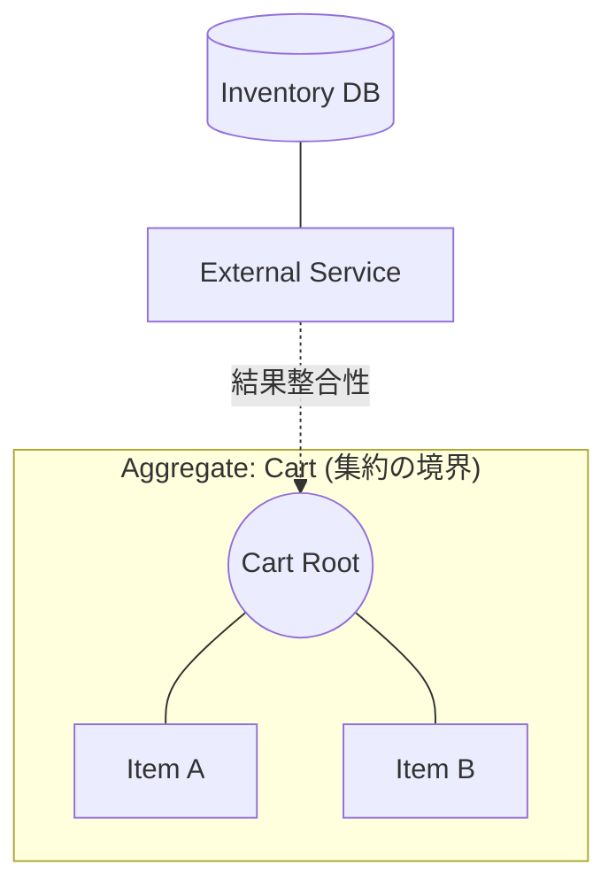

# 第10章：Aggregate（集約）と境界の決め方🐣🧩

## この章でできるようになること🎯✨

* 「Aggregateってなに？」を、**イベントソーシング視点**で説明できる😊
* **どこまでを“ひとまとまり”にするか（境界）**を、ルール（不変条件）から決められる🧠🔍
* 境界の“良し悪し”を **2案比較** で判断できる⚖️✨

---

## 1. 集約（Aggregate）＝「整合性の境界」🛡️✨


「集約って何？」をひと言でいうと、
ざっくり言うと…

> **「この中の変更は、必ずまとめて整合性を保ちたい！」**
> という“ひとまとまり”の単位だよ📦✨

イベントソーシングでは、ここが超重要ポイント👇

* **1つのAggregate（集約インスタンス）＝ 1つのイベントストリーム**
* そのストリームの中で **不変条件（絶対守るルール）** を守る
* 外から触っていい入口は **Aggregate Root（ルート）だけ**

…という形にすると安定しやすいよ😊([Event Sourcing Guide][1])

---

## 2. 「境界」ってなに？どこで切るの？✂️🧠


境界は、別の言い方をすると **Consistency Boundary（整合性境界）**。

* 境界の中：**その場で必ず一致（原子的/即時）**
* 境界の外：**最終的に合えばOK（結果整合）** になりがち

つまり質問はこれ👇

> 「どこまでを“同時に必ず更新されるべき範囲”にする？」

この考え方が、Aggregateやトランザクション設計のカギだよ🔑✨([cqrs.com][2])

---

## 3. 境界の決め方：まず“不変条件”から逆算しよう🧷🛡️


境界を感覚で決めると事故りやすいので、順番はこれが鉄板😊

## ステップA：不変条件を3つ書く📝✨

例（ショッピングカート題材🛒）

* ① カート内の数量は **1以上**
* ② 同じ商品は **1行にまとめる**（重複行は禁止）
* ③ カートの合計金額は **各行の合計と一致**

この「**同時に必ず守りたい**」ルールが、境界の中心になるよ🧠🔥

## ステップB：そのルールを“誰が責任持つか”決める👮‍♀️✅

* ルールを守る責任者＝**Aggregate Root** になりやすい

## ステップC：「一緒に原子的に更新したいもの」を同じ集約へ🔗

* 同時に守りたいなら同じ集約
* そうじゃないなら別集約（結果整合でつなぐ）

---

## 4. 具体例：カートはどこまで“1つ”にする？🛒⚖️


ここが一番悩むところ！なので、よくある2案を比べるよ😊

## 案1：Cart集約（カート＋明細）だけを1つにする🧺✅

**入れるもの**

* Cart（ルート）
* CartItem（内部エンティティ）

**良いところ**

* カート内ルールがシンプルに守れる😊
* 1ストリームで完結しやすい📼✨

**悩みどころ**

* 在庫（Inventory）や価格（Pricing）まで「常に同時に正しい」を狙うと、境界の外になる
  → “購入確定”の瞬間に別の仕組みでチェックする設計になりやすい🧯

## 案2：Cart＋Inventoryまで1つの集約にまとめる📦⚠️

**良いところ**

* 「在庫を減らす」と「カート更新」を原子的にできるかも✨

**でも…**

* 集約が巨大化しやすい😵‍💫
* 競合（同時更新）が増えやすい⚔️
* “カート更新”が在庫全体の都合で重くなることも

> ※「何を原子的に守りたいか」が最優先！



---

## 5. 合言葉：「1集約＝1ストリーム」って、何が嬉しいの？📼✨

イベントソーシングでは、Aggregateを決める＝**ストリームの単位**を決めることでもあるよ😊([Event Sourcing Guide][1])

## ここが嬉しい🎁

* ルール（不変条件）を **1か所で守れる**🛡️
* イベントが1列に並ぶから **順序が明確**⏳
* 競合を防ぐ設計（expectedVersionなど）に繋げやすい🔒

---

## 6. よくある境界ミス集🙅‍♀️💥


## ミス1：なんでも1集約に入れる（巨大集約）🐘💦

* 変更するたびに読み込むイベントが多い
* 同時更新が増えて失敗しやすい
* “小さな変更”が“でかいトランザクション”になる😵‍💫

## ミス2：逆に細かく割りすぎ（集約が粉々）🧩🌀

* 1つの操作で複数ストリームを“同時に”更新したくなって地獄
* 結局「同時更新したいから合体…」となりがち

## ミス3：境界を“データ構造”で決める📚❌

* DBテーブル単位で決めると、ルールの責任が散りやすい
* **ルール（不変条件）→責任者→境界** の順が強いよ😊

---

## 7. TypeScriptで“境界”をコードに落とすミニ例🍱🧑‍💻


ここでは「Cart集約（案1）」の雰囲気だけ掴もう😊
（イベントストアは後の章で本格化するので、ここでは **集約の形** に集中！）

## イベント型（Cartストリームに積むもの）📮

```ts
type CartId = string;
type ProductId = string;

type CartEvent =
  | { type: "CartCreated"; cartId: CartId; createdAt: string }
  | { type: "ItemAdded"; cartId: CartId; productId: ProductId; qty: number }
  | { type: "ItemQtyChanged"; cartId: CartId; productId: ProductId; qty: number }
  | { type: "ItemRemoved"; cartId: CartId; productId: ProductId };
```

## 状態（イベント列から復元される“現在の姿”）🔁

```ts
type CartState = {
  cartId: CartId;
  exists: boolean;
  items: Map<ProductId, number>; // qty
};

const emptyCart = (cartId: CartId): CartState => ({
  cartId,
  exists: false,
  items: new Map(),
});
```

## Apply（イベント→状態変化）🪄

```ts
function apply(state: CartState, e: CartEvent): CartState {
  switch (e.type) {
    case "CartCreated": {
      return { ...state, exists: true };
    }
    case "ItemAdded": {
      const items = new Map(state.items);
      items.set(e.productId, (items.get(e.productId) ?? 0) + e.qty);
      return { ...state, items };
    }
    case "ItemQtyChanged": {
      const items = new Map(state.items);
      items.set(e.productId, e.qty);
      return { ...state, items };
    }
    case "ItemRemoved": {
      const items = new Map(state.items);
      items.delete(e.productId);
      return { ...state, items };
    }
  }
}
```

## Decide（不変条件チェック→新イベントを決める）🛡️➡️📮

```ts
type AddItemCommand = {
  type: "AddItem";
  cartId: CartId;
  productId: ProductId;
  qty: number;
};

function decideAddItem(state: CartState, cmd: AddItemCommand): CartEvent[] {
  // 不変条件：qtyは1以上
  if (cmd.qty < 1) {
    throw new Error("数量は1以上だよ🥺"); // 後の章でResult型にする予定🚦
  }

  // ここでは “在庫チェック” は境界の外（別集約/別仕組み）にする
  // → Cart集約は「カート内の一貫性」に集中する😊

  // 追加イベントを返す
  return [
    {
      type: "ItemAdded",
      cartId: cmd.cartId,
      productId: cmd.productId,
      qty: cmd.qty,
    },
  ];
}
```

このコードが表してること👇

* **Cart集約が守るのは「カート内ルール」**だけ
* 在庫や価格みたいに「外の世界」は、別集約 or 別プロセスで扱う設計にしやすい
* 境界を決める＝「この集約が守る責任の範囲」を決めること🧠✨

---

## 8. ミニ演習：境界案を2つ作って比較しよう⚖️📝

題材（例：カート🛒）で、次をやってみてね😊

## ① 不変条件を3つ書く🧷

* （例）数量、重複、合計…など

## ② 境界案を2つ作る🧺🧺

* 案A：Cartだけ
* 案B：Cart＋Inventoryも一緒

## ③ 3項目で比較する📋✨

* 原子的に守れるルールは何？
* 競合（同時更新）は増えそう？
* 将来変更（拡張）に強そう？

---

## 9. AI活用：境界レビューの“型”🤖🧠✨

AIに投げるときは、ふわっと聞かずにこれが安定😊

* **不変条件**：この操作で絶対守りたいルールはこれ
* **境界案A/B**：それぞれ何を含めるか
* **想定ユースケース**：1秒間に何回くらい更新？同時更新ある？
* **質問**：どの案が事故りにくい？理由は？

AIに「**案A/Bのメリデメを、競合・変更容易性・責任分離の観点で**」って言うと、だいぶ使えるよ📌✨

---

## 🧠 ちょい最新メモ（2026っぽい知識）🆕✨

* Node.js は **v24 が Active LTS**、v25 は Current で進んでるよ（2026-01-12時点の更新あり）。([Node.js][3])
* TypeScript側は、Nodeのモジュール周りに合わせた `--module node18` のような“安定点”が増えてきてる（TS 5.8）。([TypeScript][4])
* TS 5.9 では `import defer` みたいな新しいモジュール機能サポートも入ってきてるよ（実行環境側の対応が前提）。([TypeScript][5])

---

## まとめ🎀✨

* Aggregateは **「不変条件を守る責任範囲」**の単位だよ🛡️
* 境界は **“同時に必ず整合するべき範囲”**として決めるのがコツ🧠✨([cqrs.com][2])
* イベントソーシングでは **1集約＝1ストリーム** の感覚が超大事📼😊([Event Sourcing Guide][1])

---

## 次章の予告📘✍️

次は、イベントが状態をどう変えるかを **手書きで見える化** して、境界の妥当性チェックもできるようにするよ🔁✨

[1]: https://www.eventsourcing.dev/best-practices/designing-aggregates "Designing Aggregates - Best Practices - Event Sourcing Guide"
[2]: https://www.cqrs.com/deeper-insights/consistency-boundaries/ "Consistency Boundaries - CQRS, Event Sourcing & co."
[3]: https://nodejs.org/en/about/previous-releases "Node.js — Node.js Releases"
[4]: https://www.typescriptlang.org/docs/handbook/release-notes/typescript-5-8.html "TypeScript: Documentation - TypeScript 5.8"
[5]: https://www.typescriptlang.org/docs/handbook/release-notes/typescript-5-9.html "TypeScript: Documentation - TypeScript 5.9"
