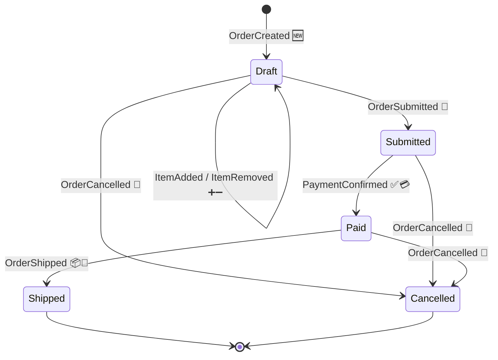
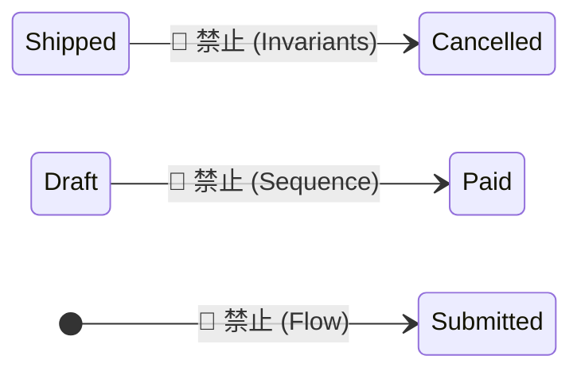

# 第11章：状態遷移を“手書き”してみる✍️🔁

## 11.1 この章でできるようになること🎯✨

* イベントが「状態」をどう変えるかを、図と表でスッキリ見える化できる📌🧠
* **抜け漏れイベント**（必要なのに存在しない出来事）に気づける👀💡
* 「その操作、なぜダメ？」を **不変条件（Invariants）** で説明できる🛡️🧷
* 次の実装（`Apply` / `Decide`）につながる“型”が作れる🧩📮

---

## 11.2 なんで“手書き”が効くの？📝💞


イベントソーシングは「状態を保存」じゃなくて、「状態が変わった出来事（イベント）を積む」やり方だよ📚🔁
だから、**イベントが起きたときに状態がどう変わるか**を一回 “目で見える形” にすると、一気に迷子が減るの🧭✨
この考え方自体がイベントソーシングの基本コンセプトとして整理されているよ。([AWS ドキュメント][1])

---

## 11.3 今日の題材（例）🍰：注文（Order）をイベントで表す🧺🧾

この章では例として「注文」を使うよ😊
（カートでもToDoでも同じ手順でOK🙆‍♀️✨）

### 状態（ざっくり）📍


* `Draft`（下書き・編集OK）✍️
* `Submitted`（確定した！）📮
* `Paid`（支払い完了）💳
* `Shipped`（発送済み）📦
* `Cancelled`（キャンセル）🧯

### 代表イベント（過去形）⏳

* `OrderCreated` 🆕
* `ItemAdded` ➕
* `ItemRemoved` ➖
* `OrderSubmitted` 📮
* `PaymentConfirmed` ✅💳
* `OrderShipped` 📦🚚
* `OrderCancelled` 🛑

---

## 11.4 手順①：まず「状態」を少なく決める🧊✨

状態は最初から細かくしすぎないのがコツ！😺
まずは「説明できる最小セット」にするよ🧠📌

✅ 良い状態の条件

* その状態名だけで **“いま何ができるか”** がだいたい分かる
* 状態が増えすぎて **図が読めなくならない**（5〜7個くらいが目安）

🚫 ありがちNG

* `EditingAddress` とか `EditingItems` とか、画面都合で状態を増やしすぎる🌀
  → 画面の“途中”は **状態**じゃなくて、だいたい **入力中のデータ** で表せることが多いよ🧺✨

---

## 11.5 手順②：イベントを「時系列で」並べる📜➡️


次に、イベントを **起きそうな順** で並べてみよう😊

例（ざっくり）👇

1. `OrderCreated` 🆕
2. `ItemAdded` ➕（何回も）
3. `OrderSubmitted` 📮
4. `PaymentConfirmed` ✅💳（または失敗イベント）
5. `OrderShipped` 📦

ここで大事なのは「**現実に起こる出来事の順序**」を意識することだよ⏳✨

---

## 11.6 手順③：状態遷移図を描く（紙でOK）✍️🗺️

### 描き方ルール（超かんたん）😊

* **箱**：状態📦
* **矢印**：イベント➡️
* **矢印ラベル**：イベント名（過去形）🏷️

まずはこのくらいのシンプルさでOKだよ🌸




💡ポイント

* `Draft -> Draft` みたいな「同じ状態のまま」も全然アリ（中身＝アイテム一覧が変わってる）😺
* `Cancelled` と `Shipped` を“終端”にしておくと、ルールが整理しやすいよ🎯

---

## 11.7 手順④：状態遷移表にして「実装の下書き」にする🧾🖊️


図を描いたら、次は表！
表にすると「実装のif/else地獄」を防げるよ🛟✨

| 現在状態                 | イベント             | 次状態       | 最低限の条件（不変条件の入口）       |
| -------------------- | ---------------- | --------- | --------------------- |
| Draft                | OrderCreated     | Draft     | まだ存在してない注文だけ作れる🆕     |
| Draft                | ItemAdded        | Draft     | 数量は1以上、商品IDは必須🧷      |
| Draft                | OrderSubmitted   | Submitted | アイテム0件はダメ🙅‍♀️🧺      |
| Submitted            | PaymentConfirmed | Paid      | 支払いは一度だけ（多重決済NG）💳🚫  |
| Paid                 | OrderShipped     | Shipped   | 発送は支払い後だけ📦✅          |
| Draft/Submitted/Paid | OrderCancelled   | Cancelled | Shippedの後はキャンセル不可🛑🚫 |

ここで「条件」がふわっとしててもOK🙆‍♀️
次の章以降でイベントの中身（payload）を決めながら、条件も育てていくよ🌱✨

---

## 11.8 手順⑤：「できない遷移」をあえて書く🙅‍♀️🧯


ここが超大事！！🔥
イベントソーシングの設計って、「何ができる」より「何ができない」をハッキリさせると強くなる💪✨

### 例：禁止ルール（不変条件）🛡️

* `Shipped` の注文は編集できない（`ItemAdded` など禁止）📦🚫
* `Draft` のまま支払いはできない（`PaymentConfirmed` 禁止）✍️🚫
* 空の注文は確定できない（`OrderSubmitted` 禁止）🧺🚫
* 二重に `PaymentConfirmed` は起きない（冪等性の入口）🔁🚫

この「禁止」を書くと、次に作る **ドメインエラー** が自然に決まるよ🚦😊



---

## 11.9 TypeScriptに落とす：`Apply` と `Decide` の最小スケルトン🧩🧠


図と表を “そのまま” コードに写す感じだよ✍️✨
（ここでは雰囲気優先で最小にしてるよ）

### 1) イベント型（Union）📜

```ts
type OrderId = string;
type Money = number;

type OrderEvent =
  | { type: "OrderCreated"; orderId: OrderId; at: string }
  | { type: "ItemAdded"; sku: string; qty: number; at: string }
  | { type: "ItemRemoved"; sku: string; at: string }
  | { type: "OrderSubmitted"; at: string }
  | { type: "PaymentConfirmed"; amount: Money; at: string }
  | { type: "OrderShipped"; trackingNo: string; at: string }
  | { type: "OrderCancelled"; reason: string; at: string };
```

### 2) 状態（読みやすい形）📦

```ts
type OrderStatus = "Draft" | "Submitted" | "Paid" | "Shipped" | "Cancelled";

type OrderState = {
  exists: boolean;
  status: OrderStatus;
  items: Map<string, number>; // sku -> qty
  paidAmount: Money;
};

const initialState: OrderState = {
  exists: false,
  status: "Draft",
  items: new Map(),
  paidAmount: 0,
};
```

### 3) Apply（イベント → 状態更新）🔁

```ts
function apply(state: OrderState, ev: OrderEvent): OrderState {
  const next: OrderState = {
    ...state,
    items: new Map(state.items),
  };

  switch (ev.type) {
    case "OrderCreated":
      return { ...next, exists: true, status: "Draft" };

    case "ItemAdded": {
      const cur = next.items.get(ev.sku) ?? 0;
      next.items.set(ev.sku, cur + ev.qty);
      return next;
    }

    case "ItemRemoved":
      next.items.delete(ev.sku);
      return next;

    case "OrderSubmitted":
      return { ...next, status: "Submitted" };

    case "PaymentConfirmed":
      return { ...next, status: "Paid", paidAmount: ev.amount };

    case "OrderShipped":
      return { ...next, status: "Shipped" };

    case "OrderCancelled":
      return { ...next, status: "Cancelled" };
  }
}
```

### 4) Decide（コマンドっぽい入力 → 新イベントを返す）📮✨

ここが「できない遷移」を止める場所だよ🛡️
（この章では “状態遷移表を写す” ことが目的！）

```ts
type DomainError =
  | { kind: "NotFound" }
  | { kind: "AlreadyShipped" }
  | { kind: "EmptyOrder" }
  | { kind: "InvalidOperation"; message: string };

type Result<T> = { ok: true; value: T } | { ok: false; error: DomainError };

function decideSubmit(state: OrderState, at: string): Result<OrderEvent[]> {
  if (!state.exists) return { ok: false, error: { kind: "NotFound" } };
  if (state.status === "Shipped") return { ok: false, error: { kind: "AlreadyShipped" } };
  if (state.status !== "Draft") {
    return { ok: false, error: { kind: "InvalidOperation", message: "Draftのときだけ確定できるよ" } };
  }
  if (state.items.size === 0) return { ok: false, error: { kind: "EmptyOrder" } };

  return { ok: true, value: [{ type: "OrderSubmitted", at }] };
}
```

💡コツ

* **状態遷移図/表があると**、`switch` と `if` が “迷わず” 書けるようになるよ😊✨
* `Apply` 漏れはバグの温床なので、図・表と一致してるか常に見比べる👀🔁

---

## 11.10 ミニ演習（紙1枚でOK）🗒️🎒

### 演習A：状態遷移図を完成させよう✍️✨

1. 状態を5つだけ書く📦
2. イベントを7つだけ書く🏷️
3. 矢印をつなぐ➡️
4. 「終端状態」を1つは作る（例：`Cancelled`）🛑
5. 「同じ状態に戻る矢印」を1本入れる（例：`Draft -> Draft`）🔁

### 演習B：抜け漏れチェック👀🧩

次の質問に答えられない箇所があったら、イベントや状態が足りないかも！😵‍💫

* 「支払いに失敗したらどうなる？」💳💥
* 「確定後に住所を変えたい要望が来たら？」🏠🌀
* 「キャンセル理由は保存する？」🧯📝

### 演習C：禁止遷移を3つ書く🙅‍♀️🛡️

* 例：「`Shipped` のあとに `OrderCancelled` は起きない」📦🚫🛑
* 例：「空の注文で `OrderSubmitted` は起きない」🧺🚫📮

---

## 11.11 AI活用（そのまま貼れる🧠🤖）✨


エディタのAIに、**図と表のレビュー係** をやってもらうのが強いよ💪
（コード生成より “抜け漏れ検知” が特に便利👀）

✅ プロンプト例①（抜け漏れ探し）

* 「この状態遷移図で、現実の業務として起きそうなのに表現できてないイベントを5つ挙げて。注文ドメイン。初心者向けに理由も。」

✅ プロンプト例②（禁止遷移 → エラー文言）

* 「禁止遷移を10個挙げて、それぞれユーザー向けの短いエラーメッセージ案も作って。」

✅ プロンプト例③（Apply漏れ検知）

* 「このイベント一覧とapply関数を見比べて、反映漏れ・状態更新不足がないかレビューして。」

※ こういうAI支援は、エディタ内の補完やチャット機能として整理されているよ。([Visual Studio Code][2])
（最近のエディタ更新ではチャット周りの改善も続いてるよ。([Visual Studio Code][3])）

---

## 11.12 よくある落とし穴😵‍💫🕳️

* **コマンド名をイベント名にしちゃう**（現在形）

  * `SubmitOrder` ❌ → `OrderSubmitted` ✅（過去形）⏳
* **状態を増やしすぎて破綻する**

  * まずは少なく！足りなければ増やす🌱
* **「失敗」をイベントにするか迷子**

  * まずはドメイン的に“意味が残る失敗”だけイベント化すると整理しやすいよ🧯✨

---

## 11.13 確認クイズ（サクッと）🧠✅

1. 状態遷移図の **矢印** は何を表す？➡️
2. `Draft -> Draft` の遷移があっていい理由は？🔁
3. 「空の注文は確定できない」は、どこで守るのが自然？🛡️
4. `Apply` と `Decide` の役割の違いは？🔁📮

---

## 11.14 次章につながる小さなヒント🍱🏷️

次は「イベントの中身（Payload）とメタデータ」へ進むよ😊
状態遷移図があると、「このイベントに何を入れるべき？」がスッと決まってくるの✨

---

### 最新動向メモ（2026/02/01時点）🗞️✨

* npm上の最新は **TypeScript 5.9.3** として公開されているよ。([NPM][4])
* さらに先の世代として、Microsoft は TypeScript のネイティブ化（高速化）ロードマップも継続的に共有しているよ。([Microsoft for Developers][5])

[1]: https://docs.aws.amazon.com/prescriptive-guidance/latest/cloud-design-patterns/event-sourcing.html?utm_source=chatgpt.com "Event sourcing pattern - AWS Prescriptive Guidance"
[2]: https://code.visualstudio.com/docs/copilot/ai-powered-suggestions?utm_source=chatgpt.com "Inline suggestions from GitHub Copilot in VS Code"
[3]: https://code.visualstudio.com/updates "December 2025 (version 1.108)"
[4]: https://www.npmjs.com/package/typescript?activeTab=versions&utm_source=chatgpt.com "typescript"
[5]: https://devblogs.microsoft.com/typescript/typescript-native-port/?utm_source=chatgpt.com "A 10x Faster TypeScript"
