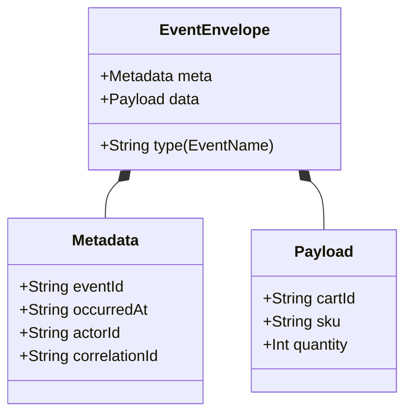

# 第12章：イベントの中身（Payload）とメタデータ🍱🏷️

## この章でできるようになること🎯✨

* 「**Payload（事実）**」と「**Metadata（文脈）**」を分けて考えられるようになる😊
* そのイベントが **“未来で読み返されても意味がズレない形”** にできる📦✨
* TypeScriptで **イベント型（discriminated union）** を気持ちよく書けるようになる🧠💡
* “入れすぎ問題” を自分で止められるようになる🛑🍱

---

## 1. Payload と Metadata のざっくり違い🌸


## ✅ Payload（ペイロード）＝「起きた事実」📜

* ドメインの**出来事そのもの**（例：商品が追加された、注文が確定した…）
* **状態を復元するために必要な材料**（= Apply で状態が作れる）になる

> ざっくり言うと、
> **Payload = 起きた事実**、**Metadata = いつ・誰が・どういう文脈で** です😊✨



---

## 2. Payload に入れるべきもの／入れないほうがいいもの🍱✨

## ✅ Payload に入れるべき（基本）👍

* **状態復元に必要な最小の事実**

  * 例：`sku` / `quantity` / `cartId` など
* **その瞬間に確定した値**

  * 例：割引が確定したなら「割引後価格」など（※ただし粒度と責務に注意⚠️）

## ❌ 入れないほうがいい（あるある）🙅‍♀️

* **画面表示用の派生値**（合計金額、表示用テキスト、並び順など）
  → それは Projection 側で作れる🪄🔎
* **他の集約から引っ張ってきた情報の丸ごとコピー**
  → 後でズレると地獄😵‍💫
* **“スナップショットっぽい全部入り”**
  → 1イベントが肥大化して管理が辛くなる🍱💥

---

## 3. Metadata の「最小セット」と「あると強いセット」🏷️💪

## 3.1 最小セット（まずはこれでOK）✅

* `eventId`：イベントの一意なID（重複排除にも使える）🆔
* `occurredAt`：いつ起きた？（ドメイン的な発生時刻）⏰
* `recordedAt`：いつ保存した？（書き込み時刻）🗄️
* `schemaVersion`：イベントの形のバージョン（将来の進化に効く）🧬

> CloudEvents の世界でも、最低限のコンテキストとして `id/source/specversion/type` が必須になってるよ📦([Microsoft Learn][1])
> ここで言う `eventId` は CloudEvents の `id` に近いイメージ😊

## 3.2 あると強いセット（運用がラクになる）✨

* `actorId`：誰がやった？（ユーザーIDなど）👤
* `correlationId`：同じ操作・同じリクエストのまとまり🧵
* `causationId`：このイベントの原因になったID（直前イベント or コマンドID的なもの）🔗
* `traceparent`：分散トレース用（W3C Trace Context）🧭

  * `traceparent` / `tracestate` の仕様があるよ([W3C][2])

ちなみに Dapr は Pub/Sub メッセージを CloudEvents で包んで、`traceparent/traceid/tracestate` みたいなトレース情報も一緒に扱う例をドキュメントで示してるよ（「文脈」の実例としてめっちゃ分かりやすい）📬✨([Dapr Docs][3])

---

## 4. 例：ショッピングカートのイベントを「中身」で設計してみよう🛒✨

ここでは Chapter 3 の題材が「カート」だった想定でいくね😊
（題材がToDoでも家計簿でも、考え方は同じだよ👌）

## 4.1 イベント候補（例）📮📜

* `CartCreated`
* `ItemAdded`
* `ItemQuantityChanged`
* `ItemRemoved`
* `CheckedOut`

---

## 5. TypeScriptで “Payload と Metadata を分けて” 型を作る🧠✨

> 2026年2月時点では、TypeScript の 5.9 系が最新ラインとして提供されてるよ（npm の dist-tag 例）
> なので例は **TS 5.9 系で気持ちよく書けるスタイル**で統一するね😊

## 5.1 まずは Metadata 型（共通）🏷️

```ts
export type EventMeta = {
  eventId: string;        // UUIDなど
  occurredAt: string;     // ISO 8601 (UTC) 例: 2026-02-01T12:34:56.789Z
  recordedAt: string;     // 保存した時刻
  schemaVersion: number;  // まずは 1
  actorId?: string;       // 操作者（ユーザーIDなど）
  correlationId?: string; // 同一操作のひもづけ
  causationId?: string;   // 直前の原因ID
  traceparent?: string;   // W3C Trace Context
};
```

📝 メモ

* `occurredAt` と `recordedAt` を分けると、**遅延・再送・バッチ**が来ても整理しやすいよ✨
* `traceparent` は分散トレースの標準ヘッダー（W3C）として定義されてる🧭([W3C][2])

---

## 5.2 Payload（事実）をイベントごとに定義🍱

```ts
export type CartCreated = {
  type: "CartCreated";
  data: {
    cartId: string;
    userId: string;
  };
  meta: EventMeta;
};

export type ItemAdded = {
  type: "ItemAdded";
  data: {
    cartId: string;
    sku: string;
    quantity: number;
  };
  meta: EventMeta;
};

export type ItemQuantityChanged = {
  type: "ItemQuantityChanged";
  data: {
    cartId: string;
    sku: string;
    quantity: number;
  };
  meta: EventMeta;
};

export type ItemRemoved = {
  type: "ItemRemoved";
  data: {
    cartId: string;
    sku: string;
  };
  meta: EventMeta;
};

export type CheckedOut = {
  type: "CheckedOut";
  data: {
    cartId: string;
    paymentMethod: "card" | "bank_transfer";
  };
  meta: EventMeta;
};

export type CartEvent =
  | CartCreated
  | ItemAdded
  | ItemQuantityChanged
  | ItemRemoved
  | CheckedOut;
```

✅ ここがポイント💡

* `type` を文字列リテラルにして **判別可能ユニオン**にすると、`switch` が安全になるよ😊
* `data` が Payload（事実）、`meta` が Metadata（文脈）でスッキリ✨

---

## 5.3 “入れすぎ” 例（ダメ寄り）と理由🙅‍♀️🍱

```ts
// ❌ 例：やりがち（入れすぎ）
export type ItemAdded_Bad = {
  type: "ItemAdded";
  data: {
    cartId: string;
    sku: string;
    quantity: number;

    // ❌ 表示名は別の場所で変わり得る
    itemName: string;

    // ❌ 合計は計算できる（Projection向き）
    cartTotalPrice: number;

    // ❌ 画像URLもUI寄りで変わりやすい
    imageUrl: string;
  };
  meta: EventMeta;
};
```

**なぜ辛いの？😵‍💫**

* `itemName` が後で変わると「昔のイベントに残ってる名前」が邪魔になる
* `cartTotalPrice` は割引・税・丸め等で **計算ロジックが更新**されると過去とズレる
* UI系データは Projection が育つほど「イベントに持たない方が綺麗」になる🔎✨

---

## 6. 便利テク：イベント生成を “型安全に” する🧰✨

## 6.1 `satisfies` でイベント辞書を検査✅

`**satisfies**` は「この形を満たしてるかチェックしつつ、推論も強く保つ」構文だよ💡（TypeScript 4.9 で導入）([TypeScript][4])

```ts
type EventFactoryMap = {
  CartCreated: (data: CartCreated["data"]) => Omit<CartCreated, "meta">;
  ItemAdded: (data: ItemAdded["data"]) => Omit<ItemAdded, "meta">;
  ItemQuantityChanged: (data: ItemQuantityChanged["data"]) => Omit<ItemQuantityChanged, "meta">;
  ItemRemoved: (data: ItemRemoved["data"]) => Omit<ItemRemoved, "meta">;
  CheckedOut: (data: CheckedOut["data"]) => Omit<CheckedOut, "meta">;
};

export const eventFactories = {
  CartCreated: (data) => ({ type: "CartCreated", data }),
  ItemAdded: (data) => ({ type: "ItemAdded", data }),
  ItemQuantityChanged: (data) => ({ type: "ItemQuantityChanged", data }),
  ItemRemoved: (data) => ({ type: "ItemRemoved", data }),
  CheckedOut: (data) => ({ type: "CheckedOut", data }),
} satisfies EventFactoryMap;
```

これ、地味に嬉しい😊

* イベントを増やしたのに辞書に追加し忘れる…みたいなミスが減る✨

---

## 6.2 `meta` を共通で付けるヘルパー🪄

```ts
import { randomUUID } from "node:crypto";

const nowIso = () => new Date().toISOString();

export function withMeta<E extends { type: string; data: unknown }>(
  e: E,
  meta?: Partial<EventMeta>
): E & { meta: EventMeta } {
  return {
    ...e,
    meta: {
      eventId: randomUUID(),
      occurredAt: nowIso(),
      recordedAt: nowIso(),
      schemaVersion: 1,
      ...meta,
    },
  };
}
```

📝 補足：IDについて

* ふつうの UUID でもOK👌
* 「時系列でソートしやすいID」が欲しい場合、UUIDv7 みたいな新しいバリエーションも仕様として整理されてるよ（RFC 9562）🧭✨

---

## 7. ミニ演習：Payload と Metadata を自分で決めてみよう📝✨

## 演習A：Payloadを決める🍱

次のイベントに「状態復元に必要な最小の事実」を書き出してみてね😊
（**“表示したいから” は一旦禁止**🙅‍♀️）

* `ItemAdded`：何が必要？
* `ItemQuantityChanged`：何が必要？
* `CheckedOut`：何が必要？

✅ 目安

* 「Apply して状態が作れそう？」を自問する🔁
* 「これ、Projectionで作れない？」を自問する🔎

## 演習B：Metadataを選ぶ🏷️

次の中から「今の学習段階で入れるならどれ？」を選んでね✨

* `actorId`
* `correlationId`
* `causationId`
* `traceparent`

💡コツ

* 最初は `actorId` + `correlationId` が扱いやすいこと多いよ👤🧵

---

## 8. AI活用：payload “入れすぎ” チェックをしてもらおう🤖🩺✨

## 8.1 そのまま貼って使えるプロンプト例🧰

```txt
あなたはイベントソーシングのレビュー担当です。
以下のイベント定義について、payload(data) と metadata(meta) の観点でレビューしてください。

- data に「入れすぎ」な項目（Projection向き・派生値・変更に弱いもの）を指摘
- data に「足りない」項目（状態復元に必要なのに不足）を指摘
- meta に入れると運用が楽になる項目の提案（actorId / correlationId / causationId / traceparent など）
- 出力は「指摘 → 理由 → 改善案」の順で、初心者にも分かる言葉で

【イベント定義】
（ここに貼る）
```

## 8.2 Copilot/Codex系に頼むときの小ワザ✨

* 「**Projection向きの項目は data から外して**」って一言入れると精度上がりがち🔎
* 「**不変条件（Invariants）に必要な値は data に残して**」も効く🧷

---

## 9. チェックリスト：イベントの中身を確定する前に✅✅

* [ ] `data` は **事実**だけ？（計算結果・表示名が混ざってない？）🍱
* [ ] `data` だけ見て **Apply できそう？**（復元できそう？）🔁
* [ ] `meta` に **追跡できる手がかり**はある？（eventId/時間/関連ID）🏷️
* [ ] “後から読む人” が **意味を誤解しない名前**になってる？📜
* [ ] 変更に強い？（後で仕様が増えても破壊しにくい？）🧬

---

## 10. まとめ🌷✨

* Payload は「起きた事実」だけをシンプルに🍱
* Metadata は「追跡・運用の文脈」を乗せる🏷️
* 共通フォーマット（CloudEvents）でも “必須の文脈” が定義されていて、現場ではトレース情報（`traceparent` など）も一緒に扱うことが多いよ📦🧭([Microsoft Learn][1])
* TypeScript は `satisfies` を使うと、イベント定義の整合性チェックが気持ちいい😊✨([TypeScript][4])

[1]: https://learn.microsoft.com/ja-jp/azure/event-grid/namespaces-cloud-events "Event Grid 名前空間 - CloudEvents スキーマのサポート - Azure Event Grid | Microsoft Learn"
[2]: https://www.w3.org/TR/trace-context-2/ "Trace Context Level 2"
[3]: https://docs.dapr.io/developing-applications/building-blocks/pubsub/pubsub-cloudevents/ "Publishing & subscribing messages with Cloudevents | Dapr Docs"
[4]: https://www.typescriptlang.org/docs/handbook/release-notes/typescript-4-9.html "TypeScript: Documentation - TypeScript 4.9"
