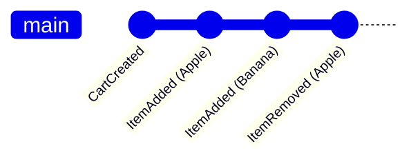

# 第13章：最小EventStore（インメモリ）を作る①：読み書きだけ📦✅

## この章のゴール🎯✨

この章が終わると、こういう状態になります😊

* **イベントを「追記（Append）」できる**✍️📚
* **ストリーム単位で「読み出し（ReadStream）」できる**🔍📜
* 「イベントソーシングって、まず何が要るの？」の答えが**コードで腹落ち**する💡😺

---

## 1) まずイメージしよう：EventStoreって何？🧠📦

イベントソーシングでは、**状態（いまの結果）**じゃなくて、**出来事（過去の履歴）**を積んでいくよね😊
その「出来事の保管庫」が **EventStore** です📦✨


ポイントは超シンプル👇

* EventStoreは **追記専用（Append-only）** 🧷✅
* 読むときは **「ある集約のイベント列」** をまとめて読む🔁📜
* 集約ごとにイベント列を分けるためのキーが **streamId**（ストリームID）🗝️



---

## 2) この章で作る“最小”の中身🧺✨

今回は「DB」なし！
メモリ上にこういう箱を持つだけでOK😊

* `Map<streamId, StoredEvent[]>`

  * `streamId` ごとにイベント配列を持つ📚
  * `StoredEvent` は「イベント本体＋ちょいメタ情報」入り🍱🏷️

> まだ **version（通し番号）** は入れないよ！
> それは次の章（14章）で「順番が命🔥」としてちゃんとやる😊

---

## 3) 実装しよう：4ファイルで完成🎉🧩

## ファイル構成（例）📁✨

* `src/domainEvent.ts`
* `src/eventStore.ts`
* `src/inMemoryEventStore.ts`
* `src/demo.ts`

---

## 3-1) `src/domainEvent.ts`（イベント型の土台）📮📜

```ts
// src/domainEvent.ts

/**
 * DomainEvent = 「ドメインで起きた出来事」そのもの
 * - type: 過去形のイベント名（例: "CartCreated"）
 * - data: 事実（payload）
 * - meta: 補助情報（最小でOK）
 */
export type DomainEvent<
  Type extends string = string,
  Data extends Record<string, unknown> = Record<string, unknown>
> = Readonly<{
  type: Type;
  data: Data;
  meta?: Record<string, unknown>;
}>;

/**
 * StoredEvent = EventStoreに保存するときの包み（envelope）🍱
 * - eventId / occurredAt は「いつ・どれ」って追えるようにするため
 */
export type StoredEvent<E extends DomainEvent = DomainEvent> = Readonly<{
  eventId: string;
  streamId: string;
  occurredAt: string; // ISO文字列にしておくと扱いやすいよ🕒
  event: E;
}>;
```

---

## 3-2) `src/eventStore.ts`（読み書きの約束＝インターフェース）🧾✅

```ts
// src/eventStore.ts
import type { DomainEvent, StoredEvent } from "./domainEvent.js";

export interface EventStore<E extends DomainEvent = DomainEvent> {
  /**
   * Append = 追記する（保存というより「追加」）
   */
  append(streamId: string, events: E[]): Promise<void>;

  /**
   * ReadStream = そのストリームのイベント列を読む
   */
  readStream(streamId: string): Promise<StoredEvent<E>[]>;
}
```

---

## 3-3) `src/inMemoryEventStore.ts`（本体：Mapに積むだけ）📦🚀

```ts
// src/inMemoryEventStore.ts
import type { DomainEvent, StoredEvent } from "./domainEvent.js";
import type { EventStore } from "./eventStore.js";

export class InMemoryEventStore<E extends DomainEvent = DomainEvent>
  implements EventStore<E>
{
  private readonly streams = new Map<string, StoredEvent<E>[]>();
  private nextId = 1;

  async append(streamId: string, events: E[]): Promise<void> {
    if (events.length === 0) return; // 何もないなら何もしない😺

    const current = this.streams.get(streamId) ?? [];

    const stored: StoredEvent<E>[] = events.map((event) => ({
      eventId: this.newEventId(),
      streamId,
      occurredAt: new Date().toISOString(),
      event,
    }));

    // 外から配列をいじられても壊れないように、毎回新しい配列にする✨
    this.streams.set(streamId, [...current, ...stored]);
  }

  async readStream(streamId: string): Promise<StoredEvent<E>[]> {
    const current = this.streams.get(streamId) ?? [];
    // 返す側もコピーにして「読み出した人がpushして壊す」事故を防ぐ🛡️
    return [...current];
  }

  private newEventId(): string {
    // インメモリ学習用なので「連番で十分」だよ😊
    const id = `evt_${String(this.nextId).padStart(6, "0")}`;
    this.nextId += 1;
    return id;
  }
}
```

---

## 3-4) `src/demo.ts`（動作確認：Append → ReadStream 🔁）🧪✨

題材は「ショッピングカート」にするよ🛒💕

```ts
// src/demo.ts
import { InMemoryEventStore } from "./inMemoryEventStore.js";
import type { DomainEvent } from "./domainEvent.js";

// この章は「イベント列が読める」がゴールなので、イベント種類は少なくてOK😺
type CartEvent =
  | DomainEvent<"CartCreated", { userId: string }>
  | DomainEvent<"ItemAdded", { sku: string; qty: number }>
  | DomainEvent<"ItemRemoved", { sku: string; qty: number }>;

const store = new InMemoryEventStore<CartEvent>();

const cartId = "cart-001";

// 追記（Append）✍️
await store.append(cartId, [
  { type: "CartCreated", data: { userId: "u-001" } },
  { type: "ItemAdded", data: { sku: "coffee", qty: 2 } },
  { type: "ItemAdded", data: { sku: "cookie", qty: 1 } },
]);

// 読み出し（ReadStream）🔍
const events = await store.readStream(cartId);

console.log("イベント件数:", events.length);
console.log(
  "イベント順:",
  events.map((x) => x.event.type).join(" -> ")
);
console.log("先頭のeventId:", events[0]?.eventId);
console.log("先頭のoccurredAt:", events[0]?.occurredAt);
```

✅ 実行できたら、だいたいこんな感じが出るはずだよ（例）😊

* イベント件数: 3
* イベント順: CartCreated -> ItemAdded -> ItemAdded
* eventId と occurredAt が付いてる📌🕒

---

## 4) ここが超大事：この章の“設計の芯”🧷✨

## ✅ EventStoreは「状態」じゃなく「出来事」を貯める📜

* いまのカートの中身はまだ作らない（それは15章で復元する🔁）
* いまは「出来事がちゃんと積めて、取り出せる」ことだけに集中🎯

## ✅ “イベント本体”と“保存用の包み”を分ける🍱

* `DomainEvent`：起きた事実だけ（type + data）
* `StoredEvent`：保存の都合（eventId, occurredAt, streamId）も一緒

これ分けないと、後で「いつ起きた？」とか「重複した？」が追いにくくなるよ〜😵‍💫

---

## 5) ミニ演習💪🌸（手を動かすと一気に理解できる！）

## 演習A：別ストリームも作ってみよう🧺🧺

* `cart-002` を作って、イベントを2個だけAppendしてみてね😊
* `readStream("cart-001")` と `readStream("cart-002")` が混ざらないことを確認✅

## 演習B：readStreamの戻り値を壊せる？🧨→🛡️

* `const events = await store.readStream(cartId); events.push(...)` を試してみて
* もう一度 `readStream(cartId)` したときに、**壊れてない**ことを確認😺✨
  （コピーで返してるから守られるはず！）

## 演習C：イベントを0件Appendしたらどうなる？🪶

* `append(cartId, [])` を呼んで、何も起きないことを確認✅
* 「空イベントを入れない」って地味だけど大事😊

---

## 6) AI活用コーナー🤖✨（“丸投げ”じゃなく、型で使う！）

## ① 叩き台を作らせるプロンプト例🧱

* 「InMemoryEventStoreをMapで作って。appendとreadStreamだけ。配列はコピーで返して、外から壊れないようにして」📝✨

## ② レビューさせるプロンプト例🔎

* 「このEventStore実装、外から配列を破壊できる穴ない？ eventId/occurredAtの付け方は変じゃない？」👀🛡️

## ③ “初心者向けに説明”させるプロンプト例📚

* 「DomainEventとStoredEventの違いを、専門用語少なめで説明して。例もつけて」🌸😊

---

## 7) よくあるつまずきポイント集🚧😵‍💫（先に潰す！）

## つまずき①：`event` と `stored event` がごっちゃになる🍱

* `DomainEvent` は「出来事」
* `StoredEvent` は「保管のために包んだもの」
  → **メタ情報（id/日時/streamId）は包みに入れる**のが分かりやすいよ😊

## つまずき②：readStreamで返した配列をいじって壊す🧨

* だから **コピーで返す**のが大事🛡️✨
  （この章ではすでに対策済み😺）

## つまずき③：イベント名が現在形になる😺→🙅‍♀️

* `AddItem` ❌（命令っぽい）
* `ItemAdded` ✅（起きた出来事）
  イベントは「過去形」でね⏳✨

---

## 8) まとめ🎁✨

この章で、イベントソーシングの“心臓”の入口を作れたよ😊🫀

* EventStoreは **追記して**✍️
* **ストリーム単位で読む**🔍
  たったこれだけで、次の章から「順番」「復元」「コマンド処理の型」へ気持ちよく進める🚀✨

---

## 参考（2026年2月時点）📚🔗

* TypeScript の最新リリースノート（5.9）([TypeScript][1])
* Node.js のリリース状況（LTS/Currentの一覧）([Node.js][2])
* VS Code の 2026年1月アップデート（1.109）([Visual Studio Code][3])
* Vitest（TypeScriptをそのまま扱えるテスト環境として普及）([Vitest][4])

[1]: https://www.typescriptlang.org/docs/handbook/release-notes/typescript-5-9.html?utm_source=chatgpt.com "Documentation - TypeScript 5.9"
[2]: https://nodejs.org/en/about/previous-releases?utm_source=chatgpt.com "Node.js Releases"
[3]: https://code.visualstudio.com/updates/v1_109?utm_source=chatgpt.com "January 2026 Insiders (version 1.109)"
[4]: https://vitest.dev/?utm_source=chatgpt.com "Vitest | Next Generation testing framework"
