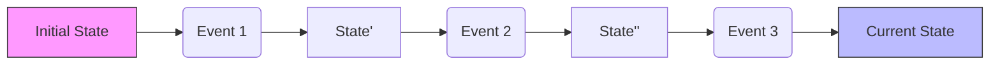

# 第15章：復元（Rehydrate）入門：Applyで状態を作る🔁🧠

## この章でできるようになること🎯✨

* イベントの列（履歴）から、今の状態を **復元（Rehydrate）** できるようになる😊
* `Apply`（イベントを状態に反映する関数）を、**安全に** 書けるようになる✅
* 「Apply漏れ（イベント追加したのに復元に反映し忘れ）」を **潰す仕組み** を入れられる🧯💥

---

## 1) Rehydrateってなに？🧩🎞️

イベントソーシングでは、「状態」を保存する代わりに **出来事（イベント）** を順番に積んでいくよね📚✨
で、「今の状態ほしい！」ってなったら…

👉 **イベントを先頭から順に再生して、状態を作り直す**
これが **復元（Rehydrate）** 🔁🎬


たとえばカートなら🛒

* `CartCreated`（カート作った）
* `ItemAdded`（商品入れた）
* `ItemQuantityChanged`（個数変えた）

この「履歴ムービー🎥」を再生して、最後の状態を作る感じだよ〜😊✨

---

## 2) Applyってなに？🧠🧷

**Apply** は超ざっくり言うと👇

> 「イベント1個」＋「今の状態」→「次の状態」 を作る関数

ポイントはこれ！✅

* `Apply` は **イベントを信じて反映する**（基本、ここでルール判定しない）

  * ルール（不変条件チェック）は、だいたい **Command処理（Decide）側** でやるよ🛡️
* **副作用なし**（DBアクセスしない、ログ出さない、乱数使わない）🙅‍♀️🎲
* いつ実行しても同じ結果（＝**決定的**）になるようにする🌱

---

## 3) 例題：ミニ・ショッピングカート🛒✨（イベント3つで復元）

ここでは「復元だけ」に集中したいので、ドメインは最小にするよ✂️😊
イベントは3種類にするね👇

* `CartCreated` 🆕
* `ItemAdded` ➕
* `ItemQuantityChanged` 🔁

---

## 3.1 型を作る（Event / State）🧾✨

```ts
// ちょいリアル感のための型（中身はただのstringでOK）
type CartId = string;
type Sku = string;

type Money = number;

type CartEvent =
  | {
      type: "CartCreated";
      data: { cartId: CartId };
      meta: { at: string }; // ISO文字列でOK
    }
  | {
      type: "ItemAdded";
      data: { sku: Sku; name: string; unitPrice: Money; quantity: number };
      meta: { at: string };
    }
  | {
      type: "ItemQuantityChanged";
      data: { sku: Sku; quantity: number };
      meta: { at: string };
    };

type CartItem = {
  sku: Sku;
  name: string;
  unitPrice: Money;
  quantity: number;
};

type CartState =
  | { kind: "Empty" } // まだ作られてない状態（イベント0件のとき用）
  | {
      kind: "Active";
      cartId: CartId;
      items: Record<Sku, CartItem>;
    };

const initialCartState: CartState = { kind: "Empty" };
```

> `kind: "Empty" | "Active"` みたいに「状態の種類」を分けると、バグが減るよ😊🧠
> 「まだ作られてないカートにItemAddedが来たら？」みたいな事故が見つけやすい✨

---

## 3.2 Apply関数を書く（switchで確実に全部処理）🧯✅

まず **「switchで全イベントを処理」** する形を作るよ💪✨
そして最後に **assertNever** を入れて「イベント増えたのにApply足してない」事故をコンパイルで止める😺🛑

```ts
function assertNever(x: never): never {
  throw new Error(`Unexpected event: ${JSON.stringify(x)}`);
}

export function applyCartEvent(state: CartState, event: CartEvent): CartState {
  switch (event.type) {
    case "CartCreated": {
      return {
        kind: "Active",
        cartId: event.data.cartId,
        items: {},
      };
    }

    case "ItemAdded": {
      if (state.kind !== "Active") return state; // ここは「最小の防御」
      const current = state.items[event.data.sku];

      const nextItem: CartItem = current
        ? { ...current, quantity: current.quantity + event.data.quantity }
        : {
            sku: event.data.sku,
            name: event.data.name,
            unitPrice: event.data.unitPrice,
            quantity: event.data.quantity,
          };

      return {
        ...state,
        items: {
          ...state.items,
          [event.data.sku]: nextItem,
        },
      };
    }

    case "ItemQuantityChanged": {
      if (state.kind !== "Active") return state;
      const current = state.items[event.data.sku];
      if (!current) return state;

      return {
        ...state,
        items: {
          ...state.items,
          [event.data.sku]: { ...current, quantity: event.data.quantity },
        },
      };
    }

    default:
      return assertNever(event);
  }
}
```

### ここでの「最小の防御」って？🧷

本来は「そんなイベント並びは起きない」ように設計するんだけど、学習中は👇があるある😵‍💫

* テスト用イベントを手書きして順番ミスる
* まだCommand側が未完成で、変な履歴ができる

だから **復元を即クラッシュさせず**、まず「最小の安全運転」にしてるよ🚗💨
（後の章で「ちゃんと壊す」「ちゃんと直す」もやる！）

---

## 3.3 Rehydrate関数（reduceでイベントを畳み込む）🔁✨

復元は、だいたいこの1行で完成するよ😊

```ts
export function rehydrateCart(events: CartEvent[]): CartState {
  return events.reduce(applyCartEvent, initialCartState);
}
```



---

## 3.4 動かしてみる（イベント3つ🎬➡️状態）🛒✨

```ts
const events: CartEvent[] = [
  {
    type: "CartCreated",
    data: { cartId: "C-001" },
    meta: { at: "2026-02-01T10:00:00.000Z" },
  },
  {
    type: "ItemAdded",
    data: { sku: "SKU-APPLE", name: "りんご", unitPrice: 120, quantity: 2 },
    meta: { at: "2026-02-01T10:01:00.000Z" },
  },
  {
    type: "ItemQuantityChanged",
    data: { sku: "SKU-APPLE", quantity: 5 },
    meta: { at: "2026-02-01T10:02:00.000Z" },
  },
];

const state = rehydrateCart(events);
/*
state は Active になって、
SKU-APPLE の quantity が 5 になってるはず😊🍎
*/
```

---

## 4) Apply漏れが怖い…😨 → コンパイルで止めよう🛑✨

イベントソーシングで一番ありがちな事故の1つが👇

> 新イベント増やしたのに、Applyに追加し忘れた😇💥
> → 復元が「古い状態のまま」になって気づきにくい…

## 4.1 `satisfies` で「イベントごとの処理表」を作る📋✅

`switch` でも十分なんだけど、イベントが増えてくると「表」の方が見通し良いことも多いよ😊
そのとき便利なのが `satisfies` ✨（TypeScript 4.9で導入）([TypeScript][1])

```ts
type CartEventType = CartEvent["type"];
type Handler<E extends CartEvent> = (state: CartState, event: E) => CartState;

type HandlerMap = {
  CartCreated: Handler<Extract<CartEvent, { type: "CartCreated" }>>;
  ItemAdded: Handler<Extract<CartEvent, { type: "ItemAdded" }>>;
  ItemQuantityChanged: Handler<Extract<CartEvent, { type: "ItemQuantityChanged" }>>;
};

const handlers = {
  CartCreated: (state, event) => ({
    kind: "Active",
    cartId: event.data.cartId,
    items: {},
  }),

  ItemAdded: (state, event) => {
    if (state.kind !== "Active") return state;
    const current = state.items[event.data.sku];
    const nextItem = current
      ? { ...current, quantity: current.quantity + event.data.quantity }
      : { sku: event.data.sku, name: event.data.name, unitPrice: event.data.unitPrice, quantity: event.data.quantity };

    return { ...state, items: { ...state.items, [event.data.sku]: nextItem } };
  },

  ItemQuantityChanged: (state, event) => {
    if (state.kind !== "Active") return state;
    const current = state.items[event.data.sku];
    if (!current) return state;

    return { ...state, items: { ...state.items, [event.data.sku]: { ...current, quantity: event.data.quantity } } };
  },
} satisfies HandlerMap;

export function applyCartEvent2(state: CartState, event: CartEvent): CartState {
  // event.typeで必ず一致するhandlerがある状態を作れる✨
  return handlers[event.type](state as CartState, event as any);
}
```

> `satisfies HandlerMap` にすると、**イベントが増えたのにhandlersに追加しない** と型エラーで止まるのが気持ちいい😺🛑✨

---

## 5) ミニ演習：Apply漏れを「わざと」起こして直す🧪🛠️

## お題🍓

`ItemRemoved` イベントを追加して、復元できるようにしてね😊

* 新イベント：`ItemRemoved`（skuだけ持つ）
* 期待：該当skuが items から消える

## ステップ🚶‍♀️

1. `CartEvent` に `ItemRemoved` を足す
2. わざと `applyCartEvent` に追加しない（すると…？）😈
3. TypeScriptのエラーを見て「ここ直して！」って言われるのを体験する👀
4. `applyCartEvent`（switch）に `ItemRemoved` を足して直す✅

---

## 6) テストの型：Given（過去）→ Rehydrate（現在）🧪🌸

復元は「関数」だからテストが超やりやすいよ😊
ここでは Node.js の標準テスト（`node:test`）でいくね🧪✨
（Nodeのリリース/LTS状況は公式でも確認できるよ）([Node.js][2])

```ts
import test from "node:test";
import assert from "node:assert/strict";
import { rehydrateCart } from "./cart";

test("rehydrate: CartCreated + ItemAdded + ItemQuantityChanged", () => {
  const events = [
    { type: "CartCreated", data: { cartId: "C-001" }, meta: { at: "2026-02-01T10:00:00.000Z" } },
    { type: "ItemAdded", data: { sku: "SKU-APPLE", name: "りんご", unitPrice: 120, quantity: 2 }, meta: { at: "2026-02-01T10:01:00.000Z" } },
    { type: "ItemQuantityChanged", data: { sku: "SKU-APPLE", quantity: 5 }, meta: { at: "2026-02-01T10:02:00.000Z" } },
  ] as const;

  const state = rehydrateCart(events as any);

  assert.equal(state.kind, "Active");
  if (state.kind !== "Active") return;

  assert.equal(state.cartId, "C-001");
  assert.equal(state.items["SKU-APPLE"].quantity, 5);
});
```

> 学習中は `as any` が混ざってもOK🙆‍♀️（後で「型を整える」章でピカピカにする✨）

---

## 7) Applyでよくある落とし穴まとめ😵‍💫🧯

## 落とし穴A：イベント順の前提があいまい🎲

* `CartCreated` より先に `ItemAdded` が来たらどうする？

  * 「来ない設計」にするのが本筋だけど、学習中は最小防御でもOK😊🧷

## 落とし穴B：イベント追加したのにApplyを更新しない😇

* **switch + assertNever** か **handlers + satisfies** で止める🛑✨
* さらに「イベントごとの復元テスト」を1本ずつ作ると安心💖🧪

## 落とし穴C：Applyが副作用モリモリ🍜

* 例：ApplyでDBアクセス、HTTP、乱数、現在時刻…

  * それやると「いつ復元しても同じ結果」にならなくて崩壊する💥
  * 時刻は `meta.at` に入ってる前提で使おう⏰✨

---

## 8) AI活用（コードを速く・安全に）🤖💨✨

## 8.1 まずは雛形を作らせる📄

GitHub Copilot / OpenAI Codex に、こんな感じで投げると速いよ😊

* 「`CartEvent`（判別共用体）を受け取る `applyCartEvent` を switch で作って。全部のcaseを埋めて。最後は `assertNever` で網羅性チェックして」
* 「rehydrateは reduce で。initial stateも入れて」
* 「node:test で復元テストを書いて。Givenはイベント列、Thenはstateのitems検証」

## 8.2 “Apply漏れ”チェック観点を出させる✅

* 「イベント追加時に起きるApply漏れパターンを5個」
* 「それぞれを防ぐ仕組み（型/テスト/レビュー観点）を箇条書きで」

---

## 9) 2026年の豆知識🫘✨（さらっと）

* TypeScriptのnpm最新は **5.9.3** として公開されているよ([npm][3])
* 5.9では `import defer` などの機能がリリースノートに載ってるよ([TypeScript][4])
* `satisfies` は公式のTypeScript 4.9リリースノートで説明されてるよ([TypeScript][1])

---

## 10) この章のゴールチェック✅🎀

* [ ] `rehydrate = events.reduce(apply, initial)` を書けた🔁
* [ ] `Apply` が「イベントを1個反映するだけ」になってる（副作用なし）🧼
* [ ] Apply漏れを **型で止める** か **テストで気づける** 仕組みがある🛑🧪

[1]: https://www.typescriptlang.org/docs/handbook/release-notes/typescript-4-9.html?utm_source=chatgpt.com "Documentation - TypeScript 4.9"
[2]: https://nodejs.org/en/about/previous-releases?utm_source=chatgpt.com "Node.js Releases"
[3]: https://www.npmjs.com/package/typescript?utm_source=chatgpt.com "typescript"
[4]: https://www.typescriptlang.org/docs/handbook/release-notes/typescript-5-9.html?utm_source=chatgpt.com "Documentation - TypeScript 5.9"
