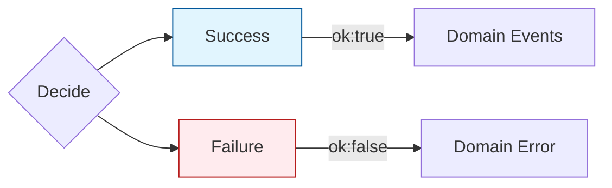

# 第17章：Command処理の“型”②（不変条件で弾く）🛡️🚧

## この章でできるようになること 🎯😊

* **不変条件（Invariants）** を「1か所（Decide）で」守れるようになる🧷✅
* ルール違反を **例外ではなく“ドメインエラー”で返す** 感覚がつかめる🚦🙂
* **Given-When-Then** で「成功/失敗」テストが書ける🧪🌸

---

## 1. まず超ざっくり：どこで“ルール”を守るの？🤔🧠


イベントソーシングの基本ルールはこれ👇✨

* **Apply**：イベントを「そのまま反映」して状態を作る（復元係）🔁
* **Decide**：コマンドを見て「イベントを作っていいか？」を決める（裁判官）⚖️

つまり…

* ✅ **不変条件チェックは Decide でやる**
* ❌ Apply に「チェック」を混ぜない（復元が壊れる＆リプレイできなくなる）😵‍💫





---

## 2. 例外じゃなくて“ドメインエラー”にする理由 😺📌


「残高不足」とか「未作成の口座に入金」みたいなものは、**ユーザー操作で普通に起きる**よね？🙂
こういうものを例外にすると…

* 例外がログを汚染しがち💥
* UIが「何が悪いの？」を出しづらい🙃
* テストが読みづらくなる🧪💦

なのでこの章では、**Decide は Result（成功/失敗）を返す**形にするよ🚦✨

ちなみにTypeScriptの安定版の最新版は現時点で **5.9** が案内されているよ📌([TypeScript][1])
（TypeScript 7のネイティブ移植プレビューも進んでるけど、この教材はまず“安定版の書き方”でいくよ🙂✨）([Microsoft for Developers][2])

---

## 3. 題材：ウォレット（残高）でやってみよう💰👛

## 3.1 ルール（不変条件）を3つだけ決める🧷


この章の不変条件はこれ👇（少なくてOK！）😊

1. 口座（Wallet）が開設されてないと入出金できない🏦🚫
2. 出金額は 1円以上（0円・マイナス禁止）🪙🚫
3. 残高より多く出金できない（残高不足）💸🚫

---

## 4. 実装：型を作って、Decide で弾く🛡️✨

ここからは **最小構成**でいくよ😊
（イベントストアはインメモリでもOK）

## 4.1 Result型（成功/失敗）を用意する🚦

```ts
// src/shared/result.ts
export type Ok<T> = { ok: true; value: T };
export type Err<E> = { ok: false; error: E };
export type Result<T, E> = Ok<T> | Err<E>;

export const ok = <T>(value: T): Ok<T> => ({ ok: true, value });
export const err = <E>(error: E): Err<E> => ({ ok: false, error });
```

---

## 4.2 イベント定義（過去形）📜⏳

```ts
// src/domain/wallet/events.ts
export type WalletOpened = {
  type: "wallet.opened";
  data: { walletId: string };
  meta: { at: string }; // ISO文字列
};

export type MoneyDeposited = {
  type: "wallet.moneyDeposited";
  data: { walletId: string; amountYen: number };
  meta: { at: string };
};

export type MoneyWithdrawn = {
  type: "wallet.moneyWithdrawn";
  data: { walletId: string; amountYen: number };
  meta: { at: string };
};

export type WalletEvent = WalletOpened | MoneyDeposited | MoneyWithdrawn;
```

---

## 4.3 コマンド定義（命令形）📮✨

```ts
// src/domain/wallet/commands.ts
export type OpenWallet = { type: "OpenWallet"; walletId: string };
export type DepositMoney = { type: "DepositMoney"; walletId: string; amountYen: number };
export type WithdrawMoney = { type: "WithdrawMoney"; walletId: string; amountYen: number };

export type WalletCommand = OpenWallet | DepositMoney | WithdrawMoney;
```

---

## 4.4 状態（復元用）＋ Apply 🔁🧠

```ts
// src/domain/wallet/state.ts
import { WalletEvent } from "./events";

export type WalletState = {
  exists: boolean;
  balanceYen: number;
};

export const initialState = (): WalletState => ({
  exists: false,
  balanceYen: 0,
});

export const applyEvent = (state: WalletState, event: WalletEvent): WalletState => {
  switch (event.type) {
    case "wallet.opened":
      return { ...state, exists: true, balanceYen: 0 };

    case "wallet.moneyDeposited":
      return { ...state, balanceYen: state.balanceYen + event.data.amountYen };

    case "wallet.moneyWithdrawn":
      return { ...state, balanceYen: state.balanceYen - event.data.amountYen };

    default: {
      // ここに来たら型定義の更新漏れ（開発者のミス）なので、コンパイルで気づけるようにする
      const _exhaustive: never = event;
      return _exhaustive;
    }
  }
};

export const rehydrate = (events: WalletEvent[]): WalletState => {
  return events.reduce(applyEvent, initialState());
};
```

📌ポイント😊

* Applyは「正しいイベントが来る前提」で淡々と反映するだけ
* ルール違反チェックは入れない（復元が壊れるから）🙅‍♀️

---

## 4.5 ドメインエラー（例外じゃないやつ）🛑🙂


```ts
// src/domain/wallet/errors.ts
export type WalletNotOpened = {
  kind: "WalletNotOpened";
  walletId: string;
};

export type InvalidAmount = {
  kind: "InvalidAmount";
  amountYen: number;
};

export type InsufficientBalance = {
  kind: "InsufficientBalance";
  balanceYen: number;
  requestedYen: number;
};

export type WalletDomainError = WalletNotOpened | InvalidAmount | InsufficientBalance;

export const errorMessage = (e: WalletDomainError): string => {
  switch (e.kind) {
    case "WalletNotOpened":
      return "このウォレットはまだ開設されていません🥺 先に開設してね！";
    case "InvalidAmount":
      return `金額が変だよ🥺（${e.amountYen}円） 1円以上を入力してね！`;
    case "InsufficientBalance":
      return `残高が足りないよ🥺（残高${e.balanceYen}円／出金${e.requestedYen}円）`;
    default: {
      const _exhaustive: never = e;
      return _exhaustive;
    }
  }
};
```

---

## 4.6 Decide：ここで“不変条件”を守る🛡️⚖️✨


```ts
// src/domain/wallet/decide.ts
import { Result, ok, err } from "../..//shared/result";
import { WalletCommand } from "./commands";
import { WalletEvent } from "./events";
import { WalletState } from "./state";
import { WalletDomainError } from "./errors";

const nowIso = () => new Date().toISOString();

export const decide = (state: WalletState, cmd: WalletCommand): Result<WalletEvent[], WalletDomainError> => {
  switch (cmd.type) {
    case "OpenWallet": {
      // ここでは「二重開設禁止」なども入れられるけど、今回は最小にする🙂
      const ev: WalletEvent = {
        type: "wallet.opened",
        data: { walletId: cmd.walletId },
        meta: { at: nowIso() },
      };
      return ok([ev]);
    }

    case "DepositMoney": {
      if (!state.exists) return err({ kind: "WalletNotOpened", walletId: cmd.walletId });
      if (cmd.amountYen <= 0) return err({ kind: "InvalidAmount", amountYen: cmd.amountYen });

      const ev: WalletEvent = {
        type: "wallet.moneyDeposited",
        data: { walletId: cmd.walletId, amountYen: cmd.amountYen },
        meta: { at: nowIso() },
      };
      return ok([ev]);
    }

    case "WithdrawMoney": {
      if (!state.exists) return err({ kind: "WalletNotOpened", walletId: cmd.walletId });
      if (cmd.amountYen <= 0) return err({ kind: "InvalidAmount", amountYen: cmd.amountYen });
      if (state.balanceYen < cmd.amountYen) {
        return err({
          kind: "InsufficientBalance",
          balanceYen: state.balanceYen,
          requestedYen: cmd.amountYen,
        });
      }

      const ev: WalletEvent = {
        type: "wallet.moneyWithdrawn",
        data: { walletId: cmd.walletId, amountYen: cmd.amountYen },
        meta: { at: nowIso() },
      };
      return ok([ev]);
    }

    default: {
      const _exhaustive: never = cmd;
      return _exhaustive;
    }
  }
};
```

---

## 5. CommandHandler（Load → Decide → Append）に組み込む📮✅

イベントストアは最小でOK（インメモリ）📦✨

```ts
// src/infra/inMemoryEventStore.ts
import { WalletEvent } from "../domain/wallet/events";

export type StreamId = string;

export class InMemoryEventStore {
  private streams = new Map<StreamId, WalletEvent[]>();

  readStream(streamId: StreamId): WalletEvent[] {
    return this.streams.get(streamId) ?? [];
  }

  appendToStream(streamId: StreamId, events: WalletEvent[]): void {
    const current = this.streams.get(streamId) ?? [];
    this.streams.set(streamId, [...current, ...events]);
  }
}
```

そしてハンドラ👇（この章の主役は「エラーを返す」ことだよ🙂🛡️）

```ts
// src/app/handleWalletCommand.ts
import { InMemoryEventStore } from "../infra/inMemoryEventStore";
import { WalletCommand } from "../domain/wallet/commands";
import { decide } from "../domain/wallet/decide";
import { rehydrate } from "../domain/wallet/state";
import { Result } from "../shared/result";
import { WalletDomainError } from "../domain/wallet/errors";
import { WalletEvent } from "../domain/wallet/events";

export const handleWalletCommand = (
  store: InMemoryEventStore,
  streamId: string,
  cmd: WalletCommand
): Result<WalletEvent[], WalletDomainError> => {
  // Load
  const pastEvents = store.readStream(streamId);

  // Rehydrate
  const state = rehydrate(pastEvents);

  // Decide（ここで不変条件チェック！）
  const decision = decide(state, cmd);
  if (!decision.ok) return decision;

  // Append
  store.appendToStream(streamId, decision.value);
  return decision;
};
```

---

## 6. ミニ演習：NGケースを1つ作って弾こう🙅‍♀️🧪✨

## やること😊

* 「残高0円のまま100円出金」を投げる
* `InsufficientBalance` で止まることを確認する

---

## 7. テスト：Given-When-Then で書く🧪🌸


この教材ではユニットテストに **Vitest** を使う形がやりやすいよ✨
（TypeScriptプロジェクトでも設定少なめで始めやすい、という説明が整理されてるよ🙂）([TypeScript入門『サバイバルTypeScript』][3])

## 7.1 テスト例（成功/失敗）✅❌

```ts
// src/domain/wallet/decide.test.ts
import { describe, it, expect } from "vitest";
import { rehydrate } from "./state";
import { decide } from "./decide";
import { WalletEvent } from "./events";

describe("Wallet decide (Given-When-Then)", () => {
  it("✅ Given: opened + deposited / When: withdraw within balance / Then: moneyWithdrawn event", () => {
    // Given
    const given: WalletEvent[] = [
      { type: "wallet.opened", data: { walletId: "w1" }, meta: { at: "2026-01-01T00:00:00.000Z" } },
      { type: "wallet.moneyDeposited", data: { walletId: "w1", amountYen: 500 }, meta: { at: "2026-01-01T00:01:00.000Z" } },
    ];
    const state = rehydrate(given);

    // When
    const result = decide(state, { type: "WithdrawMoney", walletId: "w1", amountYen: 200 });

    // Then
    expect(result.ok).toBe(true);
    if (result.ok) {
      expect(result.value).toHaveLength(1);
      expect(result.value[0].type).toBe("wallet.moneyWithdrawn");
      expect(result.value[0].data.amountYen).toBe(200);
    }
  });

  it("❌ Given: opened + deposited / When: withdraw over balance / Then: InsufficientBalance error", () => {
    // Given
    const given: WalletEvent[] = [
      { type: "wallet.opened", data: { walletId: "w1" }, meta: { at: "2026-01-01T00:00:00.000Z" } },
      { type: "wallet.moneyDeposited", data: { walletId: "w1", amountYen: 100 }, meta: { at: "2026-01-01T00:01:00.000Z" } },
    ];
    const state = rehydrate(given);

    // When
    const result = decide(state, { type: "WithdrawMoney", walletId: "w1", amountYen: 200 });

    // Then
    expect(result.ok).toBe(false);
    if (!result.ok) {
      expect(result.error.kind).toBe("InsufficientBalance");
      if (result.error.kind === "InsufficientBalance") {
        expect(result.error.balanceYen).toBe(100);
        expect(result.error.requestedYen).toBe(200);
      }
    }
  });
});
```

---

## 8. AI活用コーナー🤖✨（“丸投げ”じゃなく型で使う）

## 8.1 不変条件の候補を出してもらう🧷🧠

```text
あなたはイベントソーシング初心者の先生です。
ウォレット（残高）ドメインで「不変条件」を5つ提案してください。
条件：ユーザーが普通にやりがちなミスを止めるもの／短く／理由も一言。
```

## 8.2 エラーメッセージを“優しく・短く”整える🗣️🌸

```text
次のドメインエラーの文言を、女子大生向けにやさしく・短く直してください。
(1) WalletNotOpened
(2) InvalidAmount
(3) InsufficientBalance
条件：絵文字を入れる／責めない／次の行動が分かる。
```

## 8.3 Given-When-Then テストの“パターン”を増やす🧪✨

```text
次の実装（decide）に対して、Given-When-Then のテストケースを追加で3本提案してください。
成功1本、失敗2本。失敗は違う理由にしてください（例：未開設、0円、残高不足など）。
```

---

## 9. よくあるミス集（ここで詰まりやすい）😵‍💫🧯

## ❌ Applyでルールチェックしちゃう


→ リプレイ（復元）が「途中で止まる」ようになって地獄👹
✅ ルールは Decide に集める🛡️

## ❌ ルール違反を全部throwしちゃう

→ 想定内の失敗（残高不足）が例外扱いになり、扱いづらい💦
✅ ドメインエラーで返す🚦🙂

## ❌ エラーの種類が1個（ただの文字列）になる

→ UIが分岐できない・テストが弱い🙃
✅ `kind` を持つ union にする（分岐しやすい）✨

---

## 10. 章末チェックリスト✅📌

* [ ] 不変条件は **Decide** に集まってる🛡️
* [ ] Apply は「反映だけ」になってる🔁
* [ ] ルール違反は **Result（Err）** で返してる🚦
* [ ] **Given-When-Then** のテストが「成功/失敗」ある🧪🌸

---

## 次章へのつながり🔜😊

この章で「ルール違反＝ドメインエラー」の形ができたので、次は **作成系（Created系イベント）** を1つ通して、成功体験を作っていくよ🆕✨

（補足：Node.jsは現在、v24系がActive LTSとして案内されていて、v25系がCurrentとして更新されてるよ📌）([nodejs.org][4])

[1]: https://www.typescriptlang.org/download/?utm_source=chatgpt.com "How to set up TypeScript"
[2]: https://devblogs.microsoft.com/typescript/announcing-typescript-native-previews/?utm_source=chatgpt.com "Announcing TypeScript Native Previews"
[3]: https://typescriptbook.jp/releasenotes/2026-01-13?utm_source=chatgpt.com "2026-01-13 チュートリアル大幅刷新など"
[4]: https://nodejs.org/en/about/previous-releases?utm_source=chatgpt.com "Node.js Releases"
