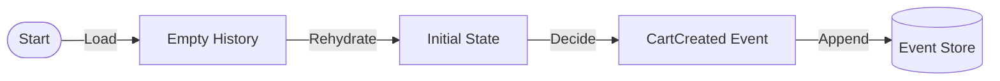

# 第18章：ユースケース実装①（作成系）🆕✨

## この章でできるようになること 🎯😊

* 「作成する」コマンド（Create）を、イベント（Created）として積めるようになる✨
* イベント列から、ちゃんと状態を復元（Rehydrate）できるようになる🔁
* 「作成系は特別」な理由（最初の1発が世界を作る🌍）を体感できる💡

---

## 18.1 作成系が“ちょっと特別”な理由 🧠✨

更新系は「すでに存在するもの」を変えるけど、作成系は **「存在しないところから、存在を生む」** んだよね👶✨

だから作成系では…

* まだイベントが1件も無い（ストリームが空っぽ）📭
* なのに「二重作成はダメ」みたいなルールは守りたい🛡️
* そして **Createdイベントが1件目として入る** と、世界が始まる🌱✨

---

## 18.2 今日の題材：ショッピングカートを作る🛒😊

### コマンド（やりたいこと）📮

* **CreateCart**：カートを新規作成したい！

### イベント（起きた事実）📜

* **CartCreated**：カートが作成された！

> ここでは「カート作成」だけに集中するよ🧘‍♀️✨
> 次の章で「更新（アイテム追加とか）」をやるよ〜🔧

---

## 18.3 設計ミニ：イベント名とPayloadの決め方🍱✨

### ✅ イベント名は過去形

* CartCreated（作成された）✅
* CartCreate（命令っぽい）❌
* CreateCart（コマンドっぽい）❌

### ✅ Payloadは「事実」だけ

CartCreatedに入れるのは例えばこんな感じ👇

* cartId（どのカート？）
* customerId（誰のカート？）

「画面に表示したいから…」で、余計な表示用データを入れないのがコツだよ🍱🚫
（表示用はProjection側で作る🔎✨）

---

## 18.4 実装：ファイル構成（この章で触るところ）🧩📁

* *src/domain/cart.ts*（ドメイン：コマンド・イベント・状態・判断）
* *src/infra/inMemoryEventStore.ts*（インメモリEventStore）
* *src/app/createCart.ts*（ユースケース：Load→Decide→Append）
* *src/demo.ts*（動作確認）

---

## 18.5* **Append**：EventStoreにそのイベントを積んで終わり！📦✨


「まだ何も起きてないストリーム」に最初のイベントを置くイメージだよ😊🌸



---

## 18.5 実装：EventStore（インメモリ）📦✅

```ts
// src/infra/inMemoryEventStore.ts
import { randomUUID } from "node:crypto";

export type EventEnvelope<TType extends string, TData> = {
  id: string;                 // eventId
  type: TType;                // "CartCreated" など
  data: TData;                // payload（事実）
  meta: {
    occurredAt: string;       // ISO文字列
  };
};

export type StoredEvent = {
  streamId: string;
  version: number;            // 0,1,2,...（順番が命！）
  event: EventEnvelope<string, unknown>;
};

export class ConcurrencyError extends Error {
  constructor(
    public readonly streamId: string,
    public readonly expectedVersion: number,
    public readonly actualVersion: number
  ) {
    super(
      `ConcurrencyError: streamId=${streamId} expected=${expectedVersion} actual=${actualVersion}`
    );
  }
}

export class InMemoryEventStore {
  private streams = new Map<string, StoredEvent[]>();

  readStream(streamId: string): StoredEvent[] {
    return this.streams.get(streamId) ?? [];
  }

  appendToStream(
    streamId: string,
    expectedVersion: number,
    newEvents: Array<{ type: string; data: unknown }>
  ): number {
    const current = this.streams.get(streamId) ?? [];
    const actualVersion = current.length - 1; // 空なら -1

    if (expectedVersion !== actualVersion) {
      throw new ConcurrencyError(streamId, expectedVersion, actualVersion);
    }

    const appended: StoredEvent[] = newEvents.map((e, idx) => {
      const version = current.length + idx;
      return {
        streamId,
        version,
        event: {
          id: randomUUID(),
          type: e.type,
          data: e.data,
          meta: { occurredAt: new Date().toISOString() },
        },
      };
    });

    const next = current.concat(appended);
    this.streams.set(streamId, next);

    return next.length - 1; // 最終version
  }
}
```

---

## 18.6 実装：ドメイン（Command / Event / State / Decide / Apply）🧠📮📜

```ts
// src/domain/cart.ts
import type { EventEnvelope, StoredEvent } from "../infra/inMemoryEventStore";

// --------------------
// コマンド
// --------------------
export type CreateCartCommand = {
  type: "CreateCart";
  cartId: string;
  customerId: string;
};

export type CartCommand = CreateCartCommand;

// --------------------
// イベント（この章は作成系だけ）
// --------------------
export type CartCreated = EventEnvelope<
  "CartCreated",
  { cartId: string; customerId: string }
>;

export type CartEvent = CartCreated;

// --------------------
// 状態
// --------------------
export type CartState =
  | { status: "Empty" } // まだ存在しない状態
  | { status: "Active"; cartId: string; customerId: string };

export const emptyCartState = (): CartState => ({ status: "Empty" });

// --------------------
// ドメインエラー（例外じゃなく、型で返す方）🧯
// --------------------
export type DomainError =
  | { type: "CartAlreadyExists"; cartId: string }
  | { type: "InvalidId"; field: "cartId" | "customerId" };

export type Result<T> =
  | { ok: true; value: T }
  | { ok: false; error: DomainError };

const isBlank = (s: string) => s.trim().length === 0;

// --------------------
// Decide：状態 + コマンド → 新イベント（またはエラー）
// --------------------
export function decide(state: CartState, command: CartCommand): Result<CartEvent[]> {
  switch (command.type) {
    case "CreateCart": {
      if (isBlank(command.cartId)) {
        return { ok: false, error: { type: "InvalidId", field: "cartId" } };
      }
      if (isBlank(command.customerId)) {
        return { ok: false, error: { type: "InvalidId", field: "customerId" } };
      }

      // すでに作成済みなら二重作成NG🙅‍♀️
      if (state.status !== "Empty") {
        return { ok: false, error: { type: "CartAlreadyExists", cartId: command.cartId } };
      }

      // 「起きた事実」をイベントとして返す📜✨
      const created: CartCreated = {
        id: "placeholder", // ここはEventStoreが採番する（append時に上書きする運用でもOK）
        type: "CartCreated",
        data: {
          cartId: command.cartId,
          customerId: command.customerId,
        },
        meta: { occurredAt: "placeholder" },
      };

      return { ok: true, value: [created] };
    }
  }
}

// --------------------
// Apply：イベント1件で状態を進める🔁
// --------------------
export function apply(state: CartState, event: CartEvent): CartState {
  switch (event.type) {
    case "CartCreated":
      return {
        status: "Active",
        cartId: event.data.cartId,
        customerId: event.data.customerId,
      };
  }
}

// --------------------
// Rehydrate：イベント列から状態を復元する🔁🧠
// --------------------
export function rehydrate(history: StoredEvent[]): CartState {
  let state: CartState = emptyCartState();

  for (const item of history) {
    // 型安全のため、ここではCartEventだけ流れてくる前提にしてるよ😊
    state = apply(state, item.event as CartEvent);
  }
  return state;
}

// --------------------
// ストリームID（この章は1集約=1ストリーム）📼
// --------------------
export const cartStreamId = (cartId: string) => `cart-${cartId}`;
```

### ちょいメモ（型の話）📝✨

* 「Decideはイベントを返す」→ ここがイベントソーシングの心臓部💓
* 「Applyは状態を作る」→ 復元もProjectionも、だいたいこの考え方でいける🔁

---

## 18.7 実装：ユースケース（Load → Decide → Append）📮✅

```ts
// src/app/createCart.ts
import { InMemoryEventStore } from "../infra/inMemoryEventStore";
import { cartStreamId, decide, rehydrate, type CreateCartCommand, type Result } from "../domain/cart";

export type UseCaseError =
  | { type: "Concurrency"; message: string } // この章は軽く触るだけ
  | { type: "Unknown"; message: string };

export type UseCaseResult =
  | { ok: true }
  | { ok: false; error: UseCaseError | ReturnType<typeof decide> extends Result<any> ? never : never };

export function handleCreateCart(
  store: InMemoryEventStore,
  command: CreateCartCommand
): Result<void> | { ok: false; error: UseCaseError } {
  const streamId = cartStreamId(command.cartId);

  // 1) Load（過去イベントを読む）
  const history = store.readStream(streamId);

  // 2) Rehydrate（状態を復元）
  const state = rehydrate(history);

  // 3) Decide（不変条件チェック→新イベント生成）
  const decided = decide(state, command);
  if (!decided.ok) return decided;

  // 4) Append（保存）※作成系は「空ストリーム」を期待するので expectedVersion=-1
  try {
    store.appendToStream(
      streamId,
      -1,
      decided.value.map(e => ({ type: e.type, data: e.data }))
    );
    return { ok: true, value: undefined };
  } catch (e) {
    if (e instanceof Error && e.name === "ConcurrencyError") {
      return { ok: false, error: { type: "Concurrency", message: e.message } };
    }
    return { ok: false, error: { type: "Unknown", message: String(e) } };
  }
}
```

> ここでやってることは、まさに「Load → Decide → Append」だよ📮✅
> この“型”があると、実装がブレなくなるのが最高👍✨

---

## 18.8 動作確認（Createdイベント → 復元まで）🎬🔁

```ts
// src/demo.ts
import { InMemoryEventStore } from "./infra/inMemoryEventStore";
import { handleCreateCart } from "./app/createCart";
import { cartStreamId, rehydrate } from "./domain/cart";

const store = new InMemoryEventStore();

const cartId = "c-001";
const customerId = "u-123";

// 1回目：成功✅
const r1 = handleCreateCart(store, { type: "CreateCart", cartId, customerId });
console.log("create #1:", r1);

// イベント確認📜
const stream = store.readStream(cartStreamId(cartId));
console.log("events:", stream.map(x => ({ v: x.version, t: x.event.type, data: x.event.data })));

// 状態復元🔁
const state = rehydrate(stream);
console.log("rehydrated state:", state);

// 2回目：二重作成で失敗🙅‍♀️
const r2 = handleCreateCart(store, { type: "CreateCart", cartId, customerId });
console.log("create #2:", r2);
```

### 期待する出力の雰囲気 👀✨

* 1回目は ok: true
* events に CartCreated が 1件入る
* rehydrated state が Active になる
* 2回目は CartAlreadyExists エラーになる🙅‍♀️

---

## 18.9 ミニ演習（手を動かすと一気に理解が進むよ💪😊）

### 演習A：IDが空文字のときのエラー文言を改善📝✨

今は InvalidId だけど、

* 「cartIdは必須だよ」
* 「customerIdが空っぽ！」
  みたいに、表示しやすい形にしてみよう😊

### 演習B：Createdイベントに “作成理由” を入れたくなったら？🤔

「キャンペーンで作った」とか入れたい気持ちが出るけど…
それって **事実（ドメイン）** ？それとも **UI事情** ？🍱

* もし事実なら payload に入れてOK✅
* UI事情なら Projection 側で作る🔎✨

### 演習C：Createdのあとに「作成した時刻」を状態に乗せる⏰

* Applyで state.createdAt を持つ
* でも createdAt は “イベントのメタ” でもあるよね？
  どっちに置くのが読みやすいか考えてみよう😊

---

## 18.10 AI活用（Copilot / Codex）で爆速にする🤖⚡

### ① Decideのレビューをしてもらう🔎

* 「二重作成を防げてる？」
* 「空IDを弾けてる？」
* 「イベント名は過去形になってる？」

### ② “イベントの粒度” の相談をする⚖️

* 「CartCreatedだけで十分？」
* 「CustomerLinkedToCartみたいに分けるべき？」

### ③ Apply漏れチェックをさせる👀

* 「イベント追加したらApplyも必ず更新してね」って、レビュー観点を固定すると強い✅

---

## 18.11 よくあるミス集（ここ踏む人多いよ〜🧨😵‍💫）

### ❌ ミス1：Createコマンドなのにイベント名が現在形

* CreateCart（コマンド）と
* CartCreated（イベント）
  を混ぜないでね📮📜

### ❌ ミス2：イベントに表示用データを詰めすぎ🍱💥

「画面に必要だから」で入れたくなるけど、あとで地獄になりがち😇
表示はProjectionで作る🔎✨

### ❌ ミス3：作成系なのに expectedVersion を見てない

作成系は「空っぽのはず」を主張するのが大事📼✅
だから expectedVersion=-1 みたいなチェックが効いてくるよ🔒

---

## 18.12 理解チェック（サクッと3問）✅😊

1. CreateCart（コマンド）と CartCreated（イベント）の違いを一言で言うと？📮📜
2. 作成系で二重作成を防ぐ方法を2つ挙げてみて🛡️
3. 「イベントに入れる情報」と「Projectionで作る情報」の違いは？🍱🔎

---

## 📌最新メモ（2026/02/01時点）🆙🗞️

* TypeScriptの安定版は 5.9.3 が “Latest” として公開されているよ（GitHub Releases）([GitHub][1])
* Node.js は v24 が Active LTS、v25 が Current として公開されてるよ（公式のリリース一覧）([Node.js][2])
* VS Code の更新情報は 2026年1月の 1.109（Insiders）に追記され続けてるよ📝([Visual Studio Code][3])
* Vitest は公式ガイドで package.json へのインストールを推奨してるよ🧪([Vitest][4])
* TypeScriptの satisfies 演算子は「型を満たすか検証しつつ、型を変えない」ための仕組みだよ✅([typescriptlang.org][5])

[1]: https://github.com/microsoft/typescript/releases "Releases · microsoft/TypeScript · GitHub"
[2]: https://nodejs.org/en/about/previous-releases?utm_source=chatgpt.com "Node.js Releases"
[3]: https://code.visualstudio.com/updates/v1_109?utm_source=chatgpt.com "January 2026 Insiders (version 1.109)"
[4]: https://vitest.dev/guide/?utm_source=chatgpt.com "Getting Started | Guide"
[5]: https://www.typescriptlang.org/docs/handbook/release-notes/typescript-4-9.html?utm_source=chatgpt.com "Documentation - TypeScript 4.9"
