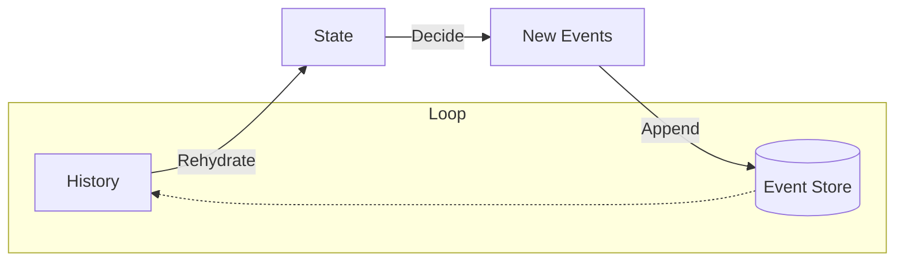

# 第19章：ユースケース実装②（更新系）🔧✨

## この章でできるようになること 🎯💖

* 「更新」を **Command → Event** に落として実装できるようになる 📮➡️📜
* **追加・削除・数量変更**みたいな “ありがち更新” をイベントとして扱えるようになる 🧺➕➖🔢
* 「イベントの粒度（でかすぎ/細かすぎ）」を **更新系で** 感覚としてつかむ ⚖️✨

---

## 参考：2026-02-01 時点の“最新”メモ 🧠📌

* npm の `typescript` は **5.9.3** が latest として案内されているよ。([NPM][1])
* **TypeScript 5.9** の公式リリース情報（新機能の方向性）はここが基準。([Microsoft for Developers][2])
* Node.js は **v24 が Active LTS**（長期運用向け）、v25 は Current（最先端）という位置づけ。([Node.js][3])
* セキュリティ更新は定期的に出るので、更新は早めが安心だよ。([Node.js][4])
* ちなみに Microsoft は “TypeScript をネイティブ実装へ寄せる” みたいな大きな改善も進めてる（将来の話として知っておくとワクワク）。([Microsoft Developer][5])

---

## 1) 題材：ショッピングカートの「更新」をイベントにする 🛒✨


ここではカートの更新をこの3つに絞るよ（超よくあるやつ！）😊

* **商品を追加**（Add）➕
* **商品を削除**（Remove）➖
* **数量を変更**（Change Qty）🔢

そしてイベントは “過去形” で記録するんだったね 🕰️✅

* `ItemAddedToCart`（追加された）
* `ItemRemovedFromCart`（削除された）
* `ItemQuantityChanged`（数量が変わった）

---

## 2) まずは「Command」「Event」「State」を揃える 🧩📦


> ポイント：更新系は **「操作（Command）」と「事実（Event）」を混ぜない** のが超大事だよ〜！🙅‍♀️💥

```ts
// ✅ Command（お願い・操作）
export type AddItem = {
  type: "AddItem";
  cartId: string;
  productId: string;
  quantity: number; // 追加したい数量
};

export type RemoveItem = {
  type: "RemoveItem";
  cartId: string;
  productId: string;
};

export type ChangeItemQuantity = {
  type: "ChangeItemQuantity";
  cartId: string;
  productId: string;
  quantity: number; // 変更後の数量（0は禁止にしてみる）
};

export type CartCommand = AddItem | RemoveItem | ChangeItemQuantity;

// ✅ Event（起きた事実・履歴）
export type ItemAddedToCart = {
  type: "ItemAddedToCart";
  productId: string;
  quantity: number;
};

export type ItemRemovedFromCart = {
  type: "ItemRemovedFromCart";
  productId: string;
};

export type ItemQuantityChanged = {
  type: "ItemQuantityChanged";
  productId: string;
  quantity: number;
};

export type CartEvent = ItemAddedToCart | ItemRemovedFromCart | ItemQuantityChanged;

// ✅ State（今の状態：イベントから作る）
export type CartState = {
  cartId: string;
  items: Record<string, number>; // productId -> qty
};
```

---

## 3) 更新系のキモ：イベント粒度を決める ⚖️🧠

更新のイベントって、粒度がブレやすいの🥺💦
たとえば「追加」をどう表現する？

## パターンA：追加は “差分（increment）” として記録する ➕📈


* `ItemAddedToCart(productId, quantity)`
* 何回でも足せる（同じ商品を +1, +2…）
* ログとして自然（何回足したかも履歴に残る）📜✨

## パターンB：追加も “最終値（set）” として記録する 🔢🎯

* `ItemQuantityChanged(productId, newQuantity)`
* いつでも最終値が分かりやすい
* でも「足した」という事実が薄れることもある🤔

この章ではわかりやすく **A（差分で追加）＋B（最終値で変更）** の “ミックス” でいくよ！💡

* 追加 → `ItemAddedToCart`（差分）
* 数量変更 → `ItemQuantityChanged`（最終値）

---

## 4) Apply：イベントを State に反映する 🔁🧠✨


> ポイント：**イベントを増やしたら Apply も必ず増やす**（忘れると復元が壊れる😱）

```ts
export function initialCartState(cartId: string): CartState {
  return { cartId, items: {} };
}

export function apply(state: CartState, event: CartEvent): CartState {
  switch (event.type) {
    case "ItemAddedToCart": {
      const current = state.items[event.productId] ?? 0;
      return {
        ...state,
        items: {
          ...state.items,
          [event.productId]: current + event.quantity,
        },
      };
    }

    case "ItemRemovedFromCart": {
      const { [event.productId]: _, ...rest } = state.items;
      return { ...state, items: rest };
    }

    case "ItemQuantityChanged": {
      return {
        ...state,
        items: {
          ...state.items,
          [event.productId]: event.quantity,
        },
      };
    }
  }
}

export function rehydrate(cartId: string, history: CartEvent[]): CartState {
  return history.reduce((s, e) => apply(s, e), initialCartState(cartId));
}
```

---

## 5) Decide：更新コマンドから「新イベント」を決める 📮➡️📜

更新系の処理は、大きく3つのステップで構成されるよ。

1. **Load/Rehydrate**：過去イベントを全部読んで、現在の状態を復元する🔁🧠
2. **Decide**：状態＋新しいコマンドを見て、新しいイベントを「1つ以上」決める🛡️✨
3. **Append**：その新イベントをEventStoreに追記する🛒➡️📦




---
## 5.1 例外じゃなく「Result」で返す（超ミニ版）🚦😊

（本格的には後の章でやるけど、ここでも “例外まみれ” を避けたい✨）

```ts
export type DomainError =
  | { code: "InvalidQuantity"; message: string }
  | { code: "ItemNotInCart"; message: string };

export type Result<T> =
  | { ok: true; value: T }
  | { ok: false; error: DomainError };

export const ok = <T>(value: T): Result<T> => ({ ok: true, value });
export const fail = (error: DomainError): Result<never> => ({ ok: false, error });
```

---

## 5.2 AddItem：追加は “差分イベント” を出す ➕🛒

```ts
export function decideAddItem(state: CartState, cmd: AddItem): Result<CartEvent[]> {
  if (cmd.quantity <= 0) {
    return fail({ code: "InvalidQuantity", message: "数量は1以上にしてね🥺" });
  }

  return ok([
    {
      type: "ItemAddedToCart",
      productId: cmd.productId,
      quantity: cmd.quantity,
    },
  ]);
}
```

---

## 5.3 RemoveItem：なければ削除できないよね？ ➖🧺


```ts
export function decideRemoveItem(state: CartState, cmd: RemoveItem): Result<CartEvent[]> {
  const current = state.items[cmd.productId];
  if (current === undefined) {
    return fail({ code: "ItemNotInCart", message: "その商品、カートに入ってないよ🫠" });
  }

  return ok([
    {
      type: "ItemRemovedFromCart",
      productId: cmd.productId,
    },
  ]);
}
```

---

## 5.4 ChangeItemQuantity：0は禁止、最終値で更新 🔢✨

```ts
export function decideChangeItemQuantity(
  state: CartState,
  cmd: ChangeItemQuantity
): Result<CartEvent[]> {
  const current = state.items[cmd.productId];
  if (current === undefined) {
    return fail({ code: "ItemNotInCart", message: "その商品、カートに入ってないよ🫠" });
  }
  if (cmd.quantity <= 0) {
    return fail({ code: "InvalidQuantity", message: "数量は1以上にしてね🥺" });
  }

  // 変化がないならイベント出さない、もアリ（ログ節約）✨
  if (current === cmd.quantity) {
    return ok([]);
  }

  return ok([
    {
      type: "ItemQuantityChanged",
      productId: cmd.productId,
      quantity: cmd.quantity,
    },
  ]);
}
```

---

## 6) まとめ関数：decide をコマンドで振り分ける 🧭✨

```ts
export function decide(state: CartState, cmd: CartCommand): Result<CartEvent[]> {
  switch (cmd.type) {
    case "AddItem":
      return decideAddItem(state, cmd);
    case "RemoveItem":
      return decideRemoveItem(state, cmd);
    case "ChangeItemQuantity":
      return decideChangeItemQuantity(state, cmd);
  }
}
```

---

## 7) Load → Decide → Append：更新の流れをつなぐ 🔁📦✅

ここは “型” で固定しちゃうと迷子にならないよ😊🧠
（Append の中身は前の章で作った EventStore を使う想定だよ）

```ts
export type EventEnvelope = {
  streamId: string;
  version: number;
  event: CartEvent;
};

export interface EventStore {
  readStream(streamId: string): Promise<EventEnvelope[]>;
  appendToStream(streamId: string, events: CartEvent[]): Promise<void>;
}

export async function handleCartCommand(store: EventStore, cmd: CartCommand): Promise<Result<void>> {
  // 1) Load
  const streamId = `cart-${cmd.cartId}`;
  const history = await store.readStream(streamId);
  const pastEvents = history.map((x) => x.event);

  // 2) Rehydrate
  const state = rehydrate(cmd.cartId, pastEvents);

  // 3) Decide
  const decision = decide(state, cmd);
  if (!decision.ok) return decision;

  // 4) Append
  if (decision.value.length > 0) {
    await store.appendToStream(streamId, decision.value);
  }

  return ok(undefined);
}
```

---

## 8) 動作確認：更新を順番に流してみよう 🎬✨

```ts
// デモ用：超雑なインメモリEventStore（最小）
export class InMemoryEventStore implements EventStore {
  private streams = new Map<string, EventEnvelope[]>();

  async readStream(streamId: string): Promise<EventEnvelope[]> {
    return this.streams.get(streamId) ?? [];
  }

  async appendToStream(streamId: string, events: CartEvent[]): Promise<void> {
    const current = this.streams.get(streamId) ?? [];
    let version = current.length === 0 ? 0 : current[current.length - 1].version;

    const appended = events.map((e) => {
      version += 1;
      return { streamId, version, event: e satisfies CartEvent };
    });

    this.streams.set(streamId, [...current, ...appended]);
  }
}

// 実行イメージ
async function demo() {
  const store = new InMemoryEventStore();

  await handleCartCommand(store, { type: "AddItem", cartId: "A", productId: "P1", quantity: 2 });
  await handleCartCommand(store, { type: "AddItem", cartId: "A", productId: "P1", quantity: 1 });
  await handleCartCommand(store, { type: "ChangeItemQuantity", cartId: "A", productId: "P1", quantity: 5 });
  await handleCartCommand(store, { type: "RemoveItem", cartId: "A", productId: "P1" });

  const history = await store.readStream("cart-A");
  console.log("events:", history.map((x) => x.event));

  const state = rehydrate("A", history.map((x) => x.event));
  console.log("state:", state);
}

demo();
```

✅ これで「更新が履歴として積まれて、最後に復元できる」感覚がつかめるよ〜！🥳📜➡️🧠

---

## 9) ミニ演習（この章のゴール）📝💪✨

## 演習A：更新コマンドを2つ以上、増やす 🧠➕

次のどれかを追加してみてね（おすすめ順）😊

* `ClearCart`（カートを空にする）🧹✨
* `AddItem` のとき、同じ商品なら「増やす」じゃなく「上限を超えない」などのルールを入れる 🧷
* `ChangeItemQuantity` で 99 超え禁止とか入れてみる 🔒

**ヒント**：イベントは “やった” じゃなく “起きた” にするよ！📜✨

* `CartCleared` ✅
* `QuantityCapped` みたいなのはちょい難（理由：ドメインの事実か？補助の事実か？）🤔

---

## 演習B：Apply漏れをわざと起こして直す 🫣🔧


1. 新イベントを作る
2. Apply に書き忘れる
3. 復元して「なんか変…😱」を体験する
4. Apply を直して復元が戻るのを確認する ✅✨

これ、実務でめっちゃ起きるから “体験しとく” のが強いよ〜🥺💕

---

## 10) AI活用（Copilot/Codex向け）🤖💬✨

最小で効くプロンプト例だよ📌
（最終判断はあなたがする前提で、AIは “案出し係” にするのがコツ😊）

## ✅ 粒度チェック用

* 「`ItemAddedToCart` と `ItemQuantityChanged` の粒度の違いと、混ぜたときの注意点を3つ挙げて」

## ✅ ルール（不変条件）案出し

* 「数量変更に入れるべき不変条件を5つ、初心者向けに説明して」

## ✅ エッジケース洗い出し

* 「RemoveItem / ChangeItemQuantity の想定外入力（productId不正、同時更新など）を列挙して」

---

## 11) よくあるミス集（更新系あるある）😵‍💫💥

* **イベント名が命令形になる**

  * ❌ `RemoveItem`（Commandっぽい）
  * ✅ `ItemRemovedFromCart`（事実）📜✨

* **Applyを書き忘れる** → 復元がズレる 😱

* **“更新の意味” が曖昧なイベントを作る**

  

  * 例：`ItemUpdated` は便利そうで地獄になりやすい🫠
  * 「何がどう変わったか」が履歴から読めなくなるよ〜💦

---

## 12) まとめ 🌸📚

更新系は、イベントソーシングの中でも特に「設計の差」が出やすいところだけど、
この章の型（Apply / Decide / Load→Decide→Append）で固定すると一気にラクになるよ😊🔧✨

次の章では、この更新を **Given-When-Then** でテストして「安心して壊せる」ようにしていくよ🧪🌷

[1]: https://www.npmjs.com/package/typescript?activeTab=versions&utm_source=chatgpt.com "typescript"
[2]: https://devblogs.microsoft.com/typescript/announcing-typescript-5-9/?utm_source=chatgpt.com "Announcing TypeScript 5.9"
[3]: https://nodejs.org/en/about/previous-releases?utm_source=chatgpt.com "Node.js Releases"
[4]: https://nodejs.org/en/blog/vulnerability/december-2025-security-releases?utm_source=chatgpt.com "Tuesday, January 13, 2026 Security Releases"
[5]: https://developer.microsoft.com/blog/typescript-7-native-preview-in-visual-studio-2026?utm_source=chatgpt.com "TypeScript 7 native preview in Visual Studio 2026"
