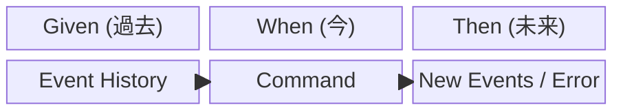

# 第20章：テストの型①（Given-When-Then）🧪🌸

## この章でできるようになること🎯✨

* イベントソーシングのテストを「型」で書けるようになる😊🧩
* **Given（過去のイベント）→ When（コマンド）→ Then（新しいイベント or エラー）**で、迷子にならない🗺️✨
* テスト対象を「DBやAPI」じゃなく、**ドメインの意思決定（Decide）**に寄せて、速くて強いテストにする⚡🛡️

---

## 1) まず超重要：イベントソーシングのテストは「状態」じゃなく「イベント」を見る👀📜✨

イベントソーシングでは、ざっくりこう考えるとラクです😊

* **Given**：これまでに起きた出来事（イベントの列）📚
* **When**：ある操作（コマンド）を投げる📮
* **Then**：新しく追加される出来事（イベント）を期待する🎉

  * もしくは「ルール違反」で**エラー**を期待する🚧💥

つまりテストの主役は、だいたいこの部分👇
**Load（過去イベント）→ Decide（イベントを作る/エラーにする）→ Append（保存）**
この章はとくに **Decideが正しいか** をテストするよ🧠🧪✨





---

## 2) 今どきのTypeScriptテスト基盤：Vitestでいこう😺⚡

最近は **Vitest** がかなり主流で、ドキュメントも継続的に更新されています📈✨
（Vitest 4.0 のアナウンスも出ています）([Vitest][1])

## 最小インストール🧰✨

* まずはこれだけでOK：Vitestは「npmで入れて」「コマンドで回す」が基本だよ😊([Kou029w][2])

```bash
npm i -D vitest
```

## よくある npm scripts（例）📝

```json
{
  "scripts": {
    "test": "vitest",
    "test:watch": "vitest --watch",
    "test:ui": "vitest --ui"
  }
}
```

> 「describe / it / expect を import したくない…」って時は、globals設定もできるよ👌
> 設定方法と、型の当て方（vitest/globals）も公式にまとまってるよ🧁([Vitest][3])

## VS Codeで“ボタン実行”したい時🖱️🧪✨

VitestをVS Codeのテストエクスプローラで回せる拡張もあるよ！便利🎮
（マーケットプレイスに「Vitest extension」があって、実行/デバッグ/ウォッチ等ができる）([Visual Studio Marketplace][4])
IDE連携の情報も公式にまとまってるよ📚([Vitest][5])

---

## 3) 例題ドメイン：ミニ「カート」🛒🌸（イベントだけで考える）

この章はテストが主役なので、ドメインは小さく！いくよ〜😊✨

## ルール（不変条件）🧷🛡️

* カートが作られてないのに追加はできない🙅‍♀️
* 追加する数量は 1以上じゃないとダメ😵‍💫

## イベント（過去形）📜

* CartCreated
* ItemAdded

## コマンド📮

* CreateCart
* AddItem

---

## 4) ドメイン実装（最小）✍️🧠

> ここは「テストしやすい形」に寄せるよ😊
> ポイント：**handle(command, historyEvents)** が “純粋に近い” とテストが超ラク✨

## 型・Result・エラー定義📦

```ts
// src/cart/domain.ts
export type CartEvent =
  | { type: "CartCreated"; cartId: string; userId: string }
  | { type: "ItemAdded"; cartId: string; sku: string; quantity: number };

export type CartCommand =
  | { type: "CreateCart"; cartId: string; userId: string }
  | { type: "AddItem"; cartId: string; sku: string; quantity: number };

export type DomainError =
  | { type: "AlreadyCreated" }
  | { type: "NotCreated" }
  | { type: "InvalidQuantity"; quantity: number };

export type Result<T, E> =
  | { ok: true; value: T }
  | { ok: false; error: E };
```

## 状態・Apply・Decide・ハンドラ🔁

```ts
// src/cart/aggregate.ts
import { CartCommand, CartEvent, DomainError, Result } from "./domain";

type CartState = {
  created: boolean;
  cartId: string | null;
  userId: string | null;
};

const initialState = (): CartState => ({
  created: false,
  cartId: null,
  userId: null,
});

const apply = (state: CartState, event: CartEvent): CartState => {
  switch (event.type) {
    case "CartCreated":
      return { created: true, cartId: event.cartId, userId: event.userId };
    case "ItemAdded":
      // 今回は「追加できた」という事実だけ見たいので、状態は最小でOK
      return state;
  }
};

const rehydrate = (history: CartEvent[]): CartState => {
  return history.reduce((s, e) => apply(s, e), initialState());
};

const decide = (state: CartState, command: CartCommand): Result<CartEvent[], DomainError> => {
  switch (command.type) {
    case "CreateCart": {
      if (state.created) return { ok: false, error: { type: "AlreadyCreated" } };
      return {
        ok: true,
        value: [{ type: "CartCreated", cartId: command.cartId, userId: command.userId }],
      };
    }
    case "AddItem": {
      if (!state.created) return { ok: false, error: { type: "NotCreated" } };
      if (command.quantity < 1) {
        return { ok: false, error: { type: "InvalidQuantity", quantity: command.quantity } };
      }
      return {
        ok: true,
        value: [
          { type: "ItemAdded", cartId: command.cartId, sku: command.sku, quantity: command.quantity },
        ],
      };
    }
  }
};

export const handle = (command: CartCommand, history: CartEvent[]): Result<CartEvent[], DomainError> => {
  const state = rehydrate(history);
  return decide(state, command);
};
```

---

## 5) Given-When-Then テストを書く🧪🌸✨（成功/失敗を2本）

## 基本形（超まっすぐ版）📏

```ts
// test/cart.gwt.spec.ts
import { describe, it, expect } from "vitest";
import { handle } from "../src/cart/aggregate";
import { CartEvent, CartCommand } from "../src/cart/domain";

describe("カート：Given-When-Then 🛒🧪", () => {
  it("成功✅ Given:作成済み When:AddItem Then:ItemAdded", () => {
    // Given（過去のイベント）📚
    const given: CartEvent[] = [
      { type: "CartCreated", cartId: "C1", userId: "U1" },
    ];

    // When（コマンド）📮
    const when: CartCommand = { type: "AddItem", cartId: "C1", sku: "SKU-APPLE", quantity: 2 };

    // Then（新しいイベント）🎉
    const then: CartEvent[] = [
      { type: "ItemAdded", cartId: "C1", sku: "SKU-APPLE", quantity: 2 },
    ];

    const result = handle(when, given);
    expect(result).toEqual({ ok: true, value: then });
  });

  it("失敗🚧 Given:未作成 When:AddItem Then:NotCreatedエラー", () => {
    // Given（過去イベントなし）📭
    const given: CartEvent[] = [];

    // When（コマンド）📮
    const when: CartCommand = { type: "AddItem", cartId: "C1", sku: "SKU-APPLE", quantity: 1 };

    const result = handle(when, given);

    // Then（エラーを期待）💥
    expect(result.ok).toBe(false);
    if (!result.ok) {
      expect(result.error.type).toBe("NotCreated");
    }
  });
});
```

## ここが「イベントソーシングっぽい」ポイント💡✨

* Then は **状態**じゃなくて **イベント**を見る👀📜
* 「DBに入った？」とか「画面に出た？」は、この層のテストでは見ない🙅‍♀️
  （それは後の章で“別の種類のテスト”としてやるとキレイ✨）

---

## 6) もっと読みやすくする：GWTヘルパー🧁✨

テストが増えると、毎回同じ形を書くのがだるい😵‍💫
だから “文章っぽく” 読めるヘルパーを作ると幸せ😊🌸

```ts
// test/gwt-helper.ts
import { expect } from "vitest";
import { CartCommand, CartEvent, DomainError, Result } from "../src/cart/domain";
import { handle } from "../src/cart/aggregate";

export const given = (history: CartEvent[]) => ({
  when: (command: CartCommand) => ({
    thenEvents: (expected: CartEvent[]) => {
      const result = handle(command, history);
      expect(result).toEqual({ ok: true, value: expected });
    },
    thenError: (expectedErrorType: DomainError["type"]) => {
      const result = handle(command, history);
      expect(result.ok).toBe(false);
      if (!result.ok) expect(result.error.type).toBe(expectedErrorType);
    },
  }),
});
```

使う側はこんな感じ👇✨

```ts
// test/cart.gwt.helper.spec.ts
import { describe, it } from "vitest";
import { given } from "./gwt-helper";

describe("GWTヘルパー版 🧁🧪", () => {
  it("成功✅", () => {
    given([{ type: "CartCreated", cartId: "C1", userId: "U1" }])
      .when({ type: "AddItem", cartId: "C1", sku: "SKU-APPLE", quantity: 2 })
      .thenEvents([{ type: "ItemAdded", cartId: "C1", sku: "SKU-APPLE", quantity: 2 }]);
  });

  it("失敗🚧", () => {
    given([])
      .when({ type: "AddItem", cartId: "C1", sku: "SKU-APPLE", quantity: 1 })
      .thenError("NotCreated");
  });
});
```

---

## 7) よくある落とし穴あるある😇🕳️（先に潰す！）

## ① Then で「状態」を期待しはじめる🧟‍♀️

* “状態はApplyの結果” だから、まずは **Then＝イベント** で安定させるのがコツ😊
* 状態を見たくなったら、別テストとして「rehydrateした状態」を確認するのはアリ👌
  でも最初はイベント中心がラク✨

## ② テストがDB/時間/乱数に依存して不安定🎲⏰

* ドメイン層は **外部要因を入れない** のが正義💪✨
* 日時が必要なら「Clockを渡す」みたいに、値を固定できる形にするよ🕰️📌

## ③ 失敗テストが“例外”で落ちる😵‍💫

* 失敗は「想定された結果」だから、Result型で扱うのが安心🚦
* 例外は「想定外の事故」寄りにしておくと、デバッグが楽になるよ🔍✨

---

## 8) AI活用（テスト増殖の最強ムーブ）🤖💞

**GitHub Copilot** や **OpenAI Codex** みたいな補助があると、GWTはめちゃ伸びるよ📈🧪✨
ただし、任せ方はコツがあるよ〜😊

## コツ①：AIに「Given/When/Thenを崩さない」縛りを入れる🔒✨

```text
次のルールでテストを追加して：
- Given: 過去イベント配列
- When: コマンド1つ
- Then: 追加されるイベント配列 もしくは DomainError
- DBやHTTPは使わない（ドメイン層のテストだけ）
- テスト名は「成功✅ / 失敗🚧」が一目で分かるように
対象：AddItem の quantity が 0 のとき InvalidQuantity を返すケース
```

## コツ②：AIに「イベント名・payload」をレビューさせる👀📜

* “Thenのイベント” が本当に「起きた事実」になってる？
* SKUやquantityが「コマンドの写し」になりすぎてない？（ドメイン的な意味ある？）
  …みたいな視点を出してもらうと強い💪✨

---

## 9) ミニ演習🎓✨（2本だけ増やそう！）

## 演習A：InvalidQuantity をテストする🍎0️⃣🚧

* Given：作成済み
* When：quantity=0 で AddItem
* Then：InvalidQuantity

## 演習B：AlreadyCreated をテストする🆕➡️🆕🚧

* Given：CartCreated 済み
* When：CreateCart をもう一回
* Then：AlreadyCreated

---

## 10) まとめチェックリスト✅🌸

* Given は「過去イベント」だけ📚
* When は「コマンド1つ」だけ📮
* Then は「新イベント配列」or「ドメインエラー」だけ🎉🚧
* 外部（DB/HTTP/現在時刻）を混ぜない⚠️
* テスト名を見れば「何が成功で何が失敗か」分かる😊✨

---

## おまけ：Jest派の人へ🧸🧪

JestでもTypeScriptは動かせるけど、TypeScript対応の方法（Babel経由など）や、ts-jestを使う構成があるよ📚([jestjs.io][6])

[1]: https://vitest.dev/blog/vitest-4?utm_source=chatgpt.com "Vitest 4.0 is out!"
[2]: https://kou029w.github.io/vitest-hands-on/getting-started.html?utm_source=chatgpt.com "はじめてのテスト - Vitestではじめるテスト"
[3]: https://vitest.dev/config/globals?utm_source=chatgpt.com "globals | Config"
[4]: https://marketplace.visualstudio.com/items?itemName=vitest.explorer&utm_source=chatgpt.com "Vitest"
[5]: https://vitest.dev/guide/ide?utm_source=chatgpt.com "IDE Integrations | Guide"
[6]: https://jestjs.io/docs/getting-started?utm_source=chatgpt.com "Jest - Getting Started"
