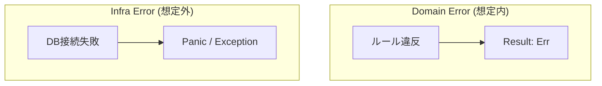

# 第21章：エラーモデリング超入門（Result型っぽい考え）🚦😊

## この章でできるようになること🎯✨

* 「例外まみれ😵‍💫」にならないように、**エラーを整理して設計**できるようになる🧺🧠
* **ドメインエラー**（ルール違反）と **インフラエラー**（DBや通信など）を分けられる🔀🧯
* Command処理（Load → Decide → Append）の **Decideを“Result返し”**にして、挙動を読みやすくできる📮✅
* テスト（Given-When-Then）で **成功・失敗がキレイに書ける**ようになる🧪🌸

---

## 1. なんで「エラーモデリング」が必要なの？🤔💭

イベントソーシングって「履歴（イベント）を積む」から、ルール違反や失敗が起きたときに…

* どこで失敗した？（ドメイン？保存？読み込み？）🌀
* ユーザーに何を見せる？🖥️
* どこまでリトライできる？🔁

がごちゃつきやすいの🥺💦

そこでこの章では、エラーをまず **2種類に分ける**ところから始めるよ〜😊🌷

---

## 2. エラーは2種類に分けよう✌️📦

### A) ドメインエラー（ルール違反）🛡️🚫

「やっちゃダメ」系。たとえばカートなら🛒✨

* 在庫0なのに追加しようとした📦❌
* 数量が0以下になった🔢❌
* すでにCheckout済みなのに変更しようとした🧾🚫

✅ポイント：**“想定内”**の失敗（正しく止めたい）

### B) インフラエラー（外の世界の失敗）🧯⚡

「保存できない」「読めない」系。

* EventStoreが落ちてる💥
* ネットワークが切れた📡❌
* JSONが壊れてた🧨

✅ポイント：**“想定外になりがち”**だけど、現実には起きる（丁寧に扱う）




---

## 3. 今日の主役：Result型っぽいやつを作ろう🎁✨

例外（throw）を乱発すると、処理の流れが見えにくくなることがあるのね🥺
そこで「成功 or 失敗」を **値として返す**スタイルを作るよ😊

### Resultの形（いちばんシンプル）🧸💡

```ts
// src/shared/result.ts
export type Ok<T> = { ok: true; value: T };
export type Err<E> = { ok: false; error: E };
export type Result<T, E> = Ok<T> | Err<E>;

export const ok = <T>(value: T): Ok<T> => ({ ok: true, value });
export const err = <E>(error: E): Err<E> => ({ ok: false, error });
```

これで、戻り値を見るだけで
「成功ルート🙂 / 失敗ルート🙅‍♀️」が一発でわかるようになるよ〜✨

---

## 4. Decideは「例外を投げない」が基本（おすすめ）📮🧠

イベントソーシングの中核は Decide（新しいイベントを決める）だよね✅
ここは **ドメインのルールの場所**だから、

* ルール違反 → ドメインエラーをResultで返す🚫
* OK → 新イベントを返す🎉

にすると、めちゃ読みやすいの🌸

---

## 5. 例：カートのドメインエラーを定義しよう🛒🧷

「種類が増えても破綻しない」ように、**ユニオン型**で定義するのが超おすすめ😊✨

```ts
// src/domain/errors.ts
export type CartDomainError =
  | { type: "CartAlreadyCheckedOut" }
  | { type: "InvalidQuantity"; quantity: number }
  | { type: "OutOfStock"; sku: string };

export const formatCartDomainError = (e: CartDomainError): string => {
  switch (e.type) {
    case "CartAlreadyCheckedOut":
      return "すでに購入手続き済みのカートは変更できません🥺";
    case "InvalidQuantity":
      return `数量が変だよ🥺 quantity=${e.quantity}`;
    case "OutOfStock":
      return `在庫がないよ🥺 sku=${e.sku}`;
    default: {
      // 型の漏れを潰すやつ（exhaustive check）🔒
      const _exhaustive: never = e;
      return _exhaustive;
    }
  }
};
```

> `default` の `never` は「ケース漏れ」をコンパイルで気づけるテクだよ🔒✨
> （最近のTypeScriptは型まわりがどんどん強くなってて、こういう“漏れ防止”が効きやすいよ〜🧠）([TypeScript][1])

---

## 6. Decide（ルールチェック→イベント生成）を書いてみよう🎬✨

ここでは例として、`AddItem` コマンドを処理する想定にするね😊

```ts
// src/domain/cart.ts
import { Result, ok, err } from "../shared/result";
import { CartDomainError } from "./errors";

export type CartState = {
  checkedOut: boolean;
  items: Record<string, number>; // sku -> qty
};

export type CartEvent =
  | { type: "ItemAdded"; sku: string; quantity: number }
  | { type: "CheckedOut" };

export const initialCartState = (): CartState => ({
  checkedOut: false,
  items: {},
});

export const applyCartEvent = (s: CartState, e: CartEvent): CartState => {
  switch (e.type) {
    case "ItemAdded": {
      const current = s.items[e.sku] ?? 0;
      return { ...s, items: { ...s.items, [e.sku]: current + e.quantity } };
    }
    case "CheckedOut":
      return { ...s, checkedOut: true };
    default: {
      const _exhaustive: never = e;
      return _exhaustive;
    }
  }
};

// Decide：状態 + コマンド → 新イベント or ドメインエラー
export const decideAddItem = (
  state: CartState,
  command: { sku: string; quantity: number },
  deps: { isInStock: (sku: string) => boolean }
): Result<CartEvent[], CartDomainError> => {
  if (state.checkedOut) return err({ type: "CartAlreadyCheckedOut" });

  if (command.quantity <= 0) {
    return err({ type: "InvalidQuantity", quantity: command.quantity });
  }

  if (!deps.isInStock(command.sku)) {
    return err({ type: "OutOfStock", sku: command.sku });
  }

  return ok([{ type: "ItemAdded", sku: command.sku, quantity: command.quantity }]);
};
```

✅ここが気持ちいいポイント😍

* Decideが **throwしない** → 失敗が「普通の分岐」になる🌿
* 「ドメインエラーだけ返す」→ 責任範囲がハッキリ🧠✨

---

## 7. インフラエラーも“型”で分けよう🧯📦

EventStoreの読み書きは失敗する可能性があるから、ここもResultにしちゃうと安全😊

```ts
// src/infra/eventStoreErrors.ts
export type EventStoreError =
  | { type: "ConnectionFailed" }
  | { type: "SerializationFailed"; reason: string }
  | { type: "ConcurrencyConflict"; expectedVersion: number; actualVersion: number };
```

---

## 8. アプリ層で「ドメイン vs インフラ」を合流させる🌉✨

画面やAPIから見ると「失敗」だけど、**意味が違う**よね🥺
だから「AppError」を作って、最後にまとめるのがやりやすいよ😊

```ts
// src/app/appError.ts
import { CartDomainError } from "../domain/errors";
import { EventStoreError } from "../infra/eventStoreErrors";

export type AppError =
  | { kind: "domain"; error: CartDomainError }
  | { kind: "infra"; error: EventStoreError };
```

---

## 9. Command処理（Load → Decide → Append）に組み込む🧩✅

「第16〜17章の型」に、Resultをスッと差し込む感じだよ😊

```ts
// src/app/handleAddItem.ts
import { Result, ok, err } from "../shared/result";
import { CartEvent, applyCartEvent, initialCartState, decideAddItem } from "../domain/cart";
import { AppError } from "./appError";
import { EventStoreError } from "../infra/eventStoreErrors";

export type EventStore = {
  readStream: (streamId: string) => Result<{ events: CartEvent[]; version: number }, EventStoreError>;
  appendToStream: (
    streamId: string,
    expectedVersion: number,
    newEvents: CartEvent[]
  ) => Result<void, EventStoreError>;
};

export const handleAddItem = (
  store: EventStore,
  streamId: string,
  command: { sku: string; quantity: number },
  deps: { isInStock: (sku: string) => boolean }
): Result<void, AppError> => {
  // Load
  const loaded = store.readStream(streamId);
  if (!loaded.ok) return err({ kind: "infra", error: loaded.error });

  const { events, version } = loaded.value;

  // Rehydrate（復元）
  const state = events.reduce(applyCartEvent, initialCartState());

  // Decide
  const decided = decideAddItem(state, command, deps);
  if (!decided.ok) return err({ kind: "domain", error: decided.error });

  // Append
  const saved = store.appendToStream(streamId, version, decided.value);
  if (!saved.ok) return err({ kind: "infra", error: saved.error });

  return ok(undefined);
};
```

ここまで来ると、
✅「どの種類の失敗か」
✅「どこで失敗したか」
がコードだけで読めるようになるよ〜📖✨

---

## 10. ミニ演習（超たいせつ）📝🌸

### 演習A：エラーを3つ作って分類してみよう🗂️✨

題材はなんでもOK🙆‍♀️

1. ドメインエラーを3つ（ルール違反）🛡️
2. インフラエラーを3つ（外の失敗）🧯

👉コツ：**「ユーザーが直せる？」**で分けると迷いにくいよ😊

### 演習B：Decideを“Result返し”に直してみよう🔧✨

すでに例外を投げてるDecideがあったら、

* throw → `return err(...)`
* success → `return ok([...])`
  に変えてみてね🌸

---

## 11. テスト（Given-When-Then）で「成功/失敗」を気持ちよく🧪💖

ここでは `decideAddItem` をテストするよ😊
（最近のVitestは4系中心でドキュメントも更新されてるよ📚✨）([Vitest][2])

```ts
// src/domain/cart.test.ts
import { describe, it, expect } from "vitest";
import { initialCartState, applyCartEvent, decideAddItem } from "./cart";

describe("decideAddItem", () => {
  it("Given: empty cart, When: add item, Then: ItemAdded event", () => {
    const state = initialCartState();
    const r = decideAddItem(
      state,
      { sku: "A-001", quantity: 2 },
      { isInStock: () => true }
    );

    expect(r.ok).toBe(true);
    if (r.ok) {
      expect(r.value).toEqual([{ type: "ItemAdded", sku: "A-001", quantity: 2 }]);
    }
  });

  it("Given: checked out cart, When: add item, Then: domain error", () => {
    const state = applyCartEvent(initialCartState(), { type: "CheckedOut" });

    const r = decideAddItem(
      state,
      { sku: "A-001", quantity: 1 },
      { isInStock: () => true }
    );

    expect(r.ok).toBe(false);
    if (!r.ok) {
      expect(r.error.type).toBe("CartAlreadyCheckedOut");
    }
  });
});
```

---

## 12. 例外（throw）はいつ使うの？🔥🚫➡️✅

Resultで全部やればOK！…と言いたいけど、実際は「例外が向く場面」もあるよ😊

✅ **throwが向く**（＝バグっぽい・想定外）

* “絶対に起きないはず”の状態（Apply漏れで不整合とか）🧨
* プログラマーのミス（nullのはずがないのにnull）😵

✅ **Resultが向く**（＝想定内）

* ルール違反（ドメインエラー）🛡️
* 外部I/O失敗（インフラエラー）🧯

この線引きをすると、運用がラクになるよ〜🌸✨

---

## 13. AI活用（コピペで使えるプロンプト）🤖💬✨

### プロンプト①：ドメインエラー案を作る🛡️

```text
題材：ショッピングカート
やりたいこと：イベントソーシングのDecideで返すドメインエラーを設計したい
条件：
- 例外は投げず Result で返す
- ユーザーが直せる失敗に限定
出力：
- エラー名（英語のtype名）
- 意味（日本語）
- 起きる条件（箇条書き）
を5つ
```

### プロンプト②：Result型のユーティリティを足す🧰

```text
TypeScriptでResult型（ok/err）を使っています。
map / mapError / andThen（flatMap）を追加してください。
条件：
- ジェネリクスを丁寧に
- 例外は投げない
- 使用例も1つ
```

※ AI拡張は便利だけど、**「返ってきた型が読みやすいか」**だけは必ず人間がチェックね👀💖
（TypeScriptはnpm上で5.9系が継続していて、型の表現力もどんどん増えてるから、ここは丁寧にやると後が楽だよ〜🧠✨）([NPM][3])

---

## 14. まとめ🎀✨

* エラーはまず **ドメイン / インフラ** に分ける🗂️
* Decideは **Resultで返す**と読みやすい📮✅
* アプリ層で `AppError` に合流させると、画面やAPIが作りやすい🌉
* テストは「成功/失敗」がスッキリ書けて最高🧪💖

次の章では、同時更新で起きる「競合」⚔️を体験していくよ〜😵✨

[1]: https://www.typescriptlang.org/docs/handbook/release-notes/typescript-5-9.html?utm_source=chatgpt.com "Documentation - TypeScript 5.9"
[2]: https://vitest.dev/blog?utm_source=chatgpt.com "Latest From the Vitest Blog"
[3]: https://www.npmjs.com/package/typescript?activeTab=versions&utm_source=chatgpt.com "typescript"
